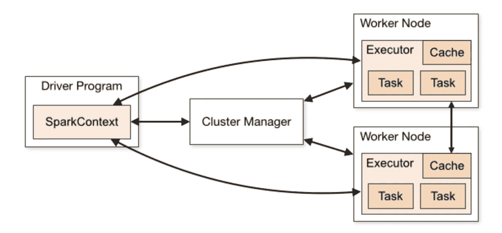
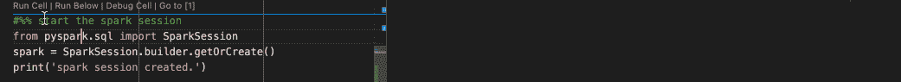
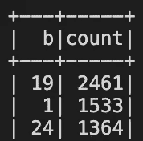

# 使用 Databricks 和 PySpark 开始使用 Spark

> 原文：<https://towardsdatascience.com/get-started-spark-with-databricks-and-pyspark-72572179bd03?source=collection_archive---------6----------------------->

## 使用纯 Python 开始使用 Spark 和 Databricks


图片来自[https://unsplash.com/s/photos/spark](https://unsplash.com/s/photos/spark)

一开始，编程大师创建了关系数据库和文件系统。但是单台机器上的文件系统变得有限且缓慢。数据黑暗就在数据库的表面。缩小地图的精神正在大数据的表面上酝酿。

编程大师说，要有火花，于是就有了火花。

## 已经有 Hadoop 了，为什么还要麻烦 Spark

如果关系数据库是一个维护良好的数据花园；Hadoop 是一个杂乱的数据森林，它可以无限增长。

要将数据放入花园，数据需要被仔细清理并在那里结构化地生长。在 Hadoop 森林中，女士们、先生们，不要担心，这里的任何数据都可以，文本、数字，甚至音频和视频都没有数据大小和类型的限制。

但是 Hadoop 还是有一些不足，Spark 来解决。这里列出了我的 4 个主要区别。

1.  在 Hadoop 中，每一个映射和归约动作都是用磁盘存储作为数据中间人，磁盘操作比较慢。Spark 通过利用内存直接数据访问优化流程。换句话说，在内存中存储一些中间数据来提高性能。(这就是为什么你总是阅读官方 Spark 介绍描绘自己比 Hadoop 快得多，这里没什么神奇的。)
2.  Hadoop 基本上是一个分布式文件系统，可以通过它的 map-reducer 和批处理调度器扩展到无限大小。但是你需要用 Java 来实现真正的应用。Spark 来提供 Python 之类的操作语言，r .为数据流、机器学习、数据分析提供有用的工具。
3.  Hadoop 不包含作业调度程序，需要第三方调度程序，Sparks 自带作业调度程序。
4.  Hadoop 更便宜，需要的内存也更少。Spark 需要更多内存。好吧，这个是 Hadoop 的优点而不是缺点。

有了 PySpark，我们可以用纯 Python 代码、Jupyter Notebook 或 Databricks Notebook 与 Spark 进行充分的交互。这是 Spark 的一大优势。

## 已经有火花了，为什么还要麻烦数据布里克

Spark 是开源的、免费的、功能强大的，为什么还要使用 Databricks 呢？为了建立一个有用的 Spark 集群，并利用分布式存储，我们需要构建至少 2 台虚拟或物理机器。接下来，设置驱动和工作节点，配置网络和安全等。



来自 https://spark.apache.org/docs/latest/cluster-overview.html[的火花元件](https://spark.apache.org/docs/latest/cluster-overview.html)

仅仅运行一个 Spark“hello world”就要做更多的手工工作。如果得到 JAVA_HOME 找不到，或者找不到 Spark path 之类的错误信息就别提了。

通过解决所有这些繁琐的配置，Databricks 提供了一个开箱即用的环境。

以 [Azure Databricks](https://docs.microsoft.com/en-us/azure/databricks/scenarios/quickstart-create-databricks-workspace-portal?tabs=azure-portal) 为例，在几次鼠标点击和几分钟等待集群启动之后。我们有一个功能齐全的火花系统。他们称之为数据砖。

与免费的 Spark 不同，Databricks 通常根据集群大小和使用情况收费。小心，在创建第一个实例时选择正确的大小。

还有一点需要注意，请记住你选择的 Databricks 运行时版本。我更愿意选择 LTS 7.3。稍后，当您安装`databricks-connect`时，版本应该是相同的。

## 开始连接

我准备用 Python 做所有的事情，那么我应该安装`pyspark`包吗？不，要使用 Python 来控制数据块，我们需要首先卸载`pyspark`包以避免冲突。

```
pip uninstall pyspark
```

接下来，安装`databricks-connect`。其中包括所有名称不同的 PySpark 函数。(确保您的本地机器上已经安装了 Java 8+)

```
pip install -U "databricks-connect==7.3.*"
```

在配置到 Databricks 集群的客户端连接之前，请转到 Databricks UI 获取以下信息并记下。详细步骤可以在[这里](https://docs.microsoft.com/en-us/azure/databricks/dev-tools/databricks-connect)找到

1.  访问令牌:`dapib0fxxxxxxxxx6d288bac04855bccccd`
2.  工作区网址:`[https://adb-8091234370581234.18.azuredatabricks.net/](https://adb-8091234370581234.18.azuredatabricks.net/)`
3.  集群 id: `1234-12345-abcdef123`
4.  端口号:`15001`
5.  组织 id: `8091234370581234`，组织 id 也出现在工作区 url 中。

当您准备好上述所有信息后，就可以配置到 Databricks 集群的本地 PySpark 连接了。

```
databricks-connect configure
```

跟着向导走，你不会迷路的。之后，使用这个 Python 代码来测试连接。

```
# python 
from pyspark.sql import SparkSession
spark = SparkSession.builder.getOrCreate()
print('spark session created.')
```



如果你受到“火花会议已创建”的欢迎，一个活蹦乱跳的火花簇正在云中运行。我们现在可以做一些大数据分析。

## 数据仓库:BDFS

Hadoop 的 HDFS 允许用户在本地磁盘上构建可扩展的海量存储。BDFS 几乎和 HDFS 一样。区别在于它的后端存储是基于云的。

你可以用`dbutils`用 Python 远程管理 BDFS，

在本地 Python 上下文中获取`dbutils`对象处理程序。官方文件假设你使用的是 Databricks 笔记本，省略这一步。当用户试图在普通 Python 代码中使用它时会感到困惑。

```
from pyspark.dbutils import DBUtils
dbutils = DBUtils(spark) # the spark object here 
                         # is already initialized above
```

列出`/mnt/`文件夹中的文件和文件夹

```
dbutils.fs.ls('dbfs:/mnt/')
```

你会得到这样的信息:

```
[FileInfo(path='dbfs:/mnt/folder1/', name='folder1/', size=123),
 FileInfo(path='dbfs:/mnt/folder2/', name='folder2/', size=123),
 FileInfo(path='dbfs:/mnt/tmp/', name='tmp/', size=123)]
```

[dbutils 官方文件](https://docs.databricks.com/dev-tools/databricks-utils.html)列出了所有其他操作。

## 用 Python 上传一个 CSV 文件到 DBFS

在本地磁盘上准备一个圣经 CSV 文件。用您的用户名替换[用户名]以运行下面的代码。

```
import urllib.request
bible_url = "https://raw.githubusercontent.com/scrollmapper/bible_databases/master/csv/t_kjv.csv"
urllib.request.urlretrieve(bible_url,"/home/[username]/temp/bible_kjv.csv")
```

现在，上传圣经 CSV 文件到 BDFS。

```
bible_csv_path = "file:/home/[username]/temp/bible_kjv.csv"
dbutils.fs.cp(bible_csv_path,"/tmp/bible_kjv.csv")
```

如果您决定移动文件而不是复制，请使用`mv`代替`cp`。

## 使用 Spark Dataframe 分析数据

读取刚刚上传的圣经 CSV 文件，并将其封装在 Spark 数据帧中(与熊猫数据帧形成对比)。

```
bible_spark_df = spark.read.format('csv')\
                 .options(header='true')\
                 .load('/tmp/bible_kjv.csv')
bible_spark_df.show()
```

你会看到结果的

```
+-------+---+---+---+--------------------+
|     id|  b|  c|  v|                   t|
+-------+---+---+---+--------------------+
|1001001|  1|  1|  1|In the beginning ...|
|1001002|  1|  1|  2|And the earth was...|
|1001003|  1|  1|  3|And God said, Let...|
...
|1001019|  1|  1| 19|And the evening a...|
|1001020|  1|  1| 20|And God said, Let...|
+-------+---+---+---+--------------------+
only showing top 20 rows
```

如果你是熊猫数据框的粉丝，很容易将数据转换成熊猫数据框

```
bible_pandas_df = bible_spark_df.toPandas()
```

我们用 Spark Dataframe 看看每本书有多少节。

```
bible_spark_df.groupBy("b")\
              .count()\
              .sort("count",ascending=False)\
              .show()
```

你会看到结果的



第一卷是创世纪，这本书包含 1533 节经文。

在创建临时视图的帮助下，我们还可以使用 Spark SQL 查询数据

```
bible_spark_df.createOrReplaceTempView('bible')
bible_sql_result = spark.sql('''
    select * from bible 
    where id == 1001001
''')
bible_sql_result.show()
```

查询结果

```
+-------+---+---+---+--------------------+
|     id|  b|  c|  v|                   t|
+-------+---+---+---+--------------------+
|1001001|  1|  1|  1|In the beginning ...|
+-------+---+---+---+--------------------+
```

将 Spark Dataframe 作为 JSON 文件保存回 BDFS。

```
bible_spark_df.write.format('json').save('/tmp/bible_kjv.json')
```

对于所有 Spark 数据集操作，请查看[Spark SQL、数据帧和数据集指南](https://spark.apache.org/docs/2.2.0/sql-programming-guide.html)

## Spark 数据库和表格

Spark 还支持 Hive 数据库和表，在上面的示例中，我创建了一个临时视图来启用 SQL 查询。但是当会话结束时，临时视图将会消失。启用在 Hive 表中存储数据，并且可以使用 Spark SQL 进行长期查询。我们可以在配置单元表中存储数据。

首先，创建一个 Hive 数据库

```
spark.sql("create database test_hive_db")
```

接下来，将圣经火花数据帧写成表格。这里的数据库名称有点像表文件夹。

```
bible_spark_df.write.saveAsTable('**test_hive_db**.bible_kjv')
```

有关 Spark 配置单元表操作的所有信息，请查看[配置单元表](https://spark.apache.org/docs/latest/sql-data-sources-hive-tables.html)

## 总结和概括

祝贺并感谢你阅读到这里。当我开始学习 Spark 和 Databricks 时，当书籍作者试图用复杂的图表介绍 Spark 后端架构时，我陷入了困境。我写这篇文章是为了那些从来没有接触过 Spark 的人，想在不被弄糊涂的情况下弄脏自己的手。

如果您成功地运行了所有代码，那么您应该可以开始使用 Spark 和 Databricks 了。Spark 和 Databricks 只是工具不应该那么复杂，能比 Python 复杂吗？(开玩笑)

还有一点要说明的是，默认的 Databricks 入门教程使用 Databricks Notebook，很好很好看。但是在真实的项目和工作中，您可能希望用普通的 Python 编写代码，并在 git 存储库中管理您的工作。我发现带有 [Python](https://marketplace.visualstudio.com/items?itemName=ms-python.python) 和 [Databricks](https://marketplace.visualstudio.com/items?itemName=paiqo.databricks-vscode) 扩展的 Visual Studio 代码是一个很棒的工具，完全支持 Databricks 和 Spark。