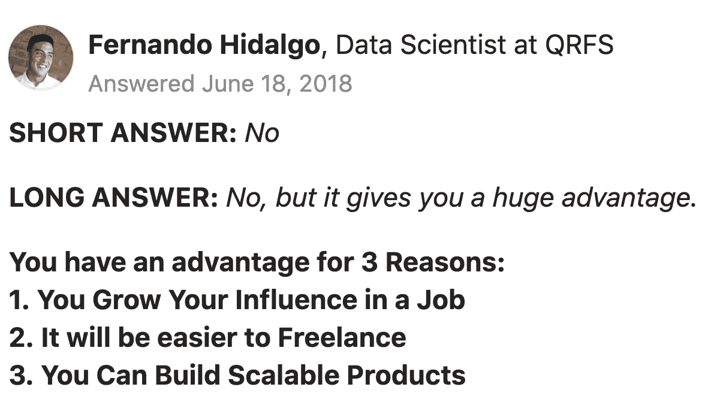
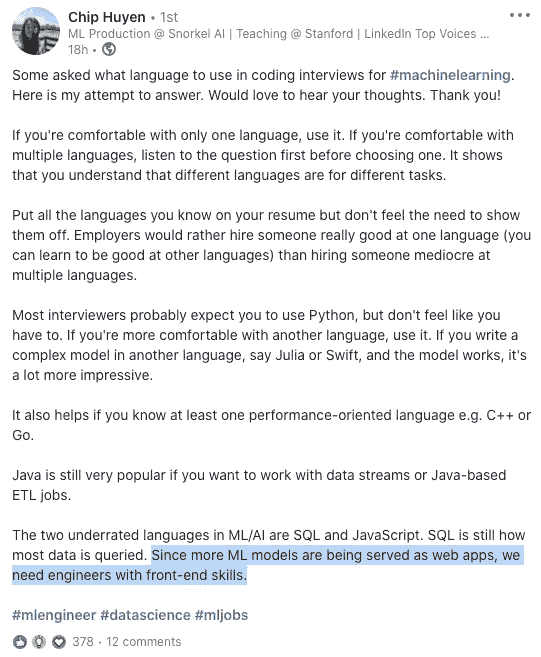

# 作为一名数据科学家，开始前端开发

> 原文：<https://towardsdatascience.com/get-started-with-frontend-development-as-a-data-scientist-3ece599bc272?source=collection_archive---------15----------------------->

## 重新掌控你向世界展示自己的方式，成为一名更好的工程师

渴望亲自动手并学习新技能？—[Quino Al](https://unsplash.com/@quinoal?utm_source=medium&utm_medium=referral)在 [Unsplash](https://unsplash.com?utm_source=medium&utm_medium=referral) 上拍摄的照片

作为一名数据科学家，你应该花时间学习前端开发吗？

虽然这听起来是一个有趣的话题，但我们的时间有限，学习一个全新的领域似乎令人生畏。

在讨论了为什么这会让你受益之后，我将分享我作为一名数据科学家开始使用前端开发的经历，并为你提供快速启动你的网站的起点。

对于上下文，我的核心工程技能(过去)围绕 Python 和 Docker。

该职位划分如下:

1 |数据科学家应该学习前端开发吗？
2 |学习 HTML、CSS、Javascript
3 |构建您的前端
4 |构建您的数据科学后端
5 |服务和托管您的网站
6 |分享您的作品

# 1 |数据科学家应该学习前端开发吗？

我做了调查，发现了一些宝石。

来自 Quora: [数据科学家需要学习 web 开发吗？](https://www.quora.com/Do-data-scientists-need-to-learn-web-development#:~:text=No.,data%20visualizations%20to%20your%20team)

Chip Huyen 在 LinkedIn[上的帖子](https://www.linkedin.com/posts/chiphuyen_machinelearning-mlengineer-datascience-activity-6764181713041149952-Di7c)—2020 年 2 月 7 日

另一篇讨论这个话题的文章是不久前写的。建议你去看看。

 [## 作为一名数据科学家，我学习 Web 开发的 5 个原因

### 还有，为什么你也应该。

towardsdatascience.com](/5-reasons-why-im-learning-web-development-as-a-data-scientist-33bd61601b62) 

作为一名数据科学家，无论是在工作场所还是在互联网上，我都觉得自己交流工作的能力有限。报告、图表、幻灯片……无论你是一个多么优秀的沟通者，都很难超越移动响应界面的惊艳效果。

现在已经有了很棒的专注于 python 的工具( [Streamlit](https://www.streamlit.io/) ， [plotly Dash](https://plotly.com/dash/) )，可以很容易地可视化数据分析或模型预测。

虽然我相信这些工具对于公司内部的应用程序来说是完全可以接受的，但是当涉及到向更多不太专业的观众展示你的作品时，你可能最终会觉得你的应用程序设计受到了限制。

在过去几周的过程中，**我意识到重新掌控并没有我想象的那么难**。

对我来说，夺回控制权意味着:

*   提高我对互联网工作原理的理解
*   学习用当前的最佳实践(flexboxes、网格、响应式设计等等)编写 HTML 和 CSS
*   学习编写普通的前端 Javascript
*   能够部署一个与我编写的 Python Flask API 交互的网站(这是我作为数据科学家开发的技能)

我相信掌握一个**更好的了解前端**会有几个**的好处**:

*   更好地理解可能与您一起工作的开发人员的工作
*   增强您对自己引导产品能力的信心
*   避免你的伟大作品被不太好的界面降级

如果你还在读，我会分享我是如何在这个领域起步的。我真的很惊讶自己能这么快学会我认为很难达到的技能。我还设法让他们与已经获得的技能互动。

# 2 |学习 HTML、CSS、Javascript

HTML 用于页面内容，CSS 用于样式，Javascript 用于交互。虽然我有关于 HTML 和 CSS 的高级知识，但 JS 真的很陌生。

无论如何，我需要用当前的最佳实践**在新的基础上重新建立我的知识。对我来说，另一个要求是在引入任何库之前，理解这些语言的全部能力。**

我对斯克林巴的团队感激不尽。自 2017 年以来，Scrimba 以互动和动手的方式为在线编码课程提供了一种创新的方法。

 [## 通过交互式教程学习编码-Scrimba.com

### 我们的目标是以最低的成本为学生创造最好的编码学校。如果我们成功了…

scrimba.com](https://scrimba.com) 

我目前正在学习*前端开发人员职业道路*课程，该课程不需要任何先验知识，重点是训练你的编码肌肉记忆，而不是理论知识，因此可以让你很快取得切实的成果。

# 3 |构建您的前端

在斯克林巴，有两章引起了我的注意:

*   响应式设计
*   使用 API

卡斯帕·卡米尔·鲁宾在 [Unsplash](https://unsplash.com?utm_source=medium&utm_medium=referral) 上拍摄的照片

## 响应式设计

请记住，如果你像我一样对夺回控制权感兴趣，这将为你的利益相关者提供**愉快的体验**，无论他们在哪里，**无论他们使用什么设备**。

响应式设计就是能够根据浏览器客户端来调整网站的内容布局。对于手机和平板电脑用户来说尤其如此。

虽然这本身是一个完整的主题，它涉及 UI 设计，但主要的关键在于[媒体查询](https://developer.mozilla.org/en-US/docs/Web/CSS/Media_Queries/Using_media_queries)，它将根据与屏幕大小相关的条件相应地修改 CSS(样式)。

## 使用 API

当您想让其他团队使用您的**模型**时，最简单的方法可能是通过 REST API 访问它**。自然，你可以在你的网站上使用同样的微服务概念。**

然后， **web 客户端**会监听网页上的用户事件，比如点击按钮，并相应地**使用 Javascript 的[获取方法](https://developer.mozilla.org/en-US/docs/Web/API/Fetch_API/Using_Fetch)向后端**发送 HTTP 请求。

注意 Javascript 是用于同步代码执行的。发送请求和等待响应需要编写异步 Javascript，如果你来自 Python，这更直观。

同样，Scrimba 在引入这一概念以及如何实现这一概念方面做得非常出色。

# 4 |构建您的数据科学后端

Flask 是一个最小的 Python 框架，满足了我的大部分需求。

这是一个你如何为你的模型服务的例子。

# 5 |服务和托管您的网站

## 知识库组织

照片由 [Richy Great](https://unsplash.com/@richygreat?utm_source=medium&utm_medium=referral) 在 [Unsplash](https://unsplash.com?utm_source=medium&utm_medium=referral) 拍摄

你应该把你的后端和前端代码分成两个仓库吗？

这取决于项目的规模和团队组织。

在较小的规模下，将这些组件放在同一个库中可能更明智。

>除了给你机会在同一次提交中修改后端和前端，它还使得跟踪你的网站的进度变得更加容易:不存在哪个后端提交和哪个前端提交配合得更好的问题。

## 微服务

说到上菜，我的建议是使用 [Docker](https://www.docker.com/) 强大的技术。

简而言之，Docker 允许复制运行时环境。

想法是**分离前端服务和后端服务的环境**，每个环境都有一个最小的依赖集。

将后端放在微服务容器中，前端放在另一个容器中。使用`docker-compose`一起构建和运行这些容器。

对于**后端** Docker 映像，它可以像具有正确依赖关系的 python 映像一样简单。

对于前端，我尝试使用一个 [nginx](https://hub.docker.com/_/nginx) 图像，将我想要提供的 HTML、CSS、Javascript 文件复制到这个图像中，效果非常好。更准确地说，是在`/usr/share/nginx/html`。您也可以选择在该位置装载卷。

 [## 如何使用官方 NGINX Docker 图片- Docker 博客

### NGINX 是世界上最流行的网络服务器之一。NGINX 不仅是一个快速可靠的静态 web 服务器，它…

www.docker.com](https://www.docker.com/blog/how-to-use-the-official-nginx-docker-image/) 

这样，如果您启用了加密通信，您的网站将在端口 80 或 443 上提供服务。您的后端在端口 5000 上提供服务(默认的 flask 服务端口)。

请注意，此时您可能会遇到与跨来源资源共享相关的问题( [CORS](https://www.notion.so/syltruong/Get-started-with-frontend-dev-as-a-data-scientist-36836bec0538444bafaf3906bb387a2d#fc0d4b4cac96429dab34089aea932224) )。这是因为您的`fetch`语句向源域(您的`index.html`文件所在的位置)之外的域发出了请求。在这种情况下，你可能想看看`flask-cors`。

 [## 烧瓶-CORS -烧瓶-Cors 3.0.10 文件

### 这个包公开了一个 Flask 扩展，默认情况下，它在所有路由上启用 CORS 支持，用于所有来源和…

flask-cors.readthedocs.io](https://flask-cors.readthedocs.io/en/latest/) 

## 主办；主持

数字海洋平面设计

我试了一下数字海洋。更准确地说，我尝试使用 **droplets** ，这是你需要的规格的普通远程机器，或者 AWS EC2 替代品。

我欣赏干净的界面和易用性。

为了部署我的网站，我`ssh`到我在 DigitalOcean 的网络控制台上启动的机器，检查代码 repo、`docker-compose build`和`docker-compose up`。

关于这个实例，我建议选择从 Ubuntu 上的“ **Docker”镜像中启动它，这个镜像随`docker-compose`一起安装。此外，您可能有兴趣遵循以下附加步骤(例如，创建具有 sudo 权限的非 root 用户):**

 [## 使用 Ubuntu 20.04 的初始服务器设置|数字海洋

### 当你第一次创建一个新的 Ubuntu 20.04 服务器时，你应该执行一些重要的配置步骤作为…

www.digitalocean.com](https://www.digitalocean.com/community/tutorials/initial-server-setup-with-ubuntu-20-04) 

## 域名

此时，您的网站将可以在您的云机器的 IP 上访问。为了更方便，您可能会对将一个**域名路由到那个地址**感兴趣。

幸运的是，这个过程是有据可查的。你所需要做的就是从注册商那里购买域名并配置域名服务器。

 [## 我如何设置域名？数字海洋

### 我对这个话题过于困惑，我只是想让人们通过一个可读的网址而不是一个 IP 地址来访问我的 droplet

www.digitalocean.com](https://www.digitalocean.com/community/questions/how-do-i-set-a-domain-name) 

# 6 |分享您的作品

这就是了。你已经部署了你的网站。你现在可以和全世界分享了。如果你读到这里，我希望这让你渴望**夺回控制权**，或许**激发一些项目想法**。

至于我自己，我写了[explorehsk.com](http://explorehsk.com/)，一个为中文学习者准备的工具。它通过将相关的单词(按单词的意义和用法)分组，并允许你从一张抽认卡跳到相邻的抽认卡，来帮助巩固 HSK 标准考试的词汇。

存储库演示了上面列出的要点。

 [## syl Truong/explore hk

### 我们的目标是使汉语学习者的词汇复习变得更容易，方法是根据语义…

github.com](https://github.com/syltruong/explorehsk) 

# 带回家的信息

*   你可以用前端技能**增加你的影响力**。
*   有**很多资源**可以学习 HTML，CSS，Javascript。这些越来越复杂了。这些语言的普通用法已经可以让你走得很远了。
*   `docker-compose`轻松管理您的前端和后端部署
*   找到你最喜欢的云提供商和域名注册商。设置好它们，你就可以开始了。

## 我个人对在这个方向上学习更多感到兴奋，并希望听到你的建议、观点和项目。

## 让我们在 LinkedIn、Twitter 或评论区联系吧！

领英—[https://www.linkedin.com/in/syltruong/](https://www.linkedin.com/in/syltruong/)
推特—[https://twitter.com/syltruong](https://twitter.com/syltruong)

免责声明:这篇文章不是由文中提到的任何公司赞助的。所有观点都是我的。