# MLOps 入门

> 原文：<https://towardsdatascience.com/get-started-with-mlops-fd7062cab018?source=collection_archive---------1----------------------->

## [实践教程](https://towardsdatascience.com/tagged/hands-on-tutorials)

## 包含开源工具的综合 MLOps 教程

pch.vector 创建的人向量—【www.freepik.com 

将机器学习(ML)模型投入生产是一项艰巨的工作。实际上，根据雄心的程度，这可能会异常困难。在这篇文章中，我将回顾一下我个人的想法(包括实现的例子),这些原则适合于在一个受监管的行业中将 ML 模型投入生产的旅程；也就是说，当一切都需要可审计、合规和受控时——在这种情况下，部署在 EC2 实例上的拼凑的 API 将无法满足要求。

*机器学习操作* (MLOps)指的是一种方法，其中 DevOps 和软件工程的组合以一种能够在生产中可靠有效地部署和维护 ML 模型的方式得到利用。可以在网上找到大量讨论 MLOps 的概念细节的信息，因此，本文将侧重于通过大量实际操作代码等来提高实用性。，基本上建立了一个基于开源工具的概念验证 MLOps 框架。你可以在 GitHub 上找到最终代码[。](https://github.com/MathiasGruber/ProofOfConcept_MLOps)

这一切都是为了将 ML 模型投入生产；但这意味着什么呢？在这篇文章中，我将考虑下面的概念列表，我认为它们应该被视为 MLOps 框架的一部分:

1.  **开发平台:**用于执行 ML 实验和授权数据科学家创建 ML 模型的协作平台应被视为 MLOps 框架的一部分。该平台应支持对数据源的安全访问(例如，从数据工程工作流)。我们希望从 ML 培训到部署的过渡尽可能平稳，这对于这样一个平台来说比在不同的本地环境中开发的 ML 模型更有可能。
2.  **模型单元测试:**每次我们创建、更改或重新训练模型时，我们都应该自动验证模型的完整性，例如
    -应该满足测试集的最低性能
    -应该在合成的用例特定数据集上表现良好
3.  **版本化:**应该可以及时返回，检查与给定模型相关的一切，例如，使用了什么数据&代码。为什么？因为如果有东西坏了，我们需要能够回到过去，看看为什么。
4.  **模型注册:**应该有已部署的&退役 ML 模型、它们的版本历史以及每个版本的部署阶段的概述。为什么？如果出现问题，我们可以将之前归档的版本回滚到生产环境中。
5.  **模型治理:**只有某些人应该有权查看与任何给定模型相关的培训。对于谁可以请求/拒绝/批准模型注册中心中部署阶段之间的转换(例如，从开发到测试到生产)，应该有访问控制。
6.  **部署:**部署可以是很多事情，但是在这篇文章中，我考虑了我们想要将模型部署到云基础设施并公开 API 的情况，这使得其他人能够消费和使用该模型，也就是说，我没有考虑我们想要将 ML 模型部署到嵌入式系统中的情况。在适当的基础设施上高效的模型部署应该:
    -支持多个 ML 框架+定制模型
    -具有定义良好的 API 规范(例如，Swagger/OpenAPI)
    -支持容器化的模型服务器
7.  **监控:**跟踪性能指标(吞吐量、正常运行时间等。).为什么？如果一个模型突然开始返回错误或者出乎意料地慢，我们需要在最终用户抱怨之前知道，以便我们可以修复它。
8.  **反馈:**我们需要向模型反馈关于它表现如何的信息。为什么？通常，我们会对新样本进行预测，但我们还不知道基本事实。然而，当我们了解真相时，我们需要通知模型报告它实际做得有多好。
9.  **A/B 测试:**无论我们认为我们在做多么可靠的交叉验证，我们永远不知道模型在实际部署之前会有怎样的表现。在 MLOps 框架内，使用真实模型进行 A/B 实验应该很容易。
10.  **漂移检测:**通常，给定模型部署的时间越长，与模型被训练时相比，随着环境的变化，情况变得越糟。我们可以尝试对这些不同的情况进行监控和警告，或者在它们变得太严重之前进行“漂移”:
    *-概念漂移:*当输入和输出之间的关系已经改变时
    *-预测漂移:* 预测中的变化，但是模型仍然保持
    *-标签漂移:*模型的结果相对于训练数据的变化
    *-特征漂移:*分布中的变化
11.  **异常值检测:**如果部署的模型接收到与训练期间观察到的任何东西都显著不同的输入样本，我们可以尝试将该样本识别为潜在的异常值，并且返回的预测应该如此标记，这表明最终用户应该小心地信任该预测。
12.  **对抗性攻击检测:**当对抗性样本攻击我们的模型时(例如，有人试图滥用/操纵我们算法的结果)，我们应该得到警告。
13.  **可解释性:**ML 部署应该支持端点返回我们预测的解释，例如，通过 SHAP 值。为什么？对于许多用例来说，预测是不够的，最终用户需要知道为什么要做出给定的预测。
14.  **部署的治理:**我们不仅需要对谁可以查看数据、训练模型等进行访问限制。而且还取决于谁最终可以使用部署的模型。这些部署的模型通常就像它们被训练的数据一样保密。
15.  **以数据为中心:**除了关注模型性能&的改进，MLOps 框架还能够更加关注终端用户如何提高数据质量和广度。

当然，上述原则是对开发运维及软件工程的常规最佳实践的补充，包括代码、文档、单元测试、CI/CD 等基础设施。在探索了 MLOps 的各种解决方案的应用之后(同时考虑到以上几点)，我将在这篇博客文章中探索的解决方案是[ml flow](https://mlflow.org/)+[Seldon-core](https://www.seldon.io/tech/products/core/)的组合——这些的优点是不需要昂贵的订阅。它们大部分都是开源的，这意味着我们可以直接设置和测试它们🙌 ...我将逐一讨论上述要点，看看这个堆栈如何应对每个挑战。这是一个很大的范围，所以也许在阅读之前喝杯咖啡。☕️

*PS:我不属于 mlflow 或 Seldon-core 团队。虽然这篇文章包含了这些特定框架的大量代码，但这篇文章来自于一种技术不可知论者的心态，试图了解更多关于上述挑战的知识。*

## 1.发展

有多种工具可以解决数据科学家的 ML 实验管理和协作问题，例如 [Neptune.ai](https://neptune.ai/) 、[Weights&bias](https://wandb.ai/site)、 [Comet.ml](https://www.comet.ml/site/) 和 [mlflow](https://mlflow.org/) 。这里我们将重点关注 mlflow，它既有一个[开源](https://github.com/mlflow/mlflow)版本，也有一个托管 D [atabricks](https://databricks.com/) 解决方案。我们可以将 Databricks 部署为我们云基础架构的一部分(无前期成本，按使用付费)，从而为我们提供:

*   数据工程工作流的坚实基础(本文不会涉及)。这些数据可能是高度机密的，并且可能是我们不允许保存在本地计算机上的内容，需要这些数据来训练我们的模型。
*   一个可扩展的协作平台，用于在笔记本电脑上运行实际数据的数据科学实验，非常类似于 jupyter 笔记本电脑。
*   用于训练给定 ML 模型的数据和代码的版本控制，以及与模型训练相关的信息(通过工具 Delta Lake、Jobs API 和 mlflow)
*   用户管理，例如，在 Azure Databricks 的情况下，可以与许多公司使用的 Azure AD 链接。这使我们能够非常精细地控制谁可以看到什么，对我们的模型做什么。

要测试 databricks+mlflow，首先要做的是创建一些基础设施。在这种情况下，我们将使用 [terraform](https://www.terraform.io/) 部署到 Azure，terraform 是一个跨不同云提供商轻松配置基础设施的工具。我们将保持简单，只需使用以下脚本在一个文件夹中运行 CLI 命令`terraform init && terraform apply`:

用于在 Azure 中设置 Databricks 工作空间和 blob 存储容器的 Terraform 脚本。作者代码。

通过 Terraform 运行上面的脚本会在你的 Azure 帐户上设置一个 Databricks 工作区——如果你在 Azure 门户中导航到已创建的 Databricks 资源，你应该能够点击“启动工作区”，这会将你发送到新创建的 Databricks 工作区；到目前为止一切顺利。👌

现在我们已经建立并运行了数据块，我们需要训练一个 ML 模型并将其登录到 mlflow 中-这可以对任何类型的自定义模型进行，但当我们使用流行的框架时，mlflow 提供了许多方便的函数-在这种情况下，我们将利用 mlflow 的魔力，训练一个经典的 Keras 模型来对 MNIST 数据集中的手写数字进行分类。导航到 Databricks 左侧的“Workspace”选项卡，我们可以创建一个笔记本并运行以下代码片段:

使用 Keras 训练 MNIST 分类器并将结果记录到 mlflow 的 Python 代码。作者代码。

注意:为了能够运行笔记本电脑，您必须将其连接到集群，但这可以使用 UI 轻松创建。

## 2.模型单元测试

数据块使我们能够定义“作业”，这使我们能够用一组输入参数运行给定的笔记本。我们可以使用它来捆绑我们的训练代码，这样当我们希望重新训练我们的模型时，我们只需要重新运行我们的工作，这可以通过一个简单的 REST 请求来完成，而不是手动进入训练笔记本并重新训练模型。我们的模型训练的这种“可操作化”的一个关键部分是，我们在笔记本中包括检查，以确保模型仍然按照预期在例如测试数据集或合成数据集上工作。例如，可以将以下内容添加到我们之前的笔记本中:

在测试数据集上评估我们的模型的代码片段，如果精度太低，则失败。作者代码

在笔记本中添加了这些检查或“测试”之后，我们可以在 Databricks 中创建一个指向笔记本的“作业”。为了重新训练我们的模型，我们简单地告诉作业用笔记本创建一个“run”(这可以在 UI 中或者通过 REST 调用来完成)。

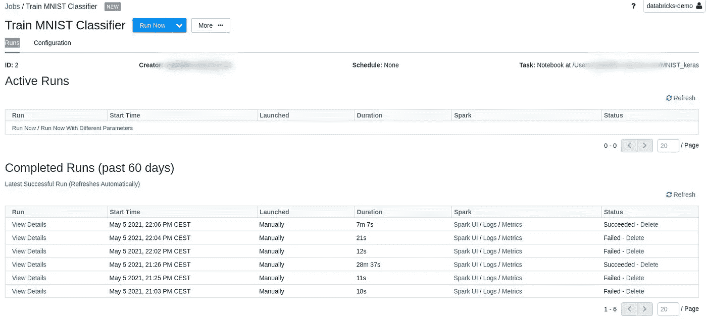

显示我们 MNIST 工作“运行”的屏幕截图——作者提供的屏幕截图。

这正是我们想要的；例如，如果我们在已部署模型的性能开始下降太多时，自动向 Databricks 发送重新训练 REST 请求，但是由于某种原因，自上次训练以来，新的损坏数据被引入到数据集，从而破坏了模型，我们不希望该模型进入生产。

## 3.版本控制

一旦我们的模型训练完成，我们可以查看本笔记本附带的 mlflow“实验”,在这里我们可以获得作为本笔记本一部分训练的模型的概述以及每个模型的指标和参数(例如，随时间推移的损耗等)。).我们可以点击“源”按钮(见下面的截图)，这将显示我们到底是什么代码被用来训练模型；这意味着我们将能够审计生产中的任何模型，以查看是谁以及如何训练它的。

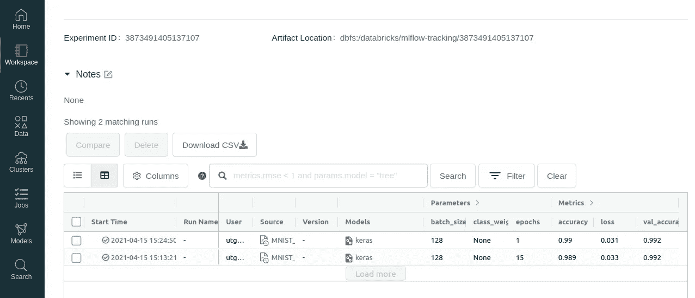

截图显示了我们的两个训练有素的 MNIST 模型的 mlflow 实验。作者截图。

在上面的屏幕截图中，还有一个“Models”列，对于每次运行，mlflow 都创建一个“mlflow model”对象，它在运行结束时封装模型。单击其中一个，我们将进入一个页面，其中包含有关模型的详细信息，包括有关训练期间的损失和准确性、训练参数的信息，最后是一个包含工件的部分，在这里我们可以看到封装的“mlflow model”，其中包含有关模型所需的`conda.yaml`环境、训练的模型权重等信息。通过点击“注册模型”按钮，我们可以将这些模型中的任何一个输入到 mlflow 模型注册表中(当然，这也可以在代码中完成)

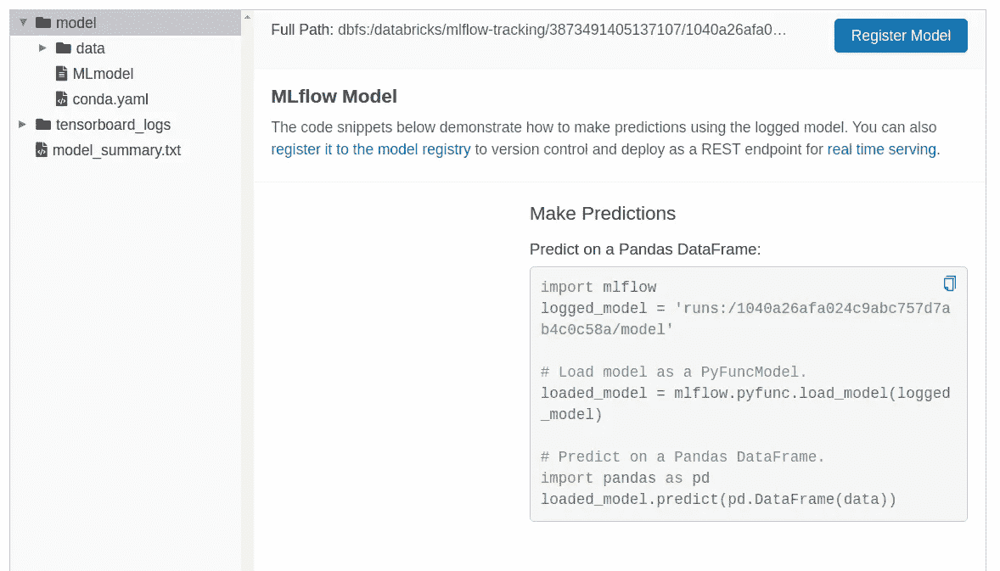

特定运行的 mlflow 工件的屏幕截图，特别关注于经过训练的 mlflow 模型。

## 4.模型注册表

一旦我们将一个或多个模型登录到我们的模型注册中心，我们可以在数据块中单击左侧的“模型”选项卡，以便获得我们的模型注册中心的概览，其中包含所有模型及其当前阶段:

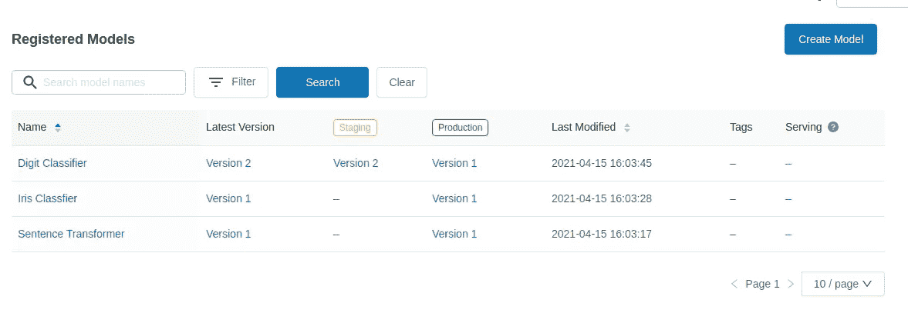

来自 Databricks 的模型注册表显示了每个模型、其最新版本、部署阶段等。

这为我们提供了很多透明度，比如当前部署了什么，之前部署了哪些版本，以及到所有模型对象的链接，允许我们检查他们接受了哪些代码和数据的培训，等等。

## 5.模型治理

对于注册到我们的模型注册中心的每一个经过训练的模型，我们可以控制许可设置，这意味着我们可以控制谁可以看到模型注册中心中的哪些模型，以及谁可以授权从例如阶段到生产的转换；这正是我们想要的，因为我们希望有一个模型进入生产的控制门；例如，创建给定模型的数据科学家的经理可能需要在给定模型过渡到部署之前对其进行验证和批准，检查如下内容:

*   确保根据已知的测试集或通过交叉验证对模型进行了测试，以确认其有效。
*   确保该模型已针对具有已知“信号”的合成数据集进行了测试如果它没有通过这种类型的测试，可能是引入了错误。

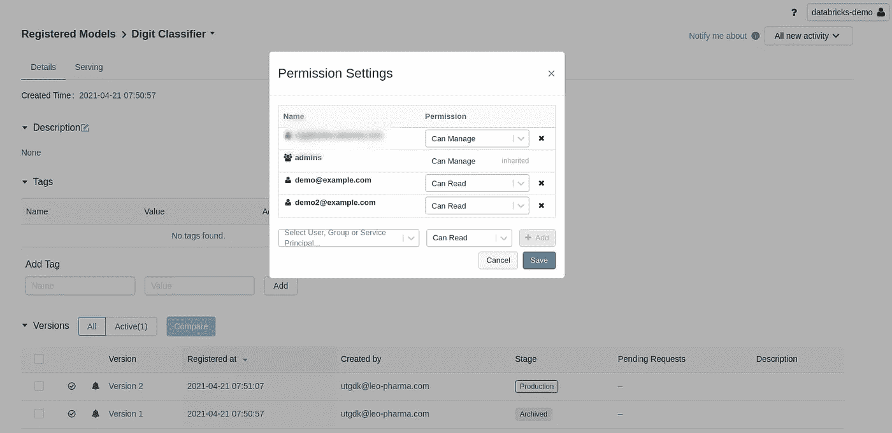

屏幕截图显示了模型注册表中给定模型的权限设置，演示了我们如何给不同的用户不同的权限。作者截图。

## 6.部署

一旦模型注册中心中的模型已经转换到“生产”阶段，下一个阶段就是将该模型推送到部署服务器，以便该模型的消费者可以使用例如 REST API 来调用它。在本帖中，[谢顿核心](https://github.com/SeldonIO/seldon-core/tree/v0.4.0)将处理这些部署。简而言之，Seldon-core 将 ML 模型包装并部署到一个 [Kubernetes](https://kubernetes.io/) 集群上，Kubernetes 是一个通用的开源系统，用于自动化部署、扩展和管理容器化的应用程序。为了测试所有这些，首先，我们需要一个 Kubernetes 集群，我们可以通过向 terraform 脚本添加一些配置来设置一个 azure 管理的 Kubernetes 集群:

扩展以前的 terraform 脚本，在 Azure 上创建一个 Kubernetes 集群。作者代码。

将上述内容添加到我们之前的 terraform 脚本并重新运行`terraform apply`,应该可以用一个非常简单的 Kubernetes 集群来更新我们的基础设施。既然我们已经启动并运行了一个集群，我们需要安装 Seldon-core +相关的包，这可以通过以下命令来实现(取自官方文档):

在我们新创建的 Kubernetes 集群上安装 Seldon-core 的 Bash 命令

就这样👌 ..现在，我们已经有了一个安装了 Seldon-core 的基本 Kubernetes 集群。作为设置的一部分，上面的命令还安装了 [Ambassador](https://www.getambassador.io/) ，它控制对我们的 Kubernetes 集群的请求，当您运行上面的`edgectl install`时，它应该已经打开了您的浏览器到您新设置的 Ambassador 域，这为我们提供了一个很好的界面来检查我们从我们的 Kubernetes 集群公开了什么，它是如何运行的，等等。

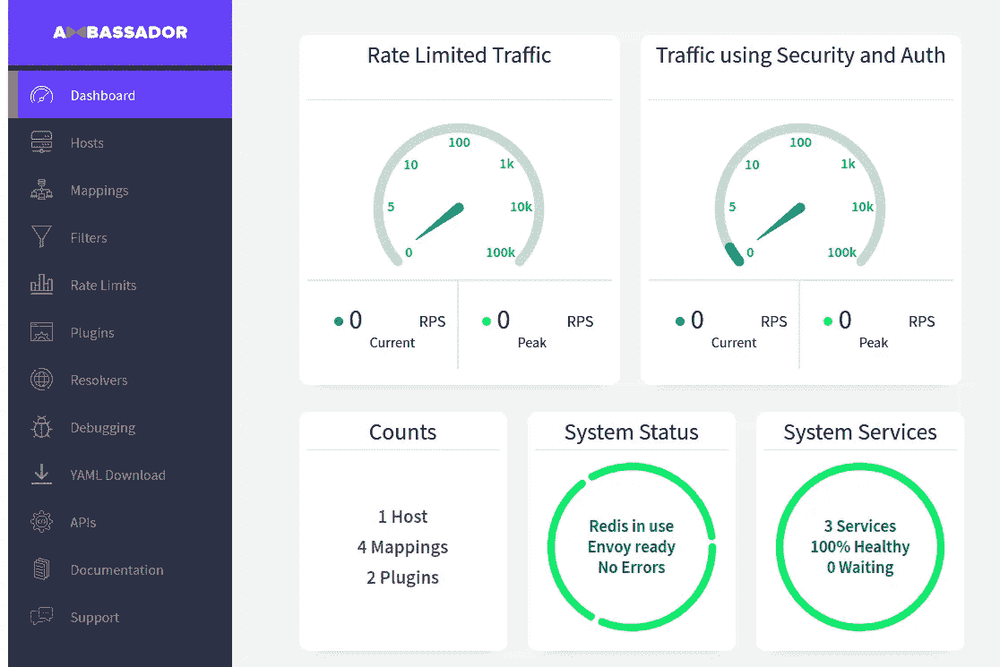

我们新集群的大使界面截图。截图由作者拍摄。

既然我们已经建立了 Seldon-core 的基础版本，我们可以开始探索如何部署我们的 mlflow 模型。可悲的是，我们将不得不做一些充实来实现这一点——即，尽管在 Seldon-core 中支持 mlflow 模型，但它不是以一个漂亮的大按钮的形式自动部署我们的模型。但是，请记住，部署模型所涉及的许多步骤都是可以自动化的——我将在下一篇博客文章中更全面地讨论这一点，可以在下面找到:

 [## 让最终用户轻松使用 MLOps

### 使用开源工具简化 MLOps 的教程

towardsdatascience.com](/making-mlops-easy-for-end-users-a3c22491e5e0) 

好吧。我们希望从 Databricks 模型注册表中获取 mlflow 模型，并将其部署到 Seldon-core 中。Seldon-core 确实提供了一个开箱即用的 mlflow 包装器来部署 mlflow 模型，但对我来说，它总是与有问题的模型发生冲突。相反，我采用了一种更加定制的方法，我们需要创建一个与 Seldon 兼容的 docker 映像，我们可以将它部署到 Seldon-core 上。实际上，我发现这更好，因为它将允许我们在后面与漂移和异常值检测相关的章节中探索 Seldon 的更多边缘应用。首先，我们需要从 Databricks mlflow 服务器下载 mlflow 模型:

获取一个 Azure AD 令牌，并使用它根据您的工作区对 Databricks CLI 进行身份验证。

用于将模型从数据块托管的 mlflow 下载到本地文件夹的脚本

使用上面的脚本，我们可以很容易地从 mlflow 下载一个给定的模型，例如，在我的例子中，我运行了`python download_mlflow_model.py --model-name “Digit Classifier" --model_stage Production`。这将把训练好的 mlflow 模型下载到一个`model/`文件夹中。从这里开始，我们只需要编写一个小的可重用 python 包装器，它让 Seldon 知道如何加载这个 mlflow 模型，并通过定义`load()`和`predict()`方法来执行预测。这个`MyMlflowModel` python 包装器是我们在 mlflow 和 Seldon 之间拥有的接口的核心部分，在这篇文章中我们会多次提到它。

我们的 mlflow 的 Python 接口将由 Seldon-core 使用。模型是从我们的下载器/模型文件夹中加载的。

有了下载的模型和 python 包装器，我们就可以用 mlflow 模型打包一个合适的 docker 映像了。这可以使用命令行工具`s2i`轻松完成，它让我们将代码注入到由 Seldon 维护的 docker 映像中:

将我们的 mlflow 模型捆绑在一个 docker 映像中，该映像被推送到 dockerhub

通读 Seldon-core 文档，有多种方法可以在部署之前本地测试这个 docker 映像，例如，通过启动 docker 映像并向其发送请求，或者使用 Seldon-core 提供的各种命令行工具。一旦确认它在本地工作，我们就必须将我们的映像推送到某个容器存储库——在这种情况下，我只使用公共 dockerhub，但我们必须记住，模型也可以是高度机密的，因此在现实世界的设置中，docker 映像存储库的安全性也必须考虑。最后，我们可以使用一个超级基本的 Kubernetes `mlflow.yaml`文件将我们训练好的 mlflow 模型推送到我们的 Kubernetes 集群，这个文件是用`kubectl apply -f mlflow.yaml`应用的:

我们在 Kubernetes 上部署 mlflow 模型的配置文件

一旦`kubectl apply`命令成功，您应该能够转到您的大使端点(例如，[https://YOUR _ URL/seldon/](https://naughty-albattani-574.edgestack.me/seldon/seldon/mlflow-mnist/api/v1.0/doc/#/)mlflow models-namespace[/ml flow-Mn ist/API/v 1.0/doc/](https://naughty-albattani-574.edgestack.me/seldon/seldon/mlflow-mnist/api/v1.0/doc/#/))来获取您新部署的模型的 REST API 的文档。该页面还将使您能够通过直接从浏览器向 API 发送请求来快速开始测试 API:

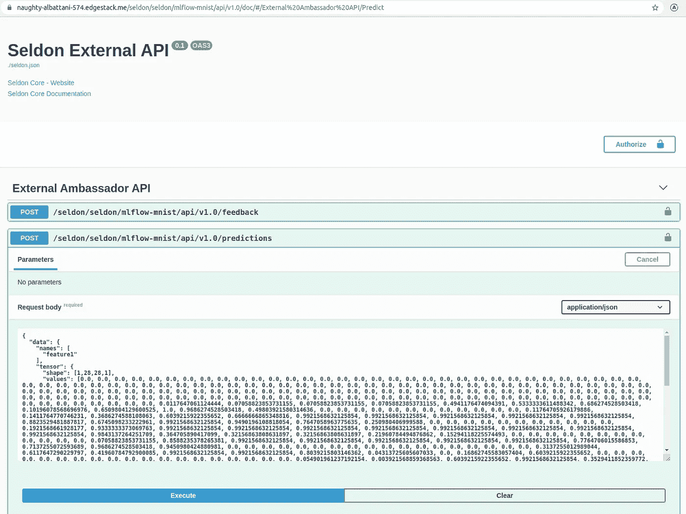

显示我们部署的 mlflow 模型的 Swagger UI 的屏幕截图。作者截图。

或者，我们可以使用 python 通过整个测试数据集来访问我们的 API:

用于将整个测试 MNIST 数据集发送到我们部署的模型端点的 Python 脚本。

## 7.监视

我们部署的 docker 映像自动设置了许多监控样板文件，这些文件公开了大量的指标，这些指标可以被 [Prometheus](https://prometheus.io/) (一种常见的监控解决方案)抓取。Seldon-core 附带了快速设置所有这些的工具，使我们能够在 [Grafana](https://grafana.com/) 中可视化这些指标。本质上，我们所要做的就是在我们的 Kubernetes 集群上安装`seldon-core-analytics`，这可以通过运行以下命令来完成:

Bash 命令用于安装 Seldon-core-analytics 并将 Prometheus 和 Grafana 端口转发到本地主机

使用这些命令，我们在集群上安装了 Prometheus 和 Grafana，并将其端口转发到我们的本地主机，这样我们就可以转到`localhost:3001`查看 Prometheus 界面，该界面允许我们发送对所有记录的指标的查询，或者我们可以转到`localhost:3000`查看预先填充的 Grafana 仪表板，该仪表板为我们提供请求率、延迟等的概述。，适用于所有当前部署的型号。本质上，使用 Seldon-core 设置监控非常简单，Grafana 可以根据用户的需求和愿望方便地定制仪表盘。

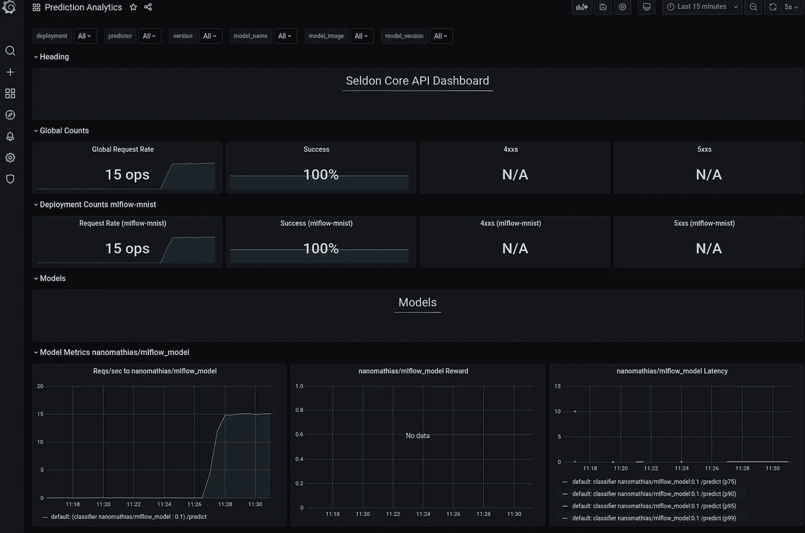

作者提供的图片，展示了 Grafana dashboard 和我们部署的 mlflow 模型。

## 8.反馈

您可能已经从 Seldon 公开的 API 文档中注意到，它自动公开了一个`/feedback`端点和`/predict`端点。此外，默认情况下，Grafana 仪表板还提供了一个图表，显示来自我们模型的“奖励”信号。“反馈”和“奖励”使我们能够在部署模型后对其进行评估，因为我们逐渐开始获得带有已知标签的额外数据。在我们知道真实标签的地方获取新数据，我们可以给`/feedback`端点发送一个给定的奖励，记录一个模型是表现得好(高奖励)还是差(低奖励)。例如，我们可以通过循环我们的测试数据来测试端点，并根据它的预测情况将奖励发送回模型:

循环测试集，从模型中获得预测，基于性能向模型反馈奖励。

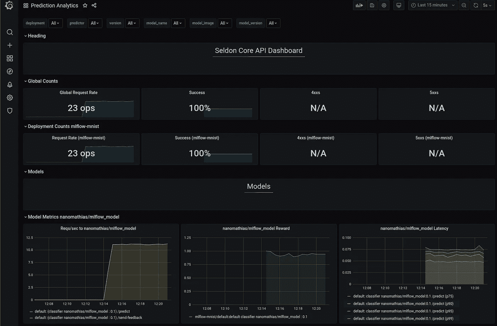

Grafana 仪表板的屏幕截图，显示我们的模型表现良好，由奖励信号确定。

除了直接发送奖励，值得注意的是，我们还可以在 python 模型包装器上覆盖`send_feedback()`方法，使我们能够将数据样本和真实标签发送到`/feedback`端点，然后在后端计算“奖励”(例如，在准确性方面)——本质上，在如何跟踪实时模型性能方面有很大的灵活性。

注意，我们可以很容易地在 Python 包装器中实现一个阈值，当平均回报低于给定阈值时，它会自动向 Databricks 发送重新训练请求。🚀

## 9.A/B 测试

当引入新版本的模型时，您可能希望验证它是否比以前的模型更好。因此，我们可能希望在生产中运行 AB 测试，看看哪个模型的性能更好。Seldon-core 使这一点变得非常容易，因为我们基本上只需要将`traffic`关键字添加到我们之前的`yaml`文件中，并添加另一个预测器。作为一个例子，让我们尝试添加另一个 MNIST 模型，该模型偶然只被训练了一个时期。在全面更换我们的旧型号之前，我们将 80%的流量导向旧型号，20%导向新型号:

这样，80%的流量流向旧模型(版本 0.1)，20%流向新模型(版本 0.2)，两者都向我们的 Grafana 仪表板报告，在那里我们可以比较它们接收反馈信号时的表现。

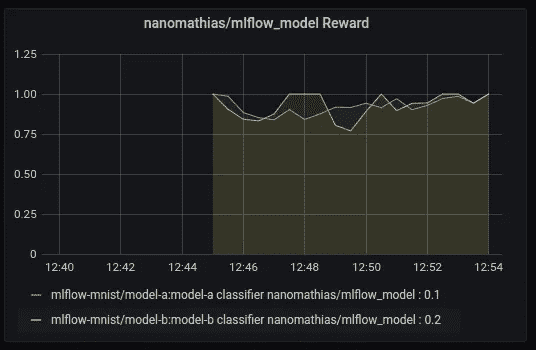

在这种情况下，两个模型实际上表现得差不多，因此仅训练 1 个时期的 MNIST 分类器不会导致模型更差，但也不会显著改善结果。然而，在某些情况下，模型实施或训练数据中的错误可能会通过我们之前的所有检查，因此为任务关键型部署执行这些 AB 测试可能是一个好主意，Seldon-core 使它非常容易做到。

## 10.漂移检测

在这篇文章中选择 Seldon-core 的原因之一是他们维护并集成了库 [Alibi-Detect](https://github.com/SeldonIO/alibi-detect) ，该库为漂移检测、敌对攻击检测和异常检测提供了预实现的算法——预实现这些算法可以节省大量时间，因为没有一种算法适合所有人，并且我们自己实现它们会很痛苦。

Alibi-Detect 中的漂移检测算法支持(2021 年 5 月 4 日)

假设我们希望将一种漂移检测算法应用于我们的 MNIST 分类器。为了以 Seldon-core 推荐的方式完成这项工作，我们必须引入另一个工具，即“ [KNative](https://knative.dev/docs/eventing/) ，它允许我们从 Seldon-core API 中提取有效载荷信息，并异步处理它，见下图:

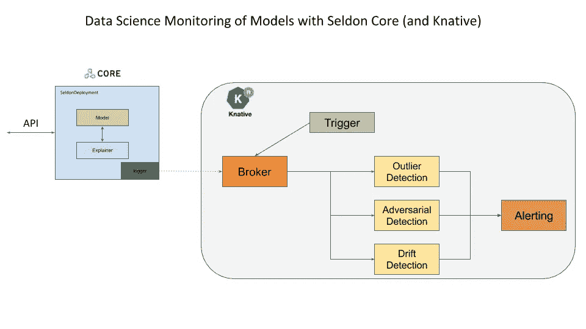

图片来自 Seldon-Core 文档

设置这个有点麻烦，因为它涉及安装 Knative 并设置它与 Ambassador 一起正常工作，训练 Alibi-Detect 模型并将其推送到 blob 存储，最后为我们的模型设置所需的 Knative 资源。不过，最终，在所有的设置之后，部署漂移检测算法并不比向 Kubernetes 应用另一个`yaml`文件更复杂，指向预训练的漂移检测算法。

为了保持这篇文章的简洁，我选择不去经历这个棘手的过程，而是提到在谢顿核心文档中有关于如何继续的[例子。作为替代，值得指出的是，我们可以选择直接在 python 模型包装类上实现自定义指标，这意味着我们可以在模型本身中包含预训练的漂移检测模型(基于 Alibi-Detect ),从而让它与每个请求同步评估，并在 Grafana 中实时报告漂移。为此，我们可以回到 Databricks 笔记本，训练一个 Kolmogorov-Smirnov 漂移检测算法(检查数据分布的差异):](https://docs.seldon.io/projects/seldon-core/en/latest/examples/outlier_cifar10.html)

为 MNIST 数据集训练 KS 漂移检测器并添加到 mlflow 模型伪影

这样，我们就可以将漂移检测算法训练并添加到我们的 mlflow 模型中，然后我们可以将它重新打包到 Seldon-core docker 映像中，并部署到我们的 Kubernetes 集群中。不过，在此之前，我们也将更新我们的 python 包装器类，以便对每个预测执行漂移检测:

添加了漂移检测器的 mlflow 模型的 Python 包装器。

随着这个模型的部署，漂移现在由普罗米修斯刮出，我们可以很容易地在 Grafana 中创建一个显示漂移的图形。我们甚至可以添加警报阈值，这样，如果数据偏离训练数据太远，相关用户就会收到通知。这里有一个例子，最初我给模型输入了大量正常的 MNIST 图像，突然之间，输入了大量失真的样本，这些样本很容易被检测器检测到:

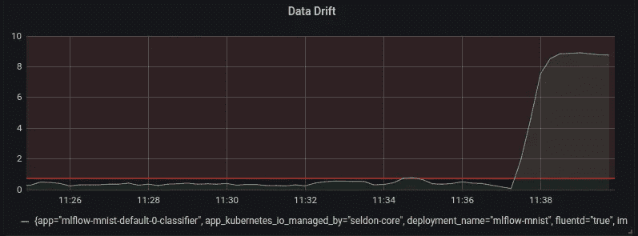

作者截图来自 Grafana 仪表板

这种特定类型的漂移称为“特征漂移”或数据漂移，即输入数据特征的变化。然而，任何其他类型的漂移检测也可以直接在 python 包装器中实现。

## 11.离群点检测

与漂移检测类似，Alibi-Detect 采用各种算法来识别输入样本是否为异常值。Seldon-core 中推荐的实现类似于漂移检测，因为它涉及设置 Knative 并异步处理给定样本是否为异常值。为了简洁起见，我将再次跳过这个实现，而是链接到[文档示例](https://docs.seldon.io/projects/seldon-core/en/latest/examples/outlier_cifar10.html)。

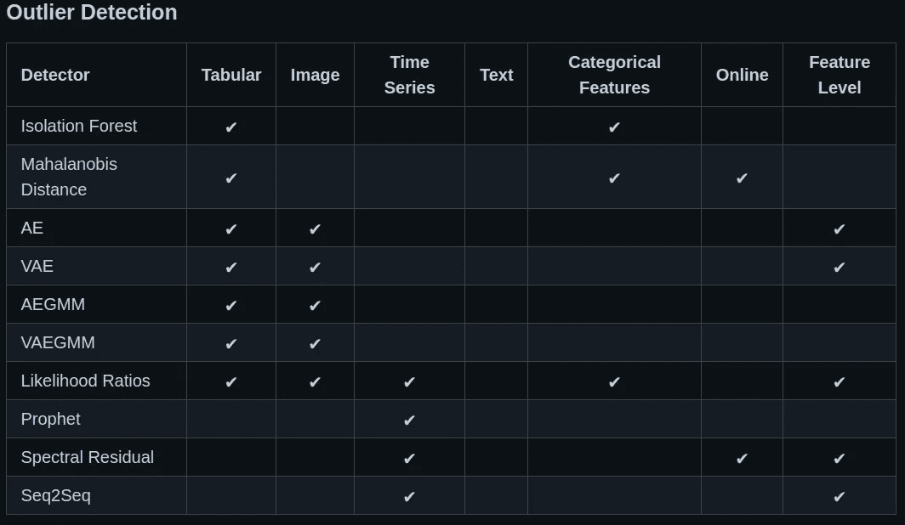

Alibi-Detect 中的异常值检测算法支持(2021 年 5 月 4 日)

除了设置 Knative，值得一提的是，与我们如何在 python 模型包装器上实现自定义指标类似，我们也可以实现在预测时返回的自定义标记——因此，我们可以将异常值检测器与模型捆绑在一起，并同步处理进入异常值检测器中的`/predict`端点的每个样本。一种想法是，如果样本是异常值，则返回一个标签，声明该样本与预测一起被认为是异常值。如果我们要尝试这样做，我们首先回到我们的 Databricks 笔记本，在那里我们可以训练异常值检测器并将其与我们的 mlflow 模型捆绑在一起:

用于为 MNIST 数据集训练异常值预测值并将其绑定为 mlflow 模型工件的 Python 脚本。

然后，我们只需要将离群点检测器添加到当前的 python 包装器中:

我们的 mlflow 模型的 Python 包装器，增加了漂移和异常值检测器

这样，我们可以将新的 mlflow 模型捆绑到一个新的 Seldon-core docker 映像中，并将其部署到 Kubernetes。当使用明显是异常值的样本(例如，完全白色的图像)向预测端点发送 REST 请求时，我们现在得到以下响应:

当我们发送白色图像时，来自部署具有漂移和异常值检测器的 mlflow 模型的样本响应。

现在，终端用户将立即能够看到，该预测是相当不确定的，因为与训练数据相比，输入数据被标记为异常值。

## 12.对抗性攻击检测

机器学习算法可能很脆弱，因为通过非常轻微地改变我们给模型的输入，我们有时可以从根本上改变它的输出——我相信你们都在网上看到过这样的例子，对给定图像的细微改变可以改变其分类，例如从熊猫到长臂猿。在 MLOps 的上下文中，我们需要考虑一个坏演员可能会利用我们部署的一些机器学习模型的这一事实，试图确定如何优化算法的预测。根据不同的用例，这可能或多或少很关键。Alibi-Detect 包再次派上了用场，它采用了一种[算法](https://arxiv.org/abs/2002.09364)来检测使用敌对自动编码器的“敌对”(被操纵)样本，使我们能够在部署的模型遇到异常数量的敌对数据时获得警报。

与异常值和漂移检测一样，我们可以在模型代码中直接包含对抗性检测器；这样做的一个额外好处是，我们不仅可以使用对抗性检测器来检测我们的 ML 模型的攻击，还可以纠正对抗性示例，从而使攻击变得更加困难，详见[论文](https://arxiv.org/abs/2002.09364)。这一点的实现将非常简单地遵循异常值和漂移检测器的步骤，因此我选择在这里不包括它。

## 13.可解释性

除了 Alibi-Detect，Seldon 还维护和集成了一个库 [Alibi](https://github.com/SeldonIO/alibi) ，它实现了各种用于模型解释的算法(例如，SHAP、集成梯度、锚点等)。这些都是以这样的方式实现的，它们在我们的 REST API 中提供了一个额外的`/explain`端点，这样任何感兴趣的用户都可以很容易地查询给定预测的解释。这太棒了，因为这意味着当最终用户对为什么返回给定的预测有疑问时，他不需要手动执行大量的分析，而只需调用`/explain`端点。

让我们尝试向我们的 MNIST 模型添加一个“集成渐变”解释器——不同的解释器有不同的要求，但在这种情况下，解释器需要直接访问我们的 Keras 模型——因此，首先，我们将在我们的 Databricks 笔记本中保存模型，并上传到我们最初用 Terraform 创建的 Azure blob:

将我们的 Keras 模型保存到云中 Azure blob 存储的脚本。

注意:我们从 Azure 的存储帐户中获得的`AZURE_CONNECT_STRING`。既然我们已经将解释器上传到 blob 存储器，我们可以扩展我们的 Seldon 部署的`yaml`-文件以包含`explainer`部分:

有了这个，我们就可以向一个端点发送格式为:https://[URL]/sel don/[space]/[name]-explainer/default/API/v 1.0/explain 的请求，我们会收到一个包含每个像素对分类贡献的响应。对给定的样本进行可视化，我们会得到如下的图，显示哪些像素导致了给定标签的给定阳性分类。

使用测试集中的示例图像调用/explain 端点，并绘制返回的解释

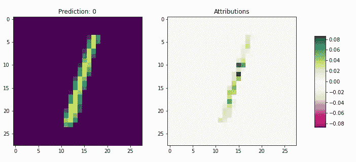

结果图显示了发送到解释终点的样本(左)和像素属性(右)

这种方法非常有效，我们可以看到，该模型将重点放在了敏感像素上，以便进行预测。

## 14.部署治理

重要的是，并非所有用户都可以访问给定的部署模型——基本上，最小特权原则应该始终适用:允许人们做他们需要做的事情，仅此而已。例如，我们可能不希望财务部门的人在一个模型周围闲逛，这个模型是根据 R&D 部门的高度机密数据训练出来的。幸运的是，Kubernetes 周围有很多工具可以解决这些问题，例如，在我们的例子中，我们使用托管 Azure 集群和 Ambassador 例如，我们可以使用 Azure AD 来认证我们的端点；[查看此链接](https://www.getambassador.io/docs/edge-stack/latest/howtos/sso/azure/)了解更多详情。这些安全方面的细节超出了本文的范围，但是解决方案肯定是有的。

就治理而言，一个有趣的复杂情况是，最终端点上的访问权限应该与 Databricks/mlflow 中的模型注册中心内设置的权限一致，因此需要实现一些额外的工具来紧密同步这些权限。这种工具的细节也不在这篇博文的讨论范围之内。

## 15.数据中心性

最后但可能是最重要的一点是，我们如何改变 MLOps 的主要焦点，使其远离模型、性能、监控等。，并返回到数据。任何在数据科学领域工作过的人都知道，系统地提高数据质量、一致性和广度(涵盖边缘情况)将比追求更复杂和更花哨的模型带来更好的模型性能。

如何构建以数据为中心的 MLOps 管道是一个有点悬而未决的问题，答案取决于使用情形，但一些观察结果如下:

*   反馈监控、漂移检测和异常值识别的实现已经分别告诉了我们一些关于我们的模型在特定新样本上表现如何、它们与我们已经观察到的有多大不同以及我们是否应该怀疑新样本的准确性的信息。在重新训练我们的模型之前，这些是需要记住的重要指标；例如，如果我们确定某个样本是异常值(例如，传感器损坏)，我们就不应该将其包含在我们的重新训练中，对于我们知道旧模型表现不佳的样本，我们可能应该在添加到我们的数据集之前进行更彻底的调查。
*   在一些我们可以选择收集什么数据的应用程序中，可以部署一个适合贝叶斯优化的附加模型；这样，部署的模型可以指导用户收集哪些额外的数据点。
*   类似于根据反馈进行重新训练，我们可以很容易地想象这样一种场景:我们收到了如此多的新数据，以至于重新训练模型实际上会提高性能，即使旧模型的性能并没有衰退。因此，不仅模型性能的变化将决定我们何时重新训练，而且可用训练数据的变化也将决定我们何时重新训练。

# 结论

我经常被希望引入其最新和最棒的 MLOps 框架的公司接洽，仅基于营销材料来评估每种框架的利弊可能相当困难。正如我希望这篇文章所展示的那样，实现一个全面的 MLOps 框架绝不是一项简单的任务，有许多需要考虑的事项和缺陷需要考虑。

本帖中提出的概念验证解决方案涵盖了本帖中提出的 15 个原则的相当多的方面，除此之外，正在讨论的系统(mlflow + Seldon)支持许多其他概念，这些概念也可能与给定的 MLOps 解决方案相关。然而，mlflow+seldon 的解决方案绝不是完美的，当我在这个框架中调试部署以使它们工作时，我不得不经历许多困难。在理想的场景中，我希望数据科学家能够专注于实现符合一些 python 接口实现方法的 ML 模型，如`predict()`、`feedback()`、`drift()`、`outlier()`、`transform()`等。，然后能够按下一个绿色的“部署”按钮，启动一个自动化的管道，将接口容器化，并部署具有本文中讨论的所有功能的 ML 模型。要求普通市民数据科学家编写和调试 Kubernetes 部署(以及工件部署以保护 blob 存储等。)不太现实。此外，以这种手动方式进行新模型的每一次部署，对我来说似乎都不可扩展或者非常不容易，如果突然需要多人来将一个模型投入生产，就更不容易了。

一种设想是实现一种工具，将 mlflow 与 Seldon-core 更紧密地联系起来。该工具将负责确保只有符合适当接口的模型才能被推送到 mlflow 模型注册中心中的“生产”阶段，并且一旦模型被提升到生产阶段，该工具将负责确保模型得到部署，权限从 mlflow 传播到 Kubernetes，监控功能正常，等等。这种工具的愿景与我在博文中没有过多提及的最后一个原则联系在一起，那就是*自动化的原则。*从本质上来说，MLOps 框架要被认为是“完整的”，它应该包含我们在 DevOps 等领域看到的所有最佳实践，并自动化所有可以通过代码自动化的事情。

虽然我不认为 mlflow + Seldon 是一个“无缝”的 MLOps 框架，但我确实认为它代表了一个强有力的组合，并且我认为两者都是非常棒的工具。在一天结束的时候，我没有看到一个全面的 MLOps 系统是微不足道的，因此，在我的书中，所提出的解决方案是开源的这一事实是一个巨大的好处，因为这意味着我们可以很容易地自己填补任何缺失的漏洞。

在本系列的下一部分中，我将介绍如何结合使用 Databricks 和 BentoML 来为最终用户创建一个无缝的设置:

 [## 让最终用户轻松使用 MLOps

### 使用开源工具简化 MLOps 的教程

towardsdatascience.com](/making-mlops-easy-for-end-users-a3c22491e5e0)