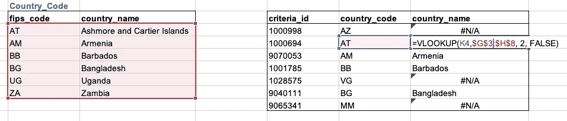
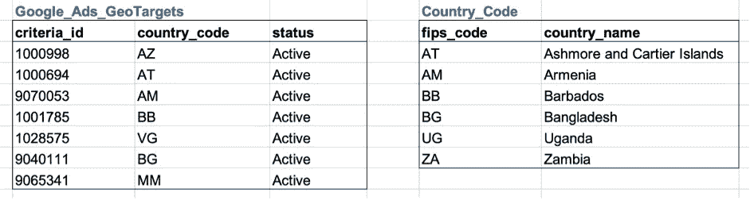
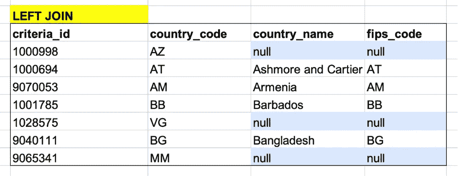
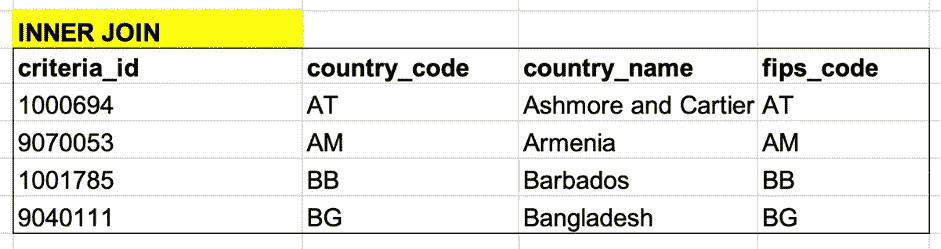
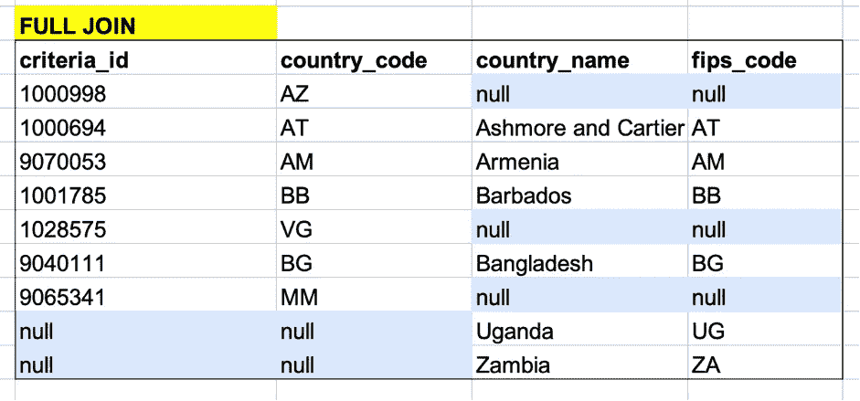
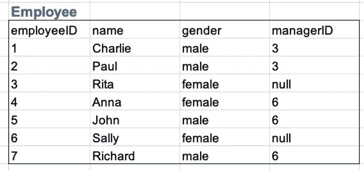
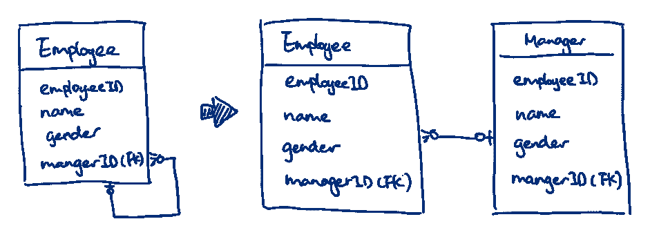
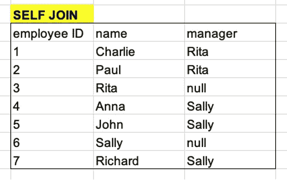
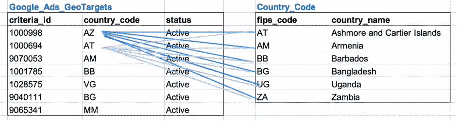
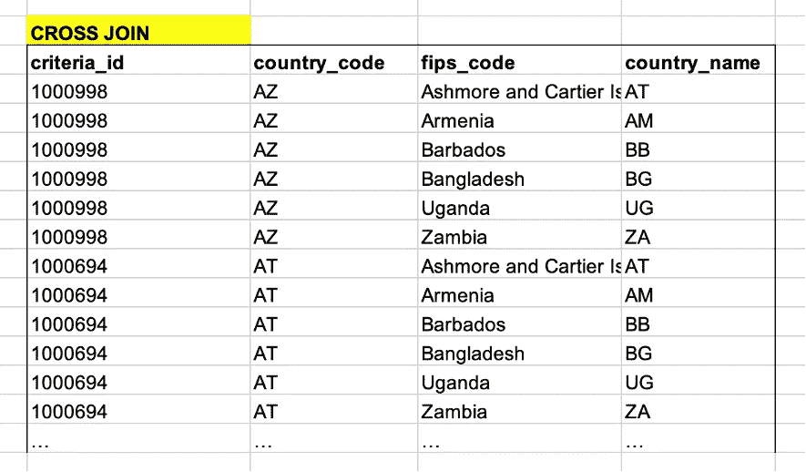

# SQL 连接入门

> 原文：<https://towardsdatascience.com/get-started-with-sql-joins-87835422644b?source=collection_archive---------45----------------------->

## 使用示例学习左连接、内连接、自连接


照片由 [Aida L](https://unsplash.com/@pensandpillows?utm_source=medium&utm_medium=referral) 在 [Unsplash](https://unsplash.com?utm_source=medium&utm_medium=referral) 上拍摄

为了执行高级分析处理和数据发现，一个表通常不足以带来有价值的见解，因此将多个表组合在一起是不可避免的。SQL 作为与关系数据库通信的工具，提供了在表之间建立关系的功能。本文介绍了如何使用 SQL 将表链接在一起。如果你想学习更多关于 SQL 的基础知识，我建议你读一读我的第一篇关于用日常语言学习 SQL 的文章。它为绝对初学者提供了全面的 SQL 介绍。

</learn-sql-in-everyday-language-8d1e06f4daef>  

# 为什么我们需要学习 SQL 连接

也许你还没有意识到，我们也经常遇到加入 Excel。这是通过 VLOOKUP 函数实现的，如下所示。VLOOKUP 函数允许我们执行一列的匹配，并从另一列返回相应的参考值。在这种情况下，我们可以通过将*国家代码*与*国家代码*表中的 *fips 代码*进行匹配，找到与每个标准相关的国家名称。



excel 中的 vlookup(图片由作者提供)

当一个表中的信息不够时，我们可能会遇到许多这样的情况。SQL join 使用完全相同的逻辑，但是它更强大，因为它匹配并合并两个或更多的表，而不是两列。在下一节中，我们将深入探讨如何使用 SQL 来解决这个问题。学习 SQL join 还有一个很实际很现实的原因就是面试！没错，SQL join 几乎是任何一个数据科学家或者数据分析师面试中不可避免的问题。有些问题比较理论化，比较露骨，“能告诉我左连接和内连接的区别吗？”；还有的比较实际含蓄“能不能写一个 SQL 语句，找到这个员工的经理的名字？”所以这给了你另一个理由去学习和区分每一种连接的实现。

# 如何创建联接

```
SELECT <attributeName>, <attributeName>, <attributeName>, ...
FROM <TableA> 
<LEFT|INNER|FULL OUTER|...> JOIN <TableB>
ON <TableA.commonAttribute> = <TableB.commonAttribute>
```

> SQL join 遵循这个语法，我把它分成三个部分: **1)选择属性和表；2)确定连接条件；3)选择合适的连接类型。**

## 属性和表格

和其他 SQL 语句一样，需要以`SELECT <attribute> FROM <table>`的形式指定属性和表名。但是不同之处在于需要连接多个表。如果相同的属性名称存在于多个表中，那么简单地通过名称引用属性将是不明确的，因为数据库不确定您从哪个表中选择该属性。为了解决这个问题，我们需要使用表名作为属性前缀。

例如，如果*名称*属性同时存在于*客户*和*国家*表中，我们只选择客户名称。然后我们将该属性称为“ *Customer.name”。*

## 连接条件

表通过至少一个公共属性连接在一起。这个公共属性通常被称为外键。如 excel 示例所示，VLOOKUP 函数也利用了这个共享属性。我们使用这个共享属性(外键)作为匹配点，在这里我们可以找到另一个表中每一行的相应信息。这个公共属性需要作为 SQL 语句中的连接条件显式地表示出来。



国家代码示例(图片由作者提供)

让我们继续这个国家代码的例子。本练习的目的是在“Google_Ads_GeoTargets”表中找到每个标准的国家名称。这些数据集来自[谷歌公共数据集](https://console.cloud.google.com/marketplace/browse?filter=solution-type:dataset&_ga=2.267295438.1534065461.1609639158-2120400784.1606380643)。如果有兴趣，可以尝试在 BigQuery 中实现它。

在左侧表格中，我们已经获得了每个标准的*国家代码*，并且*国家代码*表格为我们提供了国家名称 *fips_code* 。因此，逻辑是将 *GeoTarget* 表中的 *country_code* 与 *Country_Code* 表中的 *fips_code* 进行匹配，找到对应的名称。 *country_code* 和 *fips_code* 是建立两个表之间关系的公共属性。

我们写下下面的语句来表示连接条件。注意，最好使用表名作为属性前缀，并且不要忘记关键字“on”:

```
ON  Google_Ads_GeoTargets.country_code = Country_Code.fips_code
```

## 连接类型

还有五种主要的连接类型:**左连接、内连接、全连接、自连接**、**和交叉连接**。为了与数据库通信，我们需要在语句中显式或隐式地指示连接类型。这是通过使用关键字“左连接”、“内连接”或“全外连接”等实现的。每种类型都有其独特的用例。希望下面的比较能帮助你区分它们的细微差别。

**1。左接合**

左连接与 excel 中的 VLOOKUP 最相似。右边的表可以被看作是一个参考表或者一个字典，从这里我们扩展了左边表中存储的现有知识。因此，采用左连接来返回左表中的所有记录，并从右表中引用相应的值。左连接还可以让我们更深入地了解为什么有些值找不到匹配项。例如，是因为左表中的记录不正确或打字错误，还是因为右表中的数据不完整？

我们用这个语句生成左连接结果如图所示:

```
SELECT criteria_id, country_code, country_name, fips_code
FROM Google_Ads_GeoTargets gt
LEFT JOIN Country_Code cc
ON gt.country_code = cc.fips_code;
```



左连接结果(作者图片)

来自 *Google_Ads_Geo_Targets* 的所有行都作为结果返回，即使有些行与 *Country_Code* 表不匹配(因此返回 null)。

你可能想知道为什么大部分时间都没有必要使用右连接。这是因为右连接可以通过交换表的方向和执行左连接来实现。

此外，右表往往被视为一本参考书。在这种情况下，Country_Code 表被视为一个引用或字典。没有必要返回所有 fips_codes 的匹配。想想我们碰到一个新单词的情况。我们会在字典中找到这个单词的意思，而不是在字典中查找每个单词来匹配我们所输入的单词。范围将过于宽泛和模糊。

**2。内部连接**

当我们对表的交集感兴趣时，内部连接很有用。因为它只显示存在于两个表中的记录，所以内部联接通常返回最少的行数。如下面的结果所示，所有空值都被过滤掉了。我们使用 INNER JOIN 关键字来表示这种连接类型:

```
SELECT criteria_id, country_code, country_name, fips_code
FROM Google_Ads_GeoTargets gt
INNER JOIN Country_Code cc
ON gt.country_code = cc.fips_code;
```



内部连接结果(图片由作者提供)

**3。完全外部连接**

完全外连接覆盖两个表中的每一行，不管是否找到匹配。它用于全面掌握存储在两个表中的信息，并找出任何不匹配的地方。在本例中，第一行对于 *country_name* 和 *fips_code* 显示为 null，因为在 *Country_Cod* e 表中没有匹配的 *fips_code = "AZ"* 。另一方面，最后一行没有 *criteria_id* 和 *country_code* ，因为在 *Google_Ads_GeoTargets* 表中没有带有 *country_code = "ZA"* 的标准。



完整的外部连接结果(图片由作者提供)

要写下完整的外部联接语句，请执行以下操作:

```
SELECT criteria_id, country_code, country_name, fips_code
FROM Google_Ads_GeoTargets gt
FULL OUTER JOIN Country_Code cc
ON gt.country_code = cc.fips_code;
```

**4。自连接**

自连接意味着将表链接到自身，我们应用它来处理一元关系。这是强大的创建层次关系，例如，雇员和经理，类别和子类别等。最终，它仍然可以被看作是将两个表连接在一起。



员工示例(图片由作者提供)

我用一个员工的例子来解释自我加入。在这个例子中，如果我们想要找到每个雇员的经理姓名，我们需要使用一个自连接来找到每个雇员的经理的姓名，并且我们使用 *managerID* 来派生该姓名。在 ERD 图中，manageid 被表示为外键，因为它是从 *employeeID* 中借用的。



员工示例 ERD(图片由作者提供)

```
SELECT e.employeeID AS employee ID, e.name AS name, m.name as manager
FROM Employee e
LEFT JOIN Employee m
ON e.managerID = m.employeeID
```

如 ERD 中所示，我们可以将*经理*表视为*雇员*的子集，因此这种自连接相当于将*雇员*表左连接到其子集*经理*。连接条件是*雇员*表中的经理 ID 需要等于经理表中的*雇员 ID* ，因此 *e.managerID = m .雇员 ID* 。对于自连接，我们仍然需要考虑什么是连接类型。在这种情况下，我们希望显示所有员工记录，即使他们没有经理(例如，员工 3 和 6)，因此需要一个左连接。值得注意的是，需要对表进行重命名，以清楚地表明您引用的是哪个表中的哪些属性。此外，我们可以使用 AS 关键字将属性重命名为可读的内容。



自连接结果(图片由作者提供)

**5。交叉连接**

我会说交叉连接是最不合理的连接，因为它没有任何连接条件。

```
SELECT criteria_id, country_code, country_name, fips_code
FROM Google_Ads_GeoTargets gt
CROSS JOIN Country_Code cc;
```

交叉联接将一个表中的每一行与另一个表中的所有行进行匹配，如下例所示。带有 *criteria_id = "1000998"* 的*地理目标*标准与 *Country_Code* 表中的所有记录匹配。下表并不详尽，但我们可以计算出总共有 42 行(7 行谷歌广告标准 x 6 行国家代码)。当表中有重复的行时，我们可能会意外地创建交叉连接。因此，在预处理数据时，消除重复行是非常重要的。我将在下一篇文章中更详细地解释这一点，如果感兴趣，请继续关注:)

交叉连接的计算成本很高，应尽可能避免。我能想到的唯一用例是在两个表中填充所有记录的组合，例如，size x color。如果您对交叉连接用例有任何建议，请在下面评论。



交叉连接插图(图片由作者提供)



交叉连接结果(图片由作者提供)

# 带回家的信息

本文的主要内容是将 SQL 连接归结为三个步骤:

1.  选择表和属性
2.  2.确定连接条件
3.  3.从左联接、内联接、自联接和完全联接中选择适当的联接类型

希望这篇文章能帮助你通过结合表格将基本的 SQL 技能提升到更高级的分析。

## 相关文章

<https://www.visual-design.net/post/learn-sql-in-everyday-language>  <https://www.visual-design.net/post/five-data-science-podcasts-to-follow-in-2021>  

*原载于 2021 年 1 月 4 日 https://www.visual-design.net**[*。*](https://www.visual-design.net/post/five-data-science-podcasts-to-follow)*