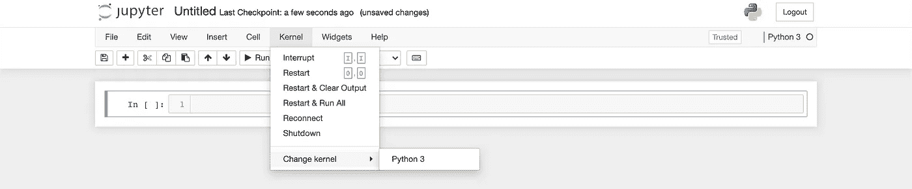
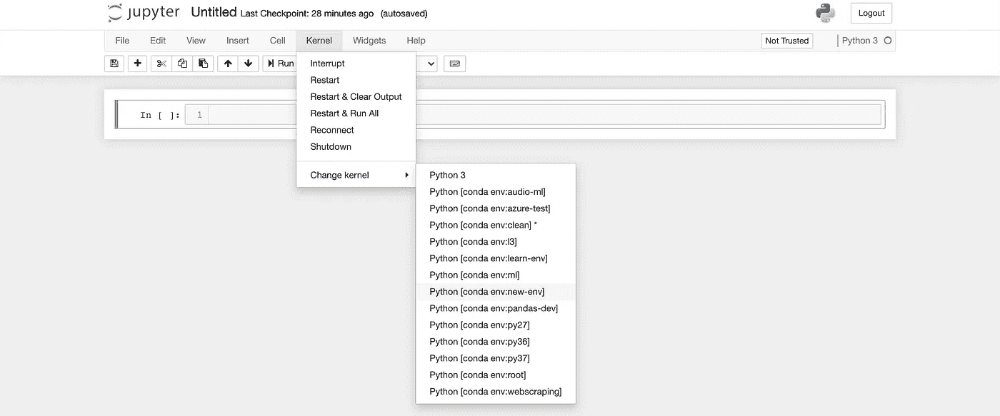
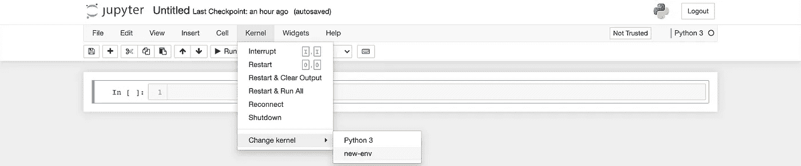
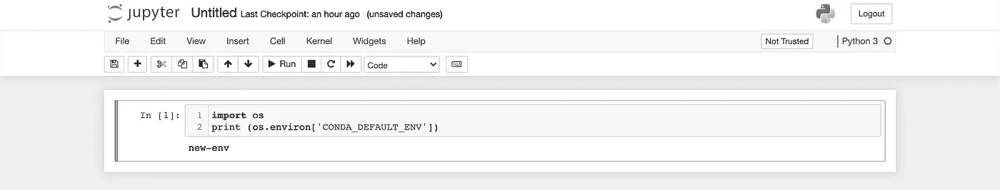

# 让您的 Conda 环境在 Jupyter 笔记本电脑上展示——简单的方法

> 原文：<https://towardsdatascience.com/get-your-conda-environment-to-show-in-jupyter-notebooks-the-easy-way-17010b76e874?source=collection_archive---------1----------------------->

## (还有一些其他方式……)


美国宇航局在 [Unsplash](https://unsplash.com?utm_source=medium&utm_medium=referral) 拍摄的照片

当我第一次开始使用 Jupyter 笔记本时，我花了比我愿意承认的更长的时间来弄清楚如何让我的 conda 环境内核显示在内核列表中。当我成功时，我并不满意，因为我希望它是自动的。像大多数事情一样，一旦你知道怎么做，两者都很简单。

下面我将展示三种方法，每种方法都最适合特定的场景。

# 方法 1:“简单的方法”

这是我的首选方法，因为它简单。新环境会自动出现(只要它们安装了`ipykernel`。)

> 在撰写本文时，`nb_conda_kernels`还不支持 Python 3.9。这只会影响我们的基本环境，我们在任何工作中都不会用到它，对吗？:).您的其他环境可以使用任何 Python 版本，包括 3.9。

最初，您的内核列表(在 Change kernel 下)将只显示您当前的环境。



作者图片

要让您的其他环境内核自动显示:

1.首先，在您的基础环境中安装`nb_conda_kernels`。一旦安装完毕，任何从基础环境运行的笔记本都会自动显示任何其他安装了`ipykernel`的环境的内核。

```
(base)$ conda install nb_conda_kernels
```

2.接下来，创建一个新环境。我会叫我的`new-env`。如果您已经有了一个想要在 Jupyter 笔记本上展示的环境，请跳过这一步。

```
(base)$ conda create --name new-env
```

3.激活您想要在笔记本中使用的环境，并安装`iypkernel`。我的环境叫`new-env`。如果您已经有了一个环境，用您的环境名称代替`new-env`

```
(base)$ conda activate new-env(new-env)$ conda install ipykernel
```

4.从您的基本环境重新启动 Jupyter 笔记本电脑，完成。你可以在这里看到我所有安装了 ipykernel 的环境，包括`new-env`都显示出来了。我现在可以随意在它们之间切换。极乐世界。



作者图片

# 方法二:“通常的方式”

单独注册您想要在内核列表中显示的每个环境并不难。如果您有许多环境，这可能更好，因为它允许您**注册**和**取消注册**您的环境内核，这有助于保持列表整洁。

1.  记下您的环境正在使用的 python 的位置。一些 os/python 版本组合引入了一个路径问题，如果你知道它的存在，这个问题很容易解决。

```
(new-env)$ which python
/opt/homebrew/Caskroom/miniforge/base/bin/python <- yours may be different.
```

2.在您的新环境中安装`ipykernel`

```
(new-env)$ conda install ipykernel
```

3.检查您的 python 位置。

```
(new-env)$which python
/opt/homebrew/Caskroom/miniforge/base/bin/python
```

如果 python 位置与第一步中的位置不匹配，您需要在继续之前停用并重新激活 conda 环境。

```
(new-env)$conda deactivate new-env
(base)$conda activate new-env
(new-env)$which python
/opt/homebrew/Caskroom/miniforge/base/bin/python <- this should match step 1
```

2.使用下面的命令向 Jupyter 注册内核规范。`--name=`参数将为这个环境的内核设置您在 Jupyter 笔记本上看到的名称(因此您可以随意命名它，但是使用环境的名称可能是明智的)。

```
(new-env)$ipython kernel install --user --name=new-env
```

3.现在`new-env`将会显示在你的内核列表中(不需要重启 Jupyter Notebook——只需要在你的浏览器中重新加载页面)。



作者图片

4.当您想要取消注册内核规范(从可用内核列表中删除环境内核)时，使用以下命令:

```
$jupyter kernelspec uninstall new-env
```

# **方法三:“快速肮脏的方法”**

这个方法实际上并没有让你的环境在 Jupyter 笔记本上显示出来，但是值得注意。如果你在任何环境中安装`jupyter`并从该环境中运行`jupyter notebook`，笔记本将使用活动环境中的内核。内核将以默认名称`Python 3`显示，但是我们可以通过执行以下操作来验证这一点。

1.  激活您的环境，安装`jupyter`，运行`jupyer notebook`。

```
(base)$ conda activate new-env
(new_env)$ conda install jupyter
(new_env)$ jupyter notebook
```

2.在您的笔记本中运行以下代码，以确认您使用的是正确的内核

```
import os
print (os.environ['CONDA_DEFAULT_ENV'])
```



作者图片

# 结论

最后，你如何选择在 Jupyter Notebook 中与你的内核交互应该基于你的特殊需求，而不是缺乏关于你的选择的信息。希望这篇文章有助于消除后面的。

去做好事吧。

## 参考资料:

我觉得这个栈溢出答案的评分不够高(去投上一票吧，以示对 [lumbric](https://stackoverflow.com/users/859591/lumbric) 贴上回答自己问题的答案的一点爱)。这是我对这个主题最初理解的基础。

<https://stackoverflow.com/questions/58068818/how-to-use-jupyter-notebooks-in-a-conda-environment> 