# 将您的双脚浸入 Power BI

> 原文：<https://towardsdatascience.com/get-your-feet-wet-in-power-bi-d23c78004a4e?source=collection_archive---------40----------------------->

## 数据科学工具

## 微软分析工具的实践介绍。

雅各布·鲍曼在 [Unsplash](https://unsplash.com/s/photos/wet-feet?utm_source=unsplash&utm_medium=referral&utm_content=creditCopyText) 上的照片

*作为一名数据科学家，你迟早需要学会适应分析工具。在今天的帖子中，我们将深入学习 Power BI 的基础知识。*

*请务必点击图片，以便更好地查看一些细节。*

# 数据

我们将在今天的实践教程中使用的数据集可以在[https://www . ka ggle . com/c/insta cart-market-basket-analysis/data](https://www.kaggle.com/c/instacart-market-basket-analysis/data)找到。该数据集是“一组描述客户订单的相关文件。"下载 zip 文件，并将它们解压缩到本地硬盘上的一个文件夹中。

# 下载 Power BI 台式机

如果你还没有，去 https://powerbi.microsoft.com/desktop[点击“免费下载”按钮。](https://powerbi.microsoft.com/desktop/)

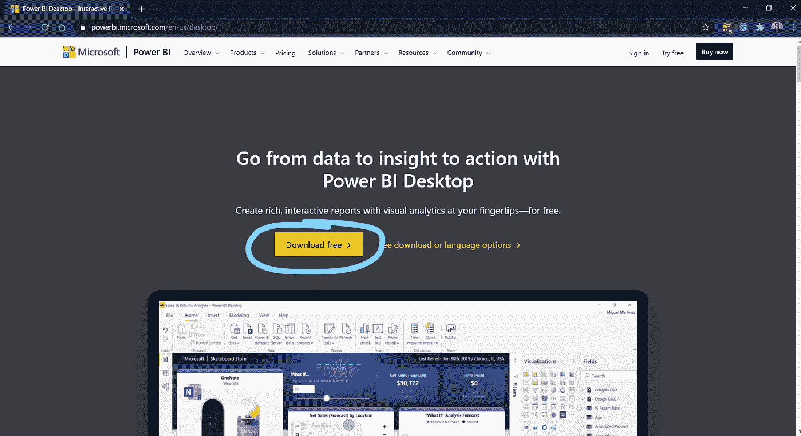

截图来自[edn alin c . De Dios](https://medium.com/@ednalyn.dedios)

如果你使用的是 Windows 10，它会要求你打开微软商店。

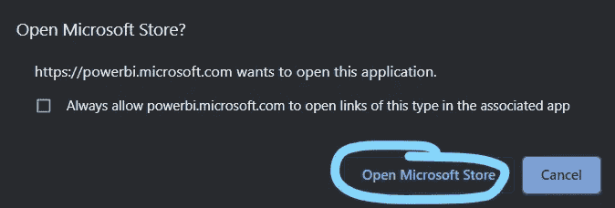

截图来自[edn alin c . De Dios](https://medium.com/@ednalyn.dedios)

继续并点击“安装”按钮。

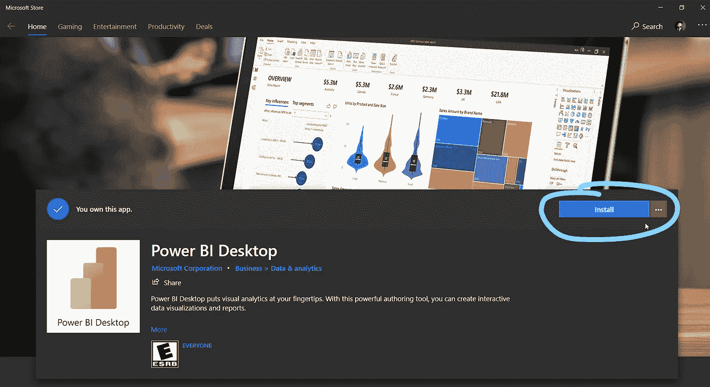

截图来自[edn alin c . De Dios](https://medium.com/@ednalyn.dedios)

让我们点击“启动”按钮开始吧。

# 一千次点击

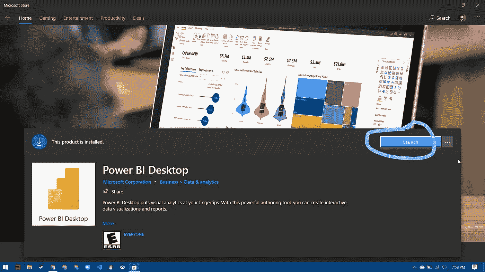

截图来自[edn alin c . De Dios](https://medium.com/@ednalyn.dedios)

出现闪屏时，点击“获取数据”。

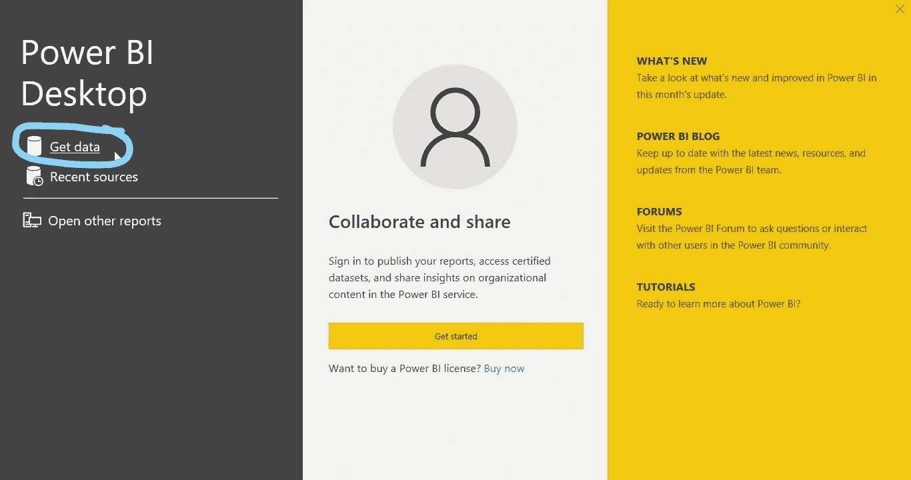

截图来自[埃德纳林·c·德·迪奥斯](https://medium.com/@ednalyn.dedios)

你会看到很多文件格式和来源；让我们选择“文本/CSV”并点击“连接”按钮。

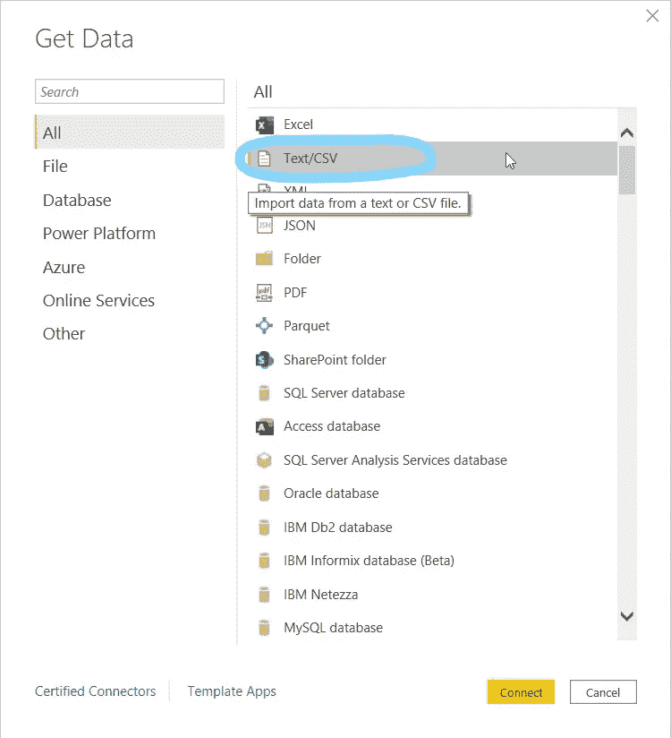

截图来自[edn alin c . De Dios](https://medium.com/@ednalyn.dedios)

选择“order_products_prior.csv”并点击“打开”按钮。

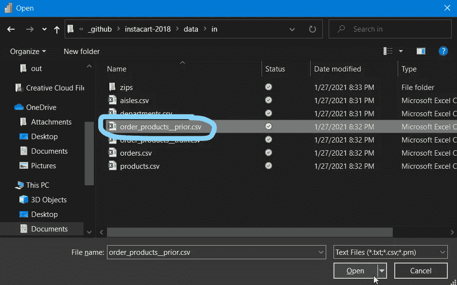

截图来自[edn alin c . De Dios](https://medium.com/@ednalyn.dedios)

下图显示了数据的样子。单击“加载”按钮将数据集加载到 Power BI Desktop 中。

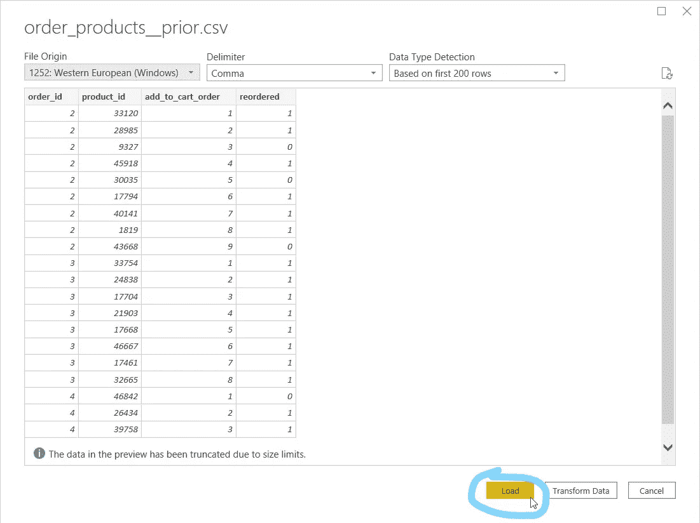

截图来自[edn alin c . De Dios](https://medium.com/@ednalyn.dedios)

通过选择“获取数据”并在下拉菜单中选择“文本/CSV”选项来加载数据集的其余部分。

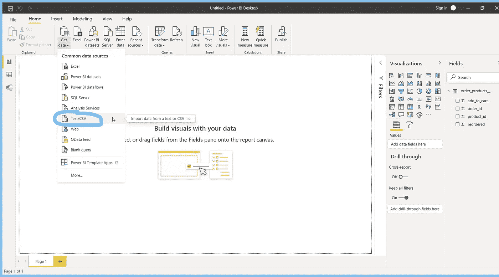

截图由[edn alin c . De Dios](https://medium.com/@ednalyn.dedios)

您应该将这三个文件加载到 Power BI Desktop 中:

*   order_products_prior.csv
*   orders.csv
*   产品. csv

您应该会在 Power BI Desktop 的“Fields”面板上看到以下表格，如下所示。(注:图像显示的是*报表视图*中的电量 BI。)

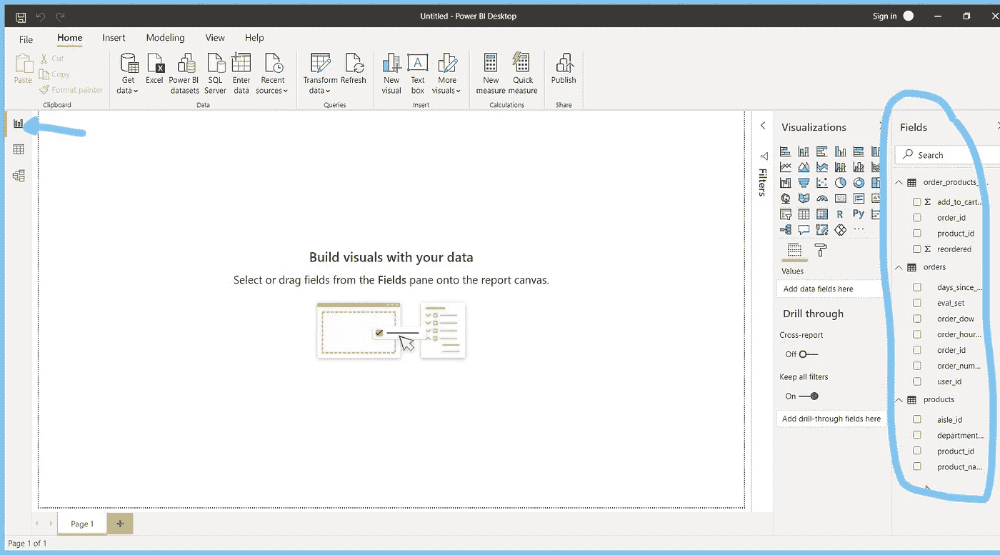

截图来自[埃德纳林·c·德·迪奥斯](https://medium.com/@ednalyn.dedios)

让我们点击 Power BI 桌面左侧的第二个图标，看看*数据视图*是什么样子。

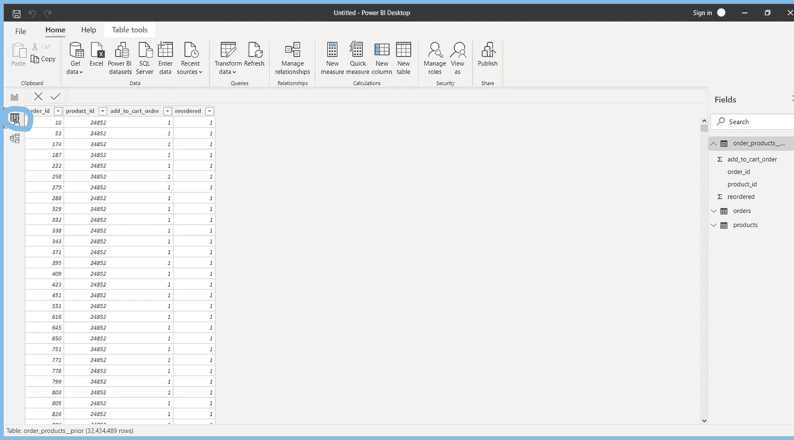

截图作者[edn alin c . De Dios](https://medium.com/@ednalyn.dedios)

现在，让我们看看*模型视图*，在这里我们将看到不同的表是如何相互关联的。

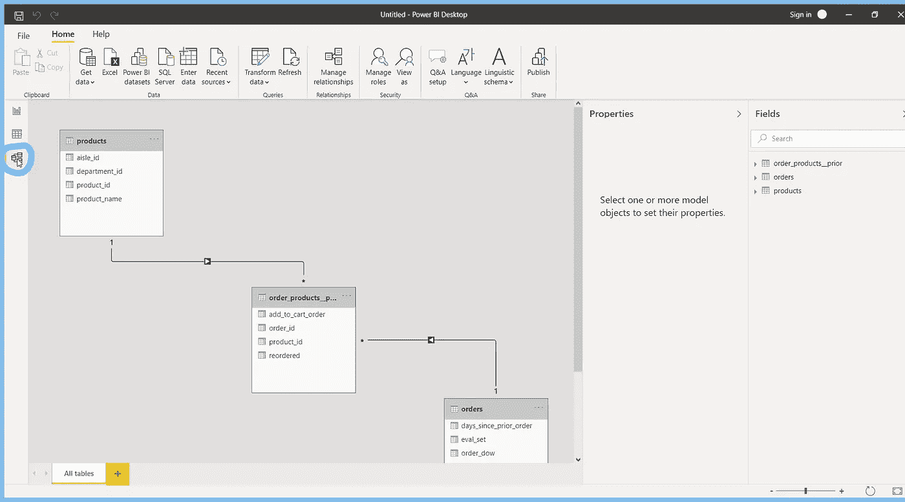

截图来自[edn alin c . De Dios](https://medium.com/@ednalyn.dedios)

如果我们将鼠标悬停在某一行上，它会变成黄色，相应的相关字段也会高亮显示。

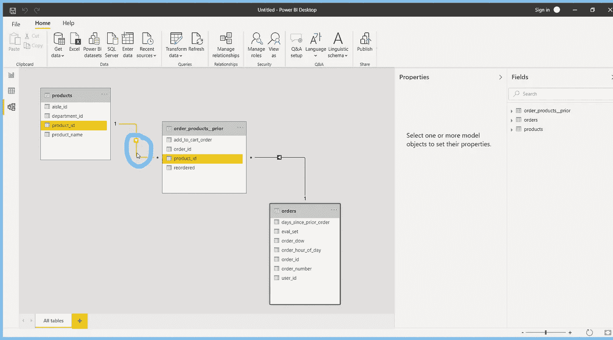

截图来自[edn alin c . De Dios](https://medium.com/@ednalyn.dedios)

在这种情况下，Power BI Desktop 很聪明地推断出了这两种关系。然而，大多数时候，我们必须自己创造关系。我们将在以后讨论这个话题。

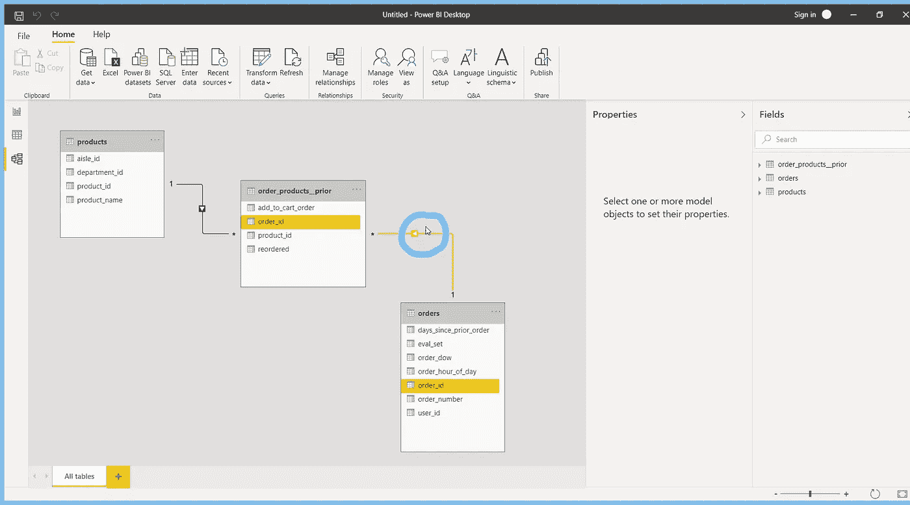

截图来自[edn alin c . De Dios](https://medium.com/@ednalyn.dedios)

让我们回到报告视图，仔细检查“可视化”面板。寻找“切片器”图标，它看起来像一个正方形，右下角有一个漏斗。单击它可以向报告添加一个可视化内容。

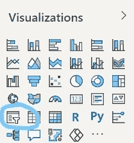

截图来自[edn alin c . De Dios](https://medium.com/@ednalyn.dedios)

在“Fields”面板中，找到“department_id”并单击其左侧的复选框。

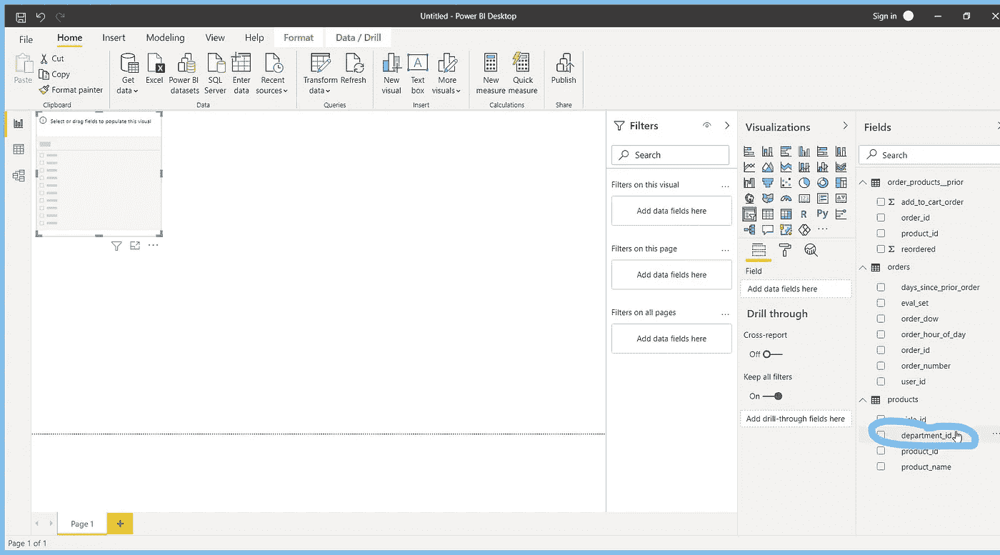

截图来自[埃德纳林·c·德·迪奥斯](https://medium.com/@ednalyn.dedios)

这将导致“部门标识”字段出现在“字段”框中的“可视化”面板下。

接下来，将鼠标光标悬停在*报告视图*的右上角。点击出现在角落的三个点，如下所示。

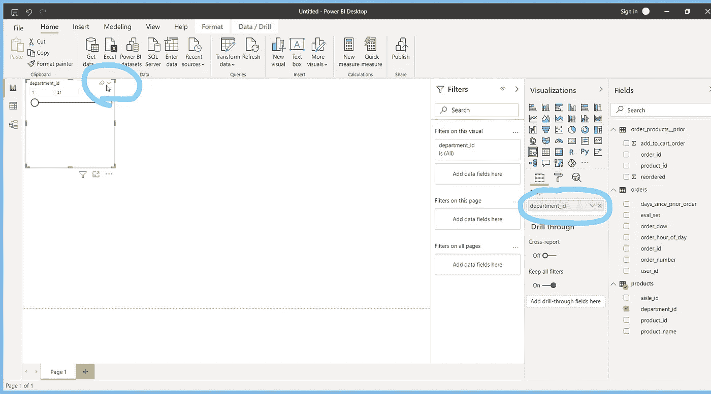

截图来自[edn alin c . De Dios](https://medium.com/@ednalyn.dedios)

在出现的下拉菜单中点击“列表”。

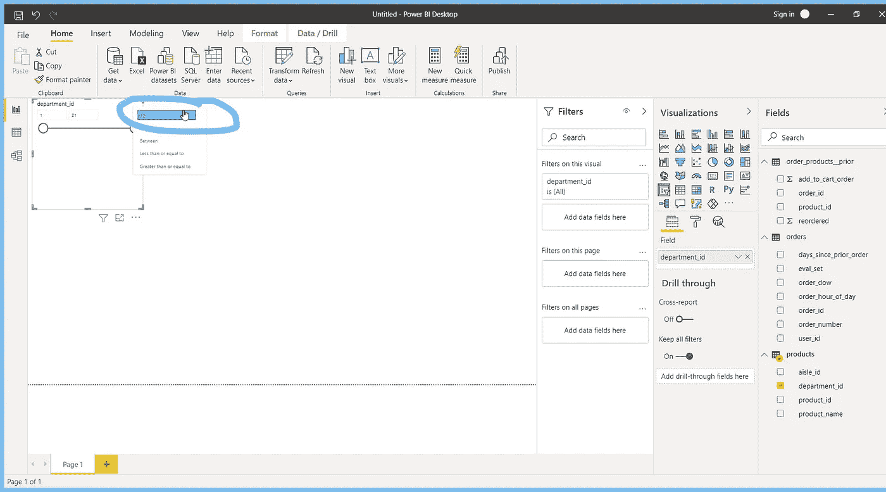

截图来自[edn alin c . De Dios](https://medium.com/@ednalyn.dedios)

当“department_id”视觉对象被选中时，您应该会看到指示该视觉对象为活动视觉对象的角标记。当“department_id”处于活动状态时，按 CTRL+C 复制它，然后按 CTRL+V 粘贴它。将新的视觉效果移到原始视觉效果的右侧。

通过单击第二个视觉对象内部的某个位置来激活它。然后在 Power BI Desktop 右侧的“Fields”面板中查找“aisle_id”字段，如下所示。

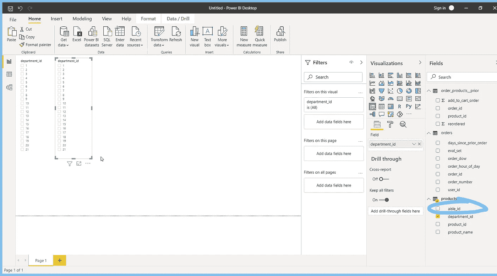

截图由[edn alin c . De Dios](https://medium.com/@ednalyn.dedios)

尝试在“部门标识”上选择一个值，并观察“通道标识”上的选择如何相应变化。

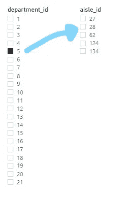

截图来自[埃德纳林·c·德·迪奥斯](https://medium.com/@ednalyn.dedios)

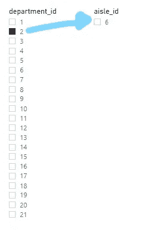

截图来自[埃德纳林·c·德·迪奥斯](https://medium.com/@ednalyn.dedios)

现在，再次检查“可视化”面板，并点击如下所示的表格可视化。

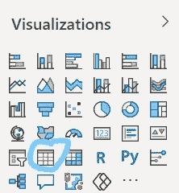

截图作者[edn alin c . De Dios](https://medium.com/@ednalyn.dedios)

在“字段”面板中，选择“产品标识”和“产品名称”，或者将它们拖到“值”框中。

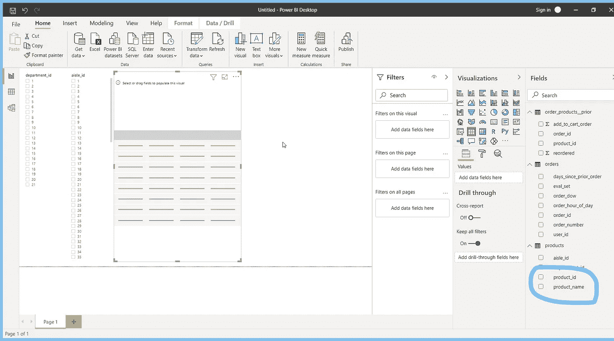

截图作者[edn alin c . De Dios](https://medium.com/@ednalyn.dedios)

Power BI Desktop 看起来应该类似于下图。

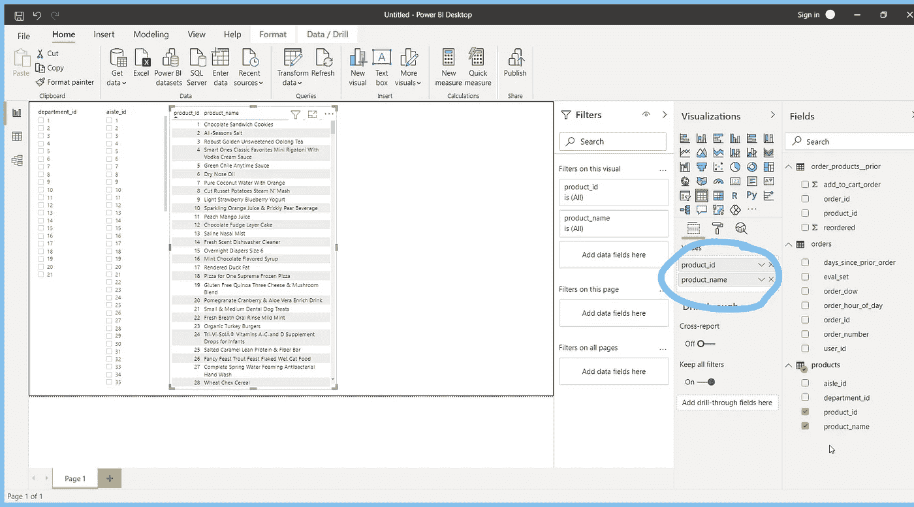

截图来自[edn alin c . De Dios](https://medium.com/@ednalyn.dedios)

这一次，尝试从“department_id”和“aisle_id”中选择一个值，观察右边的表格视图会发生什么变化。

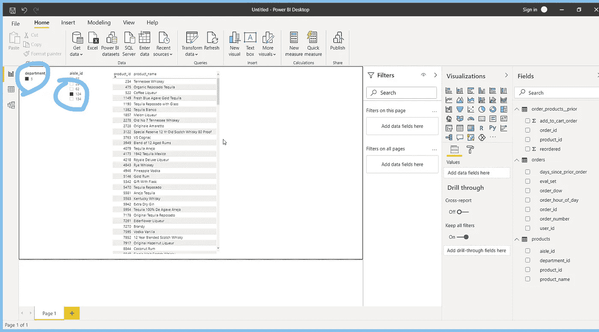

截图来自[edn alin c . De Dios](https://medium.com/@ednalyn.dedios)

让我们通过复制和粘贴表格视图来创建另一个视图。这一次，选择(或拖动)以下字段到可视化的“值”框中。

*   订单 id
*   用户标识
*   订单编号
*   订单时间
*   订单 _dow
*   天数 _ 自 _ 前 _ 顺序

Power BI Desktop 现在看起来应该类似于下图。

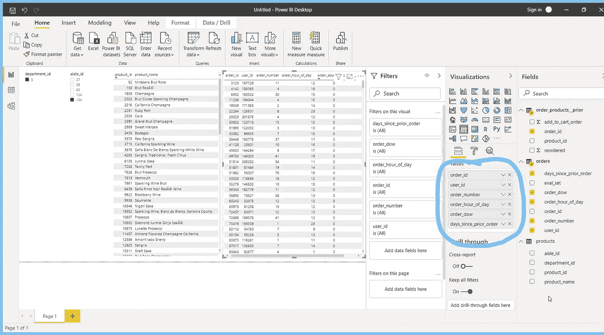

截图来自[edn alin c . De Dios](https://medium.com/@ednalyn.dedios)

尝试单击可视表格中的一个选项(显示“product_id”和“product_name”)，并观察右侧表格如何相应变化。

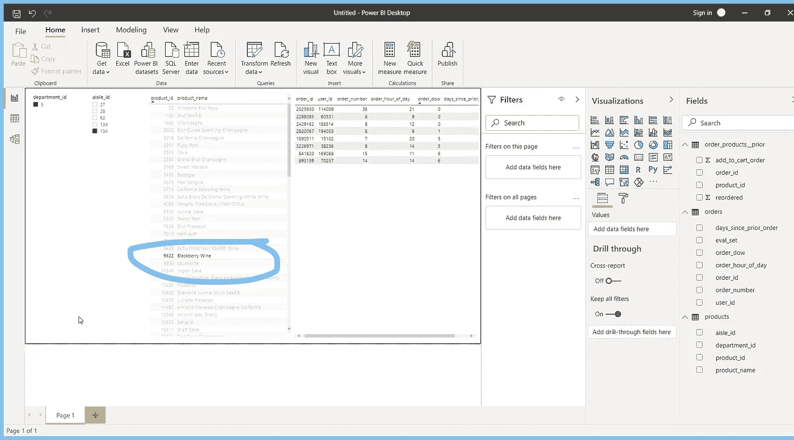

截图来自[edn alin c . De Dios](https://medium.com/@ednalyn.dedios)

为了仔细观察，通过点击如下所示的图标激活*聚焦模式*。

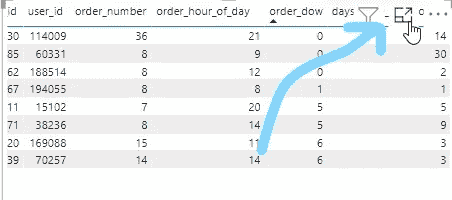

截图来自[埃德纳林·c·德·迪奥斯](https://medium.com/@ednalyn.dedios)

该表显示了订单的详细信息，这些订单包含您在表中选择的带有“产品 id”和“产品名称”的产品

点击“返回报告”退出*聚焦模式*，如下所示。

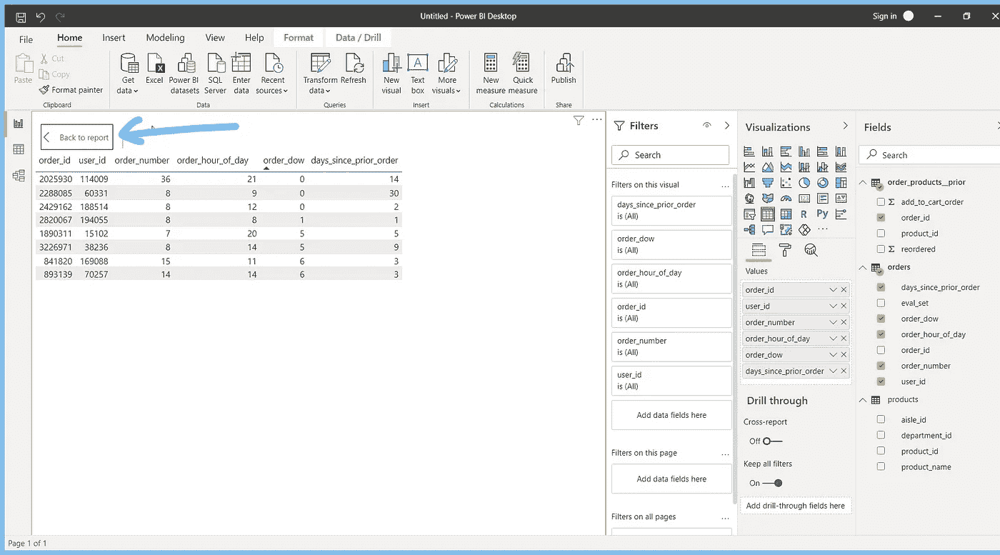

截图来自[edn alin c . De Dios](https://medium.com/@ednalyn.dedios)

让我们通过右键单击页面名称(“第 1 页”)并选择“重命名页面”来重命名此页面或选项卡

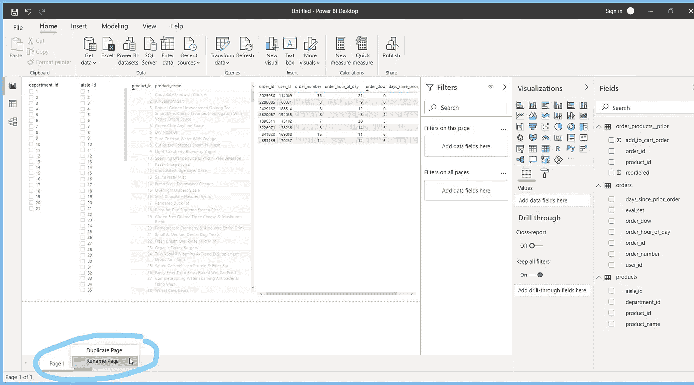

截图来自[edn alin c . De Dios](https://medium.com/@ednalyn.dedios)

键入“产品”并按回车键。

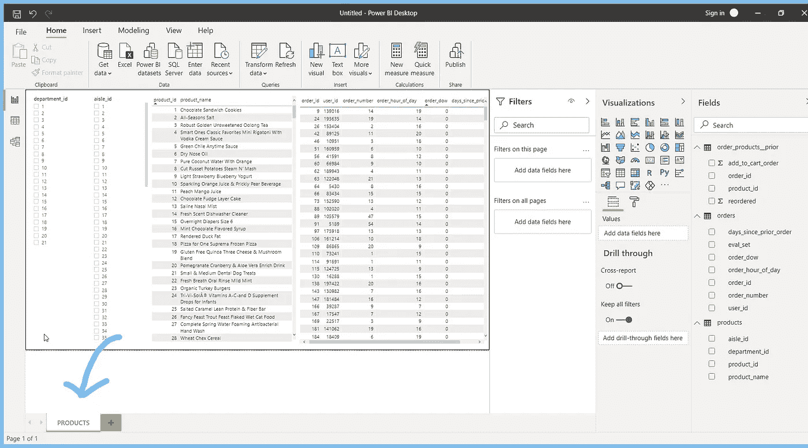

截图来自[edn alin c . De Dios](https://medium.com/@ednalyn.dedios)

让我们通过再次右键单击页面名称(“产品”)并选择“复制页面”，向报告添加另一个页面或选项卡

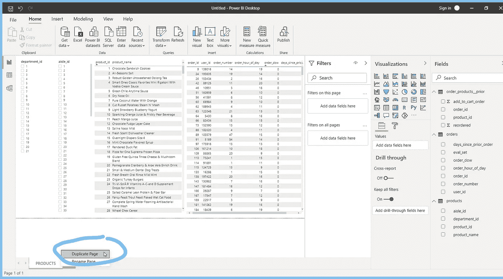

截图由[edn alin c . De Dios](https://medium.com/@ednalyn.dedios)

将新页面重命名为“TRANSACTIONS ”,并删除(或移除)最右边的包含订单详细信息的表。

更改左上角的视觉效果，并更新字段，如下所示。当左上角的图标被激活时,“Fields”框应该显示“order_dow”。

移动视觉效果，使其看起来与下图相似。

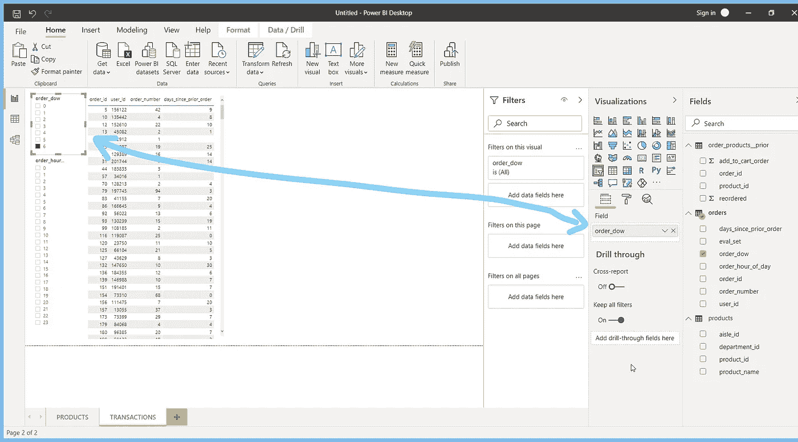

截图来自[埃德纳林·c·德·迪奥斯](https://medium.com/@ednalyn.dedios)

对下一个画面做同样的事情。这一次，选择“order_hour_of_day ”,您的 Power BI 桌面应该会像下图一样。

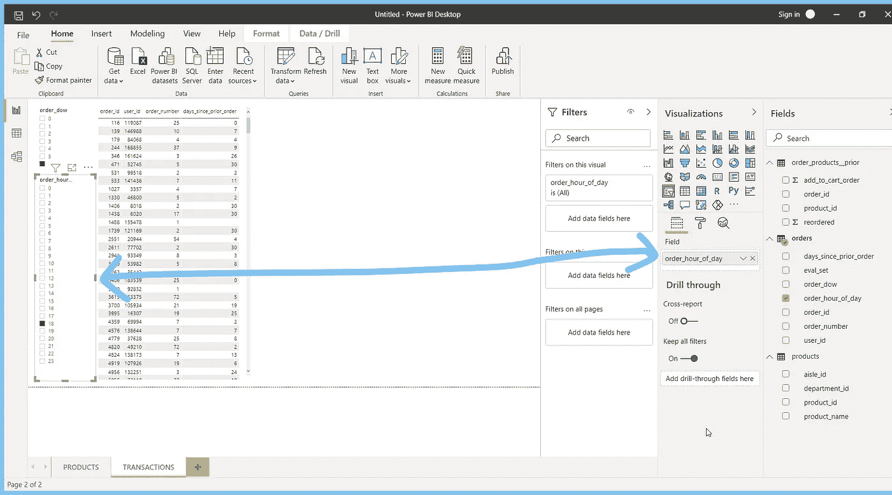

截图来自[埃德纳林·c·德·迪奥斯](https://medium.com/@ednalyn.dedios)

对最后一个表做最后一次同样的操作，现在它应该包含如下所示的字段。

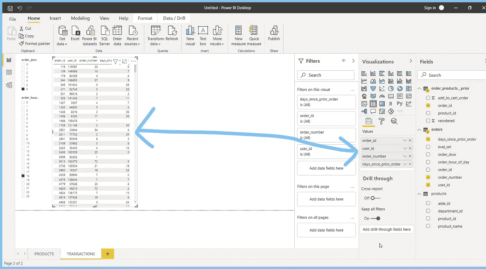

截图作者[edn alin c . De Dios](https://medium.com/@ednalyn.dedios)

让我们通过单击报告主工作区底部的“+”图标，向报告添加另一个页面或选项卡。

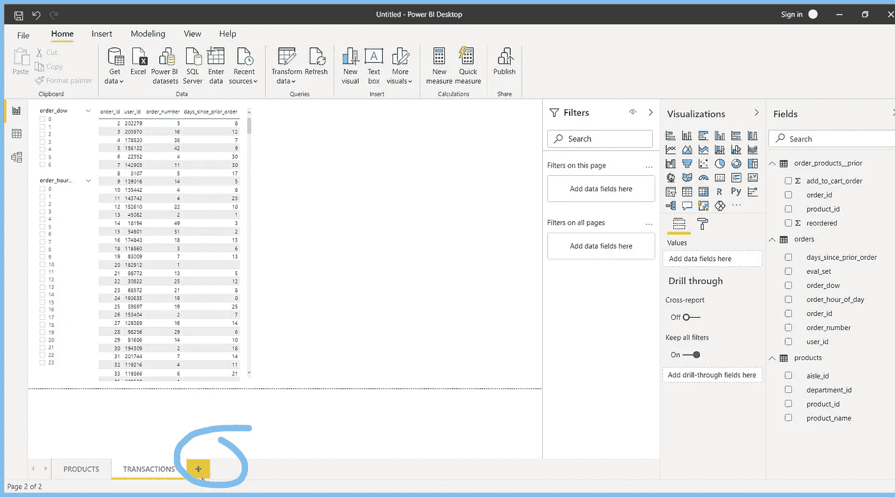

截图作者[edn alin c . De Dios](https://medium.com/@ednalyn.dedios)

# 基础探索

在“可视化”面板中，选择“堆积柱形图”

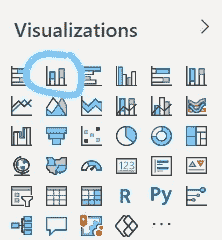

截图来自[edn alin c . De Dios](https://medium.com/@ednalyn.dedios)

拖动移动手柄来调整图表的大小。

确保“轴”框中分别包含“order_dow”和带有“order_id”的“值”框。Power BI Desktop 应自动计算“order_id”的计数，并将该字段显示为“order_id 计数”，如下所示。

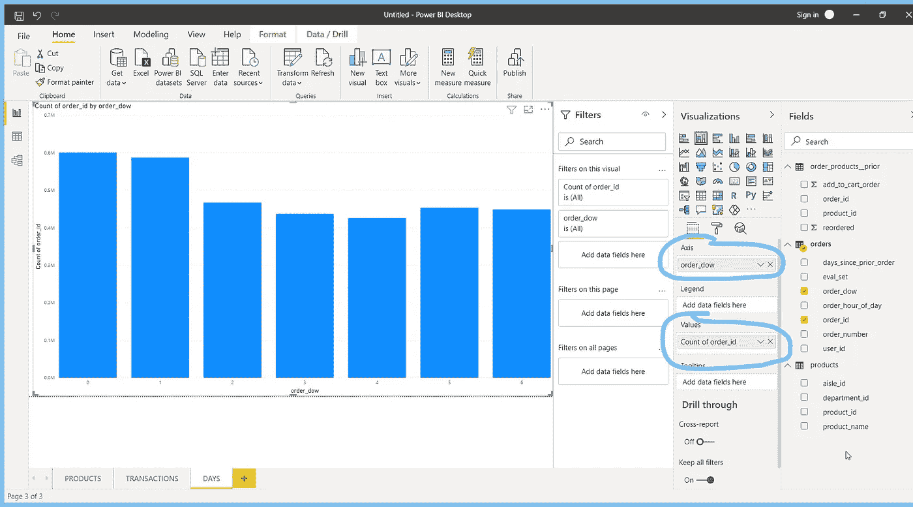

截图来自[edn alin c . De Dios](https://medium.com/@ednalyn.dedios)

上图很有趣，因为它显示了第 0 天和第 1 天的订单数量较高。

让我们再做一个图表。

我们将遵循添加图表的相同步骤，这一次，我们将在“轴”框中使用“order_hour_of_day”，如下所示。

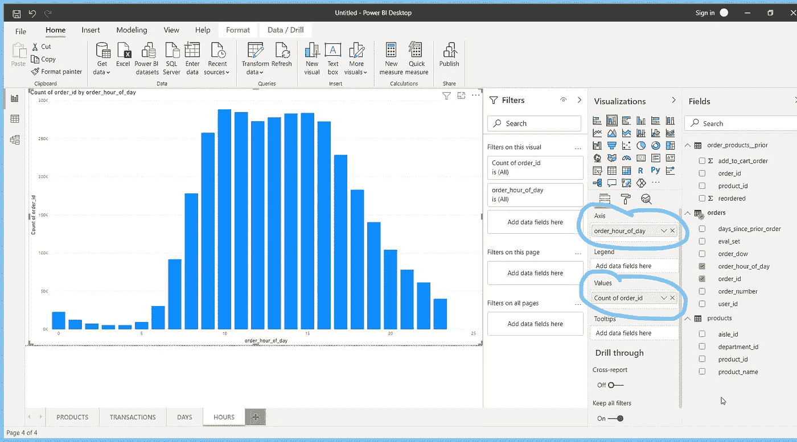

截图来自[edn alin c . De Dios](https://medium.com/@ednalyn.dedios)

该图显示了订单数量的峰值时间。

最后一张图！

我们将在“轴”框中添加另一个带有“days_since_prior_order”的图表。

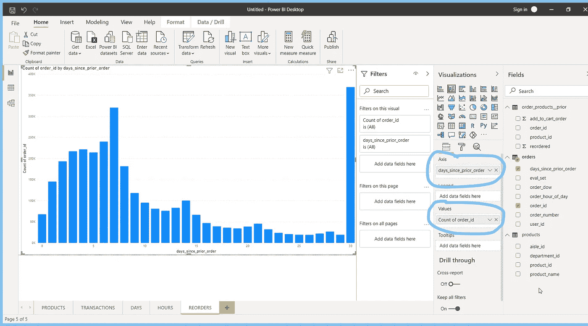

截图来自[edn alin c . De Dios](https://medium.com/@ednalyn.dedios)

最后一个图是最有趣的，因为再订购的数量在这三个时间段达到峰值:自前一次订购后的 7 天、14 天和 30 天。这意味着人们习惯于每周、每两周、每月补给一次。

就这样，伙计们！

在下一篇文章中，我们将“美化”我们的图表，使它们对其他人更具可读性。

上面的程序已经被拉长了。但是如果你是一个初级的 BI 用户，不要绝望！通过定期练习，本文中演示的概念将很快成为你的第二天性，你很可能在睡梦中也能做到。

*感谢您的阅读。如果你想了解更多关于我从懒鬼到数据科学家的旅程，请查看下面的文章:*

 [## 从懒鬼到数据科学家

### 我的无学位数据科学之旅。

towardsdatascience.com](/from-slacker-to-data-scientist-b4f34aa10ea1) 

*如果你正在考虑改变方向，进入数据科学领域，现在就开始考虑重塑品牌:*

 [## 懒鬼将自己重塑为数据科学家指南

### 给我们其他人的固执己见的建议。热爱数学，选修。

towardsdatascience.com](/the-slackers-guide-to-rebranding-yourself-as-a-data-scientist-b34424d45540) 

*敬请期待！*

你可以通过 [Twitter](https://twitter.com/ecdedios) 或 [LinkedIn](https://www.linkedin.com/in/ednalyn-de-dios/) 联系我。