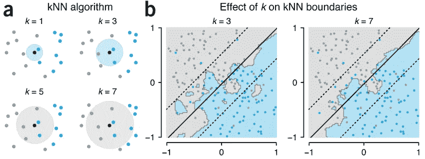
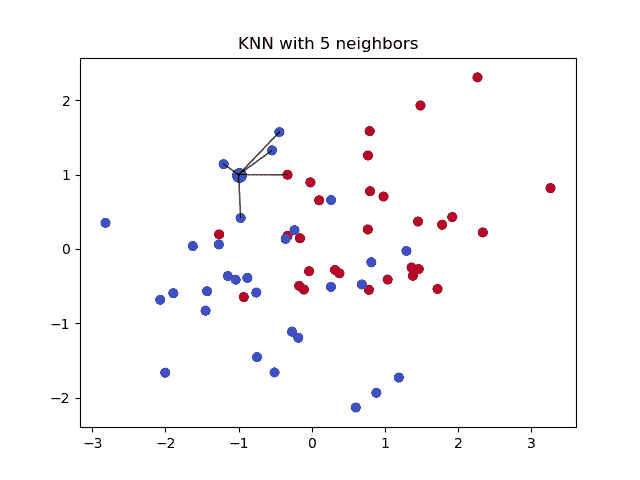

# 使用 K 个最近邻的分类介绍

> 原文：<https://towardsdatascience.com/getting-acquainted-with-k-nearest-neighbors-ba0a9ecf354f?source=collection_archive---------5----------------------->


图片由 [chenspec](https://pixabay.com/users/chenspec-7784448/?utm_source=link-attribution&utm_medium=referral&utm_campaign=image&utm_content=5474989) 来自 [Pixabay](https://pixabay.com/?utm_source=link-attribution&utm_medium=referral&utm_campaign=image&utm_content=5474989)

## 一种逐步建立 KNN 分类器的方法

作为机器学习实践者，我们会遇到各种各样的机器学习算法，我们可以利用这些算法来建立特定的预测模型。在本文中，我将重点介绍最复杂的学习算法之一，即 K 近邻算法。该算法可用于处理最大似然法中的回归和分类问题。

在这篇文章中，我将首先尝试给你一个什么是算法的直觉，以及它如何做出预测。然后，我将尝试分解与该算法密切相关的某些重要术语，最后，在本文结束时，我们将使用 KNN 算法设计自己的分类器。

在开始这篇文章之前，我建议你看一下我的[以前的文章](http://rajashwin.medium.com/)，我在那里讨论了各种学习算法。此外，如果你喜欢这篇文章，请考虑为这篇文章鼓掌，并确保关注我的更多机器学习食谱。这篇文章的 PDF 副本可以从[这里](https://drive.google.com/file/d/139nsR8YPyRPmzkuMv7C6KA0U4-s_nPID/view?usp=sharing)下载，继续你的离线学习。

# **算法背后的想法**

假设你从一个装满金属球的袋子里随机选择一个球，这些金属球要么是金的，要么是碳的。为了区分球是由金还是碳制成，你可以检查它的颜色、导电性、沸点和熔点。这些被称为特征。利用这些特征，我们可以确定球属于哪一类。这类似于 KNN 分类算法的工作原理。


图片由[丹尼斯·巴克豪斯](https://medium.com/r?url=https%3A%2F%2Fdennisbakhuis.medium.com%2F%3Fsource%3Dpost_page-----3d16dc5c45ef--------------------------------)拍摄

KNN 算法是一种简单、一致但通用的监督学习算法，可用于解决分类和回归问题。它本质上可以被视为一种算法，该算法基于训练数据集中与其接近的其他数据点的性质来进行预测。

也就是说，简单地说，分类器算法通过计算输入样本和最接近输入样本的 k 个训练实例之间的相似性，输出对象最有可能被分配到的类别。它假设相近的值存在。KNN 经常被认为是一个懒惰的学习者，因为它不学习判别函数。

当很少或没有关于数据分布的信息时，通常使用这种算法。此外，该算法本质上是非参数化的，这意味着它不对数据或其总体分布模式做出任何潜在假设。


图片来自 [covartech.github.io](http://covartech.github.io)

因此，KNN 算法不需要训练时间。然而，无论何时将该算法投入使用，它都需要搜索整个数据集以找到 K 个最近邻。该算法主要用于设计推荐系统和执行分析评估。

# **KNN 选粉机的引擎盖下**

通常，解决分类问题的复杂部分是找到要使用的正确算法。不同的算法适用于不同类型的数据。KNN 算法一般用于小于 100K 标记非文本数据样本的数据集，一般在 LinearSVC 无法投入使用时使用。

如前所述，KNN 是一种监督学习算法，可用于处理回归和分类问题。在这篇文章中，我们将集中在 KNN 分类器。


图片来自 [JournalDev](https://www.google.com/url?sa=i&url=https%3A%2F%2Fwww.journaldev.com%2F36835%2Fscatterplots-in-r&psig=AOvVaw3BVriOgcRU6PYMK-mOxsA6&ust=1617957935977000&source=images&cd=vfe&ved=0CAMQjB1qFwoTCOD_iZeh7u8CFQAAAAAdAAAAABA7)

分类器将训练数据作为输入，并输出对象预期所属的类。该对象被分配给其大多数相邻实例所属的类。

## **KNN 中的 K 分类器**

KNN 中的 k 是一个参数，指的是包含在决策过程中的特定数据点的最近邻居的数量。这是核心决定因素，因为分类器输出取决于这些相邻点的大多数所属的类别。

考虑如果 K 的值是 5，那么该算法将考虑五个最近的相邻数据点来确定物体的类别。选择正确的 K 值被称为参数调整。随着 K 值的增加，预测曲线变得更加平滑。


图片来自[康奈尔 CS](https://www.google.com/url?sa=i&url=https%3A%2F%2Fwww.cs.cornell.edu%2Fcourses%2Fcs4780%2F2018fa%2Flectures%2Flecturenote02_kNN.html&psig=AOvVaw1ovjOwPhN4irRwxZdhWa6h&ust=1617949864321000&source=images&cd=vfe&ved=0CAMQjB1qFwoTCMC4-IuD7u8CFQAAAAAdAAAAABAD)

默认情况下，K 的值为 5。没有找到 K 值的结构化方法，但是 K 的最佳值是数据集中存在的样本总数的平方根。K 的值通常取为奇数值，以避免决策过程中出现平局。误差图或精度图通常用于寻找最合适的 k 值。

# **KNN 的距离度量**

KNN 使用各种不同类型的距离度量来计算距离。为了使算法有效工作，我们需要选择最合适的距离度量。其中一些指标如下所述:

*   **欧几里德距离:**这是 sklearn KNN 分类器使用的默认度量。它通常被称为 L2 规范。它计算欧几里得空间中两点之间的普通直线距离。


图片来自 [Packt 订阅](https://subscription.packtpub.com/book/big_data_and_business_intelligence/9781785882104/6/ch06lvl1sec40/measuring-distance-or-similarity)

*   **曼哈顿距离:**通常被称为城市街区度量，在这种情况下，两点之间的距离是它们的笛卡尔坐标的绝对差，并且在高维度的情况下使用。
*   **汉明距离:**该指标用于比较两个二进制数据字符串，通常与 OneHotEncoding 一起使用。它查看整个数据集，并发现数据点何时相似或不相似。

既然我们已经讨论了 KNN 分类算法的理论概念，我们将应用我们的学习来使用 K 最近邻算法构建一个分类器。用于构建这个模型的代码和其他资源可以在我的 [GitHub 句柄](https://github.com/ashwinraj-in/MachineLearningRecipes/blob/master/KNearestNeighbour.ipynb)中找到。

## 步骤 1:导入所需的库和数据集

构建分类器的第一步是导入将用于构建分类模型的所有必需的包。首先，我们将导入 Pandas、Numpy、Seaborn 和 Matplotlib 包。

```
***#Importing the Required Libraries and Loading the Dataset*** import pandas as pd
import numpy as np
import seaborn as sns
import matplotlib.pyplot as plt%matplotlib inline
dataset = pd.read_csv("Iris.csv")
```

在这个例子中，我们将尝试使用各种特征，如花瓣长度、花瓣宽度、萼片长度和萼片宽度，对鸢尾花进行分类。我们在选择模型参数时需要非常小心，因为 KNN 对要使用的参数非常敏感。


图片来自[兰卡斯特大学](https://www.google.com/url?sa=i&url=https%3A%2F%2Fwww.lancaster.ac.uk%2Fstor-i-student-sites%2Fhamish-thorburn%2F2020%2F02%2F23%2Fmodel-based-clustering%2F&psig=AOvVaw3qT81cRGnMGtLAdv5fCfNB&ust=1617955901640000&source=images&cd=vfe&ved=0CAMQjB1qFwoTCNC4icqZ7u8CFQAAAAAdAAAAABAD)

一旦导入了所有这些库，下一步就是获取数据集。用于建立这个模型的数据可以从[这里](https://www.kaggle.com/uciml/iris)下载。read_csv()函数用于将数据集加载到笔记本中。用于该模型的数据集可以从这里下载。

## **第二步:数据分割和标签编码**

加载数据集后，下一步是将数据分割为要素和标注。在机器学习中，特征是作为输入提供给系统的独立变量，而标签是我们试图预测的属性。

```
***#Dividing Data Into Features and Labels*** feature_columns = ['SepalLengthCm', 'SepalWidthCm', 'PetalLengthCm', 'PetalWidthCm']
X = dataset[feature_columns].values
y = dataset['Species'].values***#Label Encoding*** from sklearn.preprocessing import LabelEncoder
le = LabelEncoder()
y = le.fit_transform(y)
```



图片来自 [ResearchGate](https://www.researchgate.net/figure/Illustration-of-the-k-nearest-neighbours-kNN-classifier-a-kNN-assigns-a-class-to_fig2_321554029) 的 [Danilo Bzdok](https://www.researchgate.net/profile/Danilo-Bzdok)

KNN 分类器不接受字符串标签，因此有必要在对数据建模之前对这些标签进行编码。标签编码器用于将这些标签转换成数值。

## **步骤 3:可视化数据集**

在构建分类模型时，可视化数据集是一个重要的步骤。这使得理解数据和寻找数据中隐藏的模式变得更加容易。Python 有一系列可以用来可视化数据的包。

```
***#Visualizing Dataset using Pairplot*** plt.figure()
sns.pairplot(dataset.drop("Id", axis=1), hue = "Species", size=3, markers=["o", "s", "D"])
plt.show()***#Visualizing Dataset using Boxplot*** plt.figure()
dataset.drop("Id", axis=1).boxplot(by="Species", figsize=(15, 10))
plt.show()
```

Matplotlib 是 Python 中静态绘图的基础。Seaborn 是最流行的绘制视觉上吸引人的图形的库之一，它建立在 Matplotlib 之上。Matplotlib 和 Seaborn 就是这样的两个软件包，它们用于在各种不同类型的图表上绘制数据。


图片来自[Magrathea](https://blog.magrathealabs.com/choosing-one-of-many-python-visualization-tools-7eb36fa5855f)Gabriela Moreira Mafra

Matplotlib 的[网站](https://matplotlib.org/tutorials/introductory/sample_plots.html)包含了多个文档、教程和大量的例子，这使得它的使用更加容易。箱线图、Pairplot 和 Andrews 曲线是几种最广泛使用的数据可视化图形，可用于绘制图形以可视化分类问题。

## **第四步:分割数据集并拟合模型**

选择所需的参数并可视化数据集后，下一步是从 sklearn 库中导入 train_test_split，该库用于将数据集拆分为训练和测试数据。我们将把数据集分成 80%的训练数据和 20%的测试数据。

```
***#Splitting the Data into Training and Testing Dataset*** from sklearn.model_selection import train_test_split
X_train, X_test, y_train, y_test = train_test_split(X, y, test_size = 0.2, random_state = 0)***#Fitting the Model and Making Predictions*** from sklearn.neighbors import KNeighborsClassifier
from sklearn.metrics import confusion_matrix, accuracy_score
from sklearn.model_selection import cross_val_score

classifier = KNeighborsClassifier(n_neighbors=3)
classifier.fit(X_train, y_train)
y_pred = classifier.predict(X_test)
```

在这之后，KNeighborsClassifier 从 sklearn.neighbors 包中导入，并且使用设置为 3 的 k 值实例化分类器。然后将分类器拟合到数据集上，并使用 y _ pred = classifier . predict(X _ test)对测试集进行预测。


图片来自[sumunosato . koukodou . or . jp](http://sumunosato.koukodou.or.jp/)

由于在本例中，要素处于相同的数量级，因此不对数据集执行任何要素缩放。但是，建议在拟合分类器之前对数据集进行归一化和缩放。

## **第五步:评估预测并交叉验证**

评估分类算法预测的最简单和最常用的技术是通过构建混淆矩阵。另一种方法是计算模型的准确度分数。

```
***#Confusion Matrix*** confusion_matrix = confusion_matrix(y_test, y_pred)
confusion_matrix***#Calculating Model Accuracy*** accuracy = accuracy_score(y_test, y_pred)*100
print('Accuracy of the model:' + str(round(accuracy, 2)) + ' %.')
```


图片由 [Dmytro Nasyrov](https://medium.com/@pharosprod?source=post_page-----32c68673d8fc--------------------------------) 从[媒体](https://medium.com/pharos-production/learning-machine-learning-petals-32c68673d8fc)获取

```
***#Performing 10 fold Cross Validation*** k_list = list(range(1,50,2))
cv_scores = []
for k **in** k_list:
    knn = KNeighborsClassifier(n_neighbors=k)
    scores = cross_val_score(knn, X_train, y_train, cv=10, scoring='accuracy')
    cv_scores.append(scores.mean())***#Finding Best K*** best_k = k_list[MSE.index(min(MSE))]
print("The optimal number of neighbors is **%d**." % best_k)
```

评估输出预测后，下一步是为参数调整执行多重交叉验证。在这里，我们正在进行十倍交叉验证，以找到 k 的最佳值。

# **KNN 分类器的优势**

KNN 分类器是最复杂和应用最广泛的分类算法之一。使该算法如此流行的一些特征如下所述:

1.  KNN 没有对这些数据做出任何潜在的假设。
2.  与许多分类算法相比，它具有相对较高的精度。
3.  随着更多数据点的添加，分类器不断进化，能够快速适应输入数据集中的变化。
4.  它为用户提供了选择距离度量标准的灵活性


图片来自 [Milliams](https://milliams.com/courses/applied_data_analysis/Nearest%20Neighbours.html)

# **KNN 分类器的局限性**

虽然分类器有多种优点，但它也有一些严重的局限性。其中一些限制如下所述:

1.  KNN 对异常值非常敏感。
2.  随着数据集的增长，分类速度会变慢
3.  KNN 没有能力处理缺失的价值观。
4.  由于高存储要求，它在计算上是昂贵的。

# **总结你所学的知识**

为了总结我们在本文中学到的东西，首先我们看一下算法背后的思想及其理论概念。然后，我们讨论了参数“K ”,并了解了如何找到 K 的最佳值。之后，我们回顾了各种距离度量指标。



图片来自 [Piyush Pathak](https://piyushpathak03.medium.com/?source=post_page-----cacefe94ffc2--------------------------------)

然后，我们应用我们的学习来建立 KNN 分类器模型，以对各种植物物种进行分类，然后我们通过浏览分类算法的优点和局限性来支持我们的学习。

至此，我们已经到了这篇文章的结尾。我希望这篇文章能帮助你对 KNN 算法的工作原理有所了解。如果你有任何问题，或者如果你认为我犯了任何错误，请随时与我联系。通过[电子邮件](http://rajashwin733@gmail.com/)或 [LinkedIn](https://www.linkedin.com/in/rajashwin/) 与我联系。快乐学习！