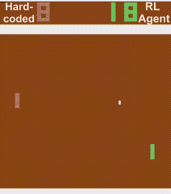
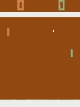
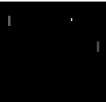
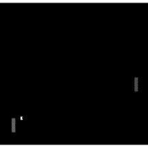
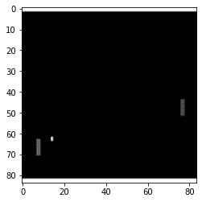
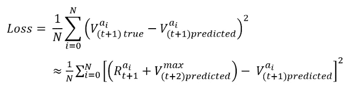

# 让人工智能玩 atari Pong，进行深度强化学习

> 原文：<https://towardsdatascience.com/getting-an-ai-to-play-atari-pong-with-deep-reinforcement-learning-47b0c56e78ae?source=collection_archive---------8----------------------->

## 详细的指导

首先我们统治 pong，接下来，世界…

让一个计算机程序学习如何玩 Atari 游戏似乎是一项非常困难的任务。好吧，我来告诉你…它是什么。但是相信我，如果我能做到，你也能。本页假设你已经通读并稍微理解了深度 RL 的理论(链接在下面)。但是要注意，理论不足以让代理学习雅达利！有了强化学习，一切都在实施中，魔鬼就在细节中！因此，这篇文章的其余部分将集中在一行一行地实现代码，以使我们的代理工作。

 [## 什么是深度强化学习？

### 详细的介绍

towardsdatascience.com](/what-is-deep-reinforcement-learning-de5b7aa65778) 

# 实施:

为了实现，我们将使用开放的人工智能健身房环境。对于代理的神经网络，我将使用 Keras 建立一个 CNN。我们将首先处理 Pong，然后在另一篇文章中，我们将让代理玩 breakout(这需要花费更多的时间来训练)。真的要慢慢来，通读我的代码，了解发生了什么。

此外，如果你没有一台功能强大的电脑，我强烈建议你在 google colab 上做这个项目。如果你不知道 google colab 是什么，那就谷歌一下看看吧！他们免费为你提供 GPU 和 CPU 来运行代码。

这里的策略是。我们从 openai 健身房收到当前的游戏画面。来自 4 个最近帧的像素值的张量是我们的当前状态(稍后将详细介绍)。基于ε贪婪策略，我们要么采取随机行动，要么将我们的当前状态输入 CNN 以获得我们的行动。现在我们采取行动，获得奖励，并被带到一个新的状态。我们将(S，A，R，S’)值存储在内存中用于训练。在每个动作之后，我们从我们的代理的内存中随机抽取数据，并使用我们在关于深度 RL 理论的文章中导出的损失函数来训练我们的代理。

## 一个快速打开的人工智能健身房教程

开放人工智能健身房是一个充满雅达利游戏(在其他游戏中)的图书馆。这个库很容易让我们测试我们的理解，而不必自己构建环境。在你导入健身房后，我们将只使用其中的 4 个功能。这些功能是:gym.make(env)、env.reset()、env.step(a)和 env.render()。

*   gym.make(env): 这只是从 open ai gym 中获取我们的环境。我们将调用 env = gym . make(' PongDeterministic-v4 ')，这表示我们的 env 是 Pong。
*   **env.reset():** 这将环境重置回它的第一个状态
*   **env.step(a):** 通过执行动作 a 在环境中前进一步，返回下一帧、奖励、完成标志和信息。如果 done 标志== True，那么游戏结束。
*   **env.render():** env.render()显示代理在玩游戏。在检查代理的性能时，我们将只使用 env.render()。我不认为这在谷歌 colab 或任何其他笔记本上行得通，尽管我可能是错的。因此，您可能需要保存代理的权重，然后将它们加载到您的本地计算机上，并在那里渲染游戏。

下面是如何实现这些函数的代码示例:

## 预处理帧

目前，从 openai 接收的帧比我们需要的大得多，分辨率也比我们需要的高得多。见下文:

我们不需要底部的任何空白，也不需要顶部白色条纹上方的任何像素。此外，我们不需要这个是彩色的。

首先，我们裁剪图像，以便只显示重要的区域。接下来，我们将图像转换为灰度。最后，我们使用 cv2 和最近邻插值来调整帧的大小，然后将图像数据类型转换为 np.uint8

生成的图像如下所示:

## 提供方向信息

站在代理的角度想想，看看下面的框架:

现在，球在朝哪个方向移动…没办法知道。我们只能知道位置，因为我们只有一个时间步长。仅仅在一帧中提供的信息不足以知道方向。如果给定两个时间步长，我们可以知道球的速度，如果给定三个时间步长，我们可以知道加速度，等等。

回想一下，我们的帧是像素值的矩阵。为了将方向信息添加到我们的输入中，我们可以简单地将我们的帧堆叠在一起以形成张量。假设我们的帧的形状是(84，84)，如果我们将最近的 4 帧堆叠在一起，我们的状态的形状将是(84，84，4)。所以在游戏中的时间 t，我们当前的状态是 t，t-1，t-2 和 t-3 的帧的堆栈。

## 代理内存

在我开始实现代理内存之前，我想解释一下最初是什么激发了研究人员使用它。

当我第一次接触这个项目时，我试图使用实时生成的数据来训练代理。所以在时间步长 t，我将使用时间(t-1)的(S，A，R，S’)数据来训练我的代理。

我能解释这个问题的最好方法是回到我大学的早期。在我大二的时候，我连续一年被灌输静力学理论(我学的是机械工程)。然后在我大三的时候，我对静力学一无所知，相反，我被迫接受了机器设计。到了高三，我已经忘记了所有关于静力学的事情。

在我们的环境中，可能有 100 帧球移动到屏幕的左侧。如果我们在完全相同的情况下反复训练我们的代理，那么最终它会过度适应这种情况，它不会推广整个游戏，就像我在学习机器设计时忘记了静力学一样。

所以，我们将所有的经历储存在记忆中，然后从整个记忆列表中随机抽取样本。通过这种方式，代理从*学习他在培训时的所有*经验，而不仅仅是他的当前情况(为了更好地击败这匹死马，想象一下如果你不能从过去学习，而只能从现在学习)。

好了，现在开始实施。对于内存，我用 4 个独立的 deques 创建了一个独立的类(固定大小的先进先出列表)。列表包含帧、动作、奖励和完成标志(它告诉我们这是否是一个终止状态)。我还添加了一个函数，允许我们添加到这些列表中。

add_experience 中 next_x 的古怪命名稍后会变得清晰

## 环境

接下来，我们开始实施我们的环境。我通过创建 4 个函数来做到这一点；

*   Make_env()
*   初始化 _ 新 _ 游戏()
*   take_step() …这是所有奇迹发生的地方
*   播放 _ 剧集()

在深入细节之前，我将展示代码，以便您能够理解。

**make_env()** 函数是不言自明的。它只是调用 gym.make()函数。

**initialize_new_game()** 函数重置环境，然后获取开始帧并声明一个虚拟动作、奖励和完成。现在，这个数据被添加到我们的内存 3 次。记住，我们需要 4 帧来完成一个状态，这里添加了 3 帧，最后一帧添加在 take_step()函数的开始处。

**take_step()** 函数有点复杂。我将在下面列出伪代码:

1.  更新代理总时间步长
2.  每 50000 步节省重量
3.  现在，我们使用代理的动作列表中的最后一个动作调用 env.step。这将返回下一帧、奖励、完成标志和信息
4.  调整下一帧的大小，并从最后 4 帧中获取下一个状态。
5.  使用下一个状态获取下一个动作。这就是为什么我们能够在步骤 3 中使用代理动作列表中的最后一个动作
6.  如果游戏结束，则返回分数和一个终止标志
7.  将这段经历加入记忆
8.  如果调试，渲染游戏。我们不会使用它，但我发现它在尝试让它工作时很有用。
9.  如果代理的内存包含足够的数据，那么让代理从内存中学习。稍后将详细介绍。
10.  返回代理分数和一个错误的终端标志

正如您所看到的，这个函数与代理类一起工作了很多。这个类将很快介绍。

**play_episode** 函数非常简单明了。这个函数只是初始化一个新游戏，调用 take_step 函数，直到返回一个真正的终端标志。然后返回剧集评分。

## 代理类

这个类有 5 个函数，包括构造函数。这些函数是:__init__()、_build_model()、get_action()、_index_valid()和 learn()。

**build_model()** 函数只是为代理构造一个 CNN。请注意，CNN 中没有 max_pooling 图层，因为池化消除了一些所需的空间信息。我使用 Huber 损失和 Adam 初始化器。

**get_action()** 函数只是 greedy 的一个实现。我们生成一个随机数，如果它小于我们的ε值，我们就采取随机行动。如果没有，那么我们将当前状态传递给 CNN 并返回最大输出。

**_index_valid()** 函数是学习函数的助手。它只是检查在给定的索引处，在我们的内存的过去 4 帧中是否有一个终止帧。我们不想创造一个介于两个游戏之间的状态。

在我解释 learn 函数之前，您可能已经注意到了该类的 model_target 属性。这是一种用于降低训练噪音的方法。基本上，我们复制我们的 CNN，所以我们现在有了我们的模型，和我们的模型目标。现在，回想一下，在训练时，我们将下一个状态输入到 CNN 中，以帮助生成误差函数的目标。注意，在权重被更新之后，误差函数中的目标将会改变，因为 CNN 被用于生成该目标，并且 CNN 权重刚刚被改变。

下面是我们损失函数的一个提示:

V(t+2)是我们的神经网络的输出。所以如果我们更新一次权重，那么 V(t+2)会有一点变化。这意味着我们的目标在移动，这在实践中被证明是低效的。

有人在谷歌有一个想法，我们可以使用目标模型来生成我们的损失函数的目标，然后我们经常只是设置目标模型的权重到我们的主模型的权重。所以他们尝试了一下，它提高了性能，减少了培训时间(这就是我在这里实现它的原因)。

现在我们来看一下 **learn()** 函数。我们将用 32 个迷你批次来训练我们的 CNN。

1.  我们的第一步是收集 32 个状态、next_states、actions、rewards 和 done 标志。
2.  我们通过模型传递状态，通过目标模型传递下一个状态。我们从模型中得到的输出将在下一步中被修改，因此它可以用作我们的 Vtrue。
3.  现在，对于迷你批处理中的每个状态，我们首先要弄清楚采取了哪个操作。然后我们计算采取这个动作的真实值，并用这个真实值替换输出值。 *not next_done_flags[i]* 代码只是确保如果我们处于终止状态，则不考虑下一个奖励。此外，伽玛被称为贴现因子。这只是让当前的奖励比未来的奖励更有分量。Gamma 可以取出来，不用担心弄坏代理。
4.  现在，我们使用我们创建的状态和标签来拟合我们的模型。
5.  现在更新 epsilon 和代理学习了多少次
6.  每 10，000 步将模型权重复制到目标模型

对代理人来说就是这样。学习功能是我第一次尝试这个项目时出错的地方。所以如果你有困难，先检查这里。

**main.py**

现在是我们最后的文件。我不打算在这里详细介绍，这个文件是不言自明的。只需初始化代理和环境，然后循环调用 play_episode()函数。偶尔打印出一些有用的指标，每 100 集我打印出一个图表，显示得分的移动平均值。在对我的代理人进行培训后，我意识到根据采取的步骤而不是玩的游戏来绘制分数会更有用。如果你正在重新创建这个项目，我建议每 10，000 步左右标一次分数。

## 总结:

你可以在这里找到完整的、完成的项目。训练持续了大约 24 小时。最后的结果就是这篇帖子顶部 gif 中右边的代理。

我第一次这样做花了几个星期。这确实是一个困难的项目。如果你有困难，真的要花时间去理解理论，通读我的代码。

这种特殊的 RL 算法被称为深度 Q 学习。深度 Q 学习通常被视为深度 RL 的介绍，但它不是最有效的算法。我最喜欢使用的算法是 A2C，我将在以后的文章中介绍它。

但在此之前，让我们证明这个算法有多酷。我曾经把这个展示给一个朋友看，他说，“你就不能硬编码一下球拍，让它跟着球走吗”。尽管他是对的，但这个项目的酷之处不仅仅在于我们用它来玩乒乓球。就是经纪人*学会了*打 pong。这个算法是迈向通用人工智能的一步。证明我们已经获得某种程度的通用人工智能的一个方法是，看看这个智能体是否可以学习多个游戏。我会在这里留下一个链接，说明如何让这个代理在完成后学习游戏突围。

**作者所有图片、gif、代码片段！**

> 感谢您的阅读！如果这篇文章在某种程度上帮助了你，或者你有什么意见或问题，请在下面留下回复，让我知道！此外，如果你注意到我在某个地方犯了错误，或者我可以解释得更清楚一些，那么如果你能通过回复让我知道，我会很感激。