# 熟悉 Rmarkdown HTML

> 原文：<https://towardsdatascience.com/getting-familiar-with-rmarkdown-html-f5b3bc4ec210?source=collection_archive---------21----------------------->

## 使用 R 降价

[斯科特·格雷厄姆](https://unsplash.com/@homajob?utm_source=medium&utm_medium=referral)在 [Unsplash](https://unsplash.com?utm_source=medium&utm_medium=referral) 上拍照

> 我认为开始做任何事都不晚，除了成为一名芭蕾舞演员。~温迪·利伯曼

**简介**

R Markdown 最早发布于 2014 年。它是一个工具，为作者提供了一些强大的技术来将报告和分析合并到一个文档中。R Markdown 的官方[网站](https://rmarkdown.rstudio.com/)声称这个工具可以用于可复制的文档，以优雅的格式放置叙述性文本和报告元素；使用像 R、Python 和 SQL 这样的语言。它允许作者以 HTML、PDF、Word、演示文稿甚至书籍或仪表板的形式生成组合报告。多年来，许多研究人员、分析师、内容作者、开发人员和软件程序员一直在不懈地发布文章、书籍和帖子，以熟悉研究和分析工作区中的这一强大工具。如果没有这些资源的贡献，从构思将该工具集成到分析表示中，到设置工作站和实际执行任务的过程是不可能的。其中一些将在文章中分享。

由[万花筒](https://unsplash.com/@kaleidico?utm_source=medium&utm_medium=referral)在 [Unsplash](https://unsplash.com?utm_source=medium&utm_medium=referral) 上拍摄的照片

R Markdown 被认为在研究和学术领域被学生和教授广泛采用。项目、作业、论文或论文的提交需要在结合数据集、图表、表格、见解、统计结果以及数学方程方面付出大量努力。下图显示了过去 52 周几个关键 R Markdown 包的下载趋势。

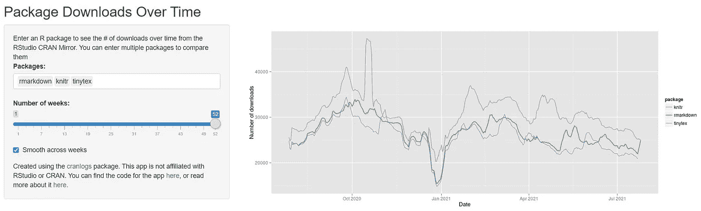

图-1 rmakrdown，knitr，tinytex 的 52 周下载趋势。(闪亮 App 来源):[链接](http://varianceexplained.org/r/cran-view/)

**虽然通过减价来使用纯文本文档是为互联网用户创建格式良好的文档的关键，但由于多种原因，在企业工作区大规模采用这种做法可能会很麻烦**。大多数公司的工作空间严重依赖于幻灯片，多个用户可以编辑和润色内容，而无需花费太多精力进行语法编码。幻灯片或办公工具允许不同类型和大小的内容众包来传达一个共同的信息。然而，如果一个作者主要使用像 R 或 Python 这样的开源编码平台，通过各种复杂的数据源来策划一个讲故事的练习，那么 R Markdown 可以为分析或科学文章提供几个这样的用例。

**议程**

在*这篇*文章中，我们将主要关注 R Markdown 用于生成 HTML 文档的一些快速而有用的特性。**目标是分享一些可用于生成 HTML 输出格式**的基本和扩展元素。我的目标不是出版一本有效的手册或食谱给读者，而是分享我在过去几周收集的快乐和挑战。不过在 RStudio 编辑器中使用 install.packages()函数预装这些包就好了； *"rmarkdown "、" tinytex "、" gridExtra "、" kableExtra "、" summarytools "、" sjPlot "、" sjmisc "、" sjlabelled "、" stargazer"* 。首先，无论如何，我们都将依赖这些实用程序来完成本文。

**R 降价元数据**

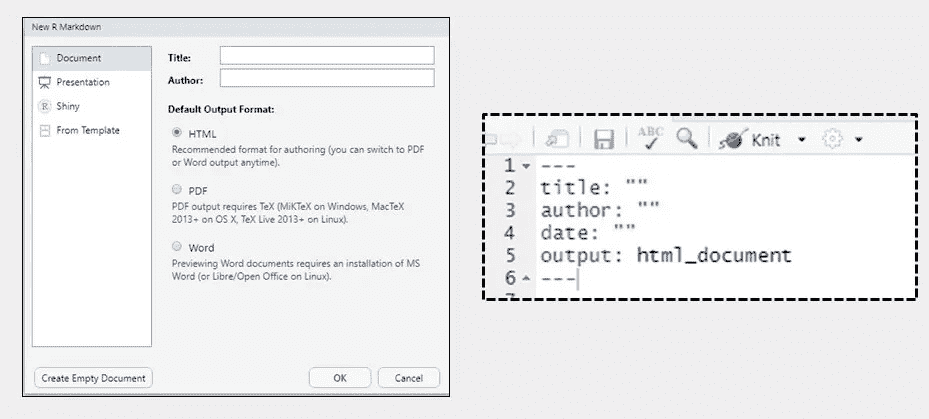

图-2 R 降价元数据。(图片来源) :图片来自作者

在 RStudio 中，如果我们遵循 File → New file → R Markdown，那么我们将得到一个创建 HTML 文档的选项，该选项是默认选中的。一旦我们单击“OK ”,我们将被定向到一个. rmd 脚本，其中元数据部分是自动填充的(*由包含三个破折号的线*分隔)。这种结构遵循 YAML 非标记语言(YAML)格式，它通过 R 进行通信，为 HTML 输出提供特定的结构指令。作者可以在引号内键入相关的*标题*、作者姓名和日期，这将允许 R Markdown 将它们放在文档的顶部。不像*标题，在双引号内键入姓名或日期并不是强制性的。*标题中的引用需要从文本中屏蔽冒号(:)。

下面的 YAML 元数据为 HTML 文档添加了标题、名称和当前系统日期。

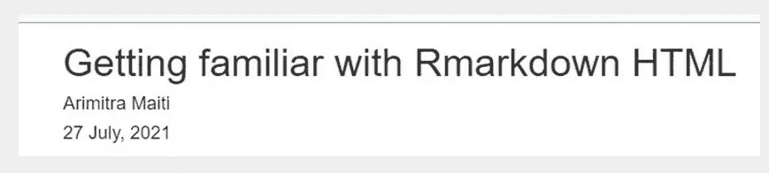

图 3 元数据输出。(图片来源) :图片来自作者

还有更多在 PDF 格式中大量使用的元数据功能。 ***大多为 HTML 用例；在我们不需要为分页符而烦恼的地方，对自动填充的 YAML 的上述修改就足够了*** 。

**代码块设置**

三个连续的反勾号后跟一对以字母“R”开头的花括号，调用环境中的 R 编辑器。这必须以另外三个连续的倒勾结束。在此期间，作者可以编写代码块。*setup 部分中声明的任何选项将优先用于流向整个文档的剩余块，除非在单个块中明确更改*。设置选项是习惯性的，是文档特有的，是一次性的练习，也是很好的实践。我们不需要为同一个文档重复设置两次。include=FALSE 选项告诉设置不要在输出中包含代码块中的任何内容。warning=FALSE 和 message=FALSE 特别要求设置不要在 HTML 文档中包含来自 R 代码的任何警告消息。打开这些选项意味着作者想要打印代码中的所有内容。许多选项都有详细的记录，可以在[这里](https://yihui.org/knitr/options/)找到。还有一个 echo=FALSE 选项，请求在输出文档中不包含源代码。我们将暂时在每个块中使用 echo 选项。

**哈希和文本**

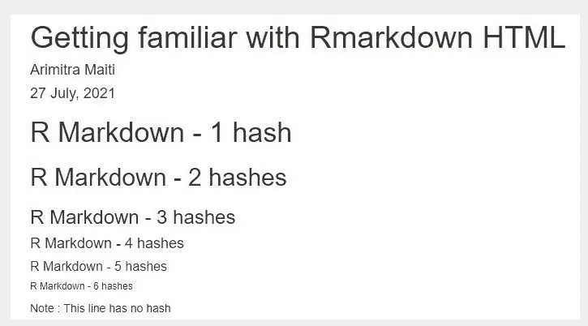

图 4 使用多少个散列值？(图片来源) :图片来自作者

在定义与 R 或 Python 相关的代码块的反斜杠之外，作者可以使用“#”符号后跟一个空格来定义部分。散列越多，意味着章节*标题*的字体越小。根本不使用散列意味着简单的降价文本。

我遵循的一个非常快速简单的参考是这里的。它快速提醒我如何使用斜体、粗体、项目符号列表或编号列表。

**包摘要工具**

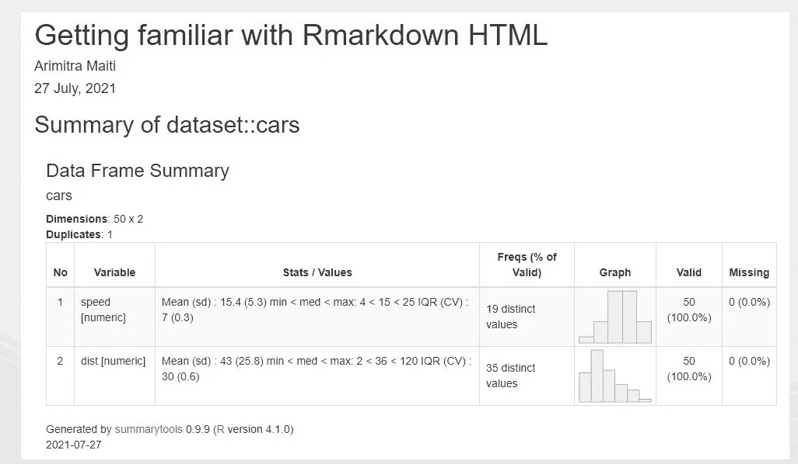

图 5 使用 dfSummary()在 HTML 中包含数据摘要。(图片来源) :图片来自作者

***这个包在一个 HTML 报告*** 中显示数据集的有用的汇总统计数据。开发这个包的主要目标之一是确保通过 R Markdown 以 HTML 格式轻松呈现数据摘要。对于具有大量分类特征的数据集，通常需要在获得叙述性文本之前显示数据透视表的快照。这个包提供了一些其他的核心功能来满足这个目的。详细的链接是[这里](https://cran.r-project.org/web/packages/summarytools/vignettes/Introduction.html)，如果渲染 HTML 看起来很有趣，你可以把它加入书签。接下来的几个数字会给你一个基本的外观和感觉，你可以根据自己的兴趣进一步美化。

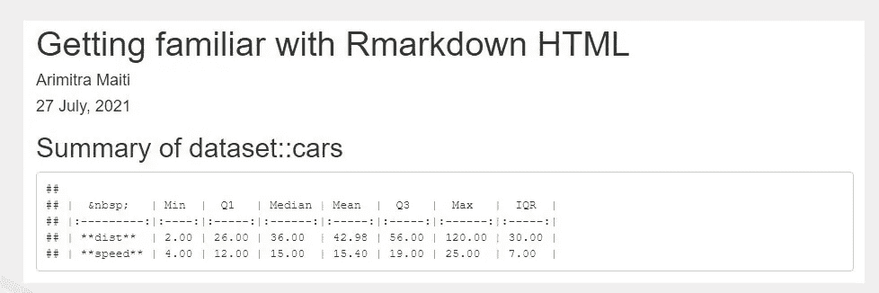

图 6 使用 descr()在 HTML 中包含数值变量的单变量汇总。(图片来源) :图片来自作者

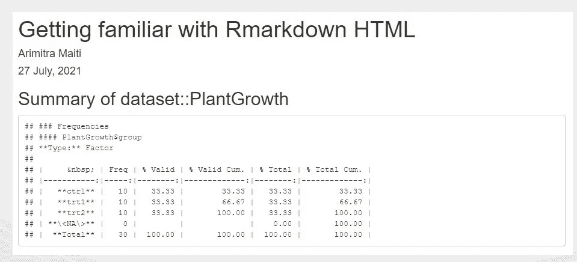

图 7 使用 freq()处理 HTML 中的分类变量。(图片来源) :图片来自作者

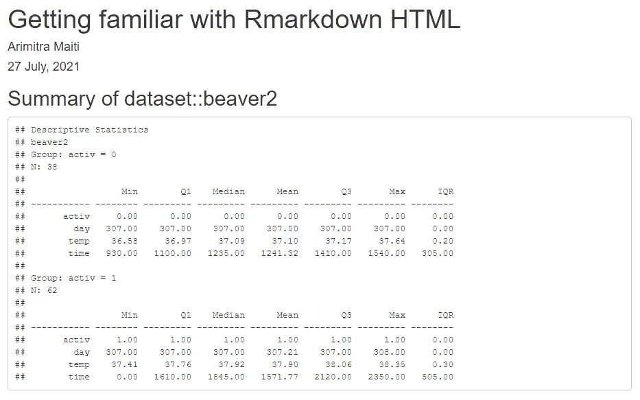

图 8 使用 stby()处理 HTML 中的分组摘要。(图片来源) :图片来自作者

> stby()中的 INDICES 参数接受多个分组变量作为列表。

**打包 kableExtra**

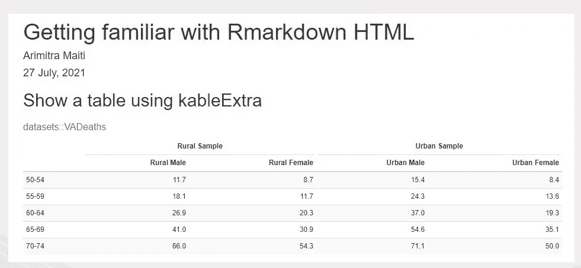

图 9 在 HTML 中使用 kableExtra。(图片来源) :图片来自作者

这个包在使用 R Markdown HTML 时的意义是确保 ***时尚且格式良好的表格显示在输出*** 中。这个实用程序产生的结果的外观和感觉与我们通常在 R print()函数中看到的截然不同。这个实用程序的详细指南可以在[这里](https://cran.r-project.org/web/packages/kableExtra/vignettes/awesome_table_in_html.html)找到，不用说，这个链接可以作为在 R Markdown 中编写语法的圣经。

**显示回归表**

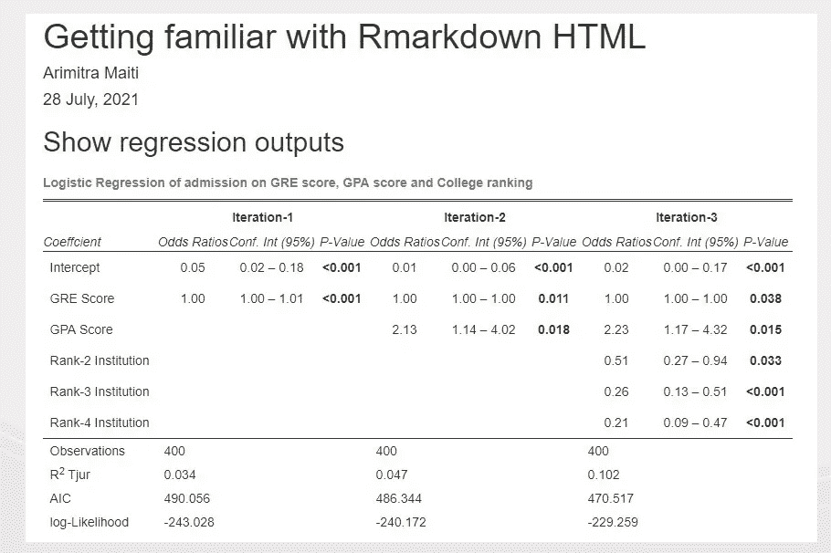

图 10 在 HTML 中使用 tab_model()。(图片来源) :图片来自作者，(数据来源):[链接](https://stats.idre.ucla.edu/r/dae/logit-regression/)

***tab_model()允许作者在 HTML 文档*** 中显示格式良好的回归表。虽然无法将此工具用于 PDF 或 Latex，但如果需要，可以通过导入来使用图像。这个函数有更多的参数，你可以使用*来检查？R 控制台中的 tab_model()* 。请注意，在显示逻辑回归表时， *tab_model()* 已经自动将β系数转换为优势比，并显示了 95%的置信区间，无需额外的努力。当作者想要展示建模实践中两到三个最重要的迭代或者甚至展示最终的模型时，这个模型就派上了用场。tab_model() 也是线性回归表或其他形式回归的常用工具。这里的链接[是在 R Markdown 中工作时的快速参考指南，我希望可以根据具体要求实现进一步的加速。](https://cran.r-project.org/web/packages/sjPlot/vignettes/tab_model_estimates.html)

**HTML 标签集**

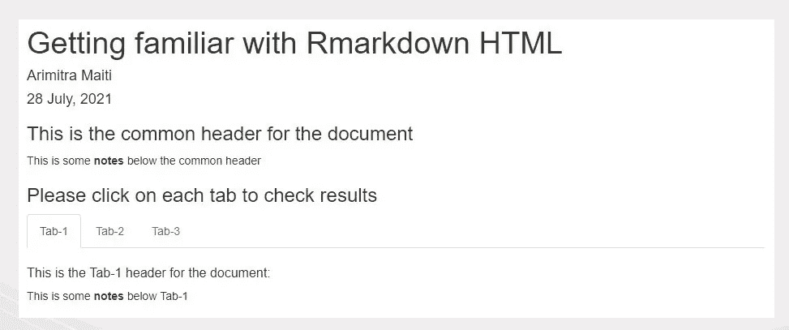

图 11 在 HTML 中使用标签集。(图片来源) :图片来自作者

{.tabset}参数允许在 HTML 文档中创建选项卡。当调整了正确的哈希数后，我们可以看到每个选项卡都可以作为一个单独的页面，在这里可以放置进一步的分析和叙述性文本。当我们想要呈现不同公司的类似分析或者一个特定公司的不同模型时，这个选项卡集布局是有用的。选项卡集布局有助于放置分组的结果或模型输出，以便最终用户阅读和导航。

**结论**

R Markdown 是一个很好的工具，可以为消费者生成可再现的分析图、表格、见解和图像。本文的目的不是鼓励 Office 套件和开源减价工具之间的任何争论。两者都有其独特的用法，并在提交分析结果时对作者有利。然而，随着 R 中如此强大的扩展的出现，R Markdown 为作者提供了过多令人兴奋的特性来管理分析的外观和感觉。不用说，对于每一个分析，编写语法来美化 HTML 文档中的输出将是有用的和经济有效的，幻灯片或单词仍可能赢得比赛。然而，在使用 R 或 Python 分析数据时，R Markdown 在增强分析师的工具箱方面取得了很大的进步。

除了栈溢出 Q & A forums 之外，本文中提供的超链接是我提到的最常访问的资源。*请看一下谢一辉、克里斯托夫·德维约和艾米丽·里德雷尔*写的 [*书*](https://bookdown.org/yihui/rmarkdown-cookbook/) *。然而，我还想提一下这篇[文章](https://medium.com/opex-analytics/r-markdown-my-favorite-tool-for-conducting-and-sharing-analysis-cf506bd85e2f)，它是一篇很好的读物，激励我写这篇文章。*

谢谢你。