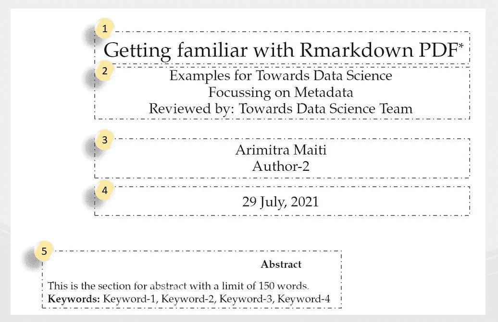
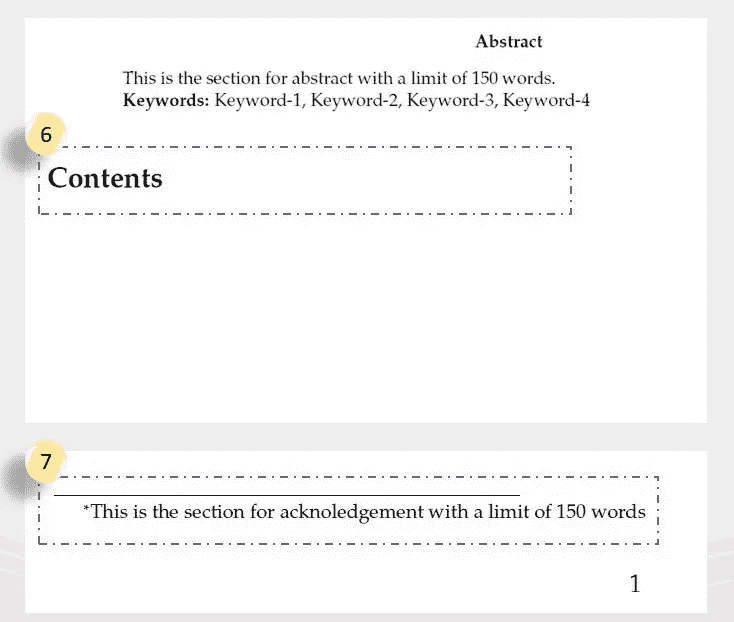
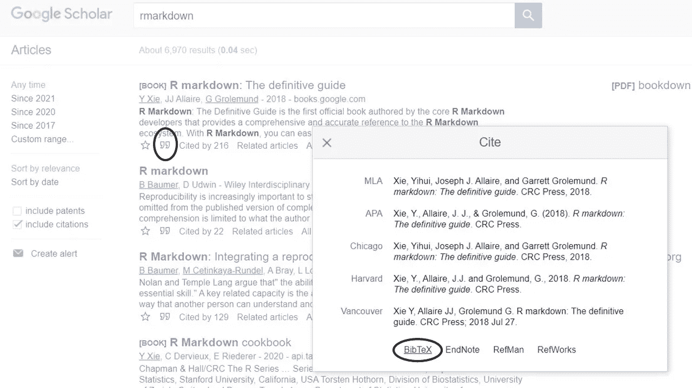
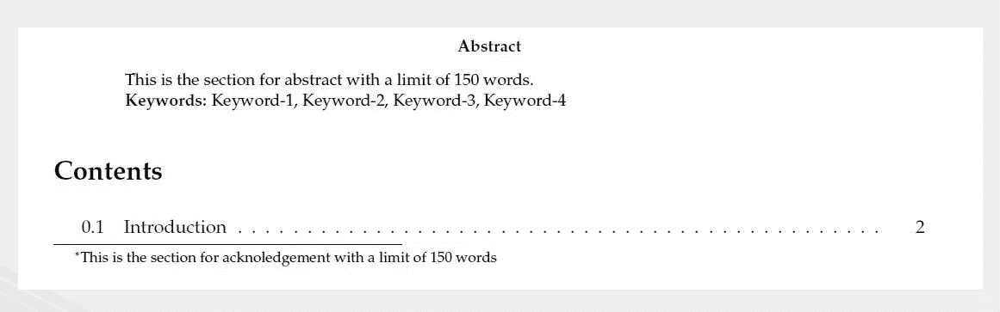
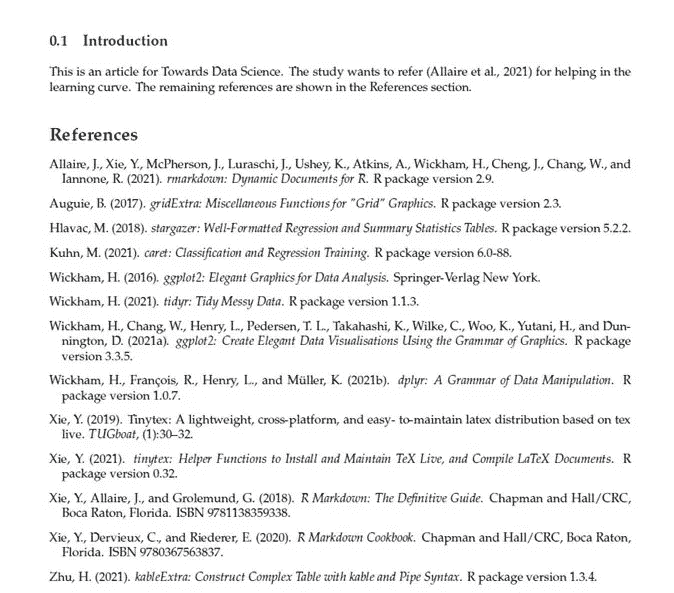
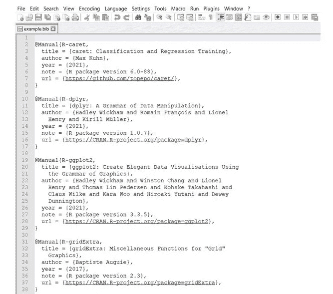

# 熟悉 Rmarkdown PDF

> 原文：<https://towardsdatascience.com/getting-familiar-with-rmarkdown-pdf-19fed1864952?source=collection_archive---------26----------------------->

## 元数据和引用

塞萨尔·阿布纳·马丁内斯·阿吉拉尔在 [Unsplash](https://unsplash.com?utm_source=medium&utm_medium=referral) 上的照片

> 如果你把一本书掉进马桶里，你可以把它捞出来，擦干，然后读那本书。但是如果你把你的 Kindle 掉到马桶里，你已经做得很好了。~斯蒂芬·金
> 
> 一个作家的大部分时间花在阅读上，为了写作:一个人会为了写一本书而翻遍半个图书馆。~塞缪尔·约翰逊

**简介**

为分析表示创建 PDF 报告是学者、业务分析师或现代数据科学家的长期传统。自从 PowerPoint 动画问世以来，最近又引入了 PowerPoint 变形转换或幻灯片缩放功能，作者们一直致力于寻找更有效、更强大的方式来传达信息并获得更好的观众接受度。R Markdown 没有涉足动画领域。然而，在分析领域，复制科学期刊的格式，尤其是美国心理学协会(APA)的格式，对于提交重大项目工作供同行评审并不奇怪。此外，分析师或商业顾问总是希望能够以书籍的形式进行写作，以传达具有强大背景的分析，具有精确的目标，正确的证据碎片和强制性的结论。R Markdown PDF 允许作者将报告和叙述性文本结合起来，并将其放入 PDF 或书籍格式中，这对于在组织的分析功能中工作的非学者来说，确实比漫游癖更强烈。在阿拉伯，他们说“当狮子打喷嚏时，猫就诞生了”。如果假设商业分析师是一只在院士打喷嚏时创造出来的猫，那么对一只坐在牛奶旁边而不舔牛奶的猫的期望就太高了。对于一个分析从业者来说，写降价报告就像喝牛奶一样难，哪怕只有一次。

 [## 熟悉 Rmarkdown HTML

### 使用 R 降价

towardsdatascience.com](/getting-familiar-with-rmarkdown-html-f5b3bc4ec210) 

在上面的*文章中，我们打算强调使用 R Markdown HTML 时的几个关键元素。在当前的文章中，我们将关注 R Markdown PDF，首先，我们将在查看 PDF 的主体之前关注元数据和引用。原因是元数据不仅定义了文档的结构，还定义了报告的开始部分。引用出现在文件的末尾，对于任何涉及一些研究工作的科学期刊来说都是强制性的。*

> **注意**:如果读者有过一些学术论文的经历，那么这篇文章并不打算[区分](https://www.alancward.co.uk/the-flow-of-dunning-kruger-a-blend-of-challenge-skill-and-perception/)作者的感知能力和实际能力。随时欢迎您的建议和经验。

**议程**

**目标是分享一些可用于生成 PDF 输出格式**的基本和扩展元素。我的目标不是出版一本有效的手册或食谱给读者，而是分享我在过去几周收集的快乐和挑战。不过在 RStudio 编辑器中使用 install.packages()函数预装这些包就好了；*“rmarkdown”、“tinytex”、“gridExtra”、“kableExtra”、“stargazer”*。首先，无论如何，我们都将依赖这些实用程序来完成本文。

**R 降价元数据**

LaTex 是学者、研究人员或大学生常用的工具。对于那些不知道的人来说，LaTex 是一个文档编写工具，可以用来编写复杂的数学方程、统计符号和假设。" *LaTeX 是科学文献交流和出版的事实标准."(来源:乳胶* [*网站*](https://www.latex-project.org/) *)。R Markdown 可以通过*“tiny tex”*包和 *pandoc* 与 LaTex 工具通信。要了解更多关于 pandoc 的信息，你也可以访问他们的官方网站。如果一个人熟悉 LaTex 语法，那么 R Markdown 可以作为一个极好的平台来利用研究人员的统计计算、可视化和文档编写能力。然而，即使一个人与研究工作无关，并且处理任何领域的分析工作空间，R Markdown PDF 或 HTML 也可以作为一个很好的附加工具来升级现有的技能组合，以编写格式良好的报告。*

图 pdf 输出的上半部分。(图片来源) :图片来自作者

图 pdf 输出的中下部。(图片来源) :图片来自作者

图 1 和图 2 显示了 pdf 输出的第一页。每个编号的框都是第一个代码片段中显示的元数据参数的结果。

## 第 1 个框是标题(*标题:*)。

## 第 2 个框是副标题(*副标题:*)。

## 第三个框是作者信息(*作者:*)。

## 第四个框是日期(*日期:*)。

## 第五个框由分析的摘要(*摘要:*)和关键字(\\ *textbf{Keywords:}* )组成。

## 第六个盒子将保存目录( *toc* )。

## 第 7 个框保存确认(*感谢*)消息，最后，我们在第一页的右下角看到页码(*编号 _ 部分:*)。

管道(“|”)允许在同一参数中键入新的一行。

*geometry* 参数允许页边距宽度，以便在打印 pdf 时，作者不会因硬装订而丢失任何文本。

当*为真时*的 *keep_tex* 参数指示 pandoc 在输出文件中保留 LaTex 转换。

*latex_engine* 参数指示 pandoc 使用特定的 latex 引擎进行文档转换。像“*pdflatex”*和“*xelatex”*这样的引擎是最常用的。使用非英语语言或系统字体的作者更喜欢“ *xelatex”。*

*fig_caption* 参数指示 latex 引擎对 pdf 文档中的表格和图像/图表进行自动编号。例如，当插入第一个表格时，标题将从表-1 开始，因此第一个图或图像的标题为图-1。 *fontfamily* 参数选择文档的字体。

*header-includes* 下的 *\usepackage{}* 参数指示 tinytex 确保安装特定的 LaTex 包，用于编写数学方程和放置图形或表格。基本上，以上三个包大部分时间用于基本的 pdf 输出创建。还有一个程序创建一个 ***。工作目录中的 sty 文件*** 用于给出显式 LaTex 指令，这些指令可以在*下的元数据中使用，包括 _header* 参数中的和*。*

**引文**

重要的是要提及其作品启发了分析表示的想法和作者。在创建期刊或发表研究论文时，通常会特别注意在同行评审的输出中包含所有必要和正确的引用。事实上，这是审查机构打击剽窃的最重要的评估标准之一。APA 格式的最常见的引用指南和最新版本很容易在公开论坛上通过谷歌搜索获得。R Markdown 可以与 BibTex 格式无缝交互。每一份研究出版物都会附上一个 DOI ( *数字对象标识符*)，同时在他们的出版物库中发布作者的作品。这个标识符包含一些关于作者和作品种类的独特信息。

 [## doi2bib

### 从数字对象标识符(DOIs)中轻松生成 BibTeX 格式的引文。

www.doi2bib.org](https://www.doi2bib.org/) 

上面的网站可以将任何 doi 转换成一个等价的 BibTex 标识符，R Markdown 可以使用 *citation_package* 参数对其进行翻译和呈现。因此，如果你试图找到一个你已经有的 doi 的相应 BibTex，那么这是一个救命稻草。或者，如果你想获取某个谷歌学术期刊/书籍的 BibTex，你可以点击“*双引号*符号，然后点击 BibTex 链接。

图 3 如何从谷歌学术获得 BibTex。(图片来源) :图片来自作者

图 4 这是第二个片段的目录。(图片来源) :图片来自作者

图 5 这是第二个代码片段的第二页输出。(图片来源) :图片来自作者

本文所附的第一段和第二段代码的不同之处在于添加了*书目:*、*书目样式:*、*链接引用:*和 *natbiboptions:* 参数。*的例子。当前工作目录中的 bib* 文件包含了作者在文档中可能引用或不引用的所有引文。*\ n site { * }*参数通过 pandoc 明确指示 latex 引擎在 references 部分包含所有引用，而不管它是否在主体中被引用。[@ < id > ]语法允许作者在文档的叙述性文本中明确引用作品。文献目录文件中未明确引用的那些 id(即 bib 文件)将按照*\ n site { * }显示在参考部分。*如果不需要此功能，那么作者可以简单地删除*\ n site { * }参数。*

图 6 这是 example.bib 文件在**记事本++** 中编辑时的样子。(图片来源) :图片来自作者

函数 *write_bib()* 在 R 控制台中打印机器中已安装软件包的 BibTex。文档链接在这里是。 *wirte_bib()无法从出版网站获取学术文章或期刊的 BibTex*。这仅用于获取安装在机器中的 R 包的 BibTex。

最简单的方法是从与分析相关的所有可能来源中逐一收集所有 BibTex 引用，将它们附加到一个单独的 Notepad++文件中，保存该文件，并将该文件及其扩展名重命名为 *example.bib. R Markdown 无法识别。txt 文件，除非将其重命名为. bib.*

**结论**

渲染 HTML 和 PDF 文档是两个不同的球赛。呈现 HTML 很简单，相对来说不那么费力，而且有其自身的局限性。另一方面，呈现 PDF 很费力，需要多次迭代才能看到文档是否放在作者想要的地方。在渲染 PDF 输出时，*分页符*和*乳胶浮动对象*的概念对初学者来说有很大的作用。然而，正如股市所说的“*风险越大，收益越高*”，一旦最初的几个项目结束，这种技能组合给分析师带来了很多快乐和满足。不推荐在没有 LaTex 广泛知识的情况下渲染 PDF 输出，但是，R Markdown 并不要求 LaTex 基础的先决条件。R Markdown 的强大功能和它的扩展包使得这种技术对于非学术界人士来说也是触手可及的，而不管它在日常演示中的大规模使用。渲染 PDF 的旅程相对较长，因为它涉及到更多的元素来管理最终输出。我同意，有时搜索数百个 Stackoverflow 问题来学习单个论点及其功能变得很单调。然而，我们的目标不是成为一名 LaTex 开发者，甚至不是 R Markdown 开发者。更大的目的是多花一点功夫来管理这个 husky 工具，以便能够在发送给同行评审时，从常规 Excel 或 PowerPoint 中脱颖而出，释放出一个封装良好的分析流。

在 R Markdown 中有多种方法来构造元数据以呈现 PDF，学习一些的最好方法是迭代不同的版本。虽然这对于学者来说可能不一样，但对于基础从业者来说，熟悉这个大力士的最好方法是熟悉 HTML 过程，然后谨慎地使用 PDF。像“rticles”这样的软件包已经提供了许多不同的模板来呈现 PDF，但是它并不能保证“一个尺寸适合所有人”的目的。我想分享一个来自 Pat Schloss 的视频，这可能会激励更多人。

谢谢你。