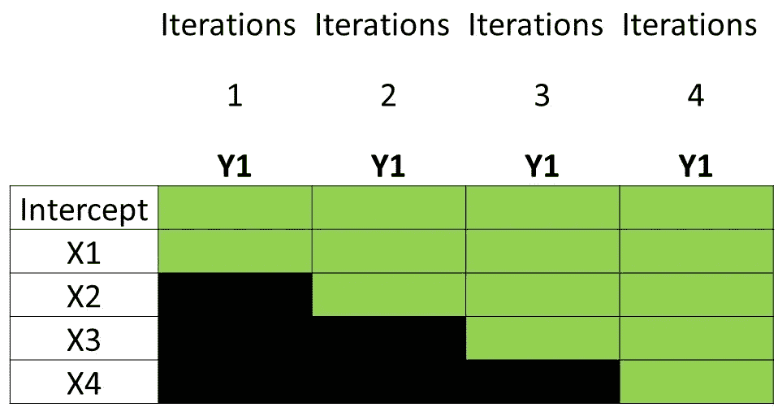
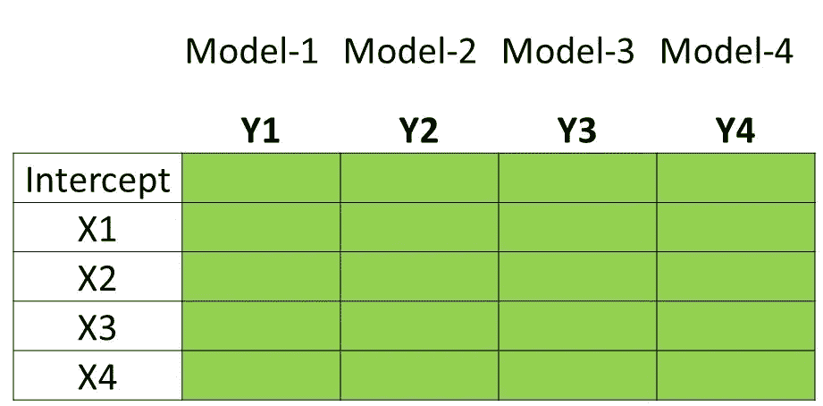
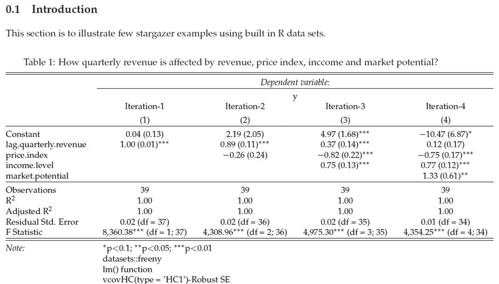
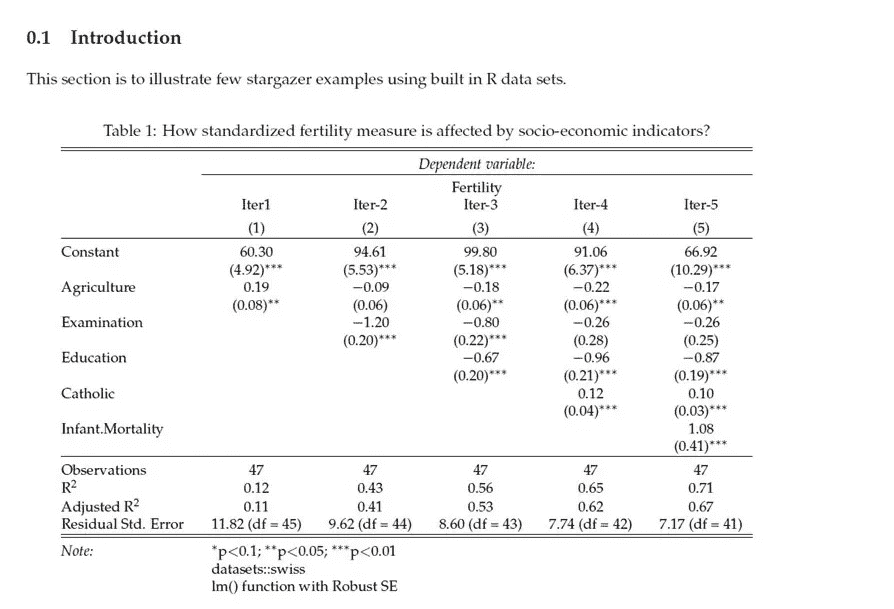
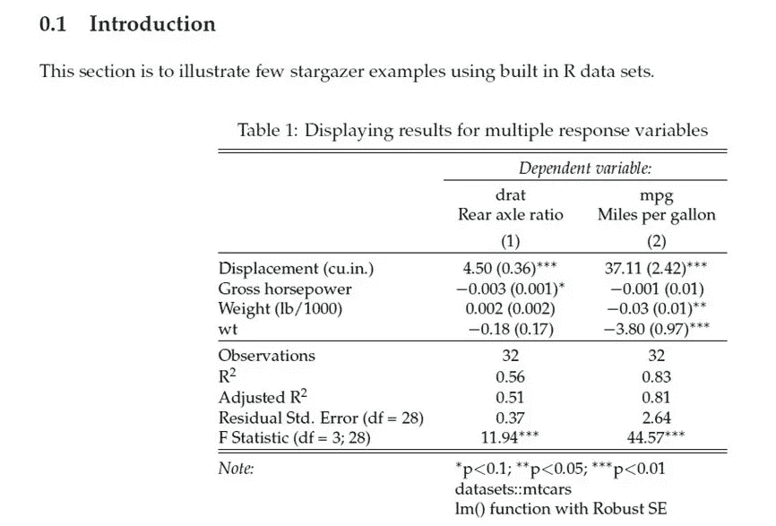

# 熟悉 Rmarkdown Stargazer

> 原文：<https://towardsdatascience.com/getting-familiar-with-rmarkdown-stargazer-3853831a3918?source=collection_archive---------9----------------------->

## R 的 Stargazer 库

ksen ia Samoylenko 在 [Unsplash](https://unsplash.com?utm_source=medium&utm_medium=referral) 上拍摄的照片

> 现在的幸福只会因为与过去的比较而破灭。~道格拉斯·霍顿

**简介**

回归分析今天不需要单独介绍。事实上，很难找到一个研究领域可以打赌在他们的生命周期中不使用这种技术至少一次就能赢。存在一种关系，等待某人通过某种回归技术的变体来探索。自从数学家阿德里安-玛丽·勒让德(Adrien-Marie Legendre)和卡尔·弗里德里希·高斯(Carl Friedrich Gauss)在 19 世纪初发明了这项技术以来，世界每天都在经历至少一个用例；被活在世上的某个人。想象一下如果人类无法获得这项技术会发生什么是很可怕的。如果这项技术没有公开，世界大战会如何发展？

在过去的十年中，随着开源平台和维护良好的统计估计库的出现，执行回归分析已经成为一项琐碎的任务。然而，比较不同条件和解释统计输出以解释潜在假设的性质的艺术将要求相关从业者通过公平的手段进行探究，直到永恒。人工智能算法旨在复制无错误的高效人类执行，然而，它可以像创建算法的开发人员一样学习表示艺术。

Stargazer 是一个最初为 R 平台开发的库，用于增强 R Markdown 文档中回归表的表示。作为一个用户，我们不能否认 stargazer 的结果在 pdf 文档中使用时非常类似于科学杂志或统计教科书的外观和感觉。

</getting-familiar-with-rmarkdown-pdf-19fed1864952>  

上面的文章试图鼓励读者积极考虑 R Markdown PDF。但是，这里说的是元数据和参考书目部分。stargazer 的使用在元数据之后，书目之前。

> **注意**:如果读者有过一些学术论文的经历，那么本文并不打算[区分](https://www.alancward.co.uk/the-flow-of-dunning-kruger-a-blend-of-challenge-skill-and-perception/)作者的感知能力和实际能力。欢迎您的建议和经验。

**议程**

**目的是分享一些可用于生成 PDF 输出格式的基本和扩展元素**。我的目标不是出版一本有效的手册或食谱给读者，而是分享我在过去几周收集的快乐和挑战。不过在 RStudio 编辑器中使用 install.packages()函数预装这些包就好了；*“rmarkdown”、“tinytex”、“gridExtra”、“kableExtra”、“stargazer”*。首先，无论如何，我们都将依赖这些实用程序来完成本文。

**包观星器**

图-1 结构，表示在独立属性上逐一回归的同一响应变量的不同关键迭代。(图片来源) :图片来自作者

图 2 代表不同响应变量的结构，这些变量是在一组共同的独立属性上回归的。(图片来源) :图片来自作者

图 1 显示了线性回归模型的基本结构，其中研究人员或分析人员希望比较最重要的迭代，同时用一组独立属性回归相同的响应变量。然而，在每次迭代中，独立属性都是在考虑一些假设的情况下逐一引入的。这在*因果分析和实验*中特别有用，因为需要检查每个阶段独立属性的调节效果，以解释关键独立变量之一对响应变量的因果影响。

图-2 表示多元线性回归的基本结构，用于表示*独立模型，*用于比较数据集的不同*响应变量*在一组公共独立变量上回归时的结果。*这对于比较一项研究中一组常见预测因子或因素对不同反应属性的影响特别有用*。这种结构在基于关系的研究中很常见，是记录结论的有用快照。

Stargazer 还可以显示“lm”、“glm”和其他类型模型族的稳健标准误差。它同样有助于显示 logit 家族的β系数和指数标准差的比值比。本文中提到了一些有用的参考资料。如果有人想用 stargazer 做他们的论文或主要项目提交的实验，它们是重要的访问目的地，所以要求将它们放在手边。可以从 [*这里*](https://cran.r-project.org/web/packages/stargazer/stargazer.pdf) 和 [*这里*](https://web.northeastern.edu/econpress/wp-content/uploads/2016/04/Stargazer.pdf) 访问几种 pdf 格式。

      

需要注意的是，尽管回归的基本本质由于基于树或基于提升的算法迎合大数据的纯粹计算能力而变得成熟，但是涉及不同回归技术的基于关系的研究对于识别重要驱动因素总是有效且必要的。

本文后面的第一个代码片段使用了免费提供的 R datasets 包中的" **freeny** "数据集。关于……的讨论。bib 文件以及如何为书目创建它们可以在本文开头的链接中找到。使用 stargazer pdf 文档时，必须使用块集中的 results = 'asis '和 stargazer 函数中的 type = "latex"。如果我们处理的因子少于 40 个(在这个数据集中有 4 个)，那么 single.row=TRUE 选项会很有帮助。此选项删除两个连续行之间的间距。intercept.bottom=FALSE 选项允许在线性模型中从 intercept 开始(*除非我们明确地希望省略 intercept* )。pdf 输出文档的快照也显示在代码片段之后。*每列代表每次迭代的 beta 值及其相应的稳健标准误差(在括号内)。*

图 freeny 数据集上的关键迭代。(图片来源) :图片来自作者

在第二段代码中，我们将处理免费提供的 R datasets 包中的"**瑞士** " 数据集。*数据帧中每个属性的描述可以在* [*这里*](https://stat.ethz.ch/R-manual/R-devel/library/datasets/html/swiss.html) 找到。使用 single.row=FALSE 并从报告中省略 F-statistics(omit . stat = c(" F "))允许在边距内拟合宽表。确保该函数生成的表格适合 PDF 页面的页边距是一项常见任务。与 HTML 不同，HTML 对于作者来说相对容易，并且避免了对边距的详细关注，PDF 输出需要一些额外的努力来遵守边距。

图 4 瑞士数据集上的关键迭代。(图片来源) :图片来自作者

在本文的第三个也是最后一个代码片段中，我们将处理免费提供的 R datasets 包中的" **mtcars** "数据集。*协变量标签*选项允许重新标记独立属性。

图 mtcars 数据集上的独立模型。(图片来源) :图片来自作者

**结论**

使用观星器无疑是很累的，因为需要注意的不仅仅是观星器的功能。作者必须同时考虑页边距、图形宽度、统计模型的整体结构、标题、脚注和字体大小。但是，这是对相关文档的一次性练习。一旦作者创建了一个适合分析的品味和本质的结构，那么为更大的目标修改微小的部分就变得微不足道了。尽管为一个格式良好的 R Markdown PDF 投入了所有的代码编辑、StackOverflow 搜索和自学时间，但结果是短暂而美好的，并且更容易专注于结果的详细解释。虽然不要求*必须*驻留在这些工具中以生成 PDF 格式的*科学文档*，但是在旅程结束时，这些亲身经历的记忆并不完全值得删除。这篇文章的意图并不是给人一种作者呼吁读者用半心半意的知识编写代码的印象。这纯粹是为了尊重研究人员、开发人员的辛勤工作，以及 StackOverflow 程序员的贡献，他们让这个 R Markdown 世界变得足够好，足以供基本的论文和报告创作探索和享受。还要注意的是，stargazer 也有一个 python 版本，在这里可以找到，但是到目前为止，如果读者想要估计 R 中的模型，并通过 R Markdown 来表示它们，那么采用 R 版本的 stargazer 将会获得比 Python 多得多的支持文档。原因是它最初是在 R 平台上开发的，随着最新版本的出现；用 Python 来处理数据工程工作，并用 R 来估算它们，变得越来越流行。

谢谢你。