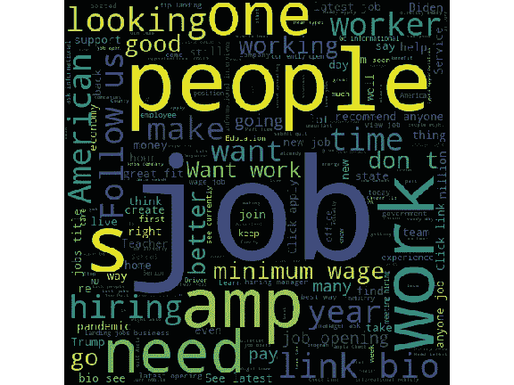
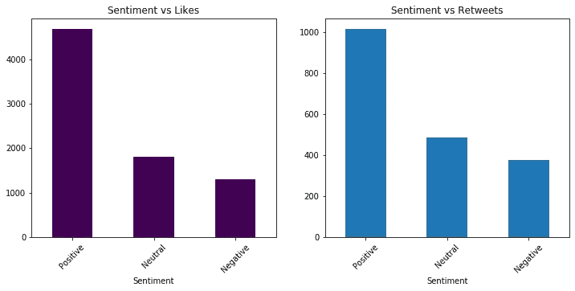

# 熟悉 Tweepy、NLP 和 Seaborn - Job 招聘

> 原文：<https://towardsdatascience.com/getting-familiar-with-tweepy-nlp-and-seaborn-job-recruitment-b665a2bd86b5?source=collection_archive---------38----------------------->

## 轻松提取、处理、分析和可视化您的推文


Joshua Hoehne 在 [Unsplash](https://unsplash.com?utm_source=medium&utm_medium=referral) 上拍摄的照片

Twitter 是向观众分享新闻、信息和情感的最大平台之一。在这个前所未有的时期，许多人失去了工作。在这篇文章中，我们将尝试浏览过去的推文，通过这些推文了解人们对工作的思维过程。我们将从赞和转发的角度来看推文的趋势。我们还将根据它们的位置对它们进行可视化。最后，我们将根据 tweets 中的关键字搜索，根据招聘人员和被招聘人员对他们进行分类。

我们将使用 python 作为我们的编程语言，tweepy 从 Twitter 中提取 tweets。我们将尝试从公司获得一些关于人们工作要求和招聘更新的某些趋势的见解。所以让我们开始导入库。

```
import csv
import pandas as pd
import csv
import re 
import string
import tweepy
import time
import ast
from nltk.corpus import stopwords
from wordcloud import WordCloud
from textblob import TextBlob
import seaborn as sns
import matplotlib.pyplot as plt
%matplotlib inline
```

所有这些库都会在编写代码的某个时候帮助我们。当我们遇到这些细节时，我们会着手处理的。

我们的第二步将是从 Twitter 中提取推文，并将其保存在 CSV 文件中。一个人必须有一个 Twitter 开发者帐户，才能使用 Twitter api 访问推文。下面是创建开发者帐户的链接。

[申请接入——Twitter 开发者| Twitter 开发者](https://developer.twitter.com/en/apply-for-access)

```
def extract_tweets():
 auth = tweepy.OAuthHandler(‘xxxxxxxxxx’, ‘xxxxxxxxxx’) 
 auth.set_access_token(‘xxxxxxx–xxxxxxxx’, ‘xxxxxxxxxx’)
 api = tweepy.API(auth)
 search_words = “jobs” #enter your words
 new_search = search_words + “ -filter:retweets”
 csvFile = open(‘jobs1.csv’, ‘a’)
 csvWriter = csv.writer(csvFile)
 for tweet in tweepy.Cursor(api.search,q=new_search,tweet_mode=’extended’,count=100,
 lang=”en”,
 since_id=0).items():
 csvWriter.writerow([tweet.created_at, tweet.full_text.encode(‘utf-8’),tweet.user.screen_name.encode(‘utf-8’),
 tweet.favorite_count,tweet.retweet_count,tweet.truncated,
 tweet.user.location.encode(‘utf-8’)])
 return
```

在上面的代码中，我们使用 tweepy 模块初始化 twitter api。在与我们的 twitter 帐户建立连接之后，我们将提取的 twitter 数据添加到 csv 文件中，并开始向其中追加 twitter 数据。我们的数据将包含日期，文本，姓名，喜欢，转发，截断和位置。

注意:提取的推文必须进行编码，因为它们的格式不可读。我们将在接下来的步骤中解码推文。

```
def read_data():
    df=pd.DataFrame()
    df=pd.read_csv('jobs1.csv')
    df.head()
    return df
```

使用这个函数，我们只需读取我们成功创建的数据。

```
def pre_processing(df):
    df.columns=['Date','Tweet','Name','Likes','Retweet','Truncated','Location']
    df['Tweet']=df['Tweet'].apply(lambda x:ast.literal_eval(x).decode('utf-8'))
    df['Location']=df['Location'].apply(lambda x:ast.literal_eval(x).decode('utf-8'))
    df['Name']=df['Name'].apply(lambda x:ast.literal_eval(x).decode('utf-8'))
    df.drop(['Truncated'],inplace=True,axis=1)
    return df
```

现在我们命名这些列，并使用 ast 库将 tweets 解码成可读的格式。

```
def assorted_tweets(df):
    location=['Atlanta, GA','Washington, DC','Los Angeles, CA',        'New York, NY', 'Chicago, IL', 'California, USA', 'Houston, TX',
'San Francisco, CA','New Jersey, USA','Boston, MA','Raleigh,                   NC','Nashville, TN','Seattle, WA','Pittsburgh, PA',
'Austin, TX','Dallas, TX','California','Portland, OR','Texas', 'Toronto','Phoenix, AZ','New York, USA','Toronto, Ontario', 'Texas, USA','Philadelphia, PA','Denver, CO','New York','Florida, USA','Manchester & San Francisco','Charlotte, NC','Las Vegas, NV','Cleveland, OH','Florida','Pennsylvania, USA','Maryland, USA','Louisville, KY','San Antonio, TX','Brooklyn, NY','Orlando, FL','Washington, D.C.','Miami, FL','Lagos, Nigeria','San Diego, CA',
'Detroit, MI','Colorado, USA','Michigan','Columbus, OH','Los Angeles','Sacramento, CA','New Jersey','Winchester, VA',
'Baltimore, MD','Pennsylvania','Providence, RI','Indianapolis, IN','North Carolina','Virginia, USA','Indiana','Colorado', 'Illinois, USA','St. Paul, MN','Buffalo, NY','North Carolina, USA','Calgary, Alberta']          
    df_new= df[df['Location'].isin(location)]
    df_new.reset_index(inplace=True)
    df_new.drop(['index'],inplace=True,axis=1)
    return df_new
```

我们将只考虑美国的数据，因为最多的推文来自该国。这可以通过对数据帧中的“位置”列应用 **value_counts** 函数来解决。

```
def view_data():
 pd.set_option(‘display.max_rows’, None)
 pd.set_option(‘display.max_columns’, None)
 pd.set_option(‘display.width’, None)
 pd.set_option(‘display.max_colwidth’, None)
 return
```

重要的是，我们能够完整地看到我们的数据，因此我们调用上面的函数，这样可以方便地通过 dataframe 读取 tweets。

```
def mention_data(df_new):
   mention=[]
   for i in df_new['Tweet']:
       txt=i
       x = re.findall("@", txt)
       mention.append(x)
   df_new['Mentions']=mention
   df_new['len']=df_new['Mentions'].map(lambda x: len(x))

   mentions['Total']=df_new['len'].groupby(df_new['Location']).sum()
   df_new.drop(['Mentions'],inplace=True,axis=1)
   return df_new, mentions
```

我们从统计每条推文的提及次数开始分析。我们还创建了一个提及表，用于将来的广泛分析。

```
def clean_tweets(df_new):
    stop = stopwords.words('english')
    df_new['Tweet'] = df_new['Tweet'].apply(lambda x: ' '.join([word      for word in x.split() if word not in (stop)]))
    df_new['Tweet']=df_new['Tweet'].apply(lambda x: str(x).split('http')[0])
    for i in range(len(df_new['Tweet'])):
        v = df_new['Tweet'][i]
        v = re.sub(r"@[A-Za-z0-9]+", "", v)
        df_new['Tweet'][i]=v
    return df_new
```

我们开始使用停用词模块清理我们的推文，并从推文中删除停用词。除此之外，我们删除了标签以及与每条推文相关的“http”链接。我们使用 regex 模块删除 tweets 中的标签和链接。

```
def create_wordcloud(df_new):
    words=''.join(list(df_new['Tweet']))
    spam_wc=WordCloud(width=512,height=512).generate(words)
    plt.figure(figsize=(8,6),facecolor='k')
    plt.imshow(spam_wc)
    plt.axis('off')
    plt.tight_layout(pad=0)
    plt.show()
    return
```

我们创建了一个 tweets 的词云，它给我们提供了所有使用最频繁或不经常出现的词的要点。

```
def sentiment_analysis(df_new):
    sentiment=[]
    Type=[]
    polarity=0
    for i in df_new['Tweet']:
        sentiments=TextBlob(i)
        sentiment.append(sentiments)
        tweet_polarity=sentiments.polarity
        if tweet_polarity>0.00:
            Type.append('Positive') elif tweet_polarity<0.00:
            Type.append('Negative') elif tweet_polarity==0.00:
            Type.append('Neutral')
        polarity+=tweet_polarity
    df_new['Sentiment']=Type
    return df_new
```

我们对我们的推文进行一个非常简单的情感分析。情感是基于极性而被划分的。推文分为正面、负面或中性。我们使用“Textblob”作为我们的 python 模块来帮助我们找到推文的极性。

```
def recruiter_recruitee(df_new):
    df_recruitee = df_new[df_new['Tweet'].str.contains('need')|df_new['Tweet'].str.contains('want work')|
                      df_new['Tweet'].str.contains('help')|df_new['Tweet'].str.contains('new job')|
                      df_new['Tweet'].str.contains('looking')|df_new['Tweet'].str.contains('support')]
    df_recruitee.drop_duplicates(inplace=True)
    df_recruiter = df_new[df_new['Tweet'].str.contains('link bio')|df_new['Tweet'].str.contains('hiring')|
                      df_new['Tweet'].str.contains('looking')|df_new['Tweet'].str.contains('job opening')|
                      df_new['Tweet'].str.contains('recommend')]
    df_recruitee.drop_duplicates(inplace=True)
    return df_recruitee,df_recruiter
```

我们现在把我们的推文分成 2 个数据帧。我们的第一个数据框架将是招聘人员，第二个将是招聘人员。我们根据单词云中最明显的关键词对它们进行分类。例如，recruitee 中的推文将包含诸如支持、帮助、新工作等词语，而招聘人员的推文包含诸如开放、寻找、推荐等词语。

```
if __name__ == '__main__':
    extract_tweets()
    view_data()
    df=read_data()
    df=pre_processing(df)
    df_new=assorted_tweets(df)
    mentions=pd.DataFrame()
    df_new,mentions=mention_data(df_new)
    df_new=clean_tweets(df_new)
    df_new=sentiment_analysis(df_new)
    df_recruitee,df_recruiter=recruiter_recruitee(df_new)
```

我们现在可以继续进行可视化。

```
if __name__ == '__main__':
    create_wordcloud(df_new)
```



我们创建了一个词云来检查我们推文中的常用词。

```
mentions.reset_index().sort_values(by='Total',ascending=False).head(7)
```

我们检查在哪个州的人们倾向于在他们的推文中提到其他人。

```
plt.subplot(121)
df1=df_new[‘Likes’].groupby(df_new[‘Location’]).mean().sort_values(ascending=False).head(7)
df1.plot(kind=’bar’,colormap=’viridis’,figsize=(7,5))
plt.xticks(rotation=45) 
plt.subplot(122)
df2=df_new[‘Retweet’].groupby(df_new[‘Location’]).mean().sort_values(ascending=False).head(7)
df2.plot(kind=’bar’,figsize=(12,5))
plt.xticks(rotation=45) 
plt.show()
```


我们创建了一个关于地点的赞和转发的柱状图。我们可以看到，与其他推文相比，来自华盛顿、迈阿密和纽约等大城市的推文产生了更多的影响。

```
plt.subplot(121)
df1=df_new['Likes'].groupby(df_new['Sentiment']).sum().sort_values(ascending=False).head(7)
df1.plot(kind='bar',colormap='viridis',figsize=(7,5))
plt.xticks(rotation=45) 
plt.subplot(122)
df2=df_new['Retweet'].groupby(df_new['Sentiment']).sum().sort_values(ascending=False).head(7)
df2.plot(kind='bar',figsize=(12,5))
plt.xticks(rotation=45) 
plt.show()
```



我们检查哪种类型的情绪获得了最多的喜欢和转发。显然，积极的推文在这方面有优势。

```
plt.subplot(121)
df1=df_new['Likes'].groupby(df_new['Sentiment']).mean().sort_values(ascending=False).head(7)
df1.plot(kind='bar',colormap='viridis',figsize=(7,5))
plt.xticks(rotation=45) 
plt.subplot(122)
df2=df_new['Retweet'].groupby(df_new['Sentiment']).mean().sort_values(ascending=False).head(7)
df2.plot(kind='bar',figsize=(12,5))
plt.xticks(rotation=45) 
plt.show()
```


令人惊讶的是，负面推文平均获得更多的喜欢和转发。

```
plt.subplot(121)
df1=df_recruitee['Sentiment'].value_counts()
df1.plot(kind='bar',colormap='viridis',figsize=(7,5))
plt.xticks(rotation=45) 
plt.subplot(122)
df2=df_recruiter['Sentiment'].value_counts()
df2.plot(kind='bar',figsize=(12,5))
plt.xticks(rotation=45) 
plt.show()
```


我们检查招聘人员和被招聘人员表中的情绪分布。

```
plt.figure(figsize=(12,5))
plt.subplot(121)
df1=df_recruitee['Likes'].groupby(df_new['Sentiment']).mean()
plt.pie(df1,labels=df1.index,autopct='%1.1f%%',shadow=True)
plt.subplot(122)
df2=df_recruiter['Likes'].groupby(df_new['Sentiment']).mean()
plt.pie(df2,labels=df2.index,autopct='%1.1f%%',shadow=True)
plt.figure(figsize=(12,5))
plt.show()
```


我们使用饼图来检查喜欢和转发的情绪分布。我们可以看到，中性的推文往往比其他推文产生更多的喜欢。

```
plt.subplot(131)
a=df_recruitee[df_recruitee['Sentiment']=='Positive']['Location'].value_counts().head(5)
a.plot(kind='bar',colormap='viridis',figsize=(14,6))
plt.xticks(rotation=45)
plt.subplot(132)
b=df_recruitee[df_recruitee['Sentiment']=='Negative']['Location'].value_counts().head(5)
b.plot(kind='bar',colormap='cividis',figsize=(14,6))
plt.xticks(rotation=45) 
plt.subplot(133)
b=df_recruitee[df_recruitee['Sentiment']=='Neutral']['Location'].value_counts().head(5)
b.plot(kind='bar',colormap='plasma',figsize=(14,6))
plt.xticks(rotation=45)
plt.show()
```


与被招聘者表中的位置相关的正面、负面和中性推文。

我们可以看到，与洛杉矶和德克萨斯州的人相比，华盛顿和旧金山的被招聘者更积极。

```
plt.subplot(131)
a=df_recruiter[df_recruiter['Sentiment']=='Positive']['Location'].value_counts().head(5)
a.plot(kind='bar',colormap='viridis',figsize=(14,6))
plt.xticks(rotation=45)
plt.subplot(132)
b=df_recruiter[df_recruiter['Sentiment']=='Negative']['Location'].value_counts().head(5)
b.plot(kind='bar',colormap='cividis',figsize=(14,6))
plt.xticks(rotation=45) 
plt.subplot(133)
b=df_recruiter[df_recruiter['Sentiment']=='Neutral']['Location'].value_counts().head(5)
b.plot(kind='bar',colormap='plasma',figsize=(14,6))
plt.xticks(rotation=45)
plt.show()
```


关于招聘人员表中位置的正面、负面和中性推文。

同样，我们可以看到，与丹佛和新泽西相比，亚特兰大和芝加哥的招聘人员更加积极。

就这样结束了。我们成功地浏览了我们的推文。我们设法深入了解了不同城市人们对于工作的思维过程。我们还看到了哪些推文在点赞和转发方面更具吸引力。

欢迎留下任何问题或评论！