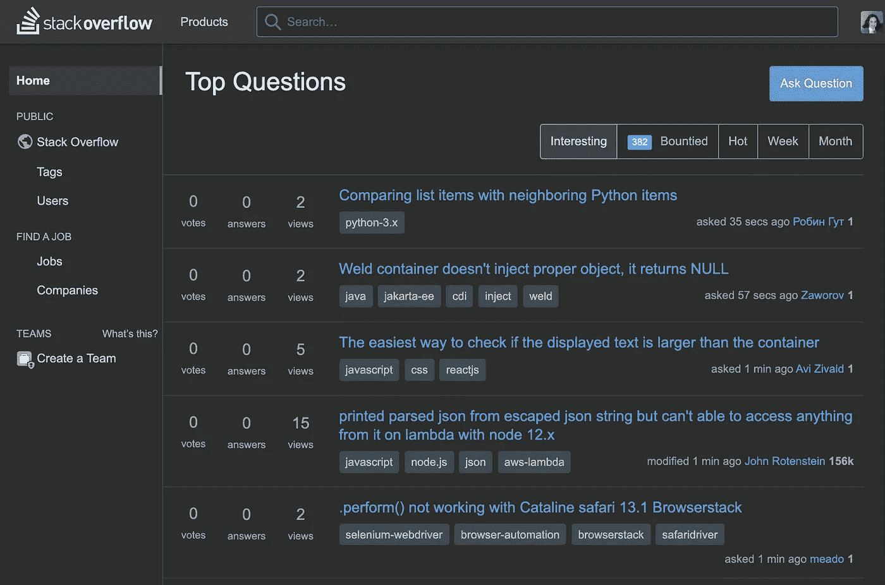
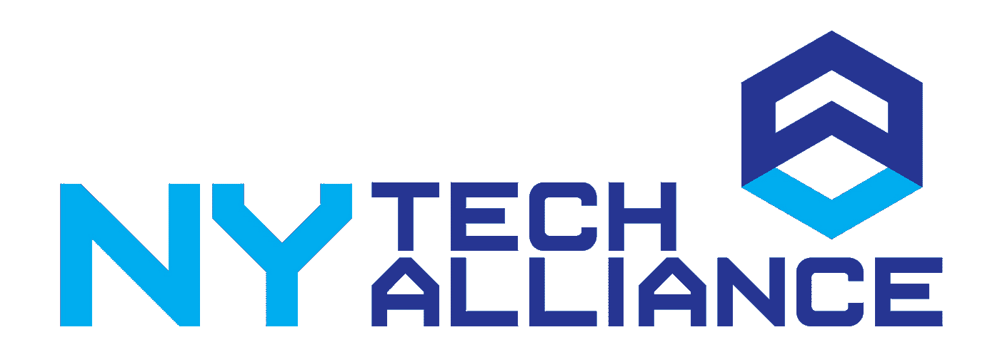

# 获得反馈在没有教师的情况下在线学习数据科学

> 原文：<https://towardsdatascience.com/getting-feedback-learning-data-science-online-without-an-instructor-262c0fc7b284?source=collection_archive---------41----------------------->

米利安·耶西耶在 [Unsplash](https://unsplash.com?utm_source=medium&utm_medium=referral) 上拍摄的照片

当你编码时，你有时会从另一双眼睛那里学到很多东西，那双眼睛会阅读你的工作，捕捉你的错误，并告诉你怎样做得更好。在许多课程中，教师或至少助教会手动阅读你的代码并提供反馈。但是，有些课程是自定进度的课程，您不会从讲师那里获得定制的反馈。即使在这些类型的课程中，你也有向他人学习的方法。

# 查看相关的问答网站

即使是一个非常有天赋的懂文档的程序员也会经常犯编程错误，尤其是在开始的时候。他们可能不会马上意识到为什么。当我在一个特定的问题上需要帮助时，我的第一站通常是[堆栈溢出](https://stackoverflow.com/)，有时我会在查看标准文档之前先查看一下。那是一个很受欢迎的问答网站，专注于编程问题的答案。

截图我的。

如果你有一个编程问题，很可能——特别是如果你刚刚开始——许多其他人也有一个非常相似的问题。这些问题和其他人对它们的回答可能已经在网站上分享了。如果你的问题与堆栈溢出略有跑题，同一公司的其他网站 [Stack Exchange](https://stackexchange.com/) 涵盖了相关的技术主题。

数据科学不仅是编程，还包括许多其他领域。像 Quora[这样的问答网站可以在数据科学的其他领域给你更多的建议，比如分析数据的策略。如果你在某个网站上找不到你的问题，问这个问题，寻求答案，帮助下一个出现的人并不丢人。](https://www.quora.com/)

# 开始或加入一个学习小组

你可能还想组织一群人一起学习这门课程。如果你还没有感兴趣的朋友，在社交媒体上发布你对这门课程的兴趣。您还可以加入 [Meetup](https://www.meetup.com/) 群组，并将课程作为事件发布在那里。Meetup 是一个为有特殊兴趣的人宣传事件的社交网络。在新冠肺炎登陆之前，它是现场技术活动的主要推广地之一。现在，许多活动都转移到了网上。这可能对你有利，因为你可以在更大的地理范围内吸引同学。

在某些情况下，对你有帮助的事件已经被安排好了。专注于特定技术或更广泛的数据科学的 Meetup 小组可能有办公时间。我所知道的，来自纽约的，可以推荐的团体包括[黑客小时](https://www.meetup.com/hackerhours)、[纽约女性编码](https://www.meetup.com/WomenWhoCodeNYC)和[纽约 Python Meetup 团体](https://www.meetup.com/nycpython/)。所有人都至少部分搬到了网上，所以你可以从世界任何地方加入。类似的聚会团体存在于大多数拥有相当规模的技术社区的城市。

照片由 [Unsplash](https://unsplash.com?utm_source=medium&utm_medium=referral) 上的[天线](https://unsplash.com/@antenna?utm_source=medium&utm_medium=referral)拍摄

如果你经常参加科技活动，你也会接触到一群与你水平相当或略高的人。这个挺有用的。你的朋友可以给你出主意去哪里，如何规划你的职业道路。我在这些活动中遇到的一些朋友已经成为非常成功的技术专家。我仍然和他们保持联系，甚至在他们结婚、有了孩子并搬离纽约多年以后。

# 寻找你的支持网络

图片来自 nytech.org

一般用途的社交活动大多会吸引那些刚刚开始职业生涯的人。纽约技术联盟组织的纽约技术聚会是吸引更有经验者的一个团体。它的重点是展示崭露头角的纽约科技公司和有趣的项目。它还举办网络会议，让整个技术行业处于职业生涯各个阶段的专业人士和学生能够交流。纽约是世界顶级技术中心之一，即使你在另一个城市，这个团体的在线活动也值得参加。

然而，对你的工作获得个性化反馈的最好方法是多付一点钱，聘请一位行业经验丰富的导师。如果你能找到一个专业数据科学家的好导师，我建议你雇佣他们每周一次或两次，每次一两个小时的指导。这几乎可以像一个现场编码训练营一样教你很多东西，而且价格要低得多。对于美国家教来说，每小时 50-100 美元是合理的。你可以在 Meetup 群和工作论坛上发布你的家教职位，比如说[zipcruiter](https://www.ziprecruiter.com/post-a-job)、[、Angel.co](https://www.indeed.com/hire)和。这是一份相当不错的技术职位列表。这里有一些[在 Indeed](https://www.indeed.com/q-tutor-jobs.html) 上辅导工作岗位的例子。

由[万花筒](https://unsplash.com/@kaleidico?utm_source=medium&utm_medium=referral)在 [Unsplash](https://unsplash.com?utm_source=medium&utm_medium=referral) 上拍摄的照片

也有可能以更低的价格获得几乎同样质量的教学。如果你有联系大学部门和校友网络的关系，你很可能能够以接近每小时 30-50 美元的价格雇佣一名研究生或高级本科生。这些学生中的一些人在该领域知识渊博，在教学方面很有天赋，他们的辅导质量可以接近专业人士的辅导。或者你可以用更低的价格外包一个家教，可能是外包到国外，使用像 [Upwork](https://www.upwork.com/) 这样的平台。尤其是印度是一个讲英语的地方，许多人懂技术，劳动力成本也更低。另一个降低成本的方法是和你的同学分享一个家教的价格。

即使是专业人士也需要知道向哪些专家询问他们专业领域之外的问题。在他们将代码添加到主程序之前，他们通常还会经历一个称为代码审查的过程。在代码评审期间，一个团队成员通读他们的代码。队友经常会有有价值的反馈，即使是世界一流的著名程序员。这类似于写作，另一个强调可读性和优雅的领域。即使是最伟大的作家也有编辑，一个人与编辑一起工作的能力可以增强他的写作能力。我知道——我不仅为专业报纸和杂志写过文章，还在谷歌做过软件工程师。与写作中的编辑过程一样，代码审查是严格的软件开发过程中的关键步骤。

这是我写的另一篇文章，提供了更多关于在自学课程中学习数据科学的技巧。

</learning-data-science-online-without-an-instructor-tips-and-tricks-5e15fb886333> 