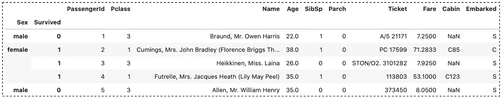
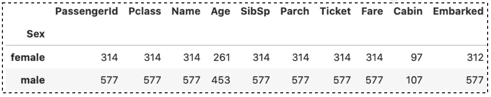
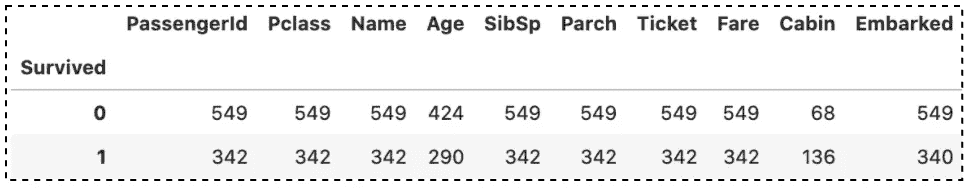
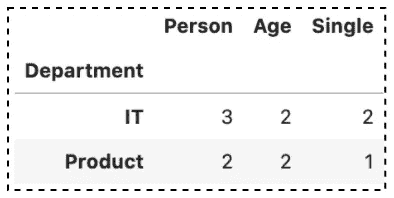
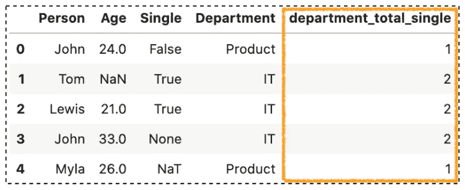
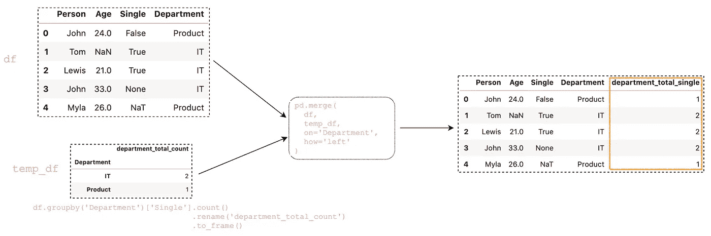

# 从熊猫数量中获取更多价值()

> 原文：<https://towardsdatascience.com/getting-more-value-from-the-pandas-count-3e45a62c7077?source=collection_archive---------6----------------------->

## 有效使用熊猫`count()`方法的 5 个技巧


苏珊·霍尔特·辛普森在 [Unsplash](https://unsplash.com/s/photos/numbers?utm_source=unsplash&utm_medium=referral&utm_content=creditCopyText) 上的照片

熊猫图书馆是最受欢迎的数据操作和分析工具之一。数据科学家通常花费大部分时间探索和预处理数据。谈到数据分析和理解数据集，Pandas `count()`是了解非 NA 数量的最常用方法之一。

这个方法很快，很快，很容易理解，但是，大多数时候，我们最终使用了带有默认参数的`count()`。在本文中，您将了解如何从中获得更多价值。这篇文章的结构如下:

1.  对每一列和每一行的非 NA 细胞进行计数
2.  在多指数数据框架上计数非钠细胞
3.  仅用`numeric_only`计数数字
4.  将`count()`应用于`groupby()`结果
5.  将计数组合回原始数据帧

> 源代码请查看笔记本。
> 
> 访问 [Github Repo](https://github.com/BindiChen/machine-learning) 获取其他教程

# 1.对每一列和每一行的非 NA 细胞进行计数

Pandas `count()`用于计算给定轴上非 NA 细胞的数量。值`None`、`NaN`、`NaT`和可选的`numpy.inf`被认为是`NA`。

例如，默认情况下，该方法对每一列的非 NA 进行计数

```
df = pd.DataFrame({
    "Person": ["John", "Tom", "Lewis", "John", "Myla"],
    "Age": [24., np.nan, 21., 33, 26],
    "Single": [False, True, True, None, np.datetime64('NaT')],
    "Department": ["Product", "IT", "IT", "IT", "Product"]
})>>> **df.count()**Person        5
Age           4
Single        3
Department    5
dtype: int64
```

如果我们希望对每行的非 NA 进行计数，我们可以将`axis`参数设置为`1`或`'columns'`:

```
>>> df.count(**axis = 1**)0    4
1    3
2    4
3    3
4    3
dtype: int64>>> df.count(**axis = 'columns'**)0    4
1    3
2    4
3    3
4    3
dtype: int64
```

# 2.在多指数数据框架上计数非钠细胞

一个**多索引**数据帧允许多个列作为一个行标识符，多个行作为一个标题标识符。例如，让我们用**性别**和**幸存的**列作为索引来加载[泰坦尼克号数据集](https://www.kaggle.com/c/titanic)。

```
df = pd.read_csv(
    'titanic_train.csv', 
    **index_col=['Sex', 'Survived']**
)
df.head()
```



作者图片

例如，我们可以设置参数`level`来计算非 NA 以及特定的索引级别

```
df.count(**level='Sex'**)
```



熊猫`count(level='Sex')`作者图片

```
df.count(**level='Survived'**)
```



熊猫`count(level='Survived')`作者图片

如果您想了解更多关于 MultiIndex 的信息，请访问:

[](/accessing-data-in-a-multiindex-dataframe-in-pandas-569e8767201d) [## 在熊猫的多索引数据框架中访问数据

towardsdatascience.com](/accessing-data-in-a-multiindex-dataframe-in-pandas-569e8767201d) 

# 3.仅在数字上执行`count()`

在熊猫`count()`中有一个关于`numeric_only`只配置数字计数的争论。值 **float** 、 **int** 和 **boolean** 被认为是数字。

参数默认为`False`，我们可以将它设置为`True`来只计算数值:

```
>>> df.count(**numeric_only=True**)PassengerId    891
Pclass         891
Age            714
SibSp          891
Parch          891
Fare           891
dtype: int64
```

# 4.将 count()应用于 groupby()结果

Pandas `[groupby()](/all-pandas-groupby-you-should-know-for-grouping-data-and-performing-operations-2a8ec1327b5)`允许我们将数据分成不同的组来执行计算，以便更好地进行分析。

一个常见的用例是按某一列进行分组，然后获取另一列的计数。例如，让我们按“**部门**列进行分组，并获得“**单个”**值的计数。

```
df = pd.DataFrame({
    "Person": ["John", "Tom", "Lewis", "John", "Myla"],
    "Age": [24., np.nan, 21., 33, 26],
    "Single": [False, True, True, None, np.datetime64('NaT')],
    "Department": ["Product", "IT", "IT", "IT", "Product"]
})>>> **df.groupby('Department')['Single'].count()**Department
IT         2
Product    1
Name: Single, dtype: int64
```

或者，我们也可以使用聚合`agg('count')`方法。

```
>>> df.groupby('Department')['Single']**.agg('count')**Department
IT         2
Product    1
Name: Single, dtype: int64
```

我们已经对`groupby()`结果的特定列执行了`count()`。事实证明，我们实际上不必指定像 Single 这样的列。如果没有列，它会将`count()`应用于所有列，例如:

```
>>> df.**groupby('Department').count()**>>> df.**groupby('Department').agg('count')**
```



如果您想了解更多关于`groupby()`的信息，请查看:

[](/all-pandas-groupby-you-should-know-for-grouping-data-and-performing-operations-2a8ec1327b5) [## 所有熊猫 groupby()你应该知道分组数据和执行操作

### 熊猫帮助你开始数据分析的提示和技巧

towardsdatascience.com](/all-pandas-groupby-you-should-know-for-grouping-data-and-performing-operations-2a8ec1327b5) 

# 5.将计数组合回原始数据帧

在某些情况下，您可能希望将计数写回原始数据帧，例如，我们希望追加一列 **department_total_single** ，如下所示:



作者图片

这个任务中棘手的部分是,`df.groupby()['Single'].cout()`返回只有 2 行的序列(如下所示),它不会匹配原始数据帧中的行数。

```
>>> df.**groupby('Department')['Single'].count()**Department
IT         2
Product    1
Name: Single, dtype: int64
```

一种解决方案是将上述结果转换成 DataFrame，并使用`merge()`方法组合结果。

```
>>> temp_df = df.groupby('Department')['Single'].count().**rename('department_total_count').to_frame()** >>> temp_df.**reset_index()**
>>> df_new = pd.**merge(df, temp_df, on='Department', how='left')**
```



熊猫分组和合并(图片由作者提供)

这当然有助于我们的工作。但是这是一个多步骤的过程，需要额外的代码来获得我们需要的形式的数据。

我们可以使用`transform()`函数有效地解决这个问题。一行代码就可以解决应用和合并问题。

```
>>> df.groupby('Department')['Single']**.transform('count')**0    1
1    2
2    2
3    2
4    1
Name: Single, dtype: int64
```

我们可以看到`transform()`的结果保留了与原始数据集相同的行数。因此，我们可以简单地将结果赋给原始数据帧中的新列:

```
>>> **df['department_total_single']** = df.groupby('Department')['Single'].transform('count')
```


熊猫`transform('count')`(作者图片)

如果您想了解有关 merge()和 transform()的更多信息，请查看:

[](/all-the-pandas-merge-you-should-know-for-combining-datasets-526b9ecaf184) [## 所有的熊猫合并()你应该知道合并数据集

### 你应该知道的一些最有用的熊猫把戏

towardsdatascience.com](/all-the-pandas-merge-you-should-know-for-combining-datasets-526b9ecaf184) [](/when-to-use-pandas-transform-function-df8861aa0dcf) [## 何时使用 Pandas transform()函数

### 一些最有用的熊猫把戏

towardsdatascience.com](/when-to-use-pandas-transform-function-df8861aa0dcf) 

# 结论

在本文中，我们探索了熊猫`counts()`的不同用例。它非常方便，是探索性数据分析和数据预处理中最受欢迎的方法之一。

我希望这篇文章能帮助你节省学习熊猫的时间。我建议你查看一下关于`counts()` API 的[文档](https://pandas.pydata.org/docs/reference/api/pandas.DataFrame.count.html)，并了解你可以做的其他事情。

感谢阅读。请查看[笔记本](https://github.com/BindiChen/machine-learning/blob/master/data-analysis/043-pandas-count/pandas-count.ipynb)获取源代码，如果您对机器学习的实用方面感兴趣，请继续关注。

## 你可能会对我的其他一些熊猫文章感兴趣:

*   [9 个熊猫 value_counts()提高数据分析能力的窍门](/9-pandas-value-counts-tricks-to-improve-your-data-analysis-7980a2b46536)
*   [所有熊猫 json_normalize()你应该知道的扁平化 JSON](/all-pandas-json-normalize-you-should-know-for-flattening-json-13eae1dfb7dd)
*   [使用熊猫方法链接提高代码可读性](https://medium.com/@bindiatwork/using-pandas-method-chaining-to-improve-code-readability-d8517c5626ac)
*   [如何对熊猫数据帧进行自定义排序](/how-to-do-a-custom-sort-on-pandas-dataframe-ac18e7ea5320)
*   [数据分析你应该知道的所有熊猫移位()](/all-the-pandas-shift-you-should-know-for-data-analysis-791c1692b5e)
*   [何时使用 Pandas transform()函数](/when-to-use-pandas-transform-function-df8861aa0dcf)
*   [你应该知道的熊猫串联()招数](/pandas-concat-tricks-you-should-know-to-speed-up-your-data-analysis-cd3d4fdfe6dd)
*   [Pandas 中 apply()和 transform()的区别](https://medium.com/@bindiatwork/difference-between-apply-and-transform-in-pandas-242e5cf32705)
*   [所有熊猫合并()你应该知道](/all-the-pandas-merge-you-should-know-for-combining-datasets-526b9ecaf184)
*   [在 Pandas 数据帧中处理日期时间](/working-with-datetime-in-pandas-dataframe-663f7af6c587)
*   [熊猫阅读 _csv()你应该知道的招数](https://medium.com/@bindiatwork/all-the-pandas-read-csv-you-should-know-to-speed-up-your-data-analysis-1e16fe1039f3)
*   [用 Pandas read_csv()解析日期列应该知道的 4 个技巧](/4-tricks-you-should-know-to-parse-date-columns-with-pandas-read-csv-27355bb2ad0e)

更多教程可以在 [Github](https://github.com/BindiChen/machine-learning) 上找到