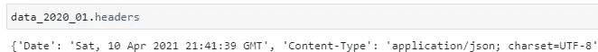
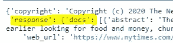
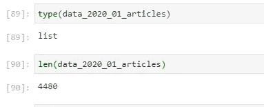
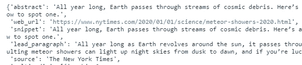
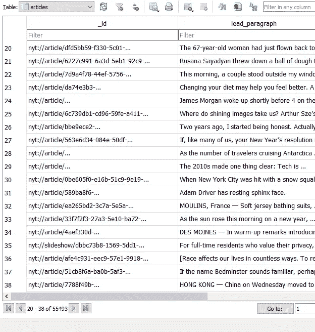

# 获取 NYT 文章数据并将其保存到 SQL 数据库中

> 原文：<https://towardsdatascience.com/getting-newspaper-article-data-and-saving-it-to-a-sql-database-651602ee929f?source=collection_archive---------34----------------------->

## 从纽约时报 API 获取文章数据并保存到 SQLite 数据库


斯蒂芬·瓦伦丁在 [Unsplash](https://unsplash.com?utm_source=medium&utm_medium=referral) 上拍摄的照片

# 介绍

本周，我决定学习更多关于文字处理的知识，从基于报纸数据构建一些文字云开始。同时，我想提高我收集数据并将其保存到数据库中的知识。

我在这里的主要目标是获取并保存一些我可以使用的有趣数据。我认为 2020 年的报纸文章会很有趣，可以看到每个月的新闻主题。

最初，我从不同的报纸档案中寻找文章。有许多很棒的工具，但我能找到的提供 API 的工具并不多。我发现《纽约时报》确实有一个 API，提供与他们的文章相关的数据。

这是一篇记录我的学习历程的文章，从 API 获取数据并保存到 SQLite DB。

# 关于 API

这些 API 可在 https://developer.nytimes.com/apis[获得](https://developer.nytimes.com/apis)

我发现 API 的文档(包括[https://developer.nytimes.com/faq](https://developer.nytimes.com/faq)的常见问题解答)对入门非常有用。

《纽约时报》提供了许多不同的 API，包括 Books API，其中包含有关畅销书列表和书评的信息，Film API，用于电影评论，以及 Community API，其中包含有关用户生成的内容(如评论)的信息。

在本文中，我使用的是归档 API([https://developer . nytimes . com/docs/Archive-product/1/overview](https://developer.nytimes.com/docs/archive-product/1/overview))。如果您将年份和月份传递给 API，它将返回该月的文章数据。文章数据告诉我们很多事情，包括 NYT 网站上的全文，发表时间，标题和导语。

## 获取访问权限

使用 API 的第一步是建立一个帐户并获得访问权限([https://developer.nytimes.com/get-started](https://developer.nytimes.com/get-started))

## 要求

我使用了*请求*、 *sqlite3* 和*时间。*

# 步伐

我在这里经历三个步骤。我:

1.  连接到 API 以浏览可用的数据，并查看我想要保存的数据。
2.  基于我要保存的数据建立一个数据库表。
3.  获取一年中每个月的数据并保存到数据库中。

# 探索数据

在这里，我导入我将使用的内容。*请求*将调用 API， *sqlite3* 用于与数据库和*时间*交互，因此脚本可以在调用之间休眠。医生建议两次通话间隔 6 秒，以避免达到极限。

```
import requests
import sqlite3
import time
```

在这一行中，我发出一个初始请求来查看数据是什么样子的。您的纽约时报 API 帐户中生成的 API 密钥将放在[您的 API 密钥]占位符中。使用这个 API 进行身份验证非常简单

```
data_2020_01 = requests.get("[https://api.nytimes.com/svc/archive/v1/2020/1.json?api-key=](https://api.nytimes.com/svc/archive/v1/2020/1.json?api-key=rukHkq9CptpyckwG9qfMpHX7C06rn9zK)[YOUR API KEY]")
```

归档 API 将数据作为 JSON 响应返回。该信息在 API 网站上给出，但是也可以检查请求响应头，以查看返回的内容类型。是“应用/json”:



知道了这一点，我可以使用 Requests 自己的 JSON 解码器将响应转换成 python 字典:

```
data_2020_01_json = data_2020_01.json()
```

打印数据显示这是一本字典。文章本身包含在字典的列表中:



```
data_2020_01_articles = data_2020_01_json['response']['docs']
```

该列表的长度为 4480，这意味着它包含以下数量的文章:



为了探究一篇文章，我在列表中取一个数字，直到 4480，来查看它。例如，在位置 10 的文章:

```
data_2020_01_articles[10]
```

关于这篇文章有很多信息——比如它的 web_url、lead_paragraph、它在哪个部分(section_name)以及它发表的时间(pub_date)



我想先保存标题、引导段落和出版日期。我认为材料的类型也可能是有趣的，还有字数、主要标题、印刷页、新闻桌和版块名称。

# 数据库

数据库有许多选项。这里我使用 SQL lite。这样做的一个主要优点是我可以很容易地用 python 创建它并与之交互。我在[https://docs.python.org/3/library/sqlite3.html](https://docs.python.org/3/library/sqlite3.html)使用文档工作

## 构建数据库

我想在我们的数据库中保存作为一行返回的每篇文章，并为上面提到的每个字段(即，主标题，打印页面，新闻桌面等)列。,)

我正在创建的特定列:

**_id** (这将是文章的唯一 id。API 为每篇文章返回一个)， **web_url** ， **main_headline** ， **pub_date** ， **news_desk** ， **section_name** ， **type_of_material** ， **word_count** 。

## 创建数据库和表

使用 python 直接连接和创建数据库:

```
connection = sqlite3.connect('nytimes_articles.db')
```

创建一个游标对象，以便我可以开始执行查询:

```
cur = connection.cursor()
```

使用游标的 execute 方法创建表:

```
cur.execute('''CREATE TABLE articles(_id TEXT, lead_pargraph TEXT,  web_url TEXT, main_headline TEXT, pub_date TEXT, news_desk TEXT, section_name TEXT, type_of_material TEXT, word_count INT)''')
```

# 保存数据

所以，我想得到一年中每个月的数据。早些时候，我获取了一个月的数据，以探索数据的结构，但现在我需要编写一个函数来获取每个月的数据，然后将每个月的数据保存到刚刚创建的数据库中。

在这里，我编写了一个函数来为我想要获取数据的每个月生成一个 URL。

```
def generate_urls():
    month_range = range(1,13)
    api_key = "[YOUR API KEY]"
    urls = []
    for month in month_range:
        url = (f"[https://api.nytimes.com/svc/archive/v1/2020/{month}.json?api-key={api_key](https://api.nytimes.com/svc/archive/v1/2020/{month}.json?api-key={api_key)}")
        urls.append(url)
    return urls
```

我将遍历我要访问的 url 列表(由上述函数返回，访问每个 URL，并使用每个月返回的数据，遍历文章列表。然后，我将数据库中每一行的值添加为一个元组，然后将每个元组存储在一个列表中。每个月结束后，我都会把这些写在数据库里。

重要的是，数据以与数据库中的列相同的顺序保存在元组中，即:_id、lead_paragraph、web_url、main_headline、pub_date、news_desk、section_name、type_of_material、word_count

```
month_urls = generate_urls()for month in month_urls:
    data = requests.get(month)
    data_json = data.json()
    data_articles = data_json['response']['docs']   
    values_for_db = []for article in data_articles:
        row = (article['_id'], article['lead_paragraph'], article['web_url'], article['headline']['main'], article['pub_date'], article['news_desk'], article['section_name'], article['type_of_material'], article['word_count'])
        values_for_db.append(row)

    cur.executemany('INSERT INTO articles VALUES (?,?,?,?,?,?,?,?,?)', values_for_db)
    time.sleep(6)
    connection.commit()connection.close()
```

# 数据

我使用了 SQLite 的 DB 浏览器来查看文章数据。在这里，我可以很容易地看到保存了什么。55，493 篇文章的数据:



作者图片

我发现使用这个 API 非常简单，它有很多关于纽约时报上文章的有趣信息。虽然 API 没有提供整篇文章的文本，但是 lead_paragraph 字段应该是每篇文章中提到的内容的一个很好的指示器。今年，我计划在文字云可视化之前对文本进行命名实体识别。这也可能是用于情感分析的有趣数据。

介绍图片是[斯蒂芬·瓦伦丁](https://unsplash.com/@valentinsteph?utm_source=medium&utm_medium=referral)在 [Unsplash](https://unsplash.com?utm_source=medium&utm_medium=referral) 上的一张照片。其他所有图片均由作者拍摄。本文中使用的代码可以在这里找到:

[](https://github.com/LiamConnors/Medium-articles) [## Liam Connors/Medium-文章

### 我在媒体上发表的文章的代码。为 LiamConnors/Medium-articles 开发创建一个…

github.com](https://github.com/LiamConnors/Medium-articles)