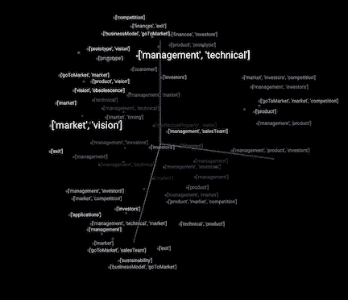

# AI 为什么这么哑？

> 原文：<https://towardsdatascience.com/getting-out-of-the-current-ai-rut-e5f10faa1983?source=collection_archive---------24----------------------->

## 为什么自动化知识获取提供了前进的道路。

集体推理主题图(图片由作者提供)

“为什么 AI 这么哑？”是 IEEE Spectrum 十月号封面故事的标题。在一系列文章中，对人工智能的全面分析表明，我们正处于人工智能应用和人工智能研究前进道路的重要转折点。本文的目的是探讨这个问题提出的结论，并提出一个前进的方向。我们正在走向一个新的人工智能冬天，还是有一条承诺持续增长和价值的前进道路？

# 我度过了第一个人工智能冬天。

作为第一次人工智能 IPO(INAI——intelli corp)的领导者和 1986 年 AAAI 的联合主席，我经历了人工智能浪潮取得巨大成功的喜悦。那些在漫长寒冷的冬天后遗失的故事，包含了前进道路的线索。几乎每一位领先公司的首席执行官都关注并在构建专家系统和其他人工智能应用程序上下了 R&D 赌注。一些非常成功的原型导致了广泛的新应用类别，例如需求预测/定价、配置管理、诊断方法和欺诈检测等等。承诺是巨大的，但成本高于收益。结果，成功的应用程序类别演变成了传统的软件应用程序。人工智能技术提供的生产力是有价值的，但广泛采用也有障碍。

可扩展性的最大障碍之一是知识获取是一个劳动密集型的过程。然而，困难并没有阻止大家。80 年代中期我在道格·勒纳特的办公室。他的既定任务是:建立一个庞大、全面的知识库。近 40 年后，该项目继续进行，并找到了效用。也就是说，手工制作知识库限制了可伸缩性。

在封面故事概述中，有两条引言阐明了当前的事态:

“无论是道格拉斯·莱纳特(Douglas Lenat)的 Cyc 等象征性人工智能项目，还是杰弗里·辛顿(Geoffrey Hinton)、扬·勒昆(Yann Lecun)和约舒阿·本吉奥(Yoshua Bengio)开创的深度学习进展，都还没有产生人类水平的智能。”

***“就过去 20 年我们在这项工作上取得的进展而言:我认为我们今天的智力水平还远远没有接近一个 2 岁孩子的水平。但也许我们有相当于低等动物感知的算法。”***

第一个评论指出了当前事态带来的限制:手工制作的人工智能系统无法扩展。第二种观点认为，基于从数据中学习数学模式的方法(尽管确实强大有力)不足以捕捉人类智能的本质。最后，朱迪亚·珀尔进一步阐述了这一观点:

***“你比你的数据聪明。数据不懂因果；人类会……最可靠的知识是你自己构建的。”***

珀尔的评论暗示了一条前进的道路，我们将在后面的段落中继续探讨。

虽然对人工智能局限性的认识越来越突出，但该领域的研究人员也认识到了这些局限性。几年前，我参加了麻省理工学院的一个会议，该会议标志着麻省理工学院智能探索的启动，这是一个促进人类和机器智能研究的广泛倡议。斯坦福和伯克利启动了类似的项目，以深化理解智能(人类和人工智能)本质的跨学科研究。此外，美国国家科学基金会(NSF)和美国国防部高级研究计划局(DARPA)的各种研究计划，都试图为整合人类认知和人工智能模型建立更好的基础。认识到限制和需要，人工智能的实际应用的前进道路是什么？

正如 MIT-IQ 所表明的那样，广义人工智能正在步入基础研究的漫长道路。前进的最佳途径是什么？我们能利用人工智能和集体智慧的发展吗？我相信答案是肯定的。尽管如此，它仍然需要通过找到人类协作学习和深度学习的共同点，深入地重新构建我们如何处理人工智能应用。一种新颖方法的精髓始于 90 年代末。

随着人工智能冬天的到来，我离开人工智能 5 年，并在 1992 年成为苹果公司的 CEO。Connect 成为电子商务平台，于 90 年代末上市。在我接近 Connect 的时候，一个朋友带着他最初称之为“思考游戏”的过程来找我。⁴:这是一个协作学习和融合的人工过程，最初是用索引卡实现的。这一过程和由此产生的模型是受研究科学发现过程的启发。⁵在 90 年代末，我们创建了一个基于网络的协作学习平台，我们将其注册为“适应性对话”宝洁公司和 NBC 是这项技术的早期采用者。我们能够证明，人们可以通过了解消费者喜欢某种产品或观众喜欢(或不喜欢)电视节目的原因来做出预测。

《适应性对话》的工作与《群体的智慧》和《引爆点》的出版同时进行。第一本书指出了什么成为了集体智慧的科学，第二本书涵盖了突现模式如何发展成为更重要的市场现象。集体智慧是关于我们如何一起变得更聪明。正如在《引爆点》中所讨论的，复杂适应系统模拟了导致巨大影响的早期趋势。

# 结合集体智能和复杂适应系统:人工智能的新框架

人工智能新框架的核心技术是从人类集合中获取知识，并使用我们称为集体推理的过程将这些知识存储在一个活的计算模型中。具体来说，集体推理过程构建了包含参与者集体智慧的概率图形网络。因此，人工智能是一种超级智能的会议主持人，它通过一个平衡发现与优化学习一致性的过程来指导团队，最终产生一种可能性和一种解释。 在嵌入了启发式模型(例如，决策规则或记分卡)的模板的驱动下，系统返回结果的概率估计以及对集体推理的完整解释。

通过与领先的消费品公司(P&G、乐高、NBC、Intuit)合作 12 年，我们了解到从自下而上的消费者对话中学习偏好(例如，你想体验什么？)是可靠的预测。核心自适应学习算法可以产生语句的相关排序。排名准确性通过了 CPG 和媒体领域全球领先的市场情报专业人士的审查。我们还了解到，它引起了高层管理人员的注意，导致技术推动了 Reichheld 的 NPS 书籍《一个问题》中五个案例研究中的两个。它创造了创新的变革案例，乐高就是一个最好的例子。时任乐高 Direct 首席执行官的他利用这项技术与乐高社区共同创新了《星球大战帝国歼星舰》，他从一个简单的问题开始:“当你把你的乐高倒在地板上时，你想体验什么？”

适应性学习奏效了。它将定性对话转化为定量预测结果，但我们只是触及了表面。我们不理解这次演出的根本原因。除了通过服务(例如，没有可靠的 NLP 技术)，我们没有任何方法来处理结果，结果是一个报告。我们需要强大的 NLP 技术来释放整合人类和人工智能的新框架的力量。

# 整合人类和人工智能

集成人类和人工智能的框架在⁶的其他地方有更详细的描述，它由三个可互操作的组件组成:1 .使用隐马尔可夫建模技术基于对等体的学习对齐来学习系统的所有原因的相关性概率的组件，2。NLP 组件，创建推理空间的几何模型；以及 3 .集体推理过程的概率图形模型。⁷

上述框架的技术开发始于 2014 年。目标是确定是否可以获得数据贫乏的资产，如早期创业公司，并预测该创业公司获得后续投资的可能性。生存能力是成功投资回报的最重要的相关因素。预测筹资潜力的基于框架的模型来自天使资本协会赞助的研究。⁸这一预测的“数据”来自一个认知多样化的合作者群体。有些成员有投资经验，有些有行业经验，有些有创业经验，有些有终端用户经验。合作团队是根据每个初创企业所需的领域专业知识挑选出来的，人数从 12 到 30 人不等。四年来分析的数据集大约有 150 家公司。结果是非常积极的，得分超过 73%的 80%在风险投资市场上获得了市场关注。得分最高的公司目前的估值是其价值的 20 倍以上，并获得了两项 CES 大奖。通过这个过程产生的所有模型都被存储为贝叶斯信任网络。知识模型是集体推理过程的持久计算模型。一旦创建，模型就像迷你专家系统一样工作。例如，投资用例的模型是可组合的，有助于学习如何在早期投资中变得更好。⁹

从这些年的经验中，我们了解到我们有一个更通用的知识获取引擎，适用于与决策相关的市场情报或知识发现过程的各个领域。例如，在单盲集体推理过程中学习基于证据的比对，并接受同行评审，本质上是一个知识发现的过程，它与我们如何建立来自科学研究的模型高度一致。

出于这个原因，下一代人工智能技术的一条建议路径是使用协作推理来跨越学科，类似于麻省理工学院 IQ 的跨学科努力。集体推理适用于评估替代模型和技术。在商业层面，集体推理适用于评估技术在创新计划和投资中的影响潜力，这些计划和投资推动了企业转型计划。

集体推理技术的数学和科学基础与深度学习非常相似。深度学习之所以如此有效，是因为它植根于物理学中的合作现象。具体来说，深度学习的核心是一个来自磁行为物理的模型。例如，通过称为重正化群的数学公式，电子自旋标度与宏观磁性的微观排列。深度学习通过实施重正化组过程来衡量数据如何在从微观相互作用(例如，像素到像素)到宏观属性(“它是一只狗”)的模式中对齐。

我们开发的集体推理系统使用类似的数学公式，但将其应用于人类如何整合他们的知识来制定决策或预测。通过利用协作过程，我们学会了协调。具体来说，对齐学习算法智能地对寻求发现对齐区域的其他参与者提交的原因的候选列表进行采样。基于框架的知识获取模板指导系统。

可以将框架简单地看作是关注决策或预测的特定方面的一种方式。例如，早期投资的框架可能简单到“你认为市场机会如何？”以及“你觉得这个团队怎么样？”。集体推理系统将学习对市场机会和团队的集体推理观点。

集体推理算法平衡了发现(允许参与者开放思考，并在看到他人原因的基础上扩展自己的推理)和优化(学习对齐)。⁷类似地，一个团队会议的主持人会从发现走向融合(把所有的想法都提出来，然后进行优先排序)。学习算法具有学习何时将注意力从发现转移到优先化的方法。

自动化集体推理有着巨大的潜力。该系统学习支持任何规模的群体的决策或预测的理由的排序偏好。因此，从组织决策到预测市场智能模型，集体推理具有广泛的适用性。

第一波人工智能专注于模仿人类智能的手工制作系统。我们把人类的思维放在基座上，检查它，并使用逻辑和试探法建立知识和推理模型，试图反映和模拟人类的专业知识。人工智能的第二次浪潮将统计相关性放在了基座上，并在自动模式识别和分类方面取得了巨大成功。

人工智能的第三次浪潮将综合智能置于一个基座上。麻省理工学院对集体智慧的定义说得很清楚:“人和计算机如何连接起来，从而集体地比任何人、团体或计算机更聪明地行动。集体推理提供了一条有望实现这一目标的前进道路。集体推理采用数学上合理的方法来学习深度学习中缩放排列的含义，以可缩放地学习人类的排列，创建集体人类知识的计算模型。

关于决策或结果的共享推理的学习对齐创建了一个知识获取框架，该框架密切反映了科学发现的过程。此外，它基于物理学的一个基本原理，即合作现象，这为未来的研究和开发提供了坚实的基础。

如果你想成为探索集体推理的新倡议的一部分，请给我发电子邮件至 [tom@crowdsmart.ai](mailto:tom@crowdsmart.ai) 。对于商业用途，该技术被授权为来自 CrowdSmart.ai 的基于云的服务。如果你的兴趣与研究相关，请在电子邮件中明确说明。

1.  伊莱扎·斯特里克兰“人工智能动荡的过去和不确定的未来”IEEE Spectrum 年 10 月
2.  Yoshua Bengio，米兰-魁北克人工智能研究所创始人兼科学主任
3.  朱迪亚珍珠采访为什么基础书籍 2018 年的书
4.  布拉德·弗格森
5.  托马斯·库恩《科学革命的结构》芝加哥大学出版社 1970 年
6.  托马斯·克勒[用集体推理改变协作决策](/transforming-organizational-decision-making-with-collective-reasoning-c859c1a9d991)
7.  专利申请中
8.  威尔特班克，罗伯特，和伯克，沃伦，回报天使投资者团体(2007 年 11 月 1 日)。可在 https://ssrn.com/abstract=1028592[或 http://dx.doi.org/10.2139/ssrn.1028592](https://ssrn.com/abstract=1028592)或[买到](http://dx.doi.org/10.2139/ssrn.1028592)
9.  托马斯·克勒[运用集体推理进行投资](https://tom-kehler.medium.com/applying-augmented-collective-intelligence-to-investing-11ddf53a6797)
10.  亨利·林、马克斯·泰格马克、大卫·罗尔尼克“为什么深度廉价学习效果如此之好？” [arXiv:1608.08225](https://arxiv.org/abs/1608.08225)
11.  基于框架的表征在推理中的作用《CACM》第 28 卷第 9 期