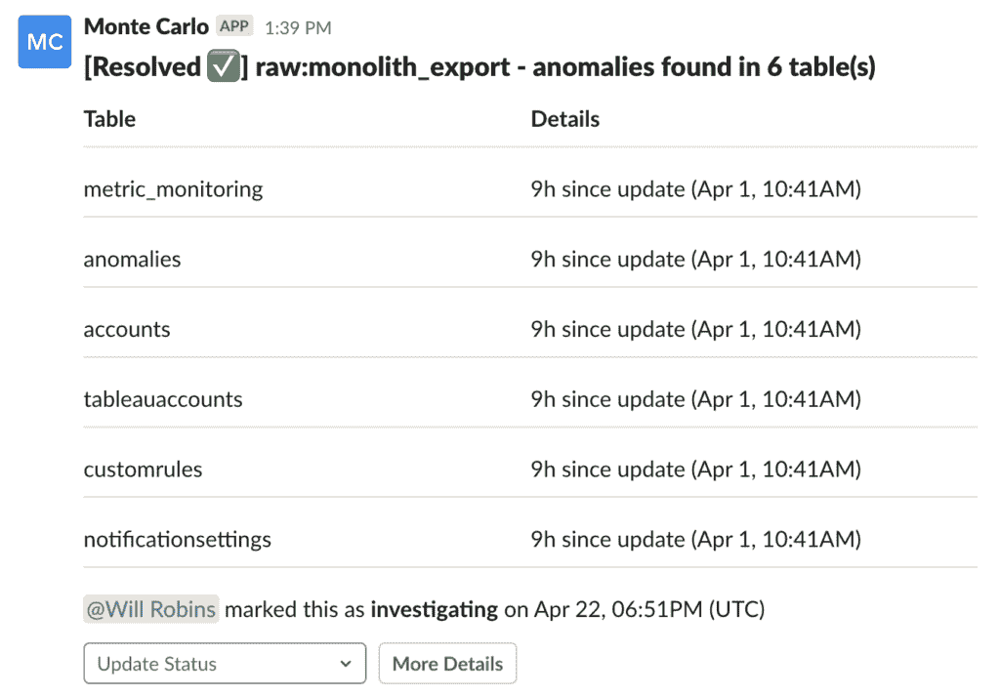
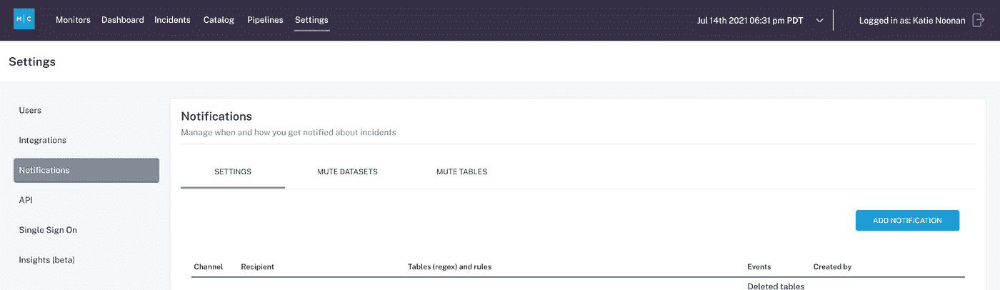
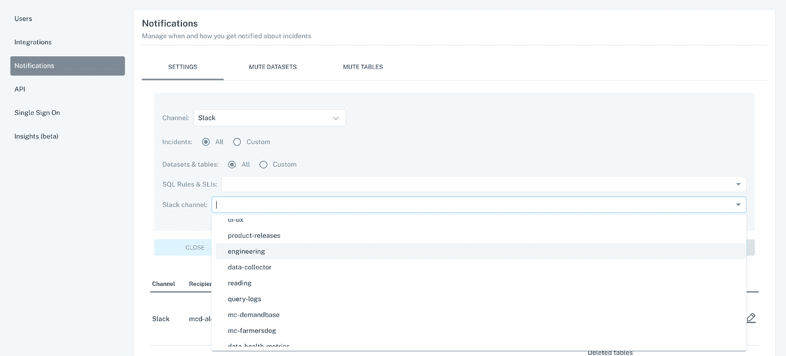
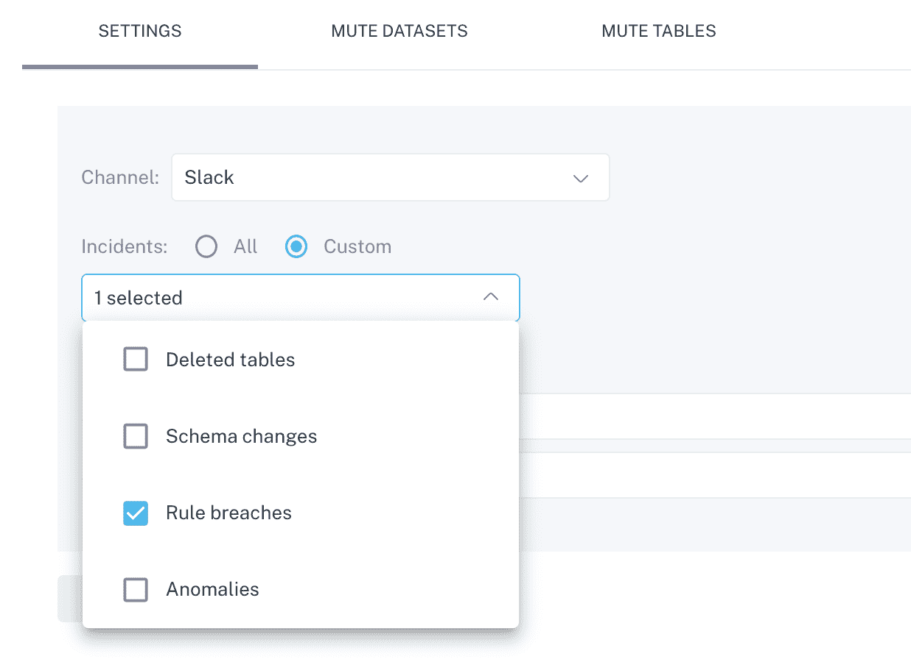
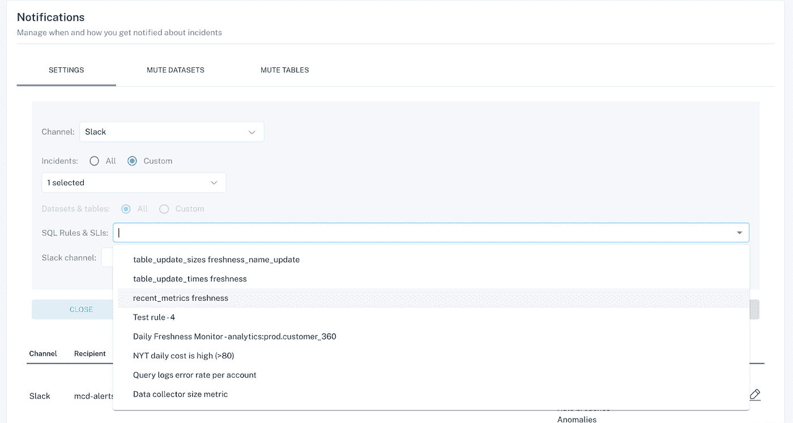
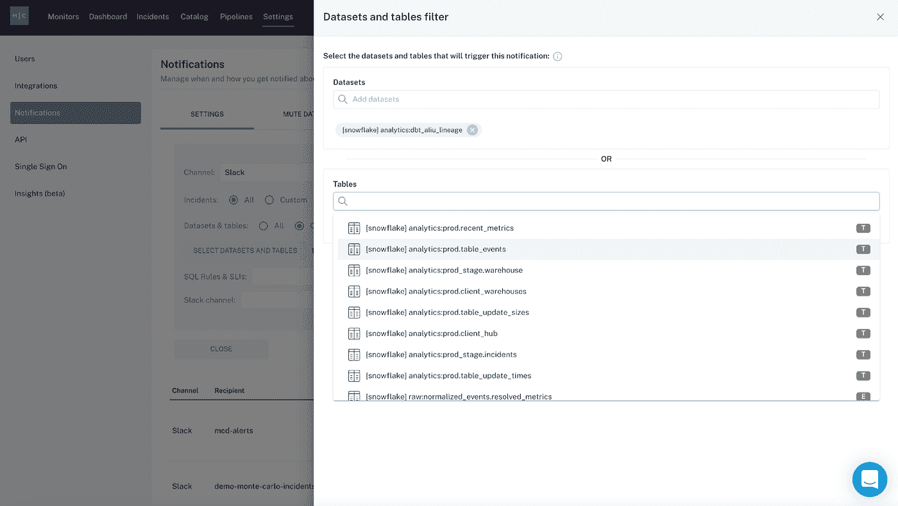

# 针对数据管道的事件检测和警报

> 原文：<https://towardsdatascience.com/getting-started-anomaly-detection-and-alerting-for-your-data-pipelines-f7be9a01f764?source=collection_archive---------15----------------------->

## 入门指南

## 如何设置端到端检测和警报，以识别和防止数据中的无声错误。

图片由 [Unsplash](http://www.unsplash.com) 上的[约翰·施诺布里奇](https://unsplash.com/photos/FlPc9_VocJ4)提供。

***数据管道断了？仪表盘不靠谱？关键报告中有太多的空值？***

***要获得可靠准确的数据，测试和断路器只能帮你到此为止。在我们最新的系列中，我们重点介绍了数据团队如何为他们的生产数据管道建立*** [***端到端事件管理工作流***](https://www.montecarlodata.com/how-to-conduct-incident-management-on-your-data-pipelines/) ***，包括事件检测、响应、根本原因分析&解决方案(RCA)和无可指责的事后分析。***

***在这篇客座博文中，蒙特卡洛的*** [***斯科特·奥利里***](https://www.linkedin.com/in/scott-o-leary-78000a43/) ***带我们了解如何开始事件检测和警报，您防御*** [***数据宕机的第一道防线***](/the-rise-of-data-downtime-841650cedfd5) ***。***

随着公司越来越依赖数据来推动决策，对数据准确性和可靠性的要求也越来越高。随着越来越多的数据进入您的数据生态系统，出错的可能性只会增加，每年会给组织造成超过[1200 万美元的损失](https://www.gartner.com/smarterwithgartner/how-to-improve-your-data-quality/?source=BLD-200123&utm_medium=social&utm_source=bambu&utm_campaign=SM_GB_YOY_GTR_SOC_BU1_SM-BA-SWG)，更不用说宝贵的时间和利益相关方的信任了。

几十年来，软件工程和 DevOps 团队一直依靠**一个** [**多步骤过程**](https://sre.google/sre-book/managing-incidents/) 来识别、分类、解决和防止软件和操作问题影响他们的应用程序。随着数据操作的成熟，是时候我们以同样的勤奋对待 [**数据停机**](https://www.montecarlodata.com/the-rise-of-data-downtime/) 了，换句话说，就是数据丢失、不准确或其他错误的时间段，尤其是在构建更可靠、更有弹性的数据系统时。

> **第一步？**事件检测和警报，这是您抵御数据管道中断和管理人员不可避免的清晨 pings 的第一道防线(“为什么数据是错的？”)和利益相关者(“这个仪表板怎么了？”)当管道破裂时。

有了正确的流程、技术和文化，您的数据团队就可以建立一个协作、高效的工作流，用于识别、补救和防止问题消耗太多宝贵的时间和精力，并侵蚀组织其他部门对数据的信任。

# 第一步。撰写您的数据事件操作手册

在您能够检测到事件之前，您需要建立流程并开发良好的(足够的)文档来传达职责、角色，以及在您确实收到可怕的松弛消息或寻呼责任通知时的清晰前进路径。引用本杰明·富兰克林的一句话，“未能计划就是计划失败”，当涉及到管理数据管道中的 [**未知的未知**](https://www.montecarlodata.com/the-new-rules-of-data-quality/) 时，这句话当然适用。

无论您为数据管道设置了多少测试，事故都是必然会发生的，当问题出现时，有一个适当的计划将有助于您。就像 [**站点可靠性工程师(SREs)**](https://sre.google/) 在应用程序中断时使用运行手册一样，现代数据工程师也应该为管道中断制定计划。

至少，我建议您使用以下操作手册地址:

1.  ***您的组织认为什么是数据事件？*** 这可以让你的团队确定这是否是你应该担心的事情。也许数据事件可以通过重新启动 Airflow DAG 来解决，或者也许您需要提交一个票证，以便与数据团队的其他成员一起更深入地研究这个问题。无论哪种方式，确定什么是真正的事件，什么可以不优先考虑或忽略有助于减少噪音和保持您的团队专注。
2.  ***发生数据事件时，谁会收到警报？这因组织而异，所以你需要找出最适合你的团队的方式。一些团队指派一个人负责所有数据事件，作为第一道防线，而其他团队则有一个数据工程团队负责数据的新鲜度和数量，还有一个分析团队负责验证数据。为特定类型的事件甚至某个事件的特定方面分配所有权，将在今后带来回报，提高您的团队合作和识别问题根源的能力。最佳实践是通过 PagerDuty、Slack、Opsgenie 和其他流行渠道将警报集成到数据工程工作流中，因为这可以确保所有数据利益相关方和最终用户在出现问题时收到警报。***
3.  ***您将如何向利益相关者和最终用户传达该事件？*** 一些组织对此采取了直接的方法，向团队特定的渠道发送事件通知(如影响重要营销仪表板的事件的 Slack 渠道)。其他组织在数据工程团队中保持第一道防线，并且只有当问题很明显是“真实的”并且确实影响到下游数据消费者时才提醒风险承担者。无论采用哪种方法，关键是您的第一道防线是技术性的，足以在您的数据环境背景下理解事件，并且足够了解业务背景和问题的影响。选中这两个框非常有帮助，因为它减少了来回沟通问题的技术范围和业务影响所需的时间。

# 第二步。检测数据事件

图片由蒙特卡洛提供。

当数据管道中断时，第一步是事件检测。

不言而喻，您应该在数据进入生产之前[测试您的数据](https://www.montecarlodata.com/the-new-rules-of-data-quality/)并捕捉已知的未知，换句话说，您可以在特定阈值范围内预测的问题。

然而，测试和其他断路器方法在检测生产中无法预测或解释的事件时会让数据团队失败— [***未知的未知***](/the-new-rules-of-data-quality-5e4fdecb9618) 。因此，测试数据并不能提供真正的端到端可观察性，而这对于数据驱动的业务来说是必要的。随着数据管道变得越来越复杂，对于试运行和生产，未知的未知数只会增加。

这就是为什么数据需要**测试和** [**可观测性**](https://www.montecarlodata.com/what-is-data-observability/) 来确保端到端的可靠性。现代数据团队必须将数据视为一个动态的、不断变化的实体，不仅要应用于严格的测试，还要应用于持续的数据可观察性。借助数据可观察性，可以通过自动 [**数据监控和警报**](https://www.montecarlodata.com/the-26-things-your-data-observability-platform-must-do/) 来检测问题，并基于 ML 生成的或自定义设置的阈值来触发问题。

数据可观察性的一个重要方面是[异常检测](https://www.montecarlodata.com/what-is-data-observability/)，它允许组织确定[数据健康](https://www.montecarlodata.com/introducing-the-5-pillars-of-data-observability/)的支柱(即，容量、新鲜度、模式和分布)何时不符合生产中的预期。与仅在数据平台的一两层中实施相比，端到端实施异常检测(例如跨您的仓库、湖泊、ETL 和 BI 工具)对企业来说是有价值的。这样做可以让您的团队全面了解组织的数据健康状况，因此如果出现问题，您的团队会第一个知道并解决。

# 第三步。为关键数据事件设置警报工作流

如果一条管道破裂，而周围没有人听到，那它真的破裂了吗？

> 2021 年，当数据驱动着您公司做出的几乎每一个关键决策，并影响到整个组织的团队时，答案是响亮的“是”。

玩笑归玩笑，当出现问题时，你的团队应该得到提醒，而不是花费几个小时甚至几天来手动调查问题。在您设置警报之前，您的团队应该建立考虑事件的基本规则，谁应该接收特定类型的警报，以及接收警报的最佳位置。这些指导方针和流程应该记录在您团队的操作手册中。

写完操作手册后，团队应该考虑实施支持机器学习的解决方案(如[数据可观察性平台](https://www.montecarlodata.com/what-is-data-observability/))，以根据历史数据自动生成警报，只需最少的提升即可启动并运行。警报可以直接发送到 Slack、email、PagerDuty、Opsgenie、Mattermost、webhooks 或您的团队用于管理沟通的任何其他渠道。

图片由蒙特卡洛提供。

许多团队选择为重要的表(如财务报告、产品统计、营销支出和运营指标)设置页面责任或 Opsgenie 通知，并为不太重要的表设置 Slack 或电子邮件通知。这样的通知可以让你的团队减少嘈杂的警报。

图片由蒙特卡洛提供。

接下来，选择要发送到此通道的事件。默认情况下，您可以路由所有事件，也可以选择自定义选项，例如，只路由特定表或报告的自定义规则违规。

图片由蒙特卡洛提供。

如果您选择违规，团队可以将所有或部分违规发送至特定渠道:

图片由蒙特卡洛提供。

最后，您可以选择一个客户过滤器来缩小要通知的数据集或表的范围:

图片由蒙特卡洛提供。

虽然数据可观察性有助于基于数据中的历史模式开箱即用的自动端到端异常检测，但一些团队选择基于特定业务需求设置自定义警报。随着贵公司数据战略的成熟，我建议两者都加以利用。

# 建立数据信任文化

建立一流的事件管理实践不仅需要正确的工具，还需要整体的方法来减少噪音、区分关键资产的优先级、解决隐性错误，最重要的是，促进整个公司内更轻松的协作。

破裂的数据管道可能不会发出声音，但它们的影响可能强大到足以砍倒比喻意义上的树。

*在我们的事件管理系列的第二部分，我们将分享我们在响应数据事件方面的最佳实践和经验教训。*

***有兴趣了解有关使用蒙特卡洛为您的数据团队建立可靠的事故管理流程的更多信息吗？伸出手去*** [***斯科特***](https://www.linkedin.com/in/scott-o-leary-78000a43) ***和*** [***我们团队的其他人***](https://www.montecarlodata.com/request-a-demo/) ***！***