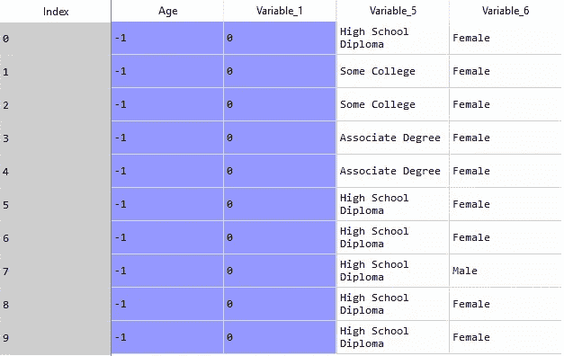
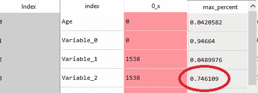
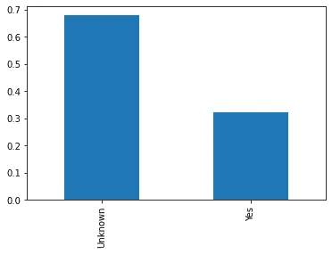
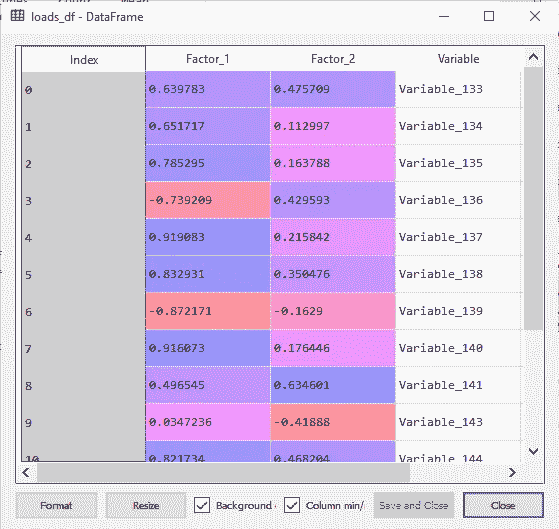

# 开始学习数据科学意味着首先清理您的数据

> 原文：<https://towardsdatascience.com/getting-started-in-data-science-means-cleaning-up-your-data-act-first-6326bcf4f33b?source=collection_archive---------21----------------------->

## [入门](https://towardsdatascience.com/tagged/getting-started)

## 用于减少数据混乱的探索性数据分析(EDA)工作流


图片由[迈克尔·施瓦森伯格](https://pixabay.com/users/blickpixel-52945/?utm_source=link-attribution&utm_medium=referral&utm_campaign=image&utm_content=568039)从[皮克斯拜](https://pixabay.com/?utm_source=link-attribution&utm_medium=referral&utm_campaign=image&utm_content=568039)拍摄

在阿姆主演的电影 *8 Mile* 中，歌曲 [*Lose Yourself*](https://www.stlyrics.com/lyrics/8mile/loseyourself.htm) 抓住了电影的整体构思。你知道我指的是哪一个。像这样开始的那个…

> “他手心出汗，膝盖发软，手臂沉重。
> 
> 他的毛衣上已经有呕吐物了，妈妈做的意大利面。
> 
> 他很紧张，但表面上看起来很平静，准备好了”

是的，这就是我在新工作中第一次坐在我的新房间时的感觉。铭牌上贴着令人垂涎的头衔“数据科学家”看起来很自信，但是感觉…嗯…紧张。

有点戏剧性？也许吧。

但是这种感觉和我的经理给我第一个项目任务时的感觉一点也不一样。

> “嘿布兰登。欢迎来到公司。您现在会开发我们的企业微细分模型吗？有你加入，每个人都很兴奋。再见了。”

我从紧张到害怕。我的手心不只是出汗，而是湿透了。为什么我会如此紧张？嗯，这里只是几个原因。

第一，我生活在学术界回归模型的世界里。我以前从未用聚类分析对数据建模，聚类分析对于细分是必要的。是的，我知道…完全没有…说真的，我是怎么得到这份工作的？

第二，也是这里最重要的一点，我得到了一个相当于 SELECT * FROM TABLE_A，TABLE_B，TABLE_C 内部连接 blah，blah，blah 的数据集，它包含 300 多万行和 200 多列。

当然，用 200 个变量建立一个有意义的聚类分析？对吗？我会在后面尖叫。

顺便提一句，如果你一直在关注我，你可能也知道我实际上试图一次分析 20 或 30 个东西，但很快发现这很痛苦，而且完全没有意义。

无论如何，如果不是因为下面的 EDA 技术，我可能还在研究那个问题。这个特定用例的主要目标是减少数据中可用的维度数量。

因此，我们希望评估每一列对于像这样的数据科学问题可能具有的潜在信息价值。因为模型是为了模拟数据中的变化而构建的，所以我们的大部分数据减少和清理都围绕着确定变量是否具有良好的变化。

在本文中，我将带您了解一个典型的 EDA 过程，该过程提供了一些常用工具，用于使用 Python 和 Pandas 执行数据简化。最终，这些工作使我们能够在数据科学生命周期的后期为更复杂的数据建模准备数据。我们开始吧！

在这里，我们使用一个常见的表格样式的数据集，包括行和列，来应用一系列重要的任务，帮助我们更深入地理解数据中不同列的潜在价值。

# 步骤 0:加载数据

这看起来很简单，但是在进行数据分析时需要考虑的一件事是将所需的数据加载到内存中的重要性。因为我们使用的计算机容量有限，所以确保我们的系统大小适合数据分析非常重要。

如果处理的数据对于您的系统内存来说太大了，那么使用向下采样来抽取数据的随机样本或者利用本文[这里](/what-to-do-when-your-data-is-too-big-for-your-memory-65c84c600585)中详细介绍的其他技术是很重要的。

```
import pandas as pd
import numpy as nppath = '/path/to/data/'
df = pd.read_csv(path+'data.csv')
```

下面是我们正在处理的数据的样子:



作者图片

# 步骤 1:信号

一旦数据在内存中，我们需要元数据信号，使我们能够快速识别变量的信息值。初始清单应该包括检查每一列的数据类型。

我喜欢构建一个包含所有元数据信号的数据框架，让我能够快速识别有意义的变量。

在下面的代码中，我们首先创建一个数据帧，其中每一行都是原始数据帧中的一列。然后，我们的代码继续向这些变量添加不同的元数据信号，例如空值的数量、空值的百分比以及使用 describe()方法的描述性统计数据。以下是我们纳入元数据数据帧的完整信号列表:

> -变量名
> 
> -空值的数量
> 
> -空值百分比
> 
> -数据类型
> 
> -数数
> 
> -卑鄙
> 
> -标准偏差
> 
> -最小值
> 
> - 25%、50%和 75%四分位数
> 
> -最大值
> 
> -出现频率最高的变量的值
> 
> -该变量最频繁值出现的时间百分比

```
meta_df = df.isna().sum().reset_index()
meta_df['percent'] = meta_df[0]/len(df)
meta_df = pd.concat([meta_df, pd.DataFrame(df.dtypes, columns=['dtypes']).reset_index(drop=True)], axis=1)d = df.describe().T.reset_index()meta_df = meta_df.merge(d, on=['index'], how='left')vcs = [pd.DataFrame(df[x].value_counts(normalize=True)).T for x in 
 list(df.columns)]vcs= [pd.DataFrame((x.idxmax(axis=1), x.max(axis=1))).T.reset_index() for x in vcs if len(list(x.columns)) > 0]meta_df = meta_df.merge(pd.concat(vcs), on=['index'], how='left') meta_df.columns = ['index', '0_x', 'percent', 'dtypes', 'count', 'mean', 'std', 'min', '25%', '50%', '75%', 'max', 'max_value','max_percent']
```

一旦我们的元数据 dataframe 构建完成，我们就可以构建一个函数，其中包含一系列规则，用于确定任何变量是否可能是坏的。

第一个规则确保至少有一些可变性，因此我们寻找标准偏差等于 0 的任何列。

第二个规则确保数据的某种分布，因此我们比较四分位数以确保它们不都等于相同的值。

根据这个建议[这里](https://www.ncbi.nlm.nih.gov/pmc/articles/PMC3701793/#:~:text=Proportion%20of%20missing%20data,-The%20proportion%20of&text=For%20example%2C%20Schafer%20(%201999%20),10%25%20of%20data%20are%20missing)，下一个规则标记具有超过 10%空值的变量。类似地，我们也标记那些出现频率超过 80%的单值变量。

最后，如果没有最大值，我们也标记变量，这意味着变量没有值。显然，这些规则可以根据不同的值或信号来定制。

```
def bad_flag(row):
    if row['std'] == 0:
        return True
    elif (row['25%'] == row['50%']) and (row['50%'] == row['75%']):
        return True
    elif row['percent'] > .10:
        return True
    elif row['max_percent'] > .80:
        return True
    elif pd.isnull(row['max_percent']):
        return True
    else:
        return False

meta_df['bad_var'] = meta_df.apply(lambda r: bad_flag(r), axis=1)
```

现在我们已经有了自己的标志，下一步是从主数据帧中删除那些变量。为此，我们列出了“bad_var”值设置为 NOT True(！idspnonenote)的列名。=).接下来，我们用一个新的 dataframe 替换我们的 dataframe，该 data frame 此时只包含感兴趣的列。

```
keep = (meta_df['index'].loc[meta_df['bad_var'] != True]).tolist()df = df[keep]
```

我们表现如何？我们从 150 个变量开始，现在减少到 113 个，我们已经能够从数据框架中删除 37 列。

# 第二步:可视化

上面的步骤很快也很容易完成，因为我们依靠数字表示来帮助评估每个变量的可变性程度。对于一些变量，我们可能仍然不确定它们的信息价值。

例如，有些变量在 70%的行中只有一个值。如果只有两个选项，这可能没问题，但是如果有两个以上的选项，则剩余值的可变性可能不足以对模型有用。在这些情况下，使用数据的可视化表示可以帮助我们进一步决定保留什么，去掉什么。

第一步是查看我们的元数据数据帧，检查任何异常或可疑的东西。例如，我们的一个变量有超过 75%的行被标记为“未知”



作者图片

让我们看看这个变量的条形图:



作者图片

根据条形图，变量“Variable_2”有两个值，“未知”和“是”在这种情况下，不清楚“未知”值和“是”值之间的差异意味着什么(一些“未知”可能是“是”)，因此我们可以决定消除这个变量。

我们对数据的直观检查揭示的其他观察结果包括“年龄”被默认值“-1”填充，并且相当多的变量具有“未知”的值。虽然对特征工程的正确处理超出了本文的范围，但是这些额外的观察表明需要对特征进行额外的工程处理，以便为模型产生更多有用的数据。

当执行 EDA 以进行数据简化时，查看相关矩阵也可能是有用的，因为一些变量可能高度相关，以至于表明它们本质上是相同的变量，因此可以从分析中移除一个或多个变量。换句话说，变量没有给模型增加任何独特的东西。

快速目视检查将生成热图。要做到这一点，你需要做的就是遵循代码[这里](https://seaborn.pydata.org/examples/many_pairwise_correlations.html)。这是我们使用相同代码的热图:


作者图片

例如，在 Variable _ 30-Variable _ 50 范围内似乎有一大块变量具有非常高的相关性，保留这些变量可能没有用。

在下面的代码块中，我们更深入地研究了相关性矩阵，只提取了那些相关性高于. 90 的变量。

```
high_corrs = corr[corr.iloc[:,:] > .90]
meta_corr = high_corrs.isna().sum().reset_index()
potential_drops = meta_corr.loc[(meta_corr[0] < meta_corr[0].mode()[0])]
```

从这里开始，由数据科学家来评估这些变量中哪些应该删除，哪些应该保留。

# 第三步:降维

如果在执行上述步骤后，我们仍然发现自己有太多的变量，EDA 的最后一点是使用探索性因子分析或主成分分析，这对于减少变量的数量同时仍然保持其潜在的信息价值是有用的。这些分析类似于我们在步骤 2 中生成的关联热图，但更进一步，寻找相关变量组，而不是简单的双变量关联。

因子分析帮助我们识别变量是否有足够的方差，我们可以做两件事情中的一件；将它们组合成它们平均值的一个指数(探索性因子分析)或者只关注一个因子中最重要的变量而忽略其余的(主成分分析)。你可以利用因子分析的结果做更多的事情，但这是我在野外处理数据时最常做的两件事。

虽然这些技术通常被认为是“无监督的”，因为我们允许算法识别数据的自然分组，但现实是数据科学家必须在执行分析之前应用一些有意义的框架来分组数据。

我说的有意义的框架是什么意思？

例如，假设一组变量代表健康的不同方面，而其他变量是来自客户满意度调查的项目。寻找跨越这两个独立数据领域的因素并没有多大意义。因此，我经常发现执行聚类分析的多次迭代来识别可能确实有自然分组的数据的自然分组更有用。

在下面的代码中，我们通过对我们一直在使用的演示数据集执行示例因子分析来完成我们的数据缩减。代码是从这个伟大的因子分析教程[这里](https://www.datacamp.com/community/tutorials/introduction-factor-analysis)派生出来的，并应用于我们的数据。以下是对相关步骤的简要概述:

> 首先，我们列出想要包含的特定列。
> 
> 其次，我们执行充分性测试，以确保因子分析对于给定的数据是可行的。请注意，我们正在寻找小于 0.05 的 p 值，这表明相关矩阵不是单位矩阵。
> 
> 第三，我们进行因子分析。
> 
> 第四，我们可视化特征值，并在图中寻找“肘”，以帮助我们决定我们的模型应该包括多少因素。
> 
> 接下来，我们重新进行因子分析，并根据我们的“肘”图分析设置因子的数量。
> 
> 最后，我们提取因子负载并查看它们，以确定我们可能希望如何组合我们的变量。

```
#subset our dataframe to focus only on domain relevant variables
df_fac = df.iloc[:,98:]import pandas as pd
from factor_analyzer import FactorAnalyzer
import matplotlib.pyplot as pltfrom factor_analyzer.factor_analyzer import calculate_bartlett_sphericity#df_fac from optum_data_segmentation.py
df_fac = df_fac.dropna()chi_square_value,p_value=calculate_bartlett_sphericity(df_fac)
chi_square_value, p_value# Create factor analysis object and perform factor analysis
fa = FactorAnalyzer()
fa.fit(df_fac)
# Check Eigenvalues
ev, v = fa.get_eigenvalues()
ev# Create scree plot using matplotlib
plt.scatter(range(1,df_fac.shape[1]+1),ev)
plt.plot(range(1,df_fac.shape[1]+1),ev)
plt.title('Scree Plot')
plt.xlabel('Factors')
plt.ylabel('Eigenvalue')
plt.grid()
plt.show()# Create factor analysis object and perform factor analysis
fa = FactorAnalyzer()
fa.set_params(n_factors=2, rotation="varimax")
fa.fit(df_fac)loads = pd.DataFrame(fa.loadings_)
loads_df = pd.concat([loads, pd.DataFrame(list(df_fac.columns))], axis=1)
loads_df.columns = ['Factor_1','Factor_2','Variable']
```

以下是“负载 _df”数据帧的样子:



作者图片

在因子负荷的输出中，我们看到大多数变量对因子 1 的负荷比因子 2 重。也就是说，我们看到“变量 _141”和“变量 _143”在因子 2 上的负载更重。

从这一点来看，降维的下一步是通过平均每个因子上加载的变量来为每个因子创建指数。

例如，如果我们想使用“变量 _141”和“变量 _143”为因子 2 创建一个索引，我们首先需要注意“变量 _143”有一个负负载。因此，在对“Variable_141”进行平均之前，我们需要对该变量进行反向编码。

反向编码的一个快速技巧是在平均之前将变量乘以-1。但是，请注意，只有当我们还打算在建模之前对数据进行规范化时，我们才会这样做(对于大多数数据科学模型，这是一个强烈推荐的过程)。

下面是创建因子 2 指数的一些示例代码:

```
df['Variable_143_R'] = -1*df['Variable_143']df['Factor2'] = df[['Variable_141','Variable_143_R']].mean()
```

我们的清洁行动现在需要 2 分钟

既然我们已经花时间减少了数据集中的维度数量，我们就准备将数据传递给更复杂的特征工程，并最终进行下游建模。

总共减少了 50%以上的可用数据，现在我的手心出汗少多了。所以我留给你们这个:

> “他最好去捕捉这一刻，并希望它不会错过”

前进！

比如参与学习数据科学、职业发展或糟糕的商业决策？[加入我](https://www.facebook.com/groups/thinkdatascience)。