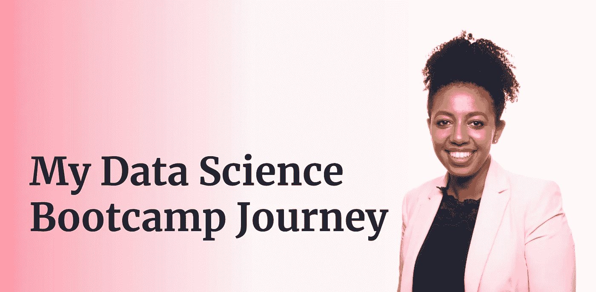
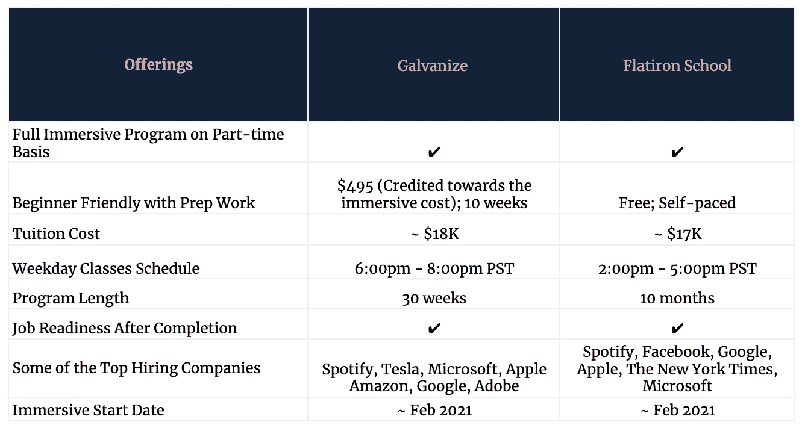
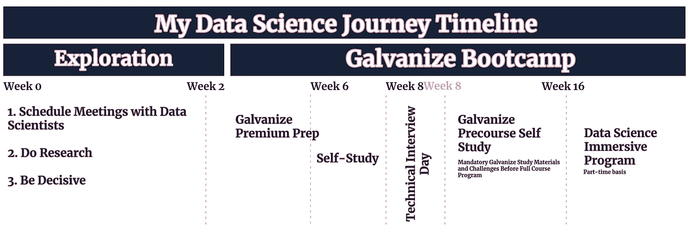

# Bootcamp 数据科学入门

> 原文：<https://towardsdatascience.com/getting-started-in-data-science-with-bootcamp-240df7e71fa5?source=collection_archive---------38----------------------->

## 将职业生涯转向数据科学指南

*我写这篇博客的目的是与任何正在考虑职业转型、感到不知从何开始、或在致力于他/她的数据科学职业转型时需要一点鼓励的读者分享我最近开始的数据科学之旅的故事。*

# 我的背景

我是 2016 年金融专业毕业，辅修数学的 SF 地区高级销售运营及策略分析师。我在一家小型精品投资银行起步，很快意识到这不是我理想的文化；这是一个竞争激烈的世界，这不符合我的个性。幸运的是(以及后来的数百份申请)，我进入了科技领域，在一家小型初创公司做业务运营和战略分析师。尽管我热爱我所做的工作、有趣的环境以及个人和职业发展机会，但在 2020 年 9 月，我开始探索其他领域，寻求新的挑战，以揭开我人生的下一个篇章。当然，更高的工资是另一个激励因素(没有废话)。

# 探索阶段

基于我的兴趣和愿望，我的潜在选择是软件工程或数据科学。在这之前的一年，我与一位令人印象深刻的同事进行了一次步行会议，他领导了一些有影响力的项目，对公司和行业有着深入的了解。他是数据科学的主管。我了解到他是从一个与金融相关的领域来到这个职位的。他给我的建议是从 SQL 开始，然后如果我对数据科学领域感兴趣，就继续学习 python。按照他的建议，我完成了 SQL，但是没有继续 python，因为公司正在进行收购，这是一个相当紧张的时期。因此，我自然倾向于进一步探索数据科学。

**行动和学习**

*   **安排与数据科学家的会面:**那时，我不知道从哪里开始，也不知道数据科学在日常和/或专业化方面需要什么。幸运的是，我利用工作之外和当前公司内部的关系，为数据科学家安排了这些会议，以回答我的迫切问题。最重要的是，他们中的一些人告诉我，甚至在我现在的公司也有一些同事是从训练营开始的，这个消息让我大吃一惊。
*   **做研究:**我对参加训练营和继续自学方向进行了高层次的成本效益分析。也许因为我是一个怀疑论者，我的大部分在线研究显示，人们对训练营持批评态度，这与我的面对面反馈相反。无论如何，我决定更加重视与我交谈的数据科学家，并继续进行训练营对比。在网上做了一些调查并打电话给他们的招生办公室收集信息后，我选择考虑的前两个是[镀锌](https://www.galvanize.com/data-science-bootcamp)和[熨斗](https://flatironschool.com/career-courses/data-science-bootcamp)。

作者图片

*   **果断点:**在评估了最适合我的环境后，我选择了“激励”。即使在那时，我意识到我几乎没有赶上最后一个优质预备班的截止日期，让你为 2 月份的数据科学沉浸式项目开始日期做好准备。如果你有足够的信息来帮助你做决定，我的建议是你赶快行动。

**不要和学习**

我做了所有这些不该做的事。事后意识到收益递减，我建议避开以下情况。

*   不要在分散注意力的活动上浪费时间:限制你的研究时间。分配的时间结束后，请集中精力学习构建您的数据科学知识的材料。花很多时间在 LinkedIn 上跟踪数据科学家，试图找到一种职业模式，不会让你接近你的职业。
*   **不要因为恐惧而放弃追求数据科学:**我会认为自己是一名好学生(聪明、学习快、勤奋)，但我记得编程的想法让我感到恐惧和不知所措。我当然不想暗示编码/数据科学很容易，当然不是。但我可以向你证明，只要你投入时间、精力和努力，你就能掌握各种看似令人生畏的概念。

# 持续的训练营体验

作者图片

回顾第一个 python 基础视频几乎让我流泪的时候，我觉得编码是我不明白的事情，这很有趣。但这就是训练营的用武之地…我从 Galvanize 的 premium prep 中获得的一个价值是信息合成。正如其他人提到的，所有入门的必要材料都可以在网上找到，而且很大一部分是免费的。有了像“激励”这样的项目，你可以获得清晰有序的学习材料和视频供你使用。当然还有专家资源供您使用！这帮助我轻松地浏览主题，更快地消化信息。讲师们和蔼可亲，富有思想，简直棒极了，其中一些人我会感激很久。我最喜欢的部分是老师故意给学生留下面包屑，以便更顺利地介绍下一章。

课程是截止日期驱动的；这对培养责任感意义重大。很快，我发现了大多数概念的浩瀚。你可以花无数个小时深入钻研，成为一名主题专家。对于像我这样的初学者来说，我发现花更多的时间去理解基本概念，以及学习正确的时机去学习另一个同样重要的科目来接受全面的教育是非常重要的。考虑到数据科学的广度和深度，如果没有激励，我自己是无法高效完成这项工作的。尊重那些有抱负的数据科学家选择自学的路线来完成自己的事业！

# 查看到目前为止涵盖的主题

*   简介/中级 Python
*   统计学导论
*   Unix 介绍，Git/Github
*   熊猫，熊猫，噢
*   积分学、微分学、线性代数
*   结构化查询语言

# 离别的思绪

如果你能从我的故事中得到什么(在我下一次更新之前)，这些是我希望你留下的:

*   努力做到最好！不后悔。
*   一步一步来！重要的是不要感到不知所措和沮丧。
*   每个人的人生道路都不一样；接受并拥抱你是独一无二的。

感谢您的阅读！