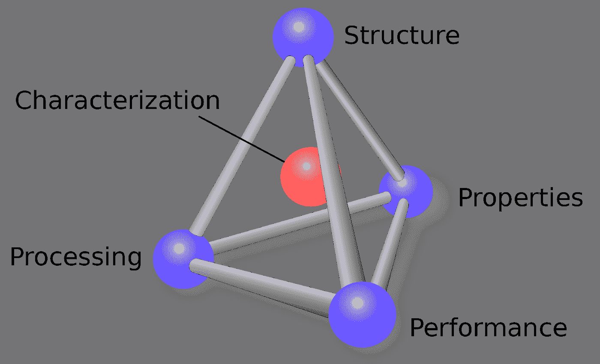

# 材料信息学入门

> 原文：<https://towardsdatascience.com/getting-started-in-materials-informatics-41ee34d5ccfe?source=collection_archive---------23----------------------->

## *如何开始研究材料信息学(数据科学+材料科学)*

*用数据科学理解材料中的结构-性能-性能-加工关系。来自维基共享。*

*在这篇文章中，我分享了参与材料信息学研究的资源和建议。随着发现和设计新材料以应对一些最紧迫的全球性挑战(人类健康、食品和水安全、气候等)变得越来越昂贵和耗时。)，我们需要拥有科学领域专业知识和数据科学培训的材料科学家。无论你是想在自己的研究中使用数据科学，还是只是想更好地了解该领域的发展状况，这篇文章都会帮助你。*

我在 GitHub 上分享了一个[资源列表](https://github.com/ncfrey/resources)，用于材料信息学入门。该列表包括论文和交互式教程、有用的 Python 库、博客、时事通讯、播客、数据库和学术材料信息学研究小组。

**什么是材料信息学？**

信息学是转换信息(数据)的科学。从某种意义上说，所有的材料科学都涉及信息学，因为所有的材料科学都是建立在数据和解释数据的理论之上的。“材料信息学”，我们特指被现代数据科学所超越的材料科学。这让我们能够[加速材料属性预测](https://www.nature.com/articles/d41586-020-03259-4)，在可能的材料空间中进行系统搜索[以发现具有优化属性的化合物](https://www.annualreviews.org/doi/10.1146/annurev-matsci-090319-010954)，甚至[根据我们想要的属性设计新材料](https://newscenter.lbl.gov/2020/12/02/a-machine-learning-solution-for-designing-materials-with-desired-optical-properties/)。

实验科学家可以使用材料信息学来[减少他们在实验室中进行反复试验的时间和精力](https://www.sciencedaily.com/releases/2020/03/200310114711.htm);而计算科学家和理论家可以提供更好的[指导，告诉他们制造什么材料](https://pubs.acs.org/doi/abs/10.1021/acsnano.8b08014)、[如何制造](https://www.nature.com/articles/s41524-017-0055-6)，以及[如何理解它们的属性](https://pubs.acs.org/doi/abs/10.1021/acsnano.0c05267)。你对数据科学和机器学习了解得越多，就越清楚这些是高效科学的工具，而不是科学家和科学思维的替代品。

**先决条件**

*数据科学先决条件:眼镜、大量显示器、夜间模式文本编辑器。来自 Unsplash。*

我假设感兴趣的读者已经在材料科学的某些领域工作:纳米材料、聚合物、冶金、生物材料或量子材料。要进行材料信息学的研究(或培养对材料信息学的欣赏)，你需要从数据科学的基础开始:[统计学](/theoretical-foundations-of-data-science-should-i-care-or-simply-focus-on-hands-on-skills-c53fb0caba66)，一种科学计算语言，如 Python 或 Julia，具有相关的数值计算能力和数据结构，机器学习，以及用数据讲故事(可视化)。

好消息是，如果你是一名科学家，你可能有很多必要的背景。更好的消息是，现在是学习数据科学的最佳时机——有大量免费课程、教程和博客可供学习。从某些方面来说，最具挑战性的事情可能是筛选所有这些资源并找到最好的。有大量的[数据科学入门指南](/how-to-get-started-in-data-science-af865b3d5231)。

根据你的学习风格，你可能想从自下而上的方法开始，从头开始阅读教科书和实施方法，或者从自上而下的方法开始，在你自己的研究中选择一个有趣的问题或者从 [Kaggle](https://www.kaggle.com/) 中选择一个简单的问题，然后开始破解，边做边学。

**进入兔子洞**

如果你想对材料信息学有一个简单的技术介绍，你可以从这里列出的资源开始。从材料信息学的详细定义，到正式的最佳实践、交互式教程和为期三天的研讨会，这些资源将帮助您尽快入门。

如果你对这个领域感兴趣，无论是作为一名从业者还是一名不经意的观察者，这里有一些[博客、播客和时事通讯](https://github.com/ncfrey/resources#blogs-newsletters-and-podcasts)可以帮助你。

*图为:用材料信息学加强研究后的你。来自 Unsplash。*

**行业工具**

一旦你准备好开始自己的材料信息学研究，利用许多已经可用的令人惊叹的开源项目[会有所帮助。Python 是该领域的编程语言选择，Jupyter 笔记本环境是进行材料信息学的虚拟实验室。以这些工具为基础，有完整的软件生态系统来生成和分析计算的材料数据，建立机器学习管道来预测性能和设计新材料，可视化材料数据，并以机器可读的方式分享您的研究。](https://github.com/ncfrey/resources#python-tools)

努力实现的一个关键原则是确保您的数据是可查找、可访问、可互操作和可重用的(公平)。换句话说，让其他科学家更容易将你的数据用于材料信息学！幸运的是，有一些很棒的框架[可以让你的数据清晰可见，并以一种可以通过网络界面和 Python API 探索的方式分享。](https://github.com/ncfrey/resources#visualization-data-sharing-and-discovery)

**一切都是为了数据……**

数据科学的第一条戒律是“垃圾进，垃圾出”这一切都归结于获得带有某种信号的巨大数据源，处理它，并应用可用工具的瑞士军刀来提取一些见解。如果缺少第一步:高质量的数据源，任何机器学习方法都无法提供有意义的输出。世界各地的英雄们不辞辛苦地计算和测量了成千上万种材料的特性，并使这些数据在数据库中变得容易获取。

即使是现在，大多数耗费大量人力和资源生成的材料数据都被锁在 pdf 的图形、表格和文本中。有[正在努力](https://www.matscholar.com/)解析 pdf 并挖掘数据，但是你可以通过将你的数据贡献给数据库并使其公平，在你自己的研究小组和你的领域内产生直接影响。

**…还有问题**

数据科学的第零条戒律是“问正确的问题”数据科学不能告诉你你的研究方向应该是什么。科学家的主要工作仍然是弄清楚什么是最有趣的问题去询问和研究。希望通过使用[这些资源](https://github.com/ncfrey/resources)，你能更好地理解材料信息学能做什么和不能做什么。

**材料信息员**

为了帮助学生、博士后和教师找到所有在这个领域工作的优秀团队，我列出了一个简短的[材料信息学团队](https://github.com/ncfrey/resources/blob/main/groups.md)(排名不分先后)。这些小组专注于完全不同的材料科学领域，共同的主题是他们在某种程度上使用理论、计算和数据科学。如果您在材料信息学小组工作，并且希望被添加到列表中，[请告诉我](https://github.com/ncfrey/resources/blob/main/CONTRIBUTING.md)！

**欢迎投稿！**

我喜欢你的反馈！该资源列表并不全面，相反，它是我在自己的工作中发现的有用的东西的精选集合。我忽略了许多前沿方法(例如，量子机器学习、[等变神经网络](https://e3nn.org/))，因为它们还没有达到日常使用所需的成熟水平，也不太适合“入门”水平。如果有材料信息学资源的某些功能没有包含在列表中，请随意阅读[投稿指南](https://github.com/ncfrey/resources/blob/main/CONTRIBUTING.md)并与我分享。我还要感谢 Pat Walters 出色的[化学信息学资源列表](https://github.com/PatWalters/resources/blob/main/cheminformatics_resources.md)，它启发了这个列表。

**保持联系**

如果你喜欢这篇文章或者有任何问题，请随时通过[电子邮件](mailto:n.frey@seas.upenn.edu)联系我，或者通过 [LinkedIn](https://www.linkedin.com/in/ncfrey) 和 [Twitter](https://twitter.com/nc_frey) 与我联系。

完整的资源列表可以在 GitHub 的[这里](https://github.com/ncfrey/resources)找到。

你可以在[我的网站](https://ncfrey.github.io/)上找到更多关于我的项目和出版物的信息，或者只是阅读更多关于我的。