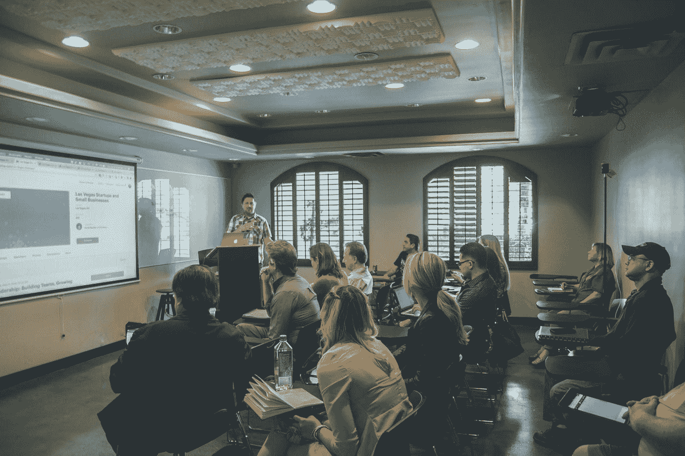
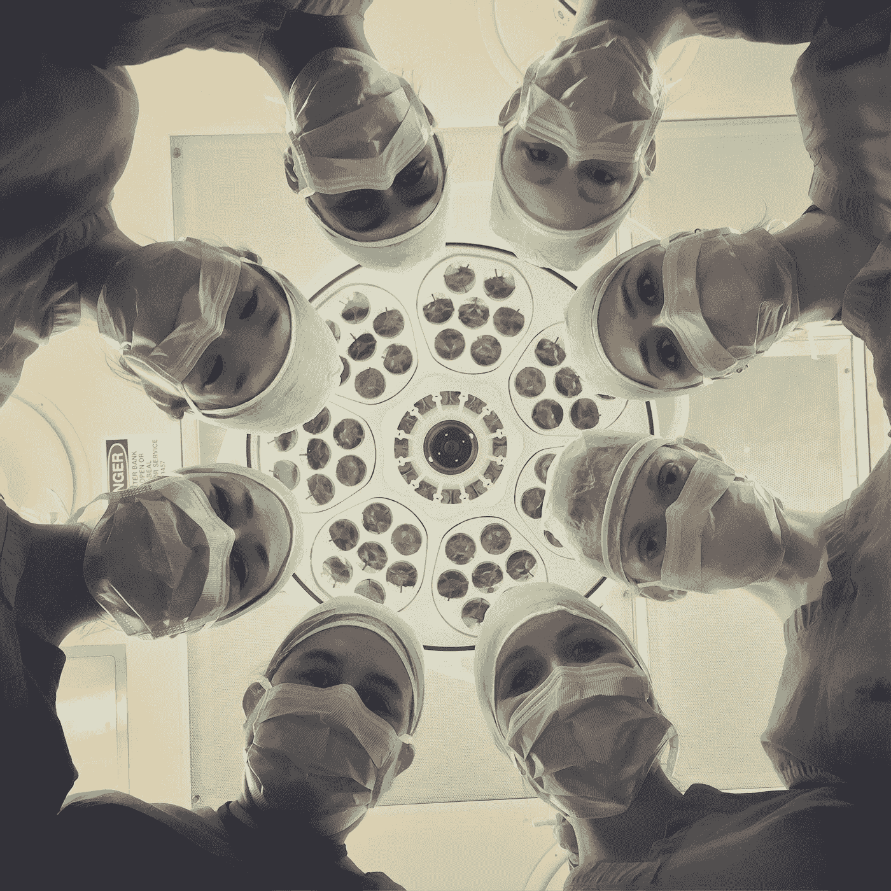

# 医疗人工智能入门

> 原文：<https://towardsdatascience.com/getting-started-in-medical-ai-93737bea5575?source=collection_archive---------14----------------------->

[国家癌症研究所](https://unsplash.com/@nci?utm_source=medium&utm_medium=referral)在 [Unsplash](https://unsplash.com?utm_source=medium&utm_medium=referral) 上拍摄的照片

## 临床医生在线学习资源指南

随着人工智能(AI)改变医疗实践，所有临床医生都将成为机器学习技术的用户，并将需要学习人工智能和机器学习的基础知识。当你计划升级你的机器学习知识时，你可能会对许多可用的教育选项感到困惑。

我最近完成了为期四个月的休假，在此期间，我调查了越来越多旨在建立人工智能知识和技能的教育课程、视频和书籍。以下是我基于那次经历的想法。

我已经按照职业轨迹组织了我的建议，从放射科医生和其他经验很少的医疗专业人员的基本资源开始，到任何具有强大技术背景和更雄心勃勃的目标的人的高级课程结束。你需要根据你的背景、经验和职业目标来定制你的道路。

# **放射学家和放射实习生**

照片由 [Unsplash](https://unsplash.com?utm_source=medium&utm_medium=referral) 上的 [NeONBRAND](https://unsplash.com/@neonbrand?utm_source=medium&utm_medium=referral) 拍摄

如果你对人工智能和机器学习完全陌生，那么通过 Coursera 在吴恩达的 deeplearning.ai 项目中提供的 [AI for Everyone](https://www.coursera.org/learn/ai-for-everyone) 课程，强调了为什么人工智能是如此多行业的焦点，而不仅仅是医疗保健。对于医疗保健特定的材料，您可以尝试由北美[放射学会](https://www.rsna.org/en/education/ai-resources-and-training/webinars) (RSNA，小额费用)、[医学成像信息学学会(SIIM)](https://siim.org/general/custom.asp?page=siim_webinars) 和[美国放射学院(ACR)](https://pages.acr.org/Informatics-E-Learning-Hub.html#module1) 提供的网络研讨会，以及由健康人工智能研究中心提供的研究研讨会、期刊俱乐部、小组讨论，包括[医学和成像人工智能中心(AIMI 中心)](https://aimi.stanford.edu/)的 YouTube 频道。

无论你是正在接受培训的放射科医师，还是经过委员会认证的放射科医师，由 RSNA 和 SIIM 赞助的[国家影像信息学课程(NIIC)](https://www.rsna.org/en/education/trainee-resources/national-imaging-informatics-curriculum-and-course) 都清晰地介绍了更广阔的信息学世界——结合录音和现场讲座，以及“翻转课堂”,使信息学名人和同学能够进行小组讨论。任何住院医师项目的受训者都可以参加这一课程，只需象征性的费用，但是住院医师需要说服他们的项目主管提供一个临床时间表的休息时间。训练有素的放射科医生也可以付费参加该课程。

如果你参加 RSNA 年会，我强烈推荐参观 [RSNA 的深度学习实验室](https://bit.ly/32hU1Lv)。在 90 分钟的初级班中，你将使用自己的笔记本电脑来构建和测试一个对医学图像进行分类的深度学习算法。这一简短的经历是对上述教学材料的完美补充，对于理解人工智能算法是如何构建的，包括陷阱是至关重要的。

# **研究合作者和实践领导者**

[国家癌症研究所](https://unsplash.com/@nci?utm_source=medium&utm_medium=referral)在 [Unsplash](https://unsplash.com?utm_source=medium&utm_medium=referral) 上拍摄的照片

你们中的一些人有雄心不仅仅成为一个有见识的人工智能用户。例如，你可能渴望成为你临床实践的人工智能领导者——协助决定采用机器学习算法，制定人工智能技术的实施和监控计划，并决定临床实践数据的管理政策。其他人可能会寻求成为领域专家和研究实验室的合作者，或者与行业合作伙伴一起开发机器学习技术。这些目标需要对神经网络和深度学习有更丰富的理解。

机器学习的基本技巧之一是将复杂的计算任务重新转换为一组矩阵运算。作为机器学习命脉的图形处理单元(GPU)通过快速的矩阵数学获得了它们的能力。如果你从来没有学过线性代数，或者像我一样，已经忘记了你所学的大部分内容，我建议你复习一下向量、矩阵、张量以及相关的数学运算。来自 3Blue1Brown 的[视觉导向的 YouTube 视频](https://www.youtube.com/playlist?list=PLZHQObOWTQDPD3MizzM2xVFitgF8hE_ab)对深度学习和神经网络所必需的矩阵运算给出了清晰的视觉解释。前 10 个视频以正常速度需要 90 分钟左右。

医疗保健专业的人工智能可以作为任何人的健康人工智能教育的基础。这门课程是在我休假快结束时发布的，但已经吸引了成千上万的学习者。专业化从健康经济学家劳伦斯·贝克(Laurence Baker)的[医疗保健介绍](https://www.coursera.org/learn/intro-to-healthcare?specialization=ai-healthcare)开始，他介绍了医疗保健系统的基本要素，重点是美国。即使你已经在美国医疗系统工作，本课程也将提供有用的健康政策复习。课程的一些元素与人工智能直接相关，例如对可能来自患者、提供商和中介的不同数据源的讨论。您可以决定本课程中的哪些主题最符合您的需求。

Nigam Shah 教授的第二个专业课程是关于健康数据的。我们如何找到正确的医疗保健数据来回答一个特定的问题？由于数据的收集方式，哪些偏见可能会影响数据？研究人员应该如何处理时态数据、缺失值和文本数据的问题？这些问题是用具体的例子来回答的，这些例子说明了像特征矩阵和知识图这样的概念。第 7 周的道德模块尤其及时。

第三个课程，[医疗保健机器学习基础](https://www.coursera.org/learn/fundamental-machine-learning-healthcare?specialization=ai-healthcare)，重点是机器学习方法。讲师 Matt Lungren 和 Serena Yeung 从基本术语和行话的定义开始。然后我们学习损失函数、梯度下降和其他关键概念，接着是过拟合和欠拟合以及其他对算法评估很重要的概念。关于机器学习陷阱的讲座，包括对因果关系、环境、信任和可解释性的讨论，是非常宝贵的。任何计划开始一个大型项目的人都应该密切关注第 6 周关于组建跨学科团队的材料。

第四门课程，由 Tina Hernandez-Boussard 主讲的[医疗保健中人工智能应用的评估](https://www.coursera.org/learn/evaluations-ai-applications-healthcare?specialization=ai-healthcare)，讨论了我们如何决定人工智能算法何时工作良好，包括效用和可行性的概念，以及对行动所需的前置时间的实际考虑。强调了实施过程中迭代和部署后监控的重要性。第 4 周提供了可能影响人工智能评估的偏见的广泛目录，并讨论了公平性、校准和透明度。监管的考虑和美国食品和药物管理局包括在内，这是一个全球监管图片的简短讨论。

由所有教师领导的顶级课程将所有材料联系在一起。

# **机器学习研究人员**

由[莱昂](https://unsplash.com/@myleon?utm_source=medium&utm_medium=referral)在 [Unsplash](https://unsplash.com?utm_source=medium&utm_medium=referral) 上拍摄的照片

任何想成为真正的数据科学家的人都应该学习基本的软件开发技能。python 是一种用于机器学习任务的流行语言，可以在网上的 [W3Schools](https://www.w3schools.com/python/) 、 [Codecademy](https://www.codecademy.com/learn/learn-python-3) 和许多其他地方找到优秀的互动课程。

为了学习医学成像的各种深度学习方法，RSNA 深度学习实验室的全系列实践课程涵盖了[图像分割](https://bit.ly/2UlhSHo)、[数据准备](http://archive.rsna.org/2019/19023416.html)和[生成对抗网络](http://archive.rsna.org/2019/19023419.html)。当你开始构建实用的深度学习模型时，你可以参考 [Brad Erickson 的魔术师之角](https://pubs.rsna.org/page/ai/magicians_corner)，这是*Radiology:Artificial Intelligence*杂志上的一系列文章，与 RSNA 深度学习实验室的课程平行，并提供系统设置的逐步指导。

[杰瑞米·霍华德的 fast.ai 课程](https://course.fast.ai/)是我个人最喜欢的课程，对于任何有很强技术背景但懂一点编程的人来说，它都是理想的资源。该课程采用自上而下的方法，从几行计算机代码开始，而不是建立详细的数学符号。第一课将指导你构建和测试你自己的深度学习模型。(我的能以 95%的准确率区分 37 种猫狗。)每一课都使用动手的方法来揭开深度学习的神秘面纱，Jupyter 笔记本中预先编写的代码可供您探索、修改和重用。没有抽象的定理或证明需要努力学习，但在课程结束时，你将知道如何阅读和理解任何深度学习论文的方法部分。

我没有花太多时间做练习，因为我是一个编程老手，现在主要管理项目而不是写代码。但这并没有影响我的学习。对于那些喜欢印刷版的人来说，杰里米刚刚与人合著了一本书，以同样的顺序提供了同样的材料。

吴恩达在 Coursera 上从 deeplearning.ai 推出的开创性和广受欢迎的[深度学习专业](https://www.deeplearning.ai/deep-learning-specialization/)是对 fast.ai 课程的一个很好的补充。Andrew 采用传统的自下而上的方法，从深度学习的基本概念的理论基础开始。他讲述了许多开创性的人工智能概念的历史和演变，介绍了标准符号，并强调了关键的参考资料。大量的练习提供了你所学的实际经验。我跳过了第三个课程，构造机器学习项目，因为我在这方面有经验，但其他人可能会发现它很有用。该系列的最后一门课程涵盖了序列模型，对于放射科医生和其他处理文本数据的临床医生来说将会特别有意义。它回顾了自然语言处理方法的当前进展，包括来自转换器的双向编码器表示(BERT)和其他转换器方法。像 fast.ai 一样，我发现整个课程很容易跟上，无需完成练习。此课程序列最近已更新。

# **参考资料**

照片由[苏珊 Q 尹](https://unsplash.com/@syinq?utm_source=medium&utm_medium=referral)在 [Unsplash](https://unsplash.com?utm_source=medium&utm_medium=referral)

对于真正的核心，一些学术文本为机器学习概念提供了大量的数学基础。古德费勒、本吉奥和库维尔的深度学习*在亚马逊有售[，在线](https://www.amazon.com/Deep-Learning-Adaptive-Computation-Machine/dp/0262035618/)[免费](http://www.deeplearningbook.org/)。*神经网络和深度学习*作者迈克尔·尼尔森，也可以在网上[免费获得](http://neuralnetworksanddeeplearning.com/)。这些资源不是为胆小的人准备的，但对于那些想在特定领域更深入研究的人来说，它们是有用的参考文本。*

我祝你在机器学习的事业上一切顺利！