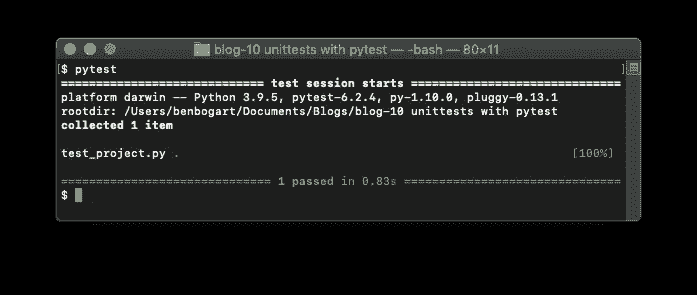
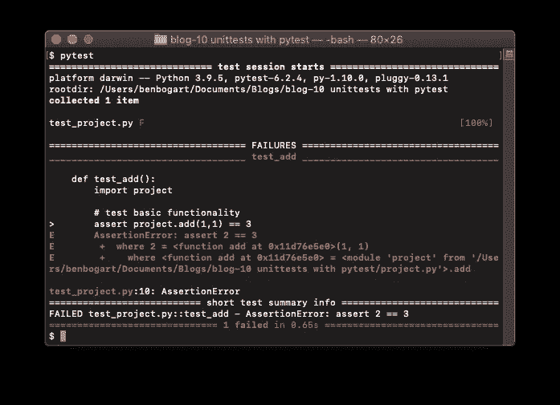
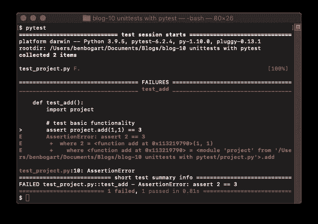
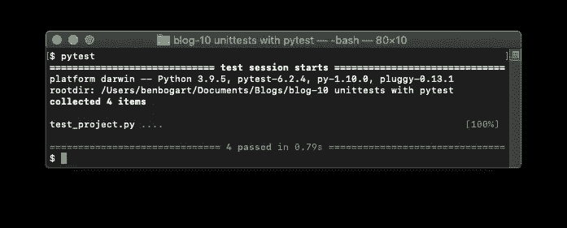
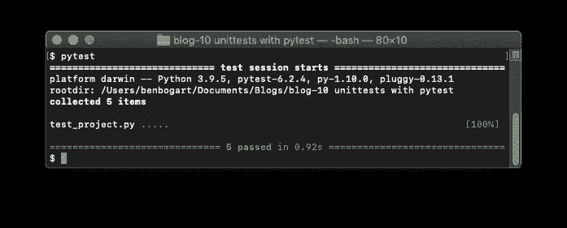

# Pytest 单元测试入门

> 原文：<https://towardsdatascience.com/getting-started-unit-testing-with-pytest-9cba6d366d61?source=collection_archive---------2----------------------->

## [入门](https://towardsdatascience.com/tagged/getting-started)

## 没有数据科学家认为他们需要的工具，除非他们知道。


[猎人哈利](https://unsplash.com/@hnhmarketing?utm_source=medium&utm_medium=referral)在 [Unsplash](https://unsplash.com?utm_source=medium&utm_medium=referral) 上拍摄的照片

本周，我在一个数据摄取管道上工作，该管道必须处理许多不同的数据场景。我们就说是政府数据，其他的你可以想象。我遇到了一个你可能很熟悉的问题。我开始更新我的函数来处理不同的数据清理场景，这破坏了以前的工作代码。在我的例子中，这些问题大多是在使用正则表达式解析文本时出现的。

此时，我意识到是时候进行单元测试了。为什么？因为单元测试正是为这个问题而设计的。您编写小的独立测试来确保您的代码按预期执行。每当您对代码进行更改时，您都可以轻松地运行这些测试，以确保您没有破坏任何东西，并且您可以继续添加测试，以确保对代码的新更改不会破坏您早已忘记的场景。

我不认为每个数据科学项目都需要单元测试。许多项目都很小，目标明确，因此测试是不必要的。但是一旦你开始编写一个需要维护的包，这是任何生产中使用的包，测试就变成了一个巨大的时间节省器。在这一点上值得注意的是，几乎所有最常见的数据科学包(包括`Pandas`、`NumPy`、`scikit-learn`和`matplotlib`都使用`pytest`作为他们的测试框架。

# pytest

Python 自带`unittest`，大多数情况下运行良好；然而，今天大多数开发者都在使用`pytest`。值得看一下这两个工具的文档，但是因为这是一个速成课程，我们将只看一下`pytest`和它的三个最常用的工具:

1.  基本断言测试
2.  参数化
3.  固定装置

这里使用的所有代码都可以在[这个 GitHub 库](https://github.com/benbogart/unittest-with-pytest)中找到。

让我们开始吃吧。

# 安装 pytest

要继续学习，您需要安装 pytest。在大多数系统上，您可以通过在命令行运行以下代码来实现这一点:

```
pip install pytest
```

# 基本断言测试

我们将从头开始。我们的第一个测试将测试一个简单的加法函数。我们将把这段代码放在一个名为`project.py`的文件中。

```
def add(a, b):
    return a + b
```

测试代码放在以`test_`为前缀的文件中。当我们运行测试时，`pytest`将执行一个发现过程。发现过程将递归扫描当前文件夹及其所有子文件夹，寻找以`test_`开头或以`_test`结尾的文件。Pytest 将运行位于这些文件中的测试。

现在我们知道我们需要一个前缀为`test_`的新文件。我们将在前缀后面添加我们正在编写测试的文件的名称。这给了我们一个文件名`test_project.py`。将以下内容添加到您的新测试文件中。

```
def test_add():
    import project # test basic functionality
    assert project.add(1,1) == 2 # try a border case
    assert project.add(-1,-1) == -2
```

注意**测试函数也带有前缀** `**test_**` **。**当 pytest 扫描我们的文件时，它将运行任何带有`test_`前缀的函数。

查看测试函数，我们可以看到实际的测试使用了`assert`关键字。如果`assert`后的表达式为真，功能将继续。如果`assert`后面的表达式为假，则`assert`将引发`AssertionError`。这将导致测试失败。

为了运行测试，我们进入命令行并键入`pytest`。



作者图片

如果我们的测试失败了会发生什么？让我们将第一个断言改为:

```
def test_add():
    import project # 1+1 != 3\. This will rais an AssertionError
    assert project.add(1,1) == **3**
```



作者图片

`pytest`不仅清楚地表明我们的测试失败了，而且通过向我们展示函数和测试失败的原因，它还告诉我们确切的位置！从底部开始检查这个结果，我们看到:

*   **失败的 test _ project . py::test _ add—assertion error:assert 2 = = 3**它告诉我们文件名、测试函数以及导致失败的原因。在这种情况下，我们的表达式(计算结果为 2 == 3)为假。
*   就在那上面，有一个“test_add”部分，以“**test _ project . py**:10:assertion error”结束。这告诉我们错误的文件和行号。
*   上面的一切给了我们错误的上下文，所以我们可以理解并快速修复我们遇到的任何问题。

注意，虽然有两个 assert 语句，但是 pytest 认为这只是一个测试，因为它们在同一个函数调用中运行。

让我们看看另一个涉及熊猫`DataFrame`的例子，它可能更像我们在数据科学工作流中看到的东西。

这是我们想要测试的函数。它向一个`DataFrame`添加一列。

```
def add_col(df, colname, coldata):

    # add a column to a DataFrame
    df[colname] = coldata
    return df
```

为了测试这一点，我们将:

*   在我们的`test_project.py`文件中创建另一个以`test_`开头的函数。
*   定义一个起点`DataFrame`。
*   定义我们的预期结果`DataFrame`。
*   通过调用 DataFrame 的`equals`方法，将使用`add_col`函数向起始`DataFrame`添加一列的结果与预期结果`DataFrame`进行比较。

```
def test_add_col():
    import project # start
    df = pd.DataFrame(
                    [[0, 1], [2, 3]],
                    index=['cat', 'dog'],
                    columns=['weight', 'height']) # expected
    df_expected = pd.DataFrame(
                       [[0, 1, 2], [2, 3, 2]],
                       index=['cat', 'dog'],
                       columns=['weight', 'height', 'n_ears']) # test the result
    assert project.add_col(df, 'n_ears', 2).equals(df_expected)
```

重新运行 pytest，我们可以看到我们的新测试通过了，但是之前的测试仍然失败。我们可以看到有多少测试失败了，有多少通过了。当其中一个测试失败时，测试不会停止；它运行我们所有的独立测试，并向我们报告每个测试的结果。



让我们通过在我们的`test_add`函数中修改这条线来恢复这条漂亮的绿线。

```
assert project.add(1,1) == 2
```


作者图片

是啊！

# 参数化测试

另一个在某些情况下有用的工具是用不同的参数调用测试函数的能力。我们将创建一个新的测试函数，一个减法函数。

```
def subtract(a, b):
    return a - b
```

在 pytest 中，参数化是通过一个装饰器来完成的，该装饰器定义了我们想要传递给测试函数的参数。让我们为使用不同参数的 subtract 函数定义一个测试。

```
# test parameterization
[@pytest](http://twitter.com/pytest).mark.parametrize("a,b,expected", [[2,1,1], [-1,1,-2]])
def test_subtract(a, b, expected):
     assert project.subtract(a,b) == expected
```

让我们仔细分析一下。装饰器告诉 pytest 将列表元素作为`a`、`b`和`expected`传递给下面的函数。它将为每个列表重复函数调用。

如果我们重新运行测试，我们会看到现在有 4 个测试，而不是 3 个。因为参数化多次调用测试函数，所以每个函数调用都算作一个单独的测试。



作者图片

# 固定装置

您可以想象，如果您要在同一个数据帧上测试许多执行不同任务的函数，那么在测试之间回收该起始数据帧会很方便。这就是固定装置的用途。

fixture 是一个带有特殊装饰器的函数，它创建一个资源并返回它。然后我们可以调用我们的测试函数，就像我们传入了那个资源一样。这有点违反直觉，但我认为一旦你看到它的作用，它就会有意义。

这是固定装置。

```
[@pytest](http://twitter.com/pytest).fixture()
def df():
     df = pd.DataFrame([[0, 1], [2, 3]],
                       index=['wallaby', 'kangaroo'],
                       columns=['weight', 'height'])return df
```

当我们调用我们的测试时，我们将在**中传递 fixture 函数**的名称。Pytest 将调用该函数，并将其返回值传递给我们的测试函数。

```
def test_add_col2(df): # expected
    df_expected = pd.DataFrame(
                       [[0, 1, 3], [2, 3, 5]],
                       index=['wallaby', 'kangaroo'],
                       columns=['weight', 'height', 'hop_height']) assert project.add_col(df, 
                           'hop_height',
                           [3,5]).equals(df_expected)
```

注意，我们定义了`test_add_col2`来将`df`作为参数。因为我们已经定义了一个名为`df`的 fixture 函数，pytest 将调用`df` fixture 函数并将结果传递给`test_add_col2`。

运行我们的测试，我们得到:



作者图片

# **包起来**

显然，使用 pytest 单元测试可以做更多的事情，但是在您了解所有这些东西之前，现在就开始做是值得的。当您看到拥有一套测试的力量时，无论您何时更改您的包，您都可以快速、轻松地运行这些测试，您还将体验到大量的时间节省。即使你还没有看到它的价值，如果你想为任何开源项目做贡献，你可能需要为你的贡献编写测试。

也就是说，不要觉得你需要立即为你所有的代码创建完整的测试套件；在大多数情况下，这是不切实际的。相反，当您开始对代码进行更改时，或者当项目的范围变得足够大而不总是清楚某个函数需要处理的所有情况时，可以考虑编写测试。

向前迈进，测试你的代码，把你的额外时间花在你的家人身上。

# 资源

*   [Pytest 文档](https://docs.pytest.org/)
*   [测试组织](https://pandas.pydata.org/docs/development/test_writing.html)从[贡献给熊猫](https://pandas.pydata.org/docs/development/contributing.html)
*   Aditya Sharma 的 Python 单元测试
*   [与 Python 的持续集成:简介](https://realpython.com/python-continuous-integration/)
*   [维基百科上的单元测试](https://en.wikipedia.org/wiki/Unit_testing)