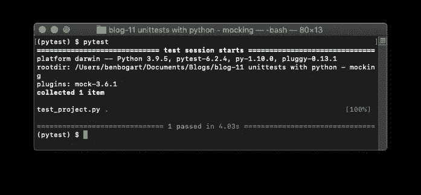
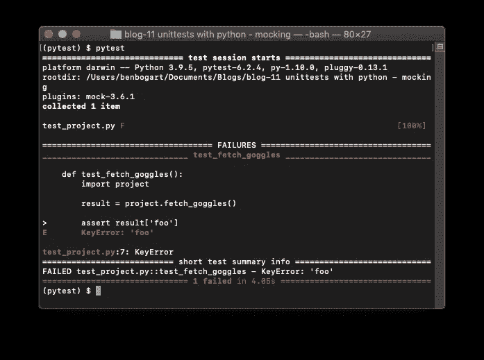
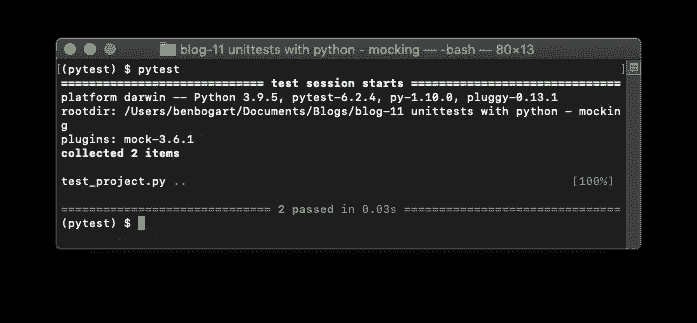

# Pytest 单元测试入门—第 2 部分

> 原文：<https://towardsdatascience.com/getting-started-unit-testing-with-pytest-part-2-4a7724b3ce72?source=collection_archive---------17----------------------->

## 制作一个单元测试的*模拟器-* y。


照片由[托德·夸肯布什](https://unsplash.com/@toddquackenbush?utm_source=medium&utm_medium=referral)在 [Unsplash](https://unsplash.com?utm_source=medium&utm_medium=referral) 拍摄

上周我写了关于[开始单元测试](/getting-started-unit-testing-with-pytest-9cba6d366d61)的文章。我们讨论了基本的断言测试、参数化、固定装置，最重要的是，测试如何节省您的时间，以便您可以完成更多的工作或花更多的时间与家人在一起——这是您的选择。本文从上一篇文章停止的地方开始，所以如果您需要复习，这里有那篇文章:

</getting-started-unit-testing-with-pytest-9cba6d366d61>  

单元测试的一个重要原则是它们应该是独立的。在测试环境中，这意味着我们的测试应该只依赖于我们正在测试的功能，而不是任何其他服务或功能。Immagine 你的函数对 goggles.com 进行 API 调用，并使用一些复杂的人工智能返回与你的搜索最相关的泳镜。如果我们不模拟 API 调用，我们的测试将依赖于它。

在我们的测试中，依赖那个 API 调用有几个问题。最常被提起的是时间。一个 API 调用可能需要一两秒钟，我们希望我们的测试很快。我们也想经常测试，如果我们对这些 API 调用收费，测试会变得很昂贵。但是这两个都不是我们不想依赖那个 API 的主要原因。

记住，单元测试的主要目的是节省我们维护项目的时间。如果那个 API 关闭，我们的系统可能会崩溃，但是当我运行我的测试时，我们不希望测试告诉我们问题出在调用 API 的函数上，因为它不是。我们希望我们的测试告诉我们，如果 API 关闭，我们的系统将如何响应，我们也可以通过模拟来模拟。好的测试会告诉我们，我们的代码是否独立于我们所连接的任何其他代码或服务而工作。

测试的主要思想是告诉我们 ***我们的代码*** 是否在做我们期望的事情。如果 goggles 的代码坏了，应该不会影响我们的测试。这应该反映在他们的测试中。

好了，解决了这个问题，我们该怎么办呢？

# 设置

要进行后续操作，您需要安装`pytest`和`pytest-mock`。

```
pip install pytest pytest-mock
```

您也可以在本文的 [GitHub 资源库](https://github.com/benbogart/unitest-with-pytest-mocking)中跟随。

# 设置场景

首先，我们将假设进行一个 API 调用。

```
from time import sleepdef fetch_goggles():
    # make an api call to goggles.com
    # ...
    sleep(4) response =  {"foo": True}
    return response
```

我们将为它编写一个测试，就像我们在本系列第 1 部分中所做的一样。

```
def test_fetch_goggles():

    import project result = project.fetch_goggles() # test that the value in result['foo'] is True
    assert result['foo']
```

运行测试。



作者图片

太棒了。我们的测试通过了。但是如果 API 调用失败了呢？我们可以通过改变函数的返回值来模拟。如果您遵循 GitHub 存储库中的代码，您可以取消注释新的响应行。

```
def fetch_goggles():
    # make an api call to goggles.com
    # ...
    sleep(4) # return a 408 (timeout) status code 
    response =  {"status": 408}
    return response
```



作者图片

哦不！我们可以看到我们的测试失败了，因为结果对象没有将`foo`作为键。

如果这个 API 调用实际上失败了，它不应该破坏我们的代码。那么，我们如何确保它不会发生呢？

# 模仿者

这个问题可以通过使用`mocker` fixture 和“修补”API 调用来解决。在其最基本的形式中，有两个元素我们必须添加到我们的测试函数中，以便用 mocker 修补。

1.  将`mocker`作为夹具添加到我们的测试函数定义中(夹具在第 1 部分的[中讨论过，以防你错过)。`mocker`夹具由`pytest`提供。](/getting-started-unit-testing-with-pytest-9cba6d366d61)
2.  “修补”我们想要规避的功能

新代码如下所示:

```
def test_fetch_goggles(**mocker**):
    import project **mocker.patch('project.fetch_goggles', 
                 return_value={'status':200,"foo": True})**
    result = project.fetch_goggles('Hi') assert result['foo']
```

让我们仔细看看那条`mocker.patch`线。第一个元素是一个字符串，它匹配我们希望替换的对象的模块路径。请注意，它与下一行的`project.fetch_goggles`相同，但没有`()`。我还向我们的`project.fetch_goggles`函数传递了一个变量，以说明无论向函数传递什么，返回值都是相同的。一个被模仿的函数会接受你给它的任何东西而不抛出错误。这是很重要的一点，也是你对嘲讽越来越熟悉时需要小心的地方。

运行测试:


砰。测试在 0.02 秒内完成。你可能从图片上感觉不到，但是等待测试完成 4 秒钟感觉是很长的时间。这样好多了。

模仿者提供的另一个我们绝对不想错过的机会是测试 API 调用的**失败**的能力。毕竟，我们确实想优雅地处理生活和代码中的失败。

```
def test_fetch_goggles_failure(mocker):
    import project mocker.patch('project.fetch_goggles', 
                  return_value={'status':408})

    result = project.fetch_goggles() if result['status'] != 200:
        # recover gracefully
        graceful_recovery = True

    # assert that this was not a success
    assert graceful_recovery
```

我们已经将`mocker.patch`中的返回值改为`{'status':408}`。这模拟了 API 调用超时。现在我们可以测试如何从 API 调用失败中恢复。这使得我们的代码更有弹性，并且仍然不依赖于实际调用 API。



作者图片

现在我们知道我们是优雅的。

# 嘲笑物品的用途，而不是它的来源

如果你还没听过这个，你会的。你会听到很多次，才会有意义。这不完全是你的错。让我们看看我们是否能分解它。

首先，《去哪儿嘲讽》比较混乱。大家说这话的意思是“如何引用你要嘲讽的对象。”您实际上在测试函数中编写了模拟程序。问题是，您要模仿的对象的路径需要遵循特定的路线。

你可能经历过这些。您导入`pandas`并编写一些代码。您决定将一些代码分解到一个单独的`helpers.py`文件中。您从`helpers.py`将函数导入到您的应用程序中，但是当您第一次运行代码时，您得到一个错误:`NameError: name ‘pd’ is not defined`。显然，你忘了在你的新`helpers.py`文件中导入熊猫。这是理解如何创建想要模仿的对象的路径的关键。

我们将使用 API 调用函数创建一个`helpers.py`文件:

```
# helpers.pydef fetch_goggles():
    # make an api call to goggles.com
    # ... response =  {'status':200,
                 "count": 5} return response
```

我们还将在`project.py`中创建一个新函数，在这里我们将使用这个函数。

```
import helpers
def count_goggles():

    result = helpers.fetch_goggles()
    return result['count']
```

最后，我们创建测试函数。

```
import project
ojectdef test_count_goggles(mocker): mocker.patch('project.helpers.fetch_goggles', 
                  return_value={'status':200, "count": 4}) result = project.count_goggles()
    assert result == 4
```

为了修补我们的函数，我们沿着从我们所在的地方到函数的路径。从测试文件中，我们导入了`project`。从`project`我们导入了`helpers`。`fetch_goggles`驻留在`helpers`中。因此我们得到`project`。`helpers`。`fetch_goggles`作为我们希望修补的对象的路径。


# 结论

*嘲讽*是测试人员工具箱中的一个便捷工具，既然你现在是一名测试人员，你将*嘲讽*。模仿的价值在于它允许我们保持测试的真正独立性，并给我们一种方法来测试不同类型的返回值，而不需要这些值的所有上下文。当你在学习构建更好的单元测试时，永远记住要考虑单元测试的独立性。

似乎总是有很多关于“嘲笑哪里”的讨论，可能是这个问题的框架造成了混乱。您在您的测试函数中编写 mock，并沿着模块路径找到您正在模仿的对象。我建议不要去想“你在嘲笑哪里”，因为那只会让人困惑。

现在去做你的单元测试。