# 神经网络入门

> 原文：<https://towardsdatascience.com/getting-started-with-a-neural-network-43ca6025c8ba?source=collection_archive---------33----------------------->

## 使用 Pytorch 的简单 CNN 示例

图片来自 https://pixabay.com/images/id-1201014/的 https://pixabay.com/users/remazteredstudio-1714780/

## 问题是

在这篇文章中，我们要解决的玩具问题是识别图像中一条线的起点和终点的坐标。图像将是全黑的，即除了代表线的像素之外，所有像素都是 0。

这既不是分类问题(目标是识别线的存在或不存在)，也不是对象检测问题(处理识别不是一个而是许多对象，对对象进行分类并通过边界框识别它们的位置)。这在某种程度上介于两者之间，这种选择的基本原理只是为了处理一些与网上数百个现有分类示例略有不同的东西。

## 基础知识

我们需要做一些事情来设置神经网络的必要组件。

图 1:训练步骤的简单列表(图片由作者提供)

1.  数据准备
2.  模型定义
3.  训练和测试功能:训练功能是图 1 中调用的步骤将驻留的地方
4.  损失函数和优化器

## 1.数据

在我们的练习中，我们将准备自己的自定义数据集。我用 skimage 生成了线坐标。给定起点和终点坐标，这将生成两个数组，表示属于该行的像素的索引。一个代表 x 的列表，另一个代表 y 的列表，把它们放在一起给出了直线经过的坐标。

 [## 模块:draw-skim age v 0 . 19 . 0 . dev 0 文档

### 用于确定输出像素坐标的最大范围的图像形状。这对于…的圆很有用

scikit-image.org](https://scikit-image.org/docs/dev/api/skimage.draw.html#skimage.draw.line) 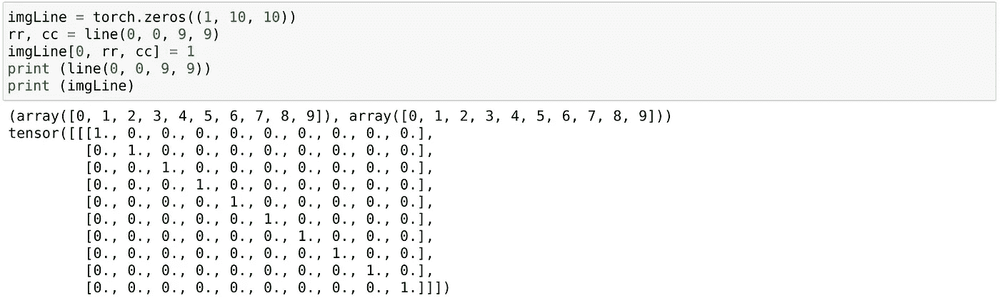

图 2:生成一行(作者图片)

图 2 显示了一个简单的例子，说明我们将如何实现这一点。首先，我们将创建一个表示全 0 的单通道 10 X 10 图像的张量。然后，我们将随机选择一个起点和终点，以获取表示该行的像素的索引，并在创建的图像张量中将相应的值设为 1。

图 3 是利用该逻辑来创建图像和结果张量的函数。图像数量(dataCount)和图像大小(imgPixelSize)被定义为输入参数。注意:在这个例子中，我使用 128 作为 imgPixelSize。

当我们随机选择一个起点和终点时，我们还会执行一些基本的检查。

首先，我们确保起点总是在终点的左边。这仅仅是基于一种直觉，对于给定的任何一条线，我个人很可能总是将最左边的点指定为“起点”，而将另一个点指定为“终点”。

这使我能够消除“顺序无关紧要”的问题。给定一条从(0，0)到(9，9)的线，虽然从技术上来说将任一点称为起点或终点都是正确的，但训练模型以适应这两种可能性可能需要我编写一个自定义损失函数，而不是简单地与一个单一的基本事实进行比较。我还直觉地感觉到，像这样的约束可能有助于模型训练得更快。

第二个检查相当简单，我们确保随机选择的起点和终点不相同(如果是，那就不是一条线，而只是一个点)。

最后，我们返回图像和相应的结果张量。结果张量只不过是开始和结束坐标的表示，即具有 4 个值的张量。

图 3:创建线条

虽然这创建了我们需要的张量，但是使用它需要我们创建一个自定义数据集和一个相应的数据加载器。自定义数据集应该是实现 __len__()函数(返回数据集的长度)和 __getitem__(index)函数(返回给定索引处的样本)的类。我们还将使用 Pytorch 的数据加载器来创建一个可迭代的加载器，它将允许我们批处理和混洗数据。

图 4:定制数据集和数据加载器

## 2.培训和测试功能

训练函数非常简单，实现了图 1 中的内容。它将数据加载器、模型、损失函数和优化器作为输入，将模型置于训练模式，并为每一批迭代数据加载器。

对于每一批，我们首先将数据移动到可用的设备(gpu vs cpu)，然后使用当前模型预测该批的结果，根据预测和基本事实计算损失，将上一轮的梯度归零，使用反向传播计算这一轮的梯度，并让优化器采取一个步骤来更新模型参数。

正如您可能注意到的，这是一个非常通用的函数，不管我们的模型结构如何，也不管我们选择的损失函数或优化器如何，它都能工作。

我们也有通用的测试函数，旨在评估不同于训练数据集的单独测试数据集的损失。测试函数的目的是查看模型对以前没有见过的数据(即没有训练过的数据)的表现。因此，我们将模型置于评估模式，只进行预测并计算损失。

图 5:训练和测试功能

## 3.模型

通过设计，卷积运算考虑了两个相邻像素之间的空间关系。一段时间以来，卷积神经网络一直是处理图像的事实架构。尽管还很初级，我们的玩具数据集也能处理基本的线条图像。所以让我们从建筑开始。

我从一个接一个的卷积层的随机排列开始。一个简单的谷歌搜索“卷积神经网络”显示，典型的标准似乎减少了高度和宽度，同时增加了这些层上的通道。最后，我们往往会有一个线性层堆栈，将最后一个卷积层展平为输出矢量。

在我们的例子中，输出向量将代表我们想要预测的内容。它将是一个 4 个值的张量，代表线的起点和终点的(x，y)坐标。

图 6:模型 1

上面的图 6 代表了模型本身。在这个例子中，我使用 128 作为 imgPixelSize。因此你所看到的数字都是由此而来的。第一个卷积层表示输入将有 1 层，这是我们在图 3 的 createDate 函数中生成的。它还指示输出将具有 4 层，卷积核的大小将为 3，步长为 2。我们有三个以上的 conv 层堆叠在这上面。然后，我们将输出变平，并在顶部堆叠几个线性层，最后一层产生 4 个值的输出张量。

你可能会注意到，重要的是我们不仅要知道第一层的输入形状，还要知道每一层的输入形状。在 Conv2D 中，我们需要知道输入中的通道数，而在线性中，我们需要知道输入张量的大小。虽然手动推导对于了解这些操作是如何工作的很重要，但是您可以将样本输入传递到一个临时的顺序网络，该网络由模型中使用的一个或多个相同的层组成，并打印结果的大小。请参见下面的图 7，了解如何快速了解添加到模型中的图层末尾的大小。

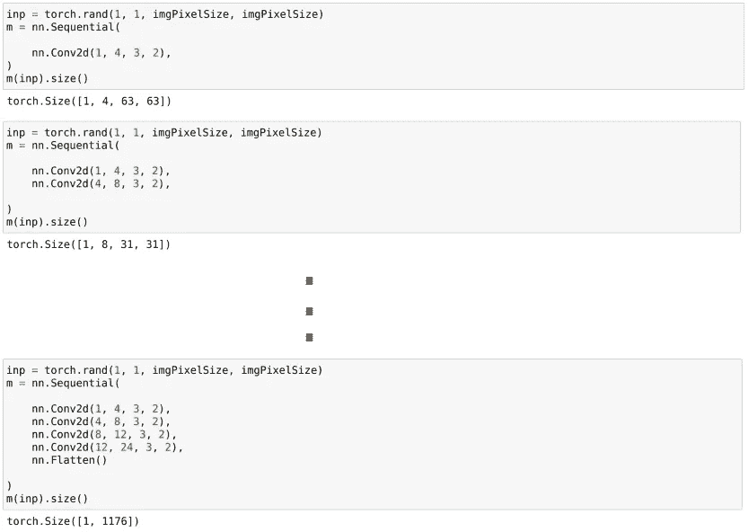

图 7:快速确定每层末尾尺寸的方法(图片由作者提供)

## 4.损失函数和优化器

交叉熵损失和 MSE 损失可能是许多例子中两个比较流行的损失函数。交叉熵通常用于分类问题，从公式的核心你可能已经注意到了。它是预测值的对数的函数，在分类问题中，我们感兴趣的是将真实类别的预测值推至 1，当预测值向 1 移动时，对数和损失将向 0 移动(反之亦然)。

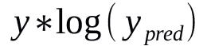

图 8:交叉熵损失(图片由作者提供)

然而，我们不是在处理分类问题。我们处理的是预测一个“连续”值——介于 0 和(imgPixelSize-1)之间的任何值。以指示起点和终点的坐标。MSE 或均方误差适用于这类问题。正如下面的核心公式所示，这里我们处理的是实际值和预测值之间的差异，而不是预测值的对数。

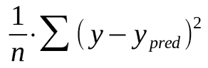

图 9: MSE 损失(图片由作者提供)

输出向量预计包含 4 个数字，代表线的两个点——起点和终点。由于不熟悉哪种优化器工作得最好，我选择了 SGD——在 Pytorch 文档的快速入门示例中，它与 MSE 损失一起使用。

# 结果、观察和改进

请参见下面的图 10，了解我们上面讨论的所有内容是如何组合在一起的。

图 10:将所有这些整合在一起

只是为了测试所有部分是否都按预期工作，我重新创建了一个只有 100 张图像的训练数据集，并用该模型运行了 1 个时期。虽然端到端的过程看似可行，但结果却非常糟糕。对于更大的数据集，我甚至无法完成训练。

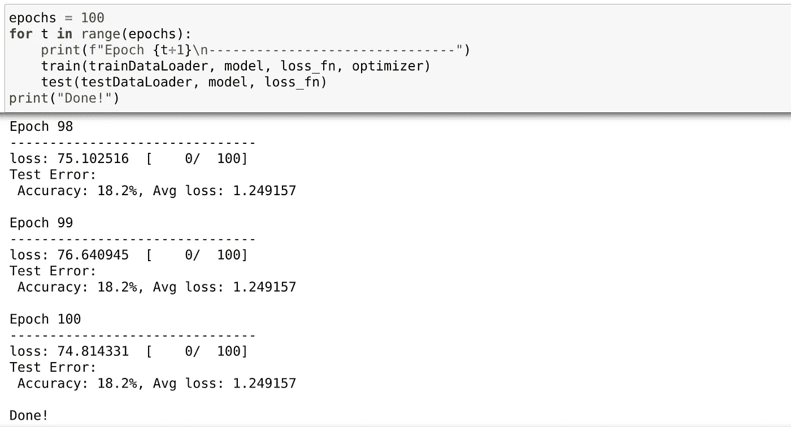

图 11:不良结果— 100 个图像训练数据集(作者提供的图像)

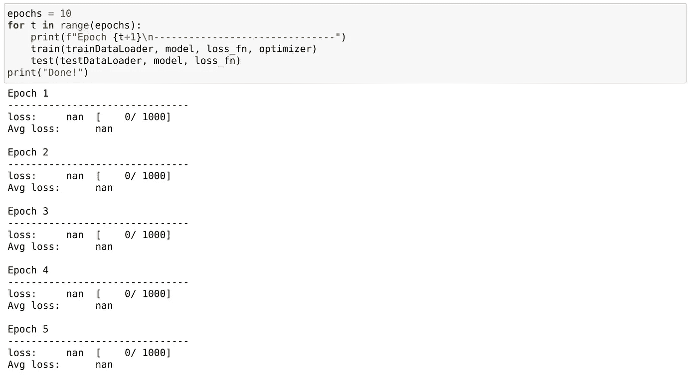

图 12:不良结果— 1000 个图像训练数据集(作者提供的图像)

但这是我们想要的初稿。第一稿不是迷失在一个“部分”的完美中，而是意味着首先将整个设置到位。我们可以稍后微调这些部分。

## 爆炸梯度

在最后一次跑步中，我注意到了一些事情。一是所有结果都是 NaN。当打印来自训练函数的预测时，很明显，在几轮训练后，预测开始呈指数增长，直到它变成 NaN。在打印模型参数(即权重)时，它们也变成了 NaN。

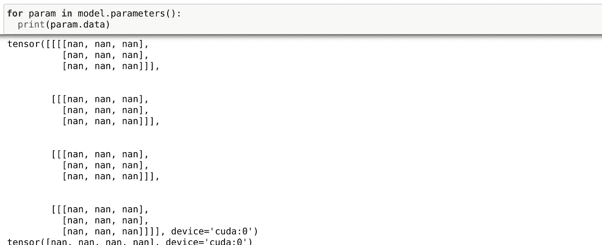

图 13:参数和预测都是 NaN(图片作者提供)

这表明了爆炸梯度问题。这是当导数很大时的情况，因为当我们反向传播时梯度也很大，并且模型权重变化如此剧烈，以至于它们变得太大而无法存储并变成 NaN。在图 14 中，您可以看到权重是如何以指数方式在各个时期更新变大的。

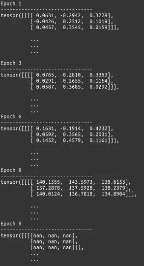

图 14:爆炸渐变(作者图片)

## 标准化数据

图像处理中的一个基本建议是归一化输入数据和输出，以避免爆炸梯度问题。在我们的数据中，我们没有这样做。

我们有两组数据。一个是图像本身，另一个是结果集。碰巧的是，我们生成图像的方式已经将背景像素标记为 0，将代表线条的像素标记为 1。因此不需要对图像数据进行进一步的归一化。

或者，如果我们处理的是一幅真实世界的图像，其中像素值可能在 0 到 255 之间变化，我们可能必须将它们除以 255 才能得到介于 0 和 1 之间的值。

另一方面，结果集需要一些规范化。目前，我们有绝对坐标，即一对 0 到 127 之间的数字，来代表起点和终点。让我们将它们除以 128，这是我们使用的图像的大小。

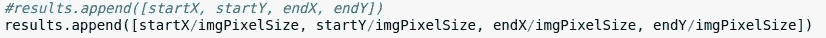

图 15:规范化结果集(作者图片)

## 激活功能

还要注意，我们的任何一层都没有激活功能。一般来说，跨层具有非线性激活函数是很常见的。这在一般意义上有所帮助，因为网络将学习非线性关系，没有这种关系，我们只是将一个线性函数应用于另一个，并创建一个大的线性函数。

尽管有卷积层，但在它们之间缺乏非线性激活函数将导致这样一个线性网络。如果我们把不同的层看作是代表一系列抽象概念的观察者的输入图像，以寻找起点和终点为最终目标，我不得不想象这些层之间的关系的性质将不会简单地是线性的。即使是这样，也可以用非线性激活函数在模型中表示这种关系，而用线性函数表示非线性关系则是不可能的。

所以在图层后添加了 ReLU。如今，在各种中枢神经系统中，标准做法是在卷积函数之后添加 ReLU。

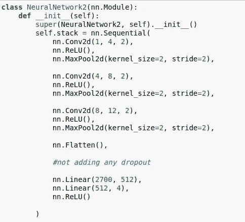

图 16:修改后的模型(作者图片)

## 减少的层

考虑到我们的问题相对简单，我们还减少了卷积层的总层数。注意:我们现在没有添加任何脱落层(图像处理模型中的另一个常用功能)，因为我们处理的是非常初级的图像，而不是具有复杂图案的真实图像。因此，在我们的案例中，辍学实际上可能会伤害学习，而不是帮助学习。

## 精度度量

为了获得更好的精确度，还添加了一个新的函数，允许在预测开始和结束坐标时有一定的回旋余地。即，如果(20，20)是起点的坐标，则预测(22，22)不一定是错误。因此，为了更好地了解模型是如何运行的，编写了一个新的函数，该函数将基础事实、预测和偏差作为输入参数，任何落在偏差定义的边界内的预测都不被视为错误。

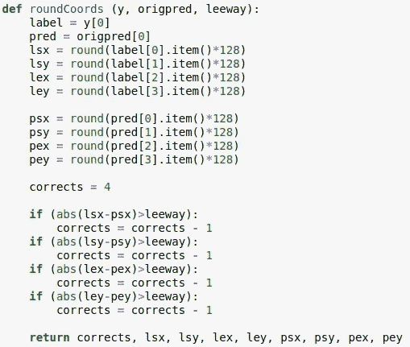

图 17:考虑偏差的准确度指标(作者图片)

## 学习率

最后，我们必须了解要使用的正确学习率。从 0.1 的学习率开始，我注意到输出要么是 1，要么是 0。在打印线性层末端的中间权重和输出时，我注意到最后一个线性层的输出达到非常高的正值或负值。虽然参数本身没有发生如此剧烈的变化，但无论做了什么改变，都足以导致这种情况。

所以我将速率降低到 0.01，较慢的学习速率意味着参数值的变化较小，然后再次尝试。虽然更新确实更小，并且需要几个额外的时期，但最终结果仍然相同，输出收敛为 0 或 1。但是 0.001 的情况要好得多，我注意到即使经过 5 个时期，这些值并没有真正变成 1 或 0。它们在第一批结束时增加，在下一批减少，表明某种对最优解的搜索正在发生。

因此，在这种学习速度下，我运行了 500 个时期的训练，如图 X 中的度量标准所定义的，准确率飙升至 94%以上，这使得这成为解决我们着手解决的玩具问题的一次相当令人满意的尝试。合并了上述修改后的笔记本最终版本的要点可以在这里找到。

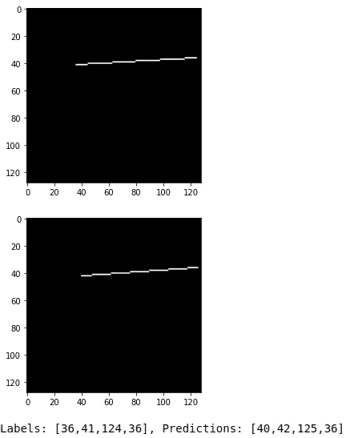

图 18:修改后的结果更好(作者图片)