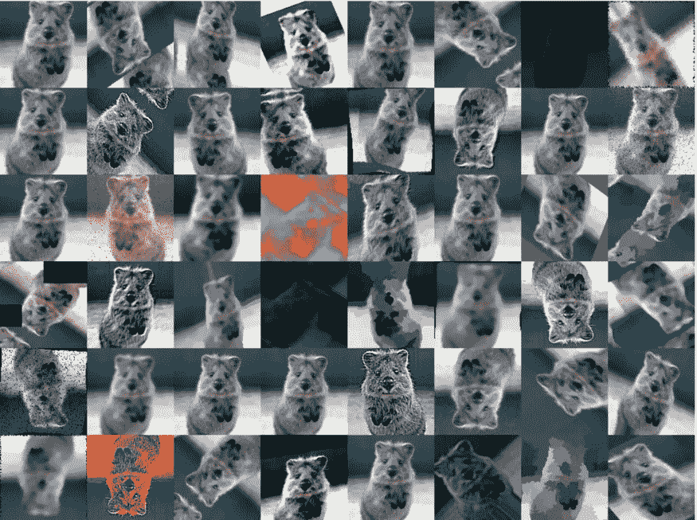
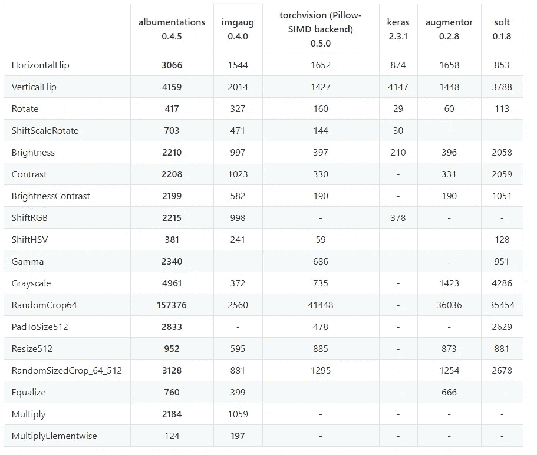
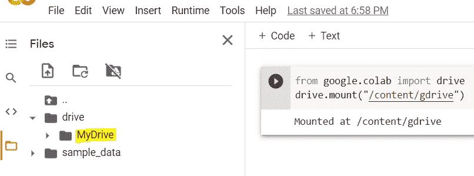
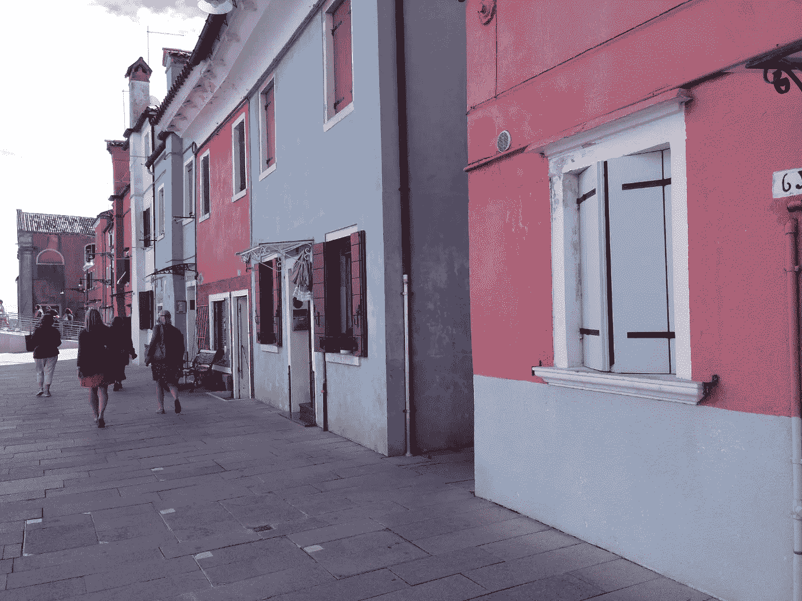
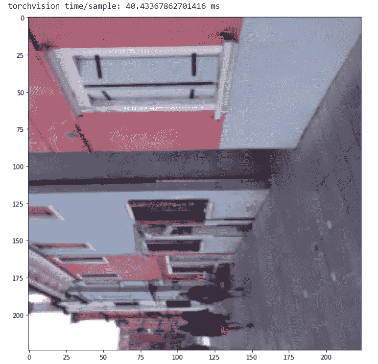
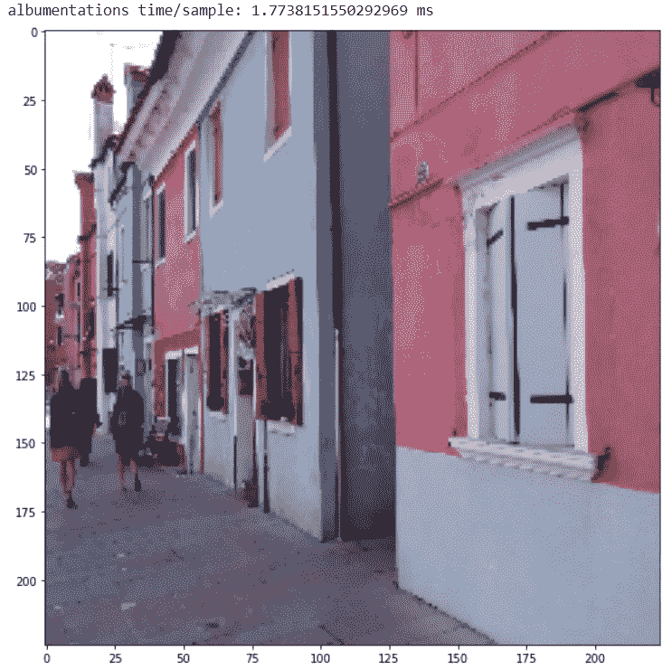
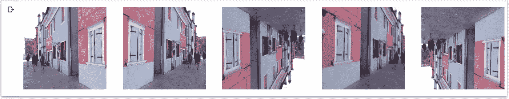

# 开始使用蛋白沉积:在 PyTorch 示例中赢得深度学习图像增强技术

> 原文：<https://towardsdatascience.com/getting-started-with-albumentation-winning-deep-learning-image-augmentation-technique-in-pytorch-47aaba0ee3f8?source=collection_archive---------2----------------------->

## Kaggle CV 比赛获奖秘诀？关于如何使用 Albumentation 库进行图像增强的教程


克里斯汀娜面粉在 [Unsplash](https://unsplash.com?utm_source=medium&utm_medium=referral) 上拍摄的照片

无论你是安静地参加 Kaggle 比赛，试图学习一种新的酷 Python 技术，还是数据科学/深度学习的新手，或者只是在这里抓取一段你想复制粘贴并立即尝试的代码集，我保证这篇文章将非常有帮助。

在这篇文章中，我将全面介绍最广泛使用的(2021 年和正在进行的)图像增强库之一，[*albumination*](https://albumentations.ai/)，并给出示例 Python 代码和输出。通过这篇文章，你应该能够对 [*蛋白*](https://albumentations.ai/) 有一个基本的了解，并最终在你自己的工作空间中进行尝试。任何没有(或很少)Pytorch 或 Python 经验或接触图像增强技术本身的人也是受欢迎的。

我个人发现这个库在我的日常使用中对任何计算机视觉相关的任务都非常有用，所以我想，‘为什么我不就此发表一篇文章呢？’？

*免责声明:这篇文章不是由*[*albumination*](https://albumentations.ai/)*赞助的，也不隶属于它。*

那么，究竟什么是[蛋白沉积](https://albumentations.ai/)？使用起来有什么特点和优势？现实世界的应用有哪些？

# 什么是蛋白沉积？

在你了解白质化有什么帮助之前，理解图像增强在计算机视觉中的意义是至关重要的。

Ryan Allred 的帖子有一个很好的解释。

> 深度神经网络，尤其是[卷积神经网络(CNN)](https://en.wikipedia.org/wiki/Convolutional_neural_network)，尤其擅长图像分类任务。最先进的 CNN 甚至被证明在图像识别方面超过了人类的表现(……)图像增强是获取已经存在于训练数据集中的图像并对其进行处理以创建同一图像的许多修改版本的过程。这不仅提供了更多的图像进行训练，而且还可以帮助我们的分类器暴露在更广泛的光照和颜色情况下，从而使我们的分类器更加鲁棒



图像增强样本。图片由 https://github.com/aleju/imgaug 的[提供](https://github.com/aleju/imgaug)

**基本上，它向给定的图像/图片中定制添加各种不同的品种，以增加训练数据集的规模，最终帮助提高深度学习模型的准确性。**

Albumentation 是一个工具，可以在将图像/图片放入模型之前，对其进行[ *弹性、网格、运动模糊、移位、缩放、旋转、转置、对比度、亮度等]* 定制。

[官方蛋白网站](https://albumentations.ai/)称自己为

> Albumentations 是一个 Python 库，用于快速灵活的[图像增强](https://albumentations.ai/#)。Albumentations 有效地实现了针对性能而优化的丰富多样的图像变换操作，并且同时为不同的计算机视觉任务(包括对象分类、分割和检测)提供了简洁而强大的图像增强接口。

albuminations 已于 2020 年正式发表在信息杂志上，标题为[**albuminations:快速灵活的图像增强**](https://www.mdpi.com/2078-2489/11/2/125) ，目前由来自俄罗斯的 5 名核心团队成员维护，功能更新一致。

# 为什么要用白蛋白？

与其他图像增强相关包不同的是，

**是** **快**

这个包已经被几个基于 OpenCV 的库(包括 NumPy，OpenCV，imgaug)优化了。

现在你有机会面对最终的老板，而不用痛打所有的中层老板

我的深度学习首选 python 框架是 Pytorch，所以我最初接触了 torchvision 原生提供的[**torch vision . transforms**](https://pytorch.org/docs/stable/torchvision/transforms.html)**的用法。[**torch vision . transforms**](https://pytorch.org/docs/stable/torchvision/transforms.html)**已经给出了相当扎实的定制增强方法和文档，所以我一直坚持它的产品。****

****在寻找更好的增强开源库时，我发现了这个 Albumentation 包。我发现它非常快，高度可定制，最重要的是，它只需要 https://github.com/albumentations-team/albumentations****

********

****上图是英特尔至强白金 8168 CPU 的测试结果，由 ImageNet 中的 2000 个验证集映像提供。每个单元格中的值表示单个内核中处理的图像数量。你可以看到，在许多转换中，Albumentation 比所有其他库至少快 2 倍。****

****您可以在[albumination 官方 GitHub](https://github.com/albumentations-team/albumentations) 中找到有关最新 0.5.0 版本的基准测试的更多信息。****

****怎么用白蛋白？****

# ******教程******

## ****对于这个项目的范围，我将介绍白蛋白的主要成分和用途。该代码集主要基于 Albumentations 团队的教程笔记本。我参考了下面的笔记本:****

****[**migrating _ from _ torch vision _ to _ albuminations . ipynb**](https://github.com/albumentations-team/albumentations_examples/blob/master/notebooks/migrating_from_torchvision_to_albumentations.ipynb)****

*   ****在 Google Colab 中安装 Google Drive****

## ****我坚持使用 Google Colab 来制作简单/可共享的笔记本原型。他们的 Jupyter 是免费的，你可以使用免费的 GPU！****

****你可以上传你的照片到你的 Google Drive，然后用下面的代码把 Google Drive 挂载到 Colab。****

****该单元格将返回以下内容*在浏览器中转到该 URL***。**点击 URL 后，您可以检索授权码。复制粘贴这段代码，然后按回车键和就可以了！****

```
**from google.colab import drive
drive.mount("/content/gdrive")**
```

****作者照片。认证后的结果****

********

****此外，我将导入本教程所需的所有其他 Python 库****

****为了演示的目的，我用了一张意大利威尼斯的街景照片，这是我前阵子去欧洲旅行时拍的。****

```
**from PIL import Image
import time
import torch
import torchvision
from torch.utils.data import Dataset
from torchvision import transforms
import albumentations
import albumentations.pytorch
from matplotlib import pyplot as plt
import cv2
import numpy as np**
```

****作者照片。意大利威尼斯的一条街道****

********

****原始火炬视觉数据管道****

# ****我通常使用 PyTorch 和 Torchvision 创建一个数据加载器来处理图像数据管道。在下面的代码中，它****

****创建一个简单的 Pytorch 数据集类****

*   ****调用图像并进行转换****
*   ****用 100 个循环测量整个处理时间****
*   ****首先，从 torch.utils.data 中获取 Dataset 抽象类，并创建一个 TorchVision Dataset 类。然后我插入图像，并使用 **__getitem__** 方法进行转换。此外，我使用`total_time = (time.time() - start_t`来测量需要多长时间****

****然后，我们将图像的大小调整为 256x256(高*重)，并随机裁剪为 224x224。然后以 50%的概率应用水平翻转，转换为张量。输入文件路径应该是你的图片所在的 Google Drive 的路径。****

```
**class TorchvisionDataset(Dataset):
    def __init__(self, file_paths, labels, transform=None):
        self.file_paths = file_paths
        self.labels = labels
        self.transform = transform

    def __len__(self):
        return len(self.file_paths)

    def __getitem__(self, idx):
        label = self.labels[idx]
        file_path = self.file_paths[idx]

        # Read an image with PIL
        image = Image.open(file_path)

        start_t = time.time()
        if self.transform:
            image = self.transform(image)
        total_time = (time.time() - start_t)

        return image, label, total_time**
```

****然后，我们计算从 torchvision_dataset 中提取样本图像并转换它所需的时间，然后运行 100 次循环来检查它所需的平均毫秒数。****

```
**torchvision_transform = transforms.Compose([
    transforms.Resize((256, 256)), 
    transforms.RandomCrop(224),
    transforms.RandomHorizontalFlip(),
    transforms.ToTensor(),
])

torchvision_dataset = TorchvisionDataset(
    file_paths=["/content/drive/MyDrive/img5.jpg"],
    labels=[1],
    transform=torchvision_transform,
)**
```

****在我的 Colab 环境中，Resize+RandomCrop+RandomHorizontalFlip 的一百次循环大约花费了 40 ms，最后一张图像花费了 224x224，如您所见。你也可以看到翻转发生在第 100 张图片上！****

```
**total_time = 0
for i in range(100):
  sample, _, transform_time = torchvision_dataset[0]
  total_time += transform_time

print("torchvision time/sample: {} ms".format(total_time*10))

plt.figure(figsize=(10, 10))
plt.imshow(transforms.ToPILImage()(sample))
plt.show()**
```

********

****沉淀数据管道****

# ****现在，我将重构从火炬视觉到蛋白质合成的数据管道****

****类似于 TorchVision，我们创建了一个 Albumentations 数据集类。****

****现在在蛋白沉积中创造一个转变。在这个例子中，你可以发现一个小小的语法差异，那就是 Torchvision 的 **RandomHorizontalFlip()** 通过 **HorizontalFlip()** 在 Albumentation 中产生相同的结果****

```
**class AlbumentationsDataset(Dataset):
    """__init__ and __len__ functions are the same as in TorchvisionDataset"""
    def __init__(self, file_paths, labels, transform=None):
        self.file_paths = file_paths
        self.labels = labels
        self.transform = transform

    def __len__(self):
        return len(self.file_paths)

    def __getitem__(self, idx):
        label = self.labels[idx]
        file_path = self.file_paths[idx]

        # Read an image with OpenCV
        image = cv2.imread(file_path)

        # By default OpenCV uses BGR color space for color images,
        # so we need to convert the image to RGB color space.
        image = cv2.cvtColor(image, cv2.COLOR_BGR2RGB)

        start_t = time.time()
        if self.transform:
            augmented = self.transform(image=image) 
            image = augmented['image']
	    total_time = (time.time() - start_t)
        return image, label, total_time**
```

****执行相同的图像转换，获得平均时间，并可视化结果。****

```
**"""
torchvision_transform = transforms.Compose([
    transforms.Resize((256, 256)), 
    transforms.RandomCrop(224),
    transforms.RandomHorizontalFlip(),
    transforms.ToTensor(),
])
"""

# Same transform with torchvision_transform
albumentations_transform = albumentations.Compose([
    albumentations.Resize(256, 256), 
    albumentations.RandomCrop(224, 224),
    albumentations.HorizontalFlip(), # Same with transforms.RandomHorizontalFlip()
    albumentations.pytorch.transforms.ToTensor()
])**
```

****令人惊讶的是，只用了 1.77ms，比 Torchvision 快了约 23 倍！它甚至比我们从官方基准文档中看到的计算差距更大，而且裁剪区域似乎也略有不同。****

```
**# Same dataset with torchvision_dataset
albumentations_dataset = AlbumentationsDataset(
    file_paths=["/content/drive/MyDrive/img5.jpg"],
    labels=[1],
    transform=albumentations_transform,
)
total_time = 0
for i in range(100):
  sample, _, transform_time = albumentations_dataset[0]
  total_time += transform_time

print("albumentations time/sample: {} ms".format(total_time*10))

plt.figure(figsize=(10, 10))
plt.imshow(transforms.ToPILImage()(sample))
plt.show()**
```

****白蛋白的应用****

********

# ****如你所见，它非常快，速度很重要。****

****在代码竞赛中，如果可以减少图像处理中的计算瓶颈，就可以将更多的资源用于其他部分(模型拟合、超参数调优等)。****

*   ****在现实世界的行业中，生产数据库中新图像的流入量可能很大(即每秒 1000 幅图像)。想象开发一个实时深度学习模型。在该模型中，处理图像的快速方法至关重要，这可能会影响用户体验并最终影响收入/利润。****
*   ****对于你的学习目的来说，接触最新的和表现最好的技术技能是有帮助的，这在你建立自己的项目时可能是有用的，也许在找工作(例如简历)时也是有用的****
*   ****更复杂的例子****

# ****最后，我将展示如何使用函数中的**函数进行增强，我个人认为这是最复杂的，但在蛋白沉积中非常有用******

****它在调整大小和随机裁剪方面与之前的代码集有相同的代码。 **OneOf** 在括号内随机选取一个列出的变换。我们甚至可以把发生的概率放在函数本身中。例如，如果其中一个([…]，p=0.5)，它以 50%的几率跳过整个变换，并以 1/6 的几率随机选取三个变换中的一个。****

```
**albumentations_transform_oneof = albumentations.Compose([
    albumentations.Resize(256, 256), 
    albumentations.RandomCrop(224, 224),
    albumentations.OneOf([
                          albumentations.HorizontalFlip(p=1),
                          albumentations.RandomRotate90(p=1),
                          albumentations.VerticalFlip(p=1)            
    ], p=1),
    albumentations.OneOf([
                          albumentations.MotionBlur(p=1),
                          albumentations.OpticalDistortion(p=1),
                          albumentations.GaussNoise(p=1)                 
    ], p=1),
    albumentations.pytorch.ToTensor()
])**
```

****我让它从水平翻转、旋转、垂直翻转中随机选择，又让它从模糊、失真、噪声中随机选择。所以在这种情况下，我们允许 3x3 = 9 种组合。****

****来自定义的图像变换的五个样本如下:****

```
**albumentations_dataset = AlbumentationsDataset(
    file_paths=["/content/gdrive/My Drive/img5.png"],
    labels=[1],
    transform=albumentations_transform_oneof,
)

num_samples = 5
fig, ax = plt.subplots(1, num_samples, figsize=(25, 5))
for i in range(num_samples):
  ax[i].imshow(transforms.ToPILImage()(albumentations_dataset[0][0]))
  ax[i].axis('off')**
```

****我们看到旋转 360，水平翻转，垂直翻转被应用，不同的失真被应用到所有遮光罩下的图像。****

********

****除了我所解释的，还有许多例子。请参考官方[营养强化网站](https://albumentations.ai/docs/)或[营养强化 Github](https://github.com/albumentations-team/albumentations/) 来应用最适合自己需求的强化！****

****额外资源****

# *******注*** 您还可以找到 Jupyter 笔记本，其中包含了 albumination:ka ggle 竞赛的真实用法****

****[孟加拉语。AI 手写字素分类](https://www.kaggle.com/c/bengaliai-cv19)是一个代码竞赛，给定一个手写孟加拉字素的图像，对图像中的三个组成元素进行分类。这是一个图像分类问题，Albumentation 用于转换最初存在于拼花文件中的数万张图像，大小为 GB。****

****GitHub: [**孟加拉语。AI 手写字素分类大赛**](https://github.com/hyunjoonbok/bengaliai-cv19)****

****结论****

# ****总之，我介绍了图像增强技术，Python 中的 Albumentation 库，教程中有示例代码。为了这个项目，这个实验只使用了一张图像，但是可以发现速度有了很大的提高。白蛋白提供了各种各样的转换，所以我强烈推荐我的读者从今天开始使用它。****

*****有关学习其他数据科学主题的更多详细信息，下面的 Github 存储库也会有所帮助*****

****[生产中的 AWS sage maker](https://github.com/hyunjoonbok/amazon-sagemaker)
展示如何使用 Amazon SageMaker 及其 ML/DL 算法解决业务问题的端到端示例。****

*   ****[PySpark](https://github.com/hyunjoonbok/PySpark)
    函数和实用程序，带有真实世界的数据示例。可以用来构建一个完整的数据建模的 ETL 过程****
*   ****[推荐系统](https://github.com/hyunjoonbok/Recommendation_System-PyTorch)
    py torch 中推荐系统的生产级实现。克隆 repo 并通过运行“main.py”开始训练****
*   ****[自然语言处理(NLP)](https://github.com/hyunjoonbok/natural-language-processing)
    Python 中几种自然语言处理方法的完整实现示例。按照学习的复杂程度排序****
*   ****关于作者****

# ****贤俊是一名拥有统计学学位的数据极客。他喜欢分享数据科学/分析知识。在 LinkedIn 上给他发消息。****

*****参考:* (1)瑞安·奥尔雷德，[https://towardsdatascience . com/AWS-glue-and-you-e2e 4322 f 0805](/image-augmentation-for-deep-learning-using-keras-and-histogram-equalization-9329f6ae5085)
(2)霍亚 012，[https://hoya012.github.io/blog/albumentation_tutorial/](https://hoya012.github.io/blog/albumentation_tutorial/)
(3)蛋白发酵官方文档，[https://albumentations.ai/docs/](https://albumentations.ai/docs/)****

*****Reference:* (1) Ryan Allred, [https://towardsdatascience.com/aws-glue-and-you-e2e4322f0805](/image-augmentation-for-deep-learning-using-keras-and-histogram-equalization-9329f6ae5085)
(2) Hoya012, [https://hoya012.github.io/blog/albumentation_tutorial/](https://hoya012.github.io/blog/albumentation_tutorial/)
(3) Albumentation Official Docs, [https://albumentations.ai/docs/](https://albumentations.ai/docs/)****