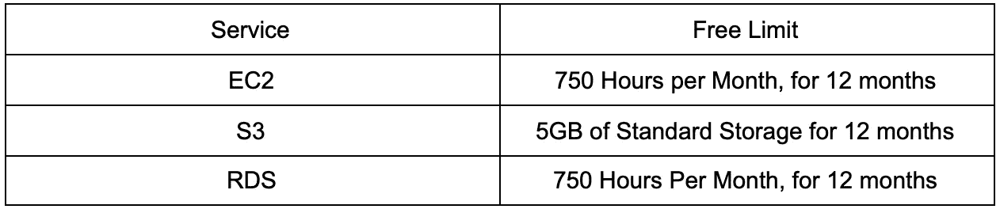
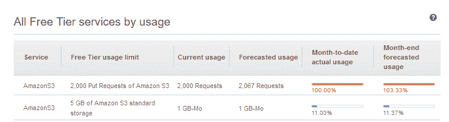
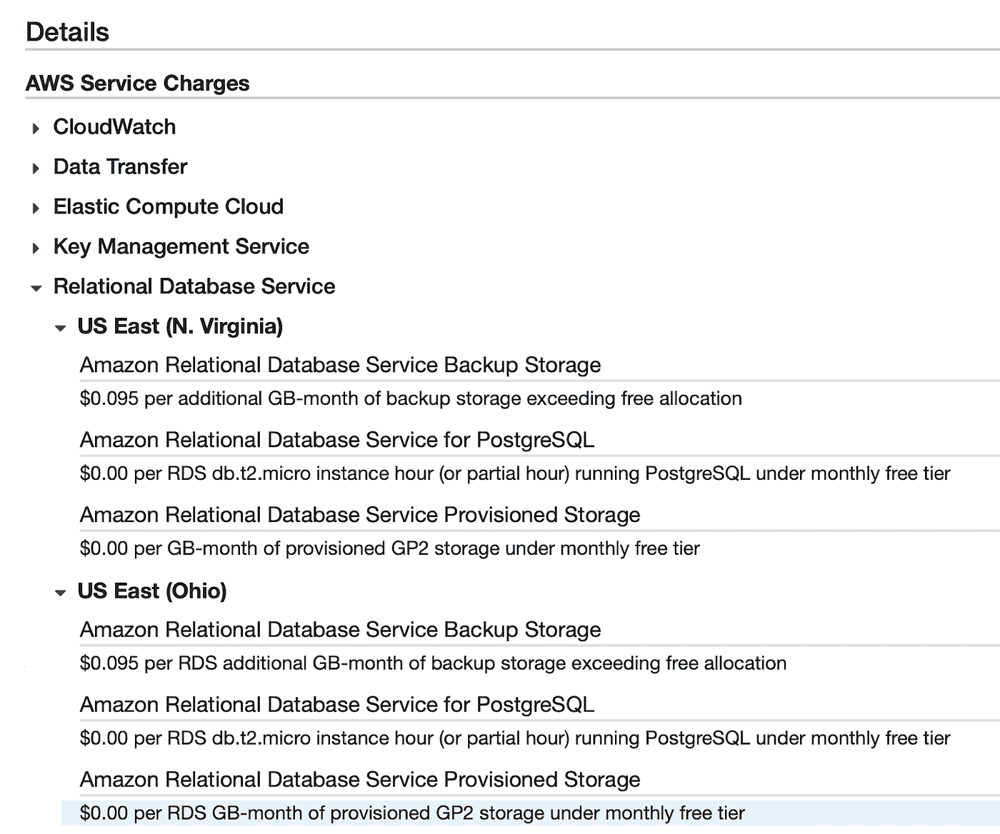
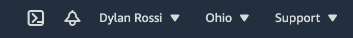
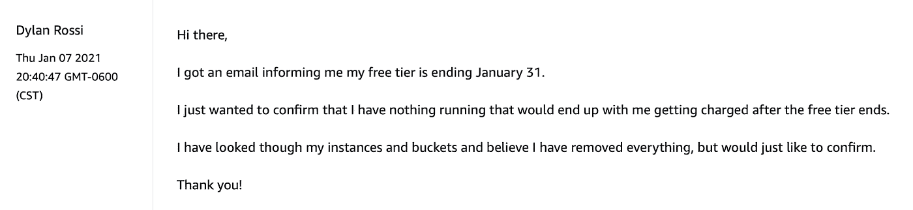
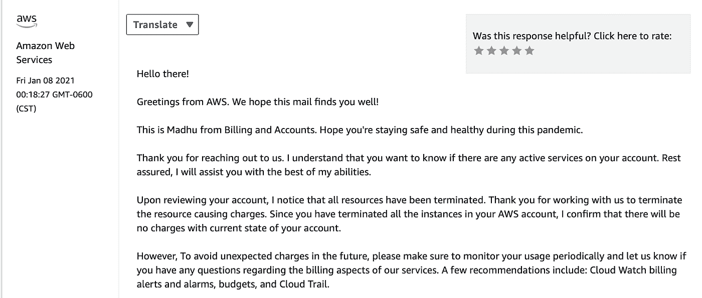

# AWS 入门:保持“免费层”免费

> 原文：<https://towardsdatascience.com/getting-started-with-aws-keeping-the-free-tier-free-a063f593b696?source=collection_archive---------20----------------------->

## 通过监控您的使用情况来防止收费

作者:[爱德华·克鲁格](https://www.linkedin.com/in/edkrueger/)和[迪伦·罗西](https://www.linkedin.com/in/dylan-rossi/)

图片由泰勒·维克(【https://unsplash.com/@tvick】T4)提供

当学习如何使用“云”时，意想不到的费用是通行的权利，即使使用“免费层”。我们自己也经历过这种情况，我们看到它发生在我们大多数学生身上。在这篇文章中，我们将帮助开明的新人避免为他们的错误付出代价。

# 为什么这是一个问题？

你可能会认为“免费层”意味着你不用付钱。事实并非如此。从设计上来说，云允许你消费你所要求的任何数量的资源。这种做法的负面影响是，如果你要求的数量超过了你的免费配额，你将为此付出代价。只有在 AWS 为您设置的使用限制内，免费层才会保持免费。如果您超出这些限制，将根据他们的[计费计划](https://aws.amazon.com/pricing/)向您收费。

这样做的理由是资本支出与运营支出。云的全部意义在于你可以得到你想要的。如果你想消耗更多免费的资源，你可以这样做，但是你需要付费。

然而，至少应该有一个选项，让你一旦达到免费层的限制，以防止任何收费杀死所有的服务。这是用户十多年来一直要求的功能。

在投入 AWS 之前，您需要理解关键的计费概念并构建一个安全网。

# AWS 免费层包括什么？

为了防止被收费，我们首先需要知道免费层包括什么，因为知道是成功的一半。

免费层中最常用的 AWS 服务包括 EC2、S3 和 RDS。以下是这些服务的自由层限制:

AWS 免费层包括更多的服务，可以在这里找到。

# 监控您的使用情况

如果您注册了 AWS 免费层，您可以通过几种不同的方式来监控您的使用情况。

最直接的方法是查看您的“自由层服务表”此表可在您的[“计费和成本管理控制台”中找到](https://console.aws.amazon.com/billing/)

在这里，您可以查看服务、您的当前使用情况以及您的预测使用情况。如果您接近了您的极限，您可以关闭服务(我们将在下一节介绍如何做)。

您还可以在接近免费等级限制时启用电子邮件提醒。这些警报也是从[“计费和成本管理控制台”创建的](https://console.aws.amazon.com/billing/)

然后，您将:

1.  点击“首选项”
2.  "帐单首选项"
3.  在“成本管理首选项”下
4.  选中“接收免费层使用警报”复选框
5.  输入您的电子邮件地址
6.  保存首选项

当您接近任何免费等级服务的上限时，您将会收到提醒。然而，即使启用了此功能，仍然建议您经常关注您的使用情况，正如 AWS 声明的此警报。

# 关闭服务

既然您已经了解了如何跟踪您的空闲层使用情况，现在您需要了解战斗的后半部分，即禁用您的服务。

一个很好的方法来检查什么服务正在运行，在什么服务器上，到你的“账单”页面。

选择当前月份以显示正在运行的服务，您将获得该月使用的服务列表。然后，您可以单击接近限制的服务，并查看它在哪个(哪些)区域运行。这一点很重要，因为你需要关闭所有地区的服务，以防止被收费。

不关闭所有地区的服务是一个常见的错误，如果你最终超过了限制，你将被收费。

在这个例子中，我有一个运行在 N. Virginia 和 Ohio 地区的 RDS 实例。因此，要关闭这些，我需要前往 AWS 上的 RDS 页面。

一旦到了那里，你就可以通过查看右上角来知道你在哪个服务器上。

我们可以暂时关闭或永久删除 RDS 实例。

如果你计划在下个月使用同一个数据库，并想关闭它以避免被收费，你可以按照[这些步骤](https://docs.aws.amazon.com/AmazonRDS/latest/UserGuide/USER_StopInstance.html)来“停止”服务。如果你打算完全删除实例，你可以遵循[指南](https://docs.aws.amazon.com/AmazonRDS/latest/UserGuide/USER_DeleteInstance.html#USER_DeleteInstance.NoSnapshot)。

**注意:当询问您是否要创建快照时，请选择“否”,因为如果超出限额，您可能需要为此付费。**

对运行 RDS 的任何其他地区重复此过程。

一旦您关闭了剩余的实例，回头看看您的账单，并找到哪些正在运行的服务需要关闭以防止收费。

关闭其他服务将是一个类似的过程。为了了解如何关闭这些服务，AWS 有一个深入的指南[这里](https://aws.amazon.com/premiumsupport/knowledge-center/terminate-resources-account-closure/)。

记住关闭每台服务器的服务。

# 确认没有运行任何东西

您还可以采取一个额外的步骤来验证没有其他需要付费的东西正在运行，请随时给 AWS 支持发送消息。支持部门的响应相当迅速，这是确保您不会收到任何意外费用的好方法。

# 如果你被指控，该怎么办

如果你真的收到意外的费用，不要惊慌。我们有学生在忘记完全关闭他们的实例后被指控。有些被收了几百(一个学生，甚至一千多)美元。

所有人都能够联系 AWS，并通知他们，他们不小心让他们的实例运行，因为他们是初学者，不理解这个过程。AWS 确实为他们提供了退款，但你不希望让这成为一种习惯，因为人们会认为，如果你不断要求退款，他们将不会继续这么理解。

# 结论

AWS 的“免费层”允许你尝试他们提供的许多服务，但是正如你所看到的，“免费”并不总是免费的。

希望本指南能帮助你在学习如何使用 AWS 的过程中避免任何意外的费用。

# 关注我们了解更多内容

*   [爱德华的领英](https://www.linkedin.com/in/edkrueger/)
*   [迪伦的 LinkedIn](https://www.linkedin.com/in/dylan-rossi/)
*   [迪伦的 LinkedIn](https://www.linkedin.com/in/dylan-rossi/)
*   [YouTube](https://www.youtube.com/channel/UCmvdvjDaSjjMRIAxE5s7EZA)