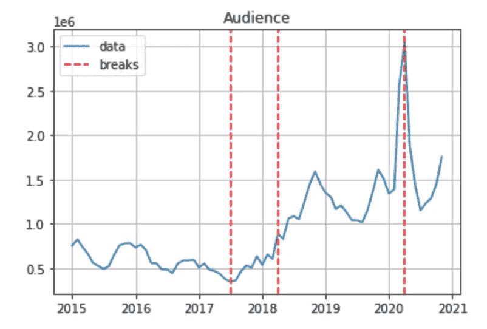

# Python 断点分析入门

> 原文：<https://towardsdatascience.com/getting-started-with-breakpoints-analysis-in-python-124471708d38?source=collection_archive---------6----------------------->

## 数据分析

## 一个现成的教程，比较 Python 中断点分析的 breakes 和 Jenkspy 库


作者图片

在处理时间序列时，识别断点非常重要。事实上，在执行预测时，数据中断点的存在可能会导致错误和模型不稳定。

> 断点是数据中的结构变化，如异常或预期事件。

存在许多识别断点的技术。一般来说，这些技术可以分为两类:

*   **检测** —检测一个或多个断点
*   **测试** —给定一个点，检查它是否是断点。这一类技术包括著名的[周试](https://en.wikipedia.org/wiki/Chow_test)。

在这个简短的教程中，我将重点放在第一类断点上，并比较了两个用于断点分析的 Python 库:`ruptures`和`jenkspy`。

代码以 Jupyter 笔记本的形式提供，可以从我的 [Github 库](https://github.com/alod83/data-science/tree/master/DataAnalysis/BreakpointAnalysis)下载。

# 加载数据

首先，我加载数据集作为一个`pandas`数据帧。作为数据集，我利用了从 2015 年到 2020 年的观众趋势。Giallozafferano 是一个非常著名的意大利美食博客。数据是从一个分析意大利互联网使用的意大利网站 Audiweb 中提取的，然后通过我的一个学生开发的一个名为 LEX 的软件进行加工。LEX 是一个非常有用的软件，它可以将微软 Excel 中的多个文件，按日期划分，转换成一个 CSV 文件。如果你想了解这个软件，请给我留言:)

```
import pandas as pddf = pd.read_csv('GialloZafferano.csv')
df.head()
```


作者图片

现在我把数据帧转换成时间序列。这可以分三步完成:

*   将`data`字段转换为日期时间
*   将日期列设置为时间序列的索引
*   将该列值分配给一个名为`ts`的新变量。

```
df['date'] = pd.to_datetime(df['date'])
df.set_index(df['date'], inplace = True)
ts = df['audience']
```

我画出了时间序列。我开发了`matplotlib`库。


作者图片

看这个图表，我注意到有三个主要的转折点。因此，我决定寻找 3 个突破口。


作者图片

```
n_breaks = 3
```

我准备数据作为测试库的输入。我把时间序列转换成数组。

```
import numpy as npy = np.array(ts.tolist())
```

# 断裂

第一个断点检测库是[breaks](https://pypi.org/project/ruptures/)，可以通过命令`pip install rupture`安装。

中断提供了六种不同的模式来检测断点:`Dynp`、`KernelCPD`、`Pelt`、`Binseg`、`BottomUp`、`Window`。每个模型都必须被构建、训练(通过`fit()`函数)，然后用于预测。`predict()`功能接收待识别断点的数量(减 1)作为输入。在这个例子中，我利用了`Dynp`模型，它对应于动态编程。

```
import ruptures as rptmodel = rpt.Dynp(model="l1")
model.fit(y)
breaks = model.predict(n_bkps=n_breaks-1)
```

因为`ruptures`返回发生结构变化的索引，所以我从原始时间序列`ts`中检索日期。

```
breaks_rpt = []
for i in breaks:
    breaks_rpt.append(ts.index[i-1])
breaks_rpt = pd.to_datetime(breaks_rpt)
breaks_rpt
```

它产生以下输出:

```
DatetimeIndex(['2016-03-01', '2018-04-01', '2020-11-01'], dtype='datetime64[ns]', freq=None)
```

现在我绘制结果。

```
plt.plot(ts, label='data')
plt.title('Audience')
print_legend = True
for i in breaks_rpt:
    if print_legend:
        plt.axvline(i, color='red',linestyle='dashed', label='breaks')
        print_legend = False
    else:
        plt.axvline(i, color='red',linestyle='dashed')
plt.grid()
plt.legend()
plt.show()
```


作者图片

# 詹克斯比

第二个断点检测库是 [Jenkspy](https://pypi.org/project/jenkspy/) ，可以通过以下命令安装:`pip install jenkspy`。这个库根据 Fisher-Jenks 算法计算数组中的自然断点。

我导入库(`import jenkspy`)，然后调用`jenks_breaks()`函数，该函数接收值数组和要检测的断点数量作为输入。作为输出，该函数返回与所标识的中断相对应的值。提醒断裂，相反，返回断裂索引。

```
import jenkspybreaks = jenkspy.jenks_breaks(y, nb_class=n_breaks-1)
```

我通过循环遍历`breaks`数组来计算 breaks 索引。

```
breaks_jkp = []
for v in breaks:
    idx = ts.index[ts == v]
    breaks_jkp.append(idx)
breaks_jkp
```

它产生以下输出:

```
[DatetimeIndex(['2017-07-01'], dtype='datetime64[ns]', name='date', freq=None),
 DatetimeIndex(['2018-04-01'], dtype='datetime64[ns]', name='date', freq=None),
 DatetimeIndex(['2020-04-01'], dtype='datetime64[ns]', name='date', freq=None)]
```

我画出结果。

```
plt.plot(ts, label='data')
plt.title('Audience')
print_legend = True
for i in breaks_jkp:
    if print_legend:
        plt.axvline(i, color='red',linestyle='dashed', label='breaks')
        print_legend = False
    else:
        plt.axvline(i, color='red',linestyle='dashed')
plt.grid()
plt.legend()
plt.show()
```



作者图片

# 比较结果

最后，我比较了两个库产生的结果。我进行了视觉对比。

我计算了理想情况，两种算法产生相同的结果。

```
x_ideal = ts.index
y_ideal = x_ideal
```

我通过散点图来比较这两种算法。理想情况用红色标出。我注意到只有一个普通的断裂(穿过理想情况的那个)。第一个断点很不一样，第三个断点很像。

```
plt.figure(figsize=(5, 5), dpi=80)
plt.scatter(breaks_rpt,breaks_jkp)
plt.xlabel('Ruptures')
plt.ylabel('Jenkspy')
plt.title('Jenskpy VS Ruptures')
plt.xlim(ts.index[0], ts.index[len(ts)-1])
plt.ylim(ts.index[0], ts.index[len(ts)-1])
plt.plot(x_ideal,y_ideal, color='r', linestyle='dashed')
plt.grid()
plt.show()
```


作者图片

# 摘要

在本教程中，我用两个库说明了如何在 Python 中检测断点:`ruptures`和`jenkspy`。这两个库产生不同的输出。将输出与可视断点进行比较，在这个特定示例中，Jenkspy 算法似乎优于动态编程。

如果你想了解我的研究和其他活动的最新情况，你可以在 [Twitter](https://twitter.com/alod83) 、 [Youtube](https://www.youtube.com/channel/UC4O8-FtQqGIsgDW_ytXIWOg?view_as=subscriber) 和 [Github](https://github.com/alod83) 上关注我。

# 相关文章

[](/how-to-detect-outliers-with-python-pyod-aa7147359e4b) [## 如何用 Python pyod 检测异常值

### 关于 pyod 库使用的快速教程。

towardsdatascience.com](/how-to-detect-outliers-with-python-pyod-aa7147359e4b) [](/4-different-approaches-for-time-series-analysis-7e2364fadcb9) [## 4 种不同的时间序列分析方法

towardsdatascience.com](/4-different-approaches-for-time-series-analysis-7e2364fadcb9) [](/a-complete-data-analysis-workflow-in-python-and-scikit-learn-9a77f7c283d3) [## Python 和 scikit 中的完整数据分析工作流程-学习

towardsdatascience.com](/a-complete-data-analysis-workflow-in-python-and-scikit-learn-9a77f7c283d3)