# C# DataFrame 和 XPlot 入门。Plotly

> 原文：<https://towardsdatascience.com/getting-started-with-c-dataframe-and-xplot-ploty-6ea6ce0ce8e3?source=collection_archive---------4----------------------->

## 探索用 C#在 Jupyter 笔记本上使用数据框和绘制图表的方法


艾萨克·史密斯在 [Unsplash](https://unsplash.com?utm_source=medium&utm_medium=referral) 上拍摄的照片

原文可以在[路孚特开发者社区](https://developers.refinitiv.com/en/article-catalog/article/getting-started-with-c--dataframe-and-xplot-ploty)上找到。

对于 Python 编程语言来说，Pandas 是一个高效且流行的数据分析工具，尤其是它的 Dataframe，用于操作和显示数据。为了。NET 编程语言，我们可以使用微软的 [Deedle](https://www.nuget.org/packages/Deedle/) 或[。Data.Analysis](https://www.nuget.org/packages/Microsoft.Data.Analysis/) 包在 [NuGet](https://www.nuget.org/) 中可用，它还提供了一个 DataFrame 类，用于操作、转换和显示数据。

这个例子主要针对[微软。Data.Analysis](https://www.nuget.org/packages/Microsoft.Data.Analysis/) 包，演示 Jupyter Notebook 中 DataFrame 类的一些基本特性。

它还使用了 [XPlot。Plotly](https://fslab.org/XPlot//index.html) 包是 F#数据可视化包，用于绘制数据帧中数据的图表。源代码可在 [GitHub](https://github.com/Refinitiv-API-Samples/Example.Notebook.CSharp.DataFrame) 上获得。

# 先决条件

要运行本文中的示例，请参考此[使用。NET Core in Jupyter Notebook](https://developers.refinitiv.com/en/article-catalog/article/using--net-core-in-jupyter-notebook) 文章，用于设置 Jupyter Notebook 以支持。NET 编程语言。

# 安装软件包

[微软。数据分析](https://www.nuget.org/packages/Microsoft.Data.Analysis/)包在 NuGet 中可用，因此可以使用 dot net-interactive**# r**[魔法命令](https://github.com/dotnet/interactive/blob/main/docs/magic-commands.md)从 Nuget 安装该包。

运行下面的命令来安装微软。数据分析包版本 0.4.0。

```
#r "nuget:Microsoft.Data.Analysis,0.4.0"
```

# 引用名称空间

本文使用了以下四个包中的类。因此，它使用 **using** 语句来引用那些包。

*   **XPlot。plotly**:F #和的跨平台数据可视化包。NET 编程语言
*   **微软。Data.Analysis** :一个易于使用的高性能数据分析和转换库
*   **系统。Linq** :支持使用语言集成查询的查询的类和接口
*   **Microsoft.AspNetCore.Html**:操纵 HTML 内容的类型

```
using XPlot.Plotly;
using Microsoft.Data.Analysis;
using System.Linq;
using Microsoft.AspNetCore.Html;
```

# 将数据帧呈现为 HTML 表格

默认情况下，DataFrame 呈现为具有一行和两列(列和行)的 HTML 表格。

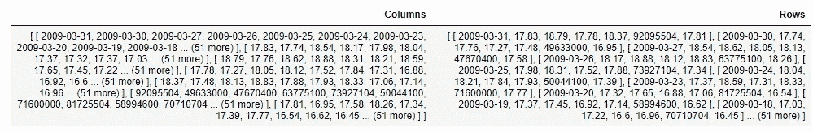

这可以通过注册数据帧的自定义格式化程序来覆盖。以下代码为**数据帧**和**数据帧行**注册自定义格式化程序，以在 HTML 表格中呈现数据。

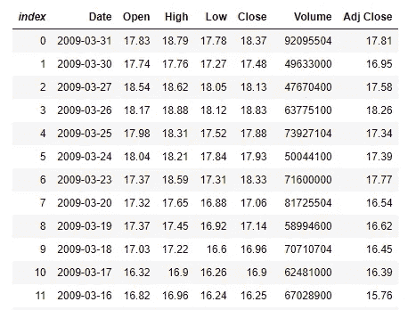

它只显示前 100 行。这可以通过修改 **take** 变量的值来改变。

```
Formatter<DataFrame>.Register((df, writer) =>
{
    var headers = new List<IHtmlContent>();
    headers.Add(th(i("index")));
    headers.AddRange(df.Columns.Select(c => (IHtmlContent) th(c.Name)));
    var rows = new List<List<IHtmlContent>>();
    var take = 100;
    for (var i = 0; i < Math.Min(take, df.Rows.Count); i++)
    {
        var cells = new List<IHtmlContent>();
        cells.Add(td(i));
        foreach (var obj in df.Rows[i])
        {
            cells.Add(td(obj));
        }
        rows.Add(cells);
    } 
    var t = table(
        thead(
            headers),
        tbody(
            rows.Select(
                r => tr(r))));
    writer.Write(t);    
    writer.Write(df.Rows.Count + " x "+df.Columns.Count);
}, "text/html");

Formatter<DataFrameRow>.Register((dataFrameRow, writer) =>
{
    var cells = new List<IHtmlContent>();
    cells.Add(td(i));
    foreach (var obj in dataFrameRow)
    {
        cells.Add(td(obj));
    }
    var t = table(
        tbody(
            cells));
    writer.Write(t);
}, "text/html");
```

# 创建数据框架

# 数据帧列

可以通过将 **DataFrameColumn** 对象的列表传递给 DataFrame 的构造函数来创建 DataFrame。

public data frame(params data frame column[]列)；
public data frame(IEnumerable<data frame column>列)；

以下代码创建了一个有 200 行 2 列的 DataFrame。第一列包含日期，第二列包含随机整数。它调用**PrimitiveDataFrameColumn**构造函数来创建 **DataFrameColumn** 实例。

```
var start = new DateTime(2009,1,1);
Random rand = new Random();
var numDataPoint = 200;PrimitiveDataFrameColumn<DateTime> date = new PrimitiveDataFrameColumn<DateTime>("Date", 
    Enumerable.Range(0, numDataPoint)
          .Select(offset => start.AddDays(offset))
          .ToList()); 
PrimitiveDataFrameColumn<int> data = new PrimitiveDataFrameColumn<int>("Data",
    Enumerable.Range(0, numDataPoint)
                        .Select(r => rand.Next(100))
                        .ToList()); 
var df = new DataFrame(date, data);
df
```

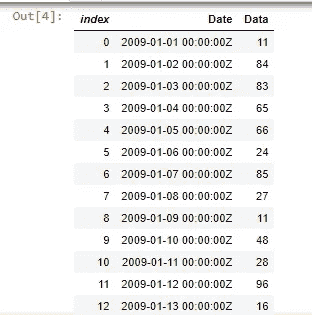

# CSV 文件

也可以通过调用**数据帧从 CSV 文件创建数据帧。LoadCsv** 静态方法。

下面的代码从 ohcldata.csv 文件创建一个 DataFrame。这个文件是从 [5.30 下载的。示例—基本 OHLC(开盘价、最高价、最低价、收盘价)金融阴谋](http://phplot.sourceforge.net/phplotdocs/ex-ohlcbasic.html)网站。该文件包含每日开盘、盘高、盘低、收盘的财务数据。

```
var df1 = DataFrame.LoadCsv("ohlcdata.csv");
df1
```

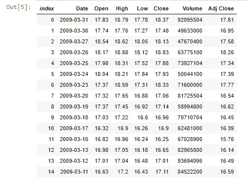

然后，可以使用 **Info** 方法生成数据帧中每一列的摘要。

```
df1.Info()
```

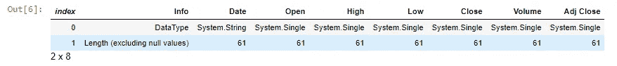

# 访问数据框架

# 通过索引访问数据

行索引和列索引可用于访问数据帧中的特定数据。索引是从零开始的编号。

下面的代码访问第一行和第二列中的数据。

```
df[0,1]
```

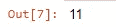

之后，可以给数据帧分配一个新值。

下面的代码将第一行和第二列的数据增加 10。

```
df[0,1] = int.Parse(df[0,1].ToString()) + 10;
df.Head(10)
```

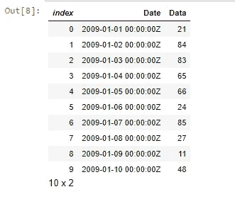

# 访问行数据

可以使用行索引来访问整行。索引是从零开始的编号。

下面的代码访问数据帧中的第十行。

```
df1.Rows[9]
```

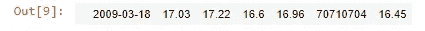

列索引也可用于访问行中的特定列。

下面的代码访问第十行的第四列。

```
df1.Rows[9][5]
```

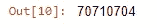

然后，新值也可以分配给该列。

下面的代码将 50000000 分配给第六列。

```
df1.Rows[9][5] = 50000000f;
df1.Head(10)
```

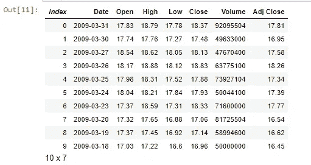

# 访问列数据

可以使用列名或索引来访问整列。索引是从零开始的编号。

下面的代码访问 DataFrame 中名为 **Data** 的列(第二列)。

```
//df.Columns["Data"] or df.Columns[1]
df.Columns["Data"]
```

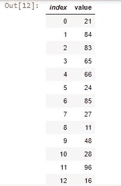

可以使用 DataFrame 的重载运算符来更改列中的数据。

下面的代码将该列中的所有数据增加 10。

```
df.Columns["Data"]= df.Columns["Data"]+10;
df
```

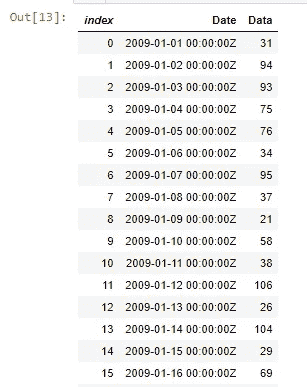

# 插入数据

# 添加新列

数据帧在**数据帧列集合**中维护一个**数据帧列**的列表。可以向 DataFrameColumnCollection 中添加新列。

下面的代码向 DataFrame 添加了一个新的整数列。

```
df.Columns.Add(new PrimitiveDataFrameColumn<int>("Data1", df.Rows.Count()));
df
```

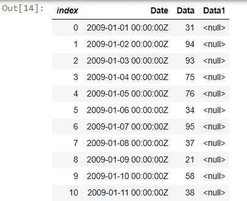

新列中的数据被设置为空。

下面的代码用 10 填充新列(Data1)中的空值。

```
df.Columns["Data1"].FillNulls(10, true);
df
```

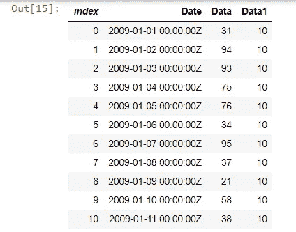

# 追加新行

**Append** 方法可用于向数据帧追加新行。

以下代码创建一个 **KeyValuePair** 实例列表，然后将其添加到 DataFrame 中。

```
df.Append(new List<KeyValuePair<string, object>>() { 
    new KeyValuePair<string, object>("Date", DateTime.Now),
    new KeyValuePair<string, object>("Data", 12),
    new KeyValuePair<string, object>("Data1", 50)
}, true);
df.Tail(10)
```

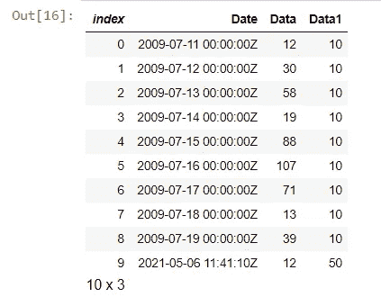

# 操纵数据帧

# 对数据帧进行排序

**OrderBy** 或 **OrderByDescending** 方法可用于按指定列对数据帧进行排序。

以下代码根据名为 **Data** 的列对 DataFrame 进行排序。

```
df.OrderBy("Data")
```

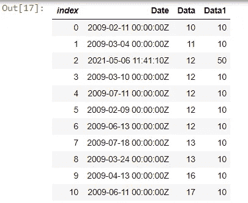

# 对数据帧进行分组

**GroupBy** 方法可用于根据列中的唯一值对数据帧的行进行分组。

以下代码按名为 Data 的列对 DataFrame 进行分组，然后计算每组中值的数量。

```
var groupByData = df.GroupBy("Data");
groupByData.Count().OrderBy("Data")
```

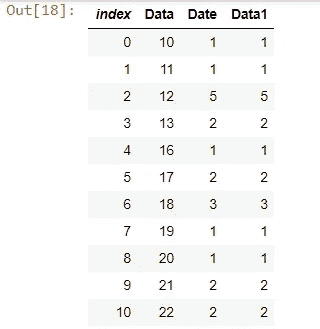

# 过滤数据帧

**Filter** 方法可用于通过行索引或布尔值过滤数据帧。

以下代码通过返回名为 **Data** 的列中的值大于 50 的行来过滤 DataFrame。

```
df.Filter(df.Columns["Data"].ElementwiseGreaterThan(50))
```

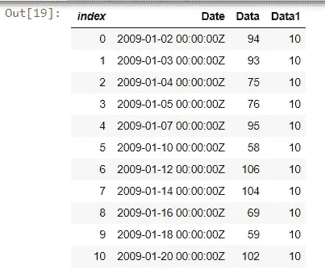

# 合并数据帧

**Merge** 方法可用于通过数据库风格的连接合并两个数据帧。

以下代码通过使用两个数据帧中包含的**日期**列来联接两个数据帧。首先，它将 **df1** 的**日期**列中的数据类型从**字符串**类型转换为**数据时间**类型。然后，它调用**合并**方法来连接数据帧。

```
df1.Columns["Date"] = new PrimitiveDataFrameColumn<DateTime>("Date", 
    df1.Columns["Date"]
                .Cast<object>()
                .ToList()
                .Select(x => DateTime.ParseExact(x.ToString(), "yyyy-MM-dd", System.Globalization.CultureInfo.InvariantCulture))
                .Cast<DateTime>());df1.Merge<DateTime>(df, "Date", "Date")
```

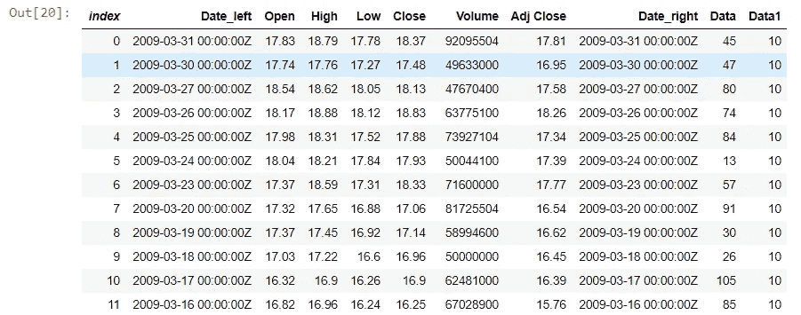

# 使用 XPlot 绘制图表。普罗蒂

[XPlot。Ploty](https://fslab.org/XPlot/) 是用于 F#和的跨平台数据可视化包。NET 编程语言。它基于流行的 JavaScript 图表库 [Plotly](https://plot.ly/) 。

以下示例演示了如何使用 XPlot。使用数据框中的数据绘制图表。

# 折线图

下面的代码从 DataFrame 中的**打开**列绘制了一个折线图。

```
var chart1 = Chart.Plot(
    new Graph.Scatter
    {
        x = df1.Columns["Date"],
        y = df1.Columns["Open"],        
        mode = "lines+markers"
    }
);
var chart1_layout = new Layout.Layout{
    title="Open Price",
    xaxis =new Graph.Xaxis{
        title = "Date"
        },
    yaxis =new Graph.Yaxis{
    title = "Price (USD)"
        }           
    };
chart1.WithLayout(chart1_layout);
chart1
```

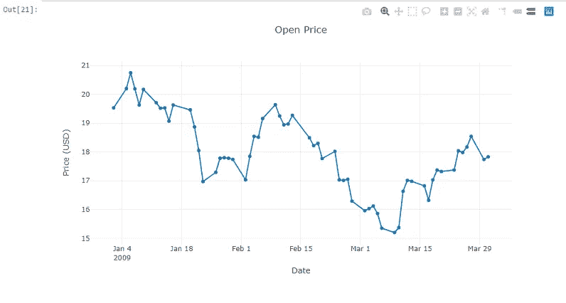

# 多线折线图

以下代码在折线图中绘制了**打开**和**关闭**列。

```
var chart2_list = new List<Graph.Scatter> 
{
    new Graph.Scatter
    {
         x = df1.Columns["Date"],
        y = df1.Columns["Open"],
        name="Open",
        mode = "lines"
    },
    new Graph.Scatter    
    {       
        x = df1.Columns["Date"],
        y = df1.Columns["Close"],
        name="Close",
        mode = "lines"
    }

};

var chart2 = Chart.Plot(
    chart2_list
);

var chart2_layout = new Layout.Layout{
    title="Open and Close Price",
    xaxis =new Graph.Xaxis{
        title = "Date"
        },
    yaxis =new Graph.Yaxis{
    title = "Price (USD)"
        }           
    };
chart2.WithLayout(chart2_layout);
chart2
```

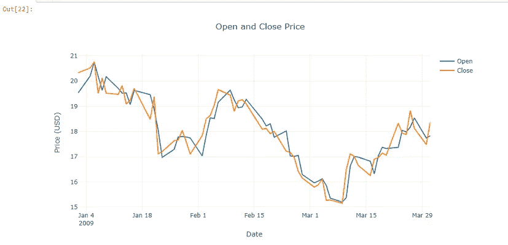

# 条形图

以下代码绘制了 DataFrame 中**卷**列的条形图。

```
var chart3 = Chart.Plot(new Graph.Bar
    {
        x = df1.Columns["Date"],
        y = df1.Columns["Volume"],        
        marker = new Graph.Marker{color = "rgb(0, 0, 109)"}
    }
);
var chart3_layout = new Layout.Layout{
    title="Volume",
    xaxis =new Graph.Xaxis{
        title = "Date"
        },
    yaxis =new Graph.Yaxis{
    title = "Unit"
        }           
    };
chart3.WithLayout(chart3_layout);
chart3
```

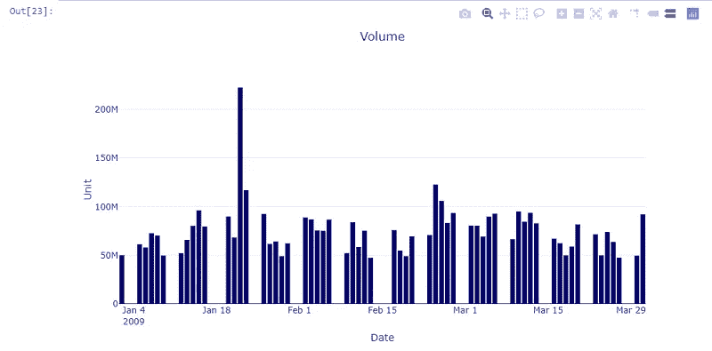

# 蜡烛图

下面的代码从 DataFrame 中的**打开**、**高**、**低**、**关闭**列绘制一个蜡烛图。

```
var chart4 = Chart.Candlestick(df1.OrderBy("Date").Rows.Select(row => new Tuple<string, double, double, double, double>(
                 ((DateTime)row[0]).ToString("yyyy-MM-dd"),
                 double.Parse(row[1].ToString()),
                 double.Parse(row[2].ToString()),
                 double.Parse(row[3].ToString()),
                 double.Parse(row[4].ToString())
                )));
chart4.WithLayout(new Layout.Layout{
    title="OHLC",
    xaxis =new Graph.Xaxis{
        title = "Date"
        },
    yaxis =new Graph.Yaxis{
    title = "Price (USD)"
        }           
    });
chart4
```

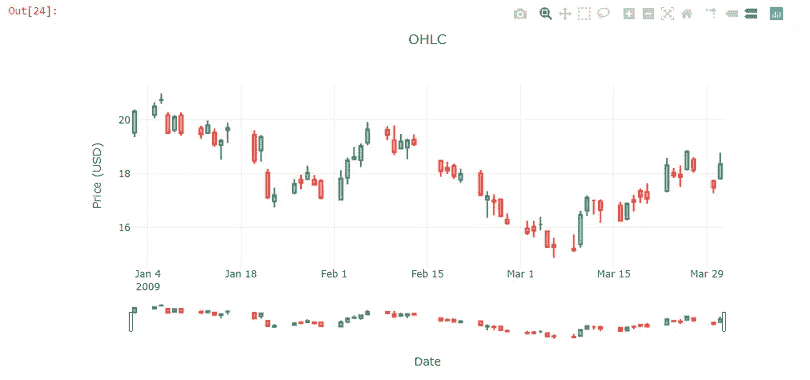

# 结论

Dotnet interactive 允许精通 Dotnet 编程语言的开发人员和数据科学家在 Jupyter Notebook 上运行 C#或 F#应用程序。不可否认的是，Jupyter Notebook 上运行的大部分应用都是使用 Dataframe 来操作数据，使用图表库来可视化数据。这篇文章介绍了微软的**。数据分析**和 **XPlot。Plotly** 包为 dotnet interactive 提供 DataFrame 类和图表库。

本文的第一部分演示了 DataFrame 类的基本用法，比如创建和数据操作。虽然与 Pandas python 库相比，DataFrame 类仍然缺少一些基本的特性，例如连接和标准计算，但我希望这在未来的版本中会有所改进。本文的最后一部分展示了如何使用 XPlot。Plotly 软件包为数据框中的数据创建折线图、条形图和蜡烛图。因为这个库是基于流行的 JavaScript 图表库 [Plotly](https://plot.ly/) 的，所以输出看起来很棒。

# 参考

1.  Phplot.sourceforge.net，荷兰国际发展署 5.30。示例-基本 OHLC(开盘、盘高、盘低、收盘)财务图。[在线]见:[http://phplot.sourceforge.net/phplotdocs/ex-ohlcbasic.html](http://phplot.sourceforge.net/phplotdocs/ex-ohlcbasic.html)[2021 年 5 月 6 日访问]。
2.  blue mountain capital . github . io . n . d . Deedle:用于. NET 的探索性数据库。[在线]可在:[https://bluemountaincapital.github.io/Deedle/](https://bluemountaincapital.github.io/Deedle/)[2021 年 5 月 6 日访问]。
3.  Govindarajan，p . 2019。DataFrame |简介。网络博客。【在线】。网络博客。可从以下网址获取:[【https://dev blogs . Microsoft . com/dotnet/an-introduction-to-data frame/](https://devblogs.microsoft.com/dotnet/an-introduction-to-dataframe/)【2021 年 5 月 6 日获取】。
4.  新泽西州塞杰拉，2020 年。dotnet/interactive:魔法命令。[在线] GitHub。可在:[https://github . com/dot net/interactive/blob/main/docs/magic-commands . MD](https://github.com/dotnet/interactive/blob/main/docs/magic-commands.md)【2021 年 5 月 6 日访问】。
5.  Winnington，e，2019。Eric winning ton——c# Jupyter 笔记本的提示和技巧。[在线]ewin ington . github . io .可在:【https://ewinnington.github.io/posts/jupyter-tips-csharp【2021 年 5 月 6 日访问】。
6.  Fslab.org . n . d . XPlot—F #数据可视化包。[在线]可在:[https://fslab.org/XPlot/index.html](https://fslab.org/XPlot/index.html)[2021 年 5 月 6 日访问]。
7.  Phuriphanvichai，j .，2021。使用。Jupyter 笔记本中的 NET Core |路孚特开发者。[在线]Developers.refinitiv.com。可从以下网址获取:[https://developers . refinitiv . com/en/article-catalog/article/using-net-core-in-jupyter-notebook.html](https://developers.refinitiv.com/en/article-catalog/article/using--net-core-in-jupyter-notebook.html)【2021 年 5 月 10 日获取】。