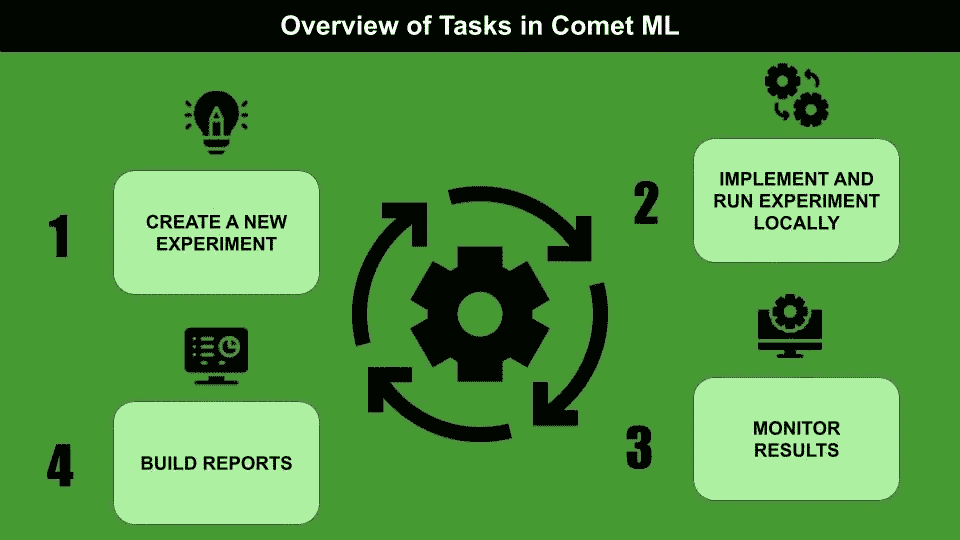
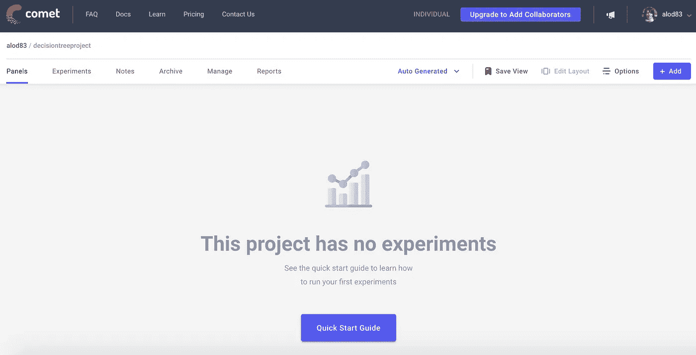
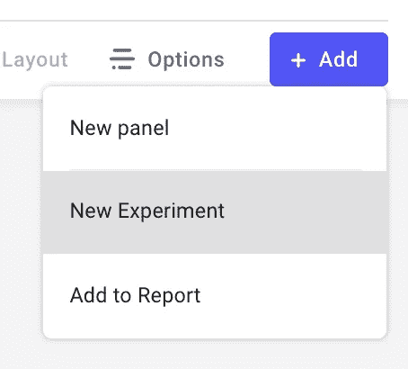
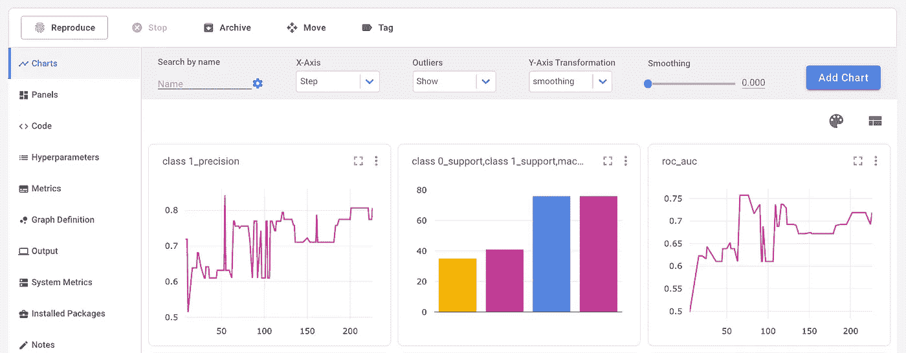
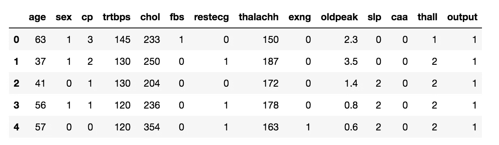
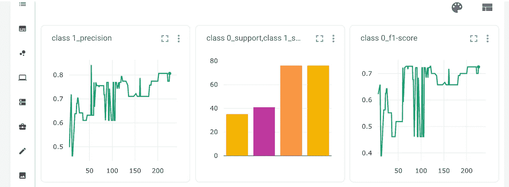

# Comet ML 入门

> 原文：<https://towardsdatascience.com/getting-started-with-comet-ml-549d44aff0c9?source=collection_archive---------17----------------------->

## 机器学习

## 机器学习流行实验平台概述，并附有实例。



作者图片

[Comet ML](https://www.comet.ml/) 是一个实验平台，它允许测试机器学习项目，从开始到最后的监控。网络上还有很多其他类似的平台，包括 [Neptune.ai](http://neptune.ai/) 、 [Guild.ai](https://guild.ai/) 、[神圣](https://github.com/IDSIA/sacred)等等。

Comet ML 可以很容易地与最流行的机器学习库集成，包括 scikit-learn、Pytorch、Tensorflow、Keras 等等。实验可以用 Python、Javascript、Java、R、REST APIs 编写。

在本文中，我主要关注 Python。

文章组织如下:

*   彗星 ML 概述
*   使用 Comet ML
*   用法示例

# 1 彗星 ML 概述

Comet ML 是一个允许跟踪实验的在线平台。Comet ML 的主要优点是我可以轻松地构建一个报告仪表板和一个监控系统。

Comet ML 提供了以下特性:

*   **比较实验**:我可以很容易地为同一个项目构建不同的实验，并比较结果，在度量、系统度量、参数等方面；
*   **监控模型**:我可以从早期阶段到生产阶段监控模型。这可以通过警报和调试策略来实现；
*   **与其他人协作**:我可以与其他人共享我的工作区项目；
*   **构建报告和面板**:从我的实验结果开始，我可以轻松地构建报告和仪表板；
*   **保持我的项目公开或使其公开**。

# 2 使用 Comet ML

一旦我进入 Comet ML Web 站点，我就可以创建一个免费帐户。然后，我登录到平台，并通过单击相对右上角的按钮创建一个新项目。我用需要的信息填写表格:


作者图片

当我单击“创建”按钮时，会出现一个空的控制面板。



作者图片

我可以添加一个新的实验，通过点击页面右上角的按钮(+Add)。我从下拉菜单中选择实验。



作者图片

该平台为实验生成了一个新的 API，可以在我的 Python 代码中使用:

```
*# import comet_ml at the top of your file*
from comet_ml import Experiment

*# Create an experiment with your api key*
experiment = **Experiment**(
    api_key="PUT HERE MY API KEY",
    project_name="decisiontree",
    workspace="PUT HERE MY ACCOUNT NAME",
)
```

现在，我需要在我的本地计算机上安装`comet_ml` Python 包:

```
pip3 install comet_ml 
```

然后我就可以像往常一样开始编码了。

## 2.1 实验课概述

实验类是本地代码与 Comet ML 的接口。它定义了许多方法，这些方法在 [Comet 官方文档](https://www.comet.ml/docs/python-sdk/Experiment/)中有描述。

在这里，我描述一些常见的方法:

*   `log_metric()`和`log_metrics()` —向实验注册一个或多个评估度量，例如准确度、精确度和召回率；
*   `log_confusion_matrix()`—为实验注册一个混淆矩阵；
*   `log_figure()` —将一个图形(如`pyplot`)注册到实验中，并保存为 SVG 图像；
*   `display()` —在 Jupyter 中创建交互环境，将 Comet ML 仪表盘显示为一个单元格的输出；
*   `end()` —如果实验在 Jupyter 中运行，该方法指定实验结束。

## 2.2 实验仪表板

一旦实验完成，Comet ML 提供了一个仪表板，在这里我可以看到我在代码中跟踪的所有度量、图形、参数等等。

评估指标是自动绘制的。例如，如果一个实验是在多个步骤上运行的，我可以很容易地画出图表，显示度量与步骤数的关系。



作者图片

在实验仪表板的左侧，可以选择许多选项，包括但不限于:

*   **面板** —最终仪表板，可用作最终用户的报告；
*   **指标** —包含所有指标及其值的表格；
*   **系统指标** —所有系统指标的可视化表示，包括内存使用情况、CPU 利用率。

# 3 用法示例

作为 Comet ML 的一个实际用例，我利用了由 [Kaggle](https://www.kaggle.com/rashikrahmanpritom/heart-attack-analysis-prediction-dataset) 提供的心脏病发作数据集。

首先，我通过指定项目名称和工作空间(我的帐户名称)来设置实验。

```
from comet_ml import Experiment

experiment = **Experiment**(
    api_key="PUT HERE MY API KEY",
    project_name="decisiontree",
    workspace="PUT HERE MY ACCOUNT NAME",
)
```

现在我可以照常工作了。我将数据集作为一个`pandas`数据帧加载。

```
import pandas as pddf = pd.read_csv('source/heart.csv')
df.head()
```



作者图片

我定义特征列。

```
cols = []
for col in df.columns:
    if col != 'output':
        cols.append(col)
```

我定义输入和输出变量:

```
X = df[cols]
y = df['output']
```

我通过一个`MinMaxScaler`缩放所有的输入特征

```
from sklearn.preprocessing import MinMaxScalerscaler = MinMaxScaler()
X_scaled = scaler.fit_transform(X)
```

我在训练集和测试集中设置了数据集。

```
from sklearn.model_selection import train_test_split
random_state = 42
X_train, X_test, y_train, y_test = train_test_split(X_scaled,y, random_state=random_state)
```

我利用一个`DecisionTreeClassifier`作为模型。我用训练集中包含的渐进数量的样本来拟合它，并预测测试集中所有样本的输出类。我还为每个步骤构建了一个分类报告。

我通过名为`log_metrics()`的 Comet 实验函数记录`classification_report()`函数返回的指标。我还通过`experiment.log_confusion_matrix()`功能记录了混乱矩阵。

```
from sklearn.tree import DecisionTreeClassifier
from sklearn.metrics import classification_report
import numpy as npmodel = DecisionTreeClassifier(random_state=random_state, max_depth=2)
min_samples = 5
target_names = ["class 0", "class 1"]for step in range(min_samples, len(X_train)):
    model.fit(X_train[0:step], y_train[0:step])
    y_pred = model.predict(X_test)
    pred_proba = np.max(model.predict_proba(X_test), axis=1)
    report = classification_report(y_test, y_pred, target_names=target_names, output_dict=True)
    for label, metric in report.items():
        try:
            experiment.log_metrics(metric, prefix=label, step=step)except:
            experiment.log_metric(label, metric,step=i)
    experiment.log_confusion_matrix(y_test.tolist(), y_pred.tolist())
```

我用 Jupyter 展示了实验结果。

```
experiment.display(tab="confusion-matrices")
```

下图显示了生成的仪表板的摘录:



作者图片

我结束了实验。

```
experiment.end()
```

# 摘要

恭喜你！您已经学习了如何在机器学习的实验平台 Comet ML 中配置和运行实验。

Comet ML 可以用来运行更复杂的实验。请继续关注更多提示😃

如果你已经走了这么远来阅读，对我来说今天已经很多了。谢谢！你可以在[这篇文章](https://alod83.medium.com/which-topics-would-you-like-to-read-c68314dc6813)中读到更多关于我的信息。

# 你想了解更多关于彗星的知识吗？

你可以看看我的书 **Comet for Data Science** ，由 Packt 出版，由 Comet 首席执行官 Gideon Mendels 作序！

> [https://www.cometfordatascience.com/](https://www.cometfordatascience.com/)

# 相关文章

[](/a-deep-dive-into-neuton-dab72db4b2d0) [## 深入内乌顿

### 平台概述、其功能和使用示例。

towardsdatascience.com](/a-deep-dive-into-neuton-dab72db4b2d0) [](/mito-speed-up-dataset-manipulation-with-no-coding-407b8c72f46f) [## 米托:无需编码即可加速数据集操作

### 概述米托，一个用于交互式数据集操作的 Python 库，不需要任何编程技能。

towardsdatascience.com](/mito-speed-up-dataset-manipulation-with-no-coding-407b8c72f46f) [](/an-overview-of-versatile-data-kit-a812cfb26de7) [## 多功能数据工具包概述

### 开始使用多功能数据工具包，这是一个使数据工程师工作更高效的框架

towardsdatascience.com](/an-overview-of-versatile-data-kit-a812cfb26de7)