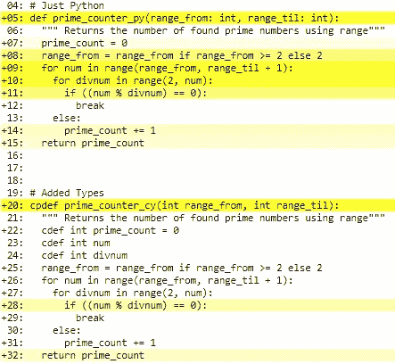
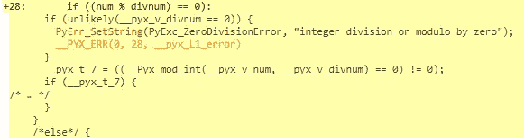
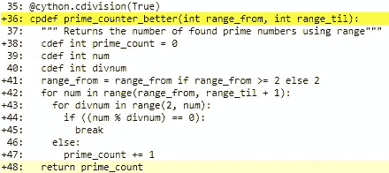

# Cython 入门:如何在 Python 中每秒执行超过 17 亿次计算

> 原文：<https://towardsdatascience.com/getting-started-with-cython-how-to-perform-1-7-billion-calculations-per-second-in-python-b83374cfcf77?source=collection_archive---------7----------------------->

## 结合 Python 的易用性和 C 的速度


Cython 将为你的程序添加一个加力燃烧室(图片由 [Oscar Sutton](https://unsplash.com/@o5ky) 在 [Unsplash](https://unsplash.com/photos/pBrHNFqcX-M) 上提供)

Python 的主要优点是对开发人员非常友好，并且易于掌握。然而，这些设计选择有一个主要的缺点；它们导致 Python 的执行速度比其他一些语言慢得多。这篇文章将告诉你如何既吃蛋糕又拥有它。我们将消除 Python 代码中的瓶颈，并使用 Cython 极大地加快速度。在继续弄清楚我们正在试图解决的问题之前，我强烈推荐阅读这篇文章。Cython 将帮助我们:

*   使用类似 Python 的语法编写代码，然后 Cython 将使用这些代码生成 C 代码。我们就不用自己用 C 语言写了
*   编译 C 代码并打包成我们可以导入的 Python 模块(就像`import time`)
*   将我们程序的执行速度提高了 70 倍以上
*   向同事吹嘘我们超快的代码

我将这篇文章分成 4 个部分:首先，我们在第一部分中安装依赖项和设置。然后，在**B 部分**中，我们只关注让 Cython 代码运行 Python。完成后，我们使用一个方便的内置工具来优化 C 部分的 Cython 代码，这个工具会告诉你代码中的瓶颈在哪里。然后，在**D 部分**中，我们将通过多重处理我们的模块来挤出最后一点速度，导致每秒超过 17 亿次计算！
我们来码！

> 通过使用 Cython 创建一个 Python 模块并对生成的函数进行多重处理，我们将执行速度从 2.5 万 e/ms 提高到了 175 万 e/ms。速度提高了 70 倍！

# 在开始之前

创建一个 Cython 包有一些巨大的好处，但是它也比常规的 Python 编程需要更多的努力。在把你的代码的最后一行变成 Cythonizing 之前，想想下面的内容。

*   确保你的代码因为正确的原因而变慢。我们无法编写等待速度更快的代码。我推荐先浏览一下 [**这篇文章**](https://mikehuls.medium.com/why-is-python-so-slow-and-how-to-speed-it-up-485b5a84154e) ，因为它解释了*为什么* Python 很慢，它是如何工作的，以及如何绕过某些瓶颈。通过这种方式，你会更加理解 Cython 是如何解决我们速度慢的一个非常好的解决方案。
*   并发性是问题所在吗？
    你的问题可以通过 [**使用线程**](https://mikehuls.medium.com/multi-tasking-in-python-speed-up-your-program-10x-by-executing-things-simultaneously-4b4fc7ee71e) (比如等待一个 API)来解决吗？也许 [**在多个 CPU 上并行运行代码**](https://mikehuls.medium.com/advanced-multi-tasking-in-python-applying-and-benchmarking-threadpools-and-processpools-90452e0f7d40) 通过多处理帮助你提高速度？
*   你是一个优秀的 C 程序员还是仅仅对 Python 和 C 如何协同工作感兴趣？查看 [**这篇文章**](https://mikehuls.medium.com/write-your-own-c-extension-to-speed-up-python-x100-626bb9d166e7) 关于 Python 模块是如何用 C 语言编写的(Python 如何使用 C 代码)。
*   确保使用一个 [**虚拟环境**](https://mikehuls.medium.com/virtual-environments-for-absolute-beginners-what-is-it-and-how-to-create-one-examples-a48da8982d4b) 。Cython 不要求这样做，但这是最佳实践。

# A 部分—安装和设置

安装非常容易。

```
pip istall Cython
```

为了展示 Cython 如何加快 CPU 密集型任务的速度，我们将使用一个简单的例子:我们将 Cython 化一个函数，该函数计算给定范围内素数的数量。这方面的 Python 代码如下所示:

请注意，这几乎不是计算素数的最有效的方法，但现在这并不重要。我们只是想要一个计算量很大的函数。


(图片由[卡拉·富勒](https://unsplash.com/@caraventurera)在 [Unsplash](https://unsplash.com/photos/34OTzkN-nuc) 上拍摄)

# B 部分—创建、打包和导入

首先，我们将创建一个非常简单的 Cython 函数，它与我们用 Python 编写的函数非常相似。本部分的目标是:

1.  创建函数
2.  在 Python 模块中编译和打包 C 代码
3.  导入并使用我们的函数。

接下来，我们将优化函数，以实现令人惊叹的速度。

## 1.创建 Cython 函数

让我们创建一个名为`primecounter.pyx`的新文件:

*   将前一部分的`prime_count_vanilla_range`函数复制到文件中
*   将我们刚刚粘贴的函数重命名为`prime_counter_cy`。

现在，我们将只在 Cython 中运行 Python 代码。这是可能的，因为 Cython 是 Python 的超集；在 Python 中可以做的任何事情，在 Cython 中都可以做。

仅仅复制函数应该已经提供了很好的加速，因为代码现在已经编译好了。然而，在我们检查之前，我们必须使用一个模块将代码放入 Python。

## 2.编译并打包成 Python 包

下一步是指示 Cython 获取 pyx 文件，将其编译成 C，并将代码填充到 Python 模块中，我们可以导入并在 Python 代码中使用该模块。为此，我们需要一个简单的`setup.py`脚本来定义我们想要打包什么以及如何打包。看起来是这样的:

> 您可能熟悉`*setup.py*`脚本:在创建自己的 Python 包时会用到它。更多关于创建自己的包 [**这里(公有包)**](https://mikehuls.medium.com/create-and-publish-your-own-python-package-ea45bee41cdc) 和 [**这里(私有包)**](https://mikehuls.medium.com/create-your-custom-python-package-that-you-can-pip-install-from-your-git-repository-f90465867893) **。**

我们简单地定义一个扩展列表，并将其传递给`setup`函数。在`Extension`中，我们给我们的模块命名。这样我们可以`import primes`然后`primes.prime_counter_cy(0, 1000)`晚点。首先，我们将创建并安装模块。下面的代码类似于`pip install primes`:

```
python setup.py build_ext --inplace
```

*您也可以使用 CythonBuilder 来编译、构建和打包您的 Cython 代码；查看* [***此处***](https://pypi.org/project/cythonbuilder/) *。*

**故障排除** Cython 会将 pyx 编译成一个 C 文件，我们会将它包含在模块中。对于这个编译过程，它需要一个编译器。如果你收到一条类似`Microsoft Visual C++ 14.0 or greater is required`的消息，这意味着你没有编译器。你可以通过安装 C++构建工具来解决这个问题，你可以在这里下载。

## 3.导入和使用我们的函数

既然我们的模块已经编译、打包和安装，我们就可以轻松地导入和使用它了:

```
import primes
print(primes.prime_counter_cy(0, 1000))   
# >> will correctly print out 168
```

当我们对 Python 函数和 Cython 函数计时时，我们已经看到了很好的加速效果:

```
Finding primes between 0 and 1000
Total number of evaluations required = 78 thousand
[py]     2.92ms (25k per ms)
[cy]     1.58ms (42k per ms)
```

尽管我们只是复制了这个函数，没有花一秒钟去优化它，但它仍然更快，因为代码是编译过的。

请注意，求值次数表示函数需要比较多少个数才能找到该范围内的所有素数。它们由多个计算组成，这使得这种加速更令人印象深刻。点击查看计算方法[。](https://gist.github.com/mike-huls/5347b9e2cd339934857061db39d6abc9)

现在有趣的部分开始了:让我们开始优化，看看我们能从我们的机器中挤出多少速度！


我们的代码已经打包好，可以进行调整了(图片由 [Jackie Zhao](https://unsplash.com/@jiaweizhao) 在 [Unsplash](https://unsplash.com/photos/W-ypTC6R7_k) 上提供)

# C 部分—优化我们的 Cython 功能

我们将调整 pyx 文件中的函数来加速它。我们先看看结果，这样才能过一遍。

我们为变量和函数本身添加了类型。许多这些附加功能使 C 能够编译我们的程序，这样我们就不会被 Python 解释器所困扰。查看 [**这篇文章**](https://mikehuls.medium.com/why-is-python-so-slow-and-how-to-speed-it-up-485b5a84154e) 以获得更多关于解释器为什么降低执行速度以及如何提高执行速度的信息(剧透:编写 Cython 模块就是其中之一！)

当 Cython 中的变量没有被类型化时，我们回到 Python 处理变量的方式；用解释器检查它们，并将它们存储在一个 PyObject 中(再次查看文章[**)。这非常慢，所以通过输入变量，我们让 C 来处理它们，这非常快。**](https://mikehuls.medium.com/why-is-python-so-slow-and-how-to-speed-it-up-485b5a84154e)

## 添加类型

在第 1 行中，我们将`prime_counter_cy`定义为 cpdef 类型的函数。这意味着 Python 和 C 都可以访问该函数。在第一行我们写下`int range_from`。这样编译器就知道 range_from 的数据类型是一个整数。因为我们知道哪些数据值得期待，所以我们避免了许多检查。第 3 行也是如此，我们定义了一个名为 prime_count 的整数。在下面两行中，我们定义了`num` 和`divnum`。这两个整数的特别之处在于它们还没有值，它们的值只在第 7 行和第 8 行被设置。

仅仅是增加类型就大大提高了性能。看看这个:

```
Finding primes between 0 and 50k
Total number of evaluations required = 121 million
[py]        4539ms ( 27k /ms)
[cy]        2965ms ( 41k /ms)
[cy+types]   265ms (458k /ms)
```

我们从 4.5 秒多一点到四分之一秒。这只是增加了一些类型，速度提高了 17 倍。

## 使用注释进一步优化

我们所有的变量都被定义了。如何才能进一步优化？还记得`setup.py`吗？在第 8 行(见上)，我们用`annotate=True`调用了`cythonize`函数。这将在 pyx 文件所在的目录下创建一个 HTML 文件。

当我们在浏览器中打开该文件时，我们会看到用黄线标注的代码，黄线表示该代码行与 Python 的接近程度。亮黄色表示它很像 Python(读作:慢)，白色表示它更接近 C(快)。这是我们在浏览器中打开`primecounter.html`时的样子:



我们在 annotations.html 的两个 Cython 功能(图片由作者提供)

在上图中，你可以看到添加类型对代码的影响。您还可以单击每一行来查看生成的 C 代码。我们点开第 28 行，看看为什么不是全白。



一行代码如何翻译成 C 语言(图片由作者提供)

正如你在上面的图片中看到的，Python 检查了一个 ZeroDivisionError。我不认为这是必要的，因为调用 divnum 的范围从 2 开始。

## 避免不必要的检查

所以还是进一步优化吧！我们在我们的函数中添加了一个装饰器，告诉编译器避免 ZeroDivisionError-check。只有当你非常确定你的代码时才这样做，因为避免检查意味着你的程序失败的额外风险:

您可以应用许多这种所谓的编译器指令。当涉及到循环时，它们中的许多都很有趣。点击这里阅读更多关于这些编译器指令[的内容。](https://cython.readthedocs.io/en/latest/src/userguide/source_files_and_compilation.html#compiler-directives)

查看我们的注释:



请注意，第 44 行现在完全是白色的(图片由作者提供)

```
Finding primes between 0 and 50k
Total number of evaluations required = 121 million
[py]        4539ms ( 27k /ms)
[cy]        2965ms ( 41k /ms)
[cy+types]   265ms (458k /ms)
[cy-check]   235ms (517k /ms)
```

这条小指令进一步缩短了执行时间！


为了提高速度，我们需要更多的工人来完成这项任务

# D 部分—更快的速度

所以我们的功能现在已经非常优化了，它几乎完全用机器代码运行。我们怎样才能挤出更多的速度呢？如果你读过这篇文章，你可能会有一个想法。我们的代码仍然在一个 CPU 上运行，而我的笔记本电脑有 12 个 CPU，为什么不用更多呢？

上面的代码创建了一个进程池(同样；阅读 [**这篇文章**](https://mikehuls.medium.com/advanced-multi-tasking-in-python-applying-and-benchmarking-threadpools-and-processpools-90452e0f7d40) )这将在我所有可用的 CPU 上分配所有任务。在第 3 行中，我们使用一个函数将 start 和 endnumber 除以 workers 的数量。如果我们希望 0 到 100 有 10 个工人，它会产生 0 到 9，10 到 19，20 到 29，等等。

接下来，我们通过将作业提交给 threadpoolexecutor 来创建作业。在最后一条记录中，我们检索每个作业的结果，并对结果求和以获得素数的个数。

## 值得投资设立吗？

正如 [**这篇文章**](https://mikehuls.medium.com/multi-tasking-in-python-speed-up-your-program-10x-by-executing-things-simultaneously-4b4fc7ee71e) 解释的那样，应用多个流程需要一点投资；创建流程需要一段时间。如果用普通函数对我们的新多处理函数进行基准测试，当我们检查前 10k 个数字时，速度甚至更慢:

```
Finding primes between 0 and 10k
Total number of evaluations required = 5.7 million
[py]       246ms ( 23k /ms)
[cy]       155ms ( 37k /ms)
[cy+types]  14ms (423k /ms)
[cy-check]  12ms (466k /ms)
[cy-mp]    201ms ( 29k /ms)
```

呀，那一点也不快。让我们看看当我们检查前 50.000 个数字时会发生什么:

```
finding primes between 0 and 50k
Total number of evaluations required = 121 million
[py]       4761ms ( 25k /ms)
[cy]       3068ms ( 40k /ms)
[cy+types]  304ms (399k /ms)
[cy-check]  239ms (508k /ms)
[cy-mp]     249ms (487k /ms)
```

请注意，我们并没有通过提高计算速度来弥补设置流程的投资。

## 最终测试

最后一个测试，我们要找出 0 到 200k 之间的所有素数。注意，我们已经为前两个方法等待了几秒钟。还要注意，增加我们的范围会成倍地增加所需评估的总数。为此，我们只对 Cython 方法进行基准测试:

```
finding primes between 0 and 200k
Total number of evaluations required = 1.7 billion
[cy+types]  3949ms ( 433k /ms)
[cy-check]  3412ms ( 502k /ms)
[cy-mp]      978ms (1750k /ms)
```

这里我们看到了我们的结果；我们每毫秒执行**175 万次评估**。注意实际操作的次数[甚至更高](https://gist.github.com/mike-huls/5347b9e2cd339934857061db39d6abc9)！

> 通过使用 Cython 创建一个 Python 模块并对生成的函数进行多重处理，我们将执行速度从 25k e/ms 提高到了 175 万 e/ms。速度提高了 70 倍！


我们的代码已经从一辆慢车变成了一架高超音速飞机(图片由 [NASA](https://unsplash.com/@nasa) 在 [Unsplash](https://unsplash.com/photos/Tquhp9Kqkzk) 上提供)

# 结论

通过这篇文章，我希望向您展示，您可以用一点 Cython 来扩展您的 Python 代码，以实现令人难以置信的速度提升，将 Python 中编码的简易性与编译 c 的令人难以置信的速度结合起来

我希望一切都像我希望的那样清楚，但如果不是这样，请让我知道我能做些什么来进一步澄清。与此同时，请查看我的其他关于各种编程相关主题的文章，比如:

*   [Python 为什么这么慢，如何加速](https://mikehuls.medium.com/why-is-python-so-slow-and-how-to-speed-it-up-485b5a84154e)
*   [自己写 C 扩展加速 Python x100](https://mikehuls.medium.com/write-your-own-c-extension-to-speed-up-python-x100-626bb9d166e7)
*   [Python 中的高级多任务处理:应用线程池和进程池并进行基准测试](https://mikehuls.medium.com/advanced-multi-tasking-in-python-applying-and-benchmarking-threadpools-and-processpools-90452e0f7d40)
*   [面向绝对初学者的虚拟环境——什么是虚拟环境，如何创建虚拟环境(+示例](https://mikehuls.medium.com/virtual-environments-for-absolute-beginners-what-is-it-and-how-to-create-one-examples-a48da8982d4b))
*   [创建并发布自己的 Python 包](https://mikehuls.medium.com/create-and-publish-your-own-python-package-ea45bee41cdc)
*   [创建您的定制私有 Python 包，您可以从您的 Git 库 PIP 安装该包](https://mikehuls.medium.com/create-your-custom-python-package-that-you-can-pip-install-from-your-git-repository-f90465867893)
*   [使用 FastAPI 用 5 行代码创建一个快速自动记录、可维护且易于使用的 Python API](https://mikehuls.medium.com/create-a-fast-auto-documented-maintainable-and-easy-to-use-python-api-in-5-lines-of-code-with-4e574c00f70e)
*   [通过简单的升级大大提高您的数据库插入速度](https://mikehuls.medium.com/dramatically-improve-your-database-inserts-with-a-simple-upgrade-6dfa672f1424)

编码快乐！

—迈克

喜欢我正在做的事情吗？ [*跟我来！*](https://mikehuls.medium.com/membership)

[](https://mikehuls.medium.com/membership) [## 通过我的推荐链接加入媒体-迈克·赫斯

### 作为一个媒体会员，你的会员费的一部分会给你阅读的作家，你可以完全接触到每一个故事…

mikehuls.medium.com](https://mikehuls.medium.com/membership)