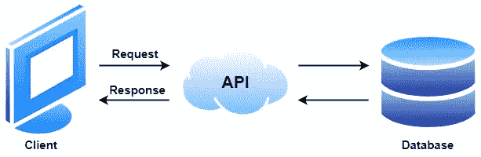
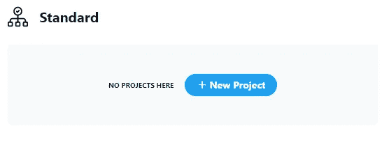
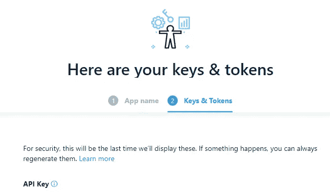

# 在不到一小时的时间内开始使用 Twitter API v2 收集数据

> 原文：<https://towardsdatascience.com/getting-started-with-data-collection-using-twitter-api-v2-in-less-than-an-hour-600fbd5b5558?source=collection_archive---------8----------------------->

## 使用 Twitter API v2 的搜索查询介绍和使用 Python 的演示。


来源:作者

# 目录:

1.  [简介](#5caf)
2.  [什么是 API？](#77d0)
3.  [推特 API](#0936)
4.  [访问 Twitter API](#b78f)
5.  [使用 Twitter API 发出基本请求](#06c8)
6.  [使用 Twitter API 修改请求](#74f7)
7.  [结论](#9572)

# *简介*

社交媒体的无处不在使得各种社交媒体平台作为数据来源越来越受欢迎。随着社交媒体作为数据源的兴起，使用 API 收集数据正在成为许多数据科学角色非常抢手的技能。今天，我们将使用 Twitter API v2 从微博和社交网络服务 Twitter 收集社交媒体帖子。

Twitter 现在每月有近 4 亿活跃用户，这意味着可以收集大量数据，其中大部分是公开的。除此之外，Twitter 开发团队最近从头开始重建了 Twitter API，在 2020 年下半年发布了 Twitter API v2。这个 API 有很好的文档记录，并且易于使用，使得利用这个丰富的数据源比以往任何时候都更容易。

本文介绍了什么是 API，并记录了使用 Twitter API v2 的过程，从获得对 API 的访问，到连接到搜索端点并收集与一些感兴趣的关键字相关的数据。阅读这篇文章不需要熟悉 Twitter API 或任何 API 知识。

# 什么是 API？

应用程序编程接口(API)是一种软件中介，允许两个应用程序相互通信以访问数据。API 经常用于你在手机上的每一个动作，例如发送私人信息或查看足球比赛的比分。这两者都使用一个 API 来访问和传递信息到您的手机。API 基本上是一个信使，接收你的请求，翻译它们，并返回响应。本质上，开发人员插入 API 来为最终用户访问某些资产。当然，为了确保数据安全，API 只提供应用程序程序员公开的精选数据。API 通常需要 API 密钥来认证请求。API 文档通常包含访问说明和要求的必要信息。很多 API 甚至可以免费使用。通常，开发人员可以遵循现有的 API 文档来构建 URL，以便在浏览器中提取数据。



一个基于 web 的 API，接受客户端的请求并返回数据作为响应。来源:作者

# Twitter API

Twitter API 是一个记录良好的 API，它使程序员能够以高级方式访问 Twitter。它可以用来分析，学习，甚至与推文互动。它还允许与直接消息、用户和其他 Twitter 资源进行交互。Twitter 的 API 还允许开发者访问各种用户档案信息，如用户搜索、黑名单、实时推文等等。关于 API 产品、用例以及文档的信息可以在[开发者平台](https://developer.twitter.com/en)上获得。关于 Twitter 开发者政策的细节可以在[这里](https://developer.twitter.com/en/developer-terms/policy}{here)找到。

开发人员可以使用 Twitter 开发的各种 API。这些 API 通过从 Twitter 数据中获取洞察力，使研究人员和公司受益。然而，它也适用于较小规模的项目，如小规模的数据分析，创建机器人，甚至创建可以与 Twitter 交互的全自动系统。在这篇文章中，我们将使用 Twitter API 来提取一些与指定搜索查询相匹配的最近的公共 Tweets。我们将使用的 API 产品跟踪对任何人都是免费的，并且允许每月提取多达 10 万条推文。

# 访问 Twitter API

在使用 Twitter API 之前，您必须已经拥有一个 Twitter 帐户。然后，它需要申请访问 Twitter API，以便获得凭证。我们将看到的 API 端点是[GET/2/tweets/search/recent](https://developer.twitter.com/en/docs/twitter-api/tweets/search/api-reference/get-tweets-search-recent)。这将返回过去七天中与搜索查询相匹配的公共推文，并可供获准将 Twitter API 与标准产品跟踪或任何其他产品跟踪一起使用的用户使用。

出于本文的目的，我们将使用最近的搜索端点，这意味着我们将只需要访问标准产品跟踪。标准产品路线是那些刚刚入门、构建有趣的东西等的默认产品路线。可供选择的产品类别有学术类和商业类，对那些有资格或愿意付费的人来说有更大的能力。

申请标准产品认证并获得必要证书的过程包括首先拥有一个 Twitter 帐户。然后你必须通过填写这个页面上的表格来申请一个开发者账户。请注意，最近搜索端点仅返回最近 7 天内符合搜索条件的 Tweets。一个类似的归档搜索端点 [GET /2/tweets/search/all](https://developer.twitter.com/en/docs/twitter-api/tweets/search/api-reference/get-tweets-search-all) 拥有更强大的功能。它允许用户返回与搜索查询相匹配的公开推文，最早可以追溯到 Twitter 2006 年的第一篇帖子。但是，此端点仅适用于那些已经获得[学术研究产品路线](https://developer.twitter.com/en/docs/projects/overview#product-track)批准的用户。学术研究产品跟踪是 Twitter API v2 的一个令人兴奋的新增功能，它允许用户使用最广泛的端点，每个月可以发布多达 1000 万条推文！Twitter API v2 端点的完整列表可在[这里](https://developer.twitter.com/en/docs/twitter-api/early-access)获得。可以在[这里](https://developer.twitter.com/en/portal/products/academic)找到更多关于可用于学术研究的特性的细节。可以在此处检查该产品轨道[的合格性。申请学术产品跟踪许可证的过程类似，但申请表更详细，必须经过 Twitter 开发团队的批准。](https://developer.twitter.com/en/products/twitter-api/academic-research/application-info)

一旦应用程序被批准，人们最终可以在标准产品跟踪中使用各种 API 端点。要做到这一点，必须打开[开发者门户](https://developer.twitter.com/en/portal/projects-and-apps)并选择“创建新项目”，填写所需的详细信息，最后给新应用起一个名字。



来源:作者在 [Twitter 开发者平台](https://developer.twitter.com/)上的应用截图

完成后，您将被导航到密钥和令牌页面。在你命名你的应用程序后，你会收到你的 API 密匙和不记名令牌(隐藏在下面的截图中)。这些是连接到 Twitter API v2 中的端点所必需的。



来源:作者在 [Twitter 开发者平台](https://developer.twitter.com/)上的应用截图

记下您的 API 密钥、API 密钥和不记名令牌。一旦您离开此页面，您将无法再次看到这些内容。但是，如果您丢失了这些密钥和令牌，仍然可以重新生成它们。这些用于验证使用 Twitter API 的应用程序，并根据端点验证用户。请注意，所有这些密钥都应该像密码一样对待，而不是共享或以明文形式写在您的代码中。

# 用 Twitter API 发出一个基本请求

现在所有的 API 访问键都应该排序了，剩下的工作就是测试 API 了！这里的第一步是加载您的凭证。一种方法是使用命令提示符(或另一种类似的工具)来传递作为环境变量的不记名令牌和一个 Juptyer 笔记本(可以通过安装 [Anaconda](https://www.anaconda.com/) 获得)来发出请求和显示响应。首先打开一个命令提示符，将目录更改为您希望保存脚本的位置。在命令提示符下，输入以下命令，传递刚刚由应用程序创建的“不记名令牌”:

```
set BEARER_TOKEN=YOUR_BEARER_TOKEN
```

接下来用命令打开 Jupyter 笔记本:

```
Jupyter Notebook
```

创建一个新的 Python 3 Jupyter 笔记本文件。接下来，我们需要做的第一件事是导入一些库。

接下来，我们需要建立到 Twitter API 的连接，并访问我们的凭证。为此，我们将创建一个 **connect_to_twitter()** 函数，从环境变量中检索不记名令牌。在这一步中，我们还传递了用于授权的承载令牌，并返回了将用于访问 API 的头。

现在我们已经准备好使用 API 了！Twitter 最近推出了一个新的#ExtremeWeather [迷你网站](https://blog.twitter.com/developer/en_us/topics/community/2021/visualizing-the-global-extremeweather-conversation-on-twitter)[【2】](#70c7)。这让我们对 Twitter 上可用的数据洞察有了一个很好的了解。因此，在本例中，我们将提取一些与 Twitter 上的#ExtremeWeather 对话相关的最新推文。为此，我们必须为端点构建适当的 URL 请求以及我们想要传递的参数。

这里 URL 的“最近”部分是端点，查询“ExtremeWeather”是要搜索的关键字。同样，我们可以编写 URL 并分离出查询参数，如下所示:

Twitter API 的响应是以 JavaScript Object Notation (JSON)格式返回的响应数据。响应被有效地读取为 Python 字典，其中的键要么包含数据，要么包含更多的字典。此响应中最上面的两个关键字是“数据”和“元”。推文包含在“数据”中，作为字典列表。Meta 是一个关于相应请求的属性字典，它给出了最老和最新的 tweet ID，结果计数为“next_token”字段，我将在稍后阶段讨论。

```
{
    "data": [
        {
            "id": "144557134867XXXXXXX",
            "text": "Tweet text 1"
        },
        {
            "id": "144557110192XXXXXXX",
            "text": "Tweet text 2"
        },
...
        {
            "id": "144555630795XXXXXXX",
            "text": "Tweet text 10"
        }
    ],
    "meta": {
        "newest_id": "144557134867XXXXXXX",
        "next_token": "b26v89c19zqg8o3fpds84gm0395pkbbjlh482vwacby4d",
        "oldest_id": "144555630795XXXXXXX",
        "result_count": 10
    }
}
```

可以使用以下代码将推文制作成数据帧:


如果愿意，我们可以轻松地将其保存为 CSV 格式:

# 用 Twitter API 修改请求

更改端点提供的查询参数允许我们定制希望发送的请求。端点的 [API 参考](https://developer.twitter.com/en/docs/twitter-api/tweets/search/api-reference/get-tweets-search-recent)文档在“查询参数”部分对此进行了详细说明。一组基本的[操作符](https://developer.twitter.com/content/developer-twitter/en/docs/twitter-api/tweets/search/integrate/build-a-rule)，可以用来修改查询。我们可以修改查询、我们感兴趣的时间窗口的开始和结束时间以及结果的最大数量，我们还可以提取许多附加字段来提供关于 tweet、作者、地点等的更多信息。以下是 15 条包含关键词“ExtremeWeather”的推文，这些推文没有被转发，创建于 2021 年 10 月 12 日(在提出请求的一周内)。

最近的搜索端点可以为每个请求提供最多 max_results=100 条推文，按时间倒序排列。如果匹配的 Tweets 超过“max_results ”,则使用分页标记。通过将先前结果中给出的“下一个 _ 令牌”字段复制并粘贴到“下一个 _ 令牌”字段中来修改请求，而不是如上将其留空，可以检索下一页结果。可以创建一个循环来请求拉推，直到收集了所有匹配的推。请求的数量是有限制的，详情请见[这里的](https://developer.twitter.com/en/docs/twitter-api/rate-limits)。

# 结论

本文详细介绍了使用 Python 通过最近的搜索端点从 Twitter API v2 收集 Tweets 的一步一步的过程。讨论了从访问 Twitter API、发出基本请求、格式化和保存响应，到最后修改查询参数的各个步骤。这应该使您能够开始使用 Twitter v2 API 进行搜索请求。

如果你觉得这篇文章有帮助，请随意与感兴趣的朋友和同事分享。如果你想联系的话，我在 LinkedIn 和 T2 Twitter 上。

数据收集愉快！

# 图像来源

所有的图片都是我自己在 diagrams.net[制作的](https://www.diagrams.net/)或者是我自己在 [Twitter 开发者平台](https://developer.twitter.com/)上应用的截图。

# 参考

[1] [Statista:截至 2021 年 7 月，全球最受欢迎的社交网络，根据活跃用户数量排名](https://www.statista.com/statistics/272014/global-social-networks-ranked-by-number-of-users/)(于 2010 年 4 月 21 日访问)。

[2] [在 Twitter 上可视化全球#ExtremeWeather 对话](https://blog.twitter.com/developer/en_us/topics/community/2021/visualizing-the-global-extremeweather-conversation-on-twitter)(访问时间:04–10–21)。