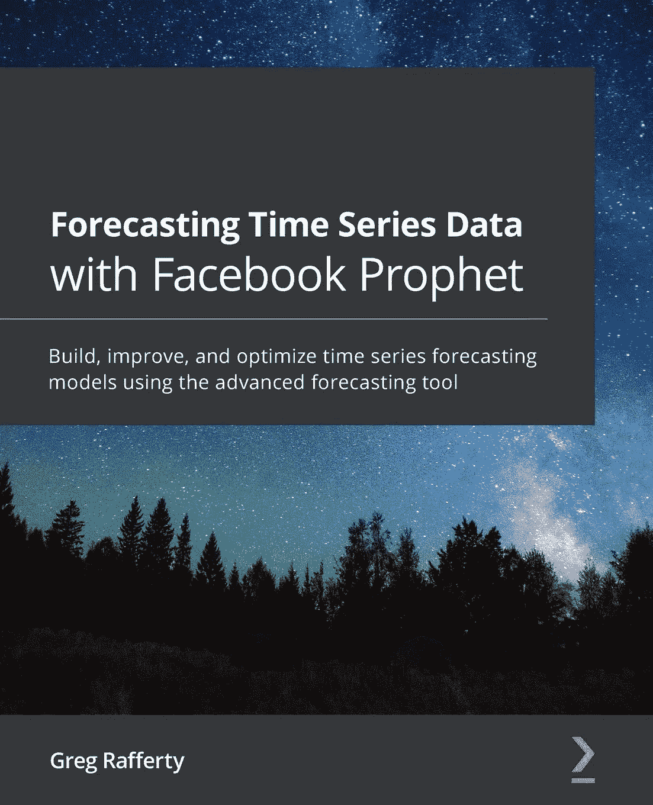
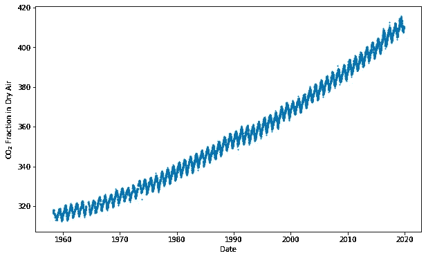
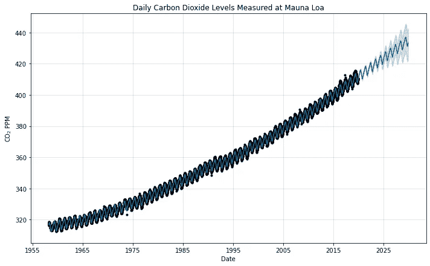
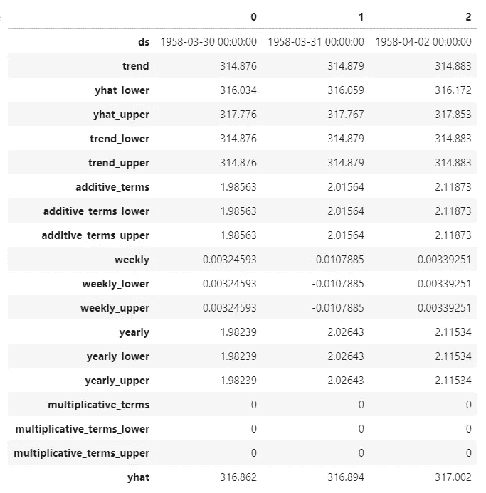
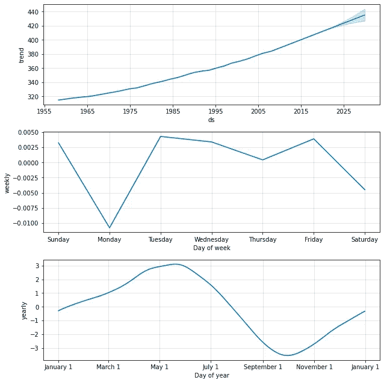

# 脸书先知入门

> 原文：<https://towardsdatascience.com/getting-started-with-facebook-prophet-20eccb25b06b?source=collection_archive---------21----------------------->

## 使用脸书的高级预测工具构建您的第一个模型所需了解的一切



在[https://amzn.to/373oIcf](https://amzn.to/373oIcf)用脸书预言家预测时间序列数据

这篇文章包含了我的新书《关于脸书先知的一切》的摘录。这本书在[亚马逊](https://amzn.to/373oIcf)上有售。这本书的全部内容都列在这个帖子的最后！

如果你觉得这篇文章很有用，并且想用 Prophet 来改善你的预测，请考虑在 https://amzn.to/373oIcf[购买整本书。](https://amzn.to/373oIcf)

# 在 Prophet 中构建简单模型

1958 年 3 月，斯克里普斯海洋研究所的查尔斯·大卫·基林开始了对大气中二氧化碳直接测量的最长记录。基林的基地在加利福尼亚的拉霍亚，但是已经得到了美国国家海洋和大气管理局的许可，可以使用他们位于夏威夷岛上莫纳罗亚火山北坡海拔两英里的设施来收集二氧化碳样本。在那个高度，基林的测量不会受到当地释放的 CO₂的影响，比如附近的工厂。

1961 年，基林发表了他迄今为止收集的数据，确定 CO₂水平有很强的季节性变化，并且在稳步上升，这一趋势后来被称为*基林曲线*。到 1974 年 5 月，NOAA 开始了他们自己的平行测量，并一直持续到现在。龙骨曲线图如下:



基林曲线显示了大气中二氧化碳的浓度

随着它的季节性和增长趋势，这条曲线是一个很好的候选人来尝试先知。该数据集包含 53 年来超过 19，000 次每日观察。CO₂的测量单位是 *PPM* 或*百万分之一*，这是每百万分子空气中 CO₂分子的度量单位。

为了开始我们的模型，我们需要导入必要的库， *pandas* 和 *Matplotlib* ，并从 **fbprophet** 包中导入 Prophet 类。

```
import pandas as pdimport matplotlib.pyplot as pltfrom fbprophet import Prophet
```

作为输入，Prophet 总是需要一个包含两列的 pandas 数据框架:

*   **ds** ，对于日戳，应该是熊猫期望格式的**日戳**或**时间戳**列。
*   **y** ，包含我们希望预测的测量值的数字列。

在这里，我们使用 pandas 来导入数据，在这种情况下是一个 **csv** 文件【注意:这个 csv 可以在 https://git.io/JYG6T 的[下载】，然后将它加载到一个 DataFrame 中。注意，我们还将 **ds** 列转换为 pandas datetime 格式，以确保 pandas 正确地将其识别为日期，而不是简单地将其作为字母数字字符串加载。](https://git.io/JYG6T)

```
df = pd.read_csv(‘co2-ppm-daily_csv.csv’)df[‘date’] = pd.to_datetime(df[‘date’])df.columns = [‘ds’, ‘y’]
```

如果你熟悉 scikit-learn ( *sklearn* )包，你会觉得在 Prophet 中如鱼得水，因为它是以类似的方式设计的。Prophet 遵循 sklearn 范式，在调用 **fit** 和 **predict** 方法之前，首先创建模型类的实例。

```
model = Prophet()model.fit(df)
```

在这个单独的 **fit** 命令中，Prophet 分析了数据并分离出季节性和趋势，而不需要我们指定任何额外的参数。不过，它还没有做出任何未来预测。为此，我们需要首先制作一个未来日期的数据框架，然后调用**预测**方法。 **make_future_dataframe** 方法要求我们指定我们打算预测的天数。在这种情况下，我们会选择十年，或 **365** 天乘以 **10** 。

```
future = model.make_future_dataframe(periods=365 * 10)forecast = model.predict(future)
```

在这一点上，**预测**数据帧包含了 Prophet 对未来十年 CO₂浓度的预测。我们稍后将探讨该数据框架，但首先让我们使用 Prophet 的 **plot** 功能绘制数据。 **plot** 方法建立在 Matplotlib 之上；它需要来自 predict 方法的数据帧输出(本例中是我们的预测数据帧)。

我们用可选的 **xlabel** 和 **ylabel** 参数来标记轴，但是只保留可选的 **figsize** 参数的默认值。注意，我还使用原始 Matplotlib 语法添加了一个标题；因为先知图是基于 Matplotlib 构建的，所以您可以对 Matplotlib 图形做的任何事情也可以在这里执行。另外，不要被带有美元符号的奇怪的 **ylabel** 文本所迷惑；这只是告诉 Matplotlib 使用自己的类似 TeX 的引擎在 CO₂.中制作下标

```
fig = model.plot(forecast, xlabel=’Date’, ylabel=r’CO$_2$ PPM’)plt.title(‘Daily Carbon Dioxide Levels Measured at Mauna Loa’)plt.show()
```

图表如下:



预言家预测

就是这样！在这 12 行代码中，我们得出了我们的十年预测。

# 解释预测数据框架

现在，让我们通过显示前三行来看看那个**预测**数据框(我在这里调换了它，以便更好地看到页面上的列名),并了解这些值在上图中是如何使用的:

```
forecast.head(3).T
```

运行该命令后，您应该会看到下表:



预测数据框架

以下是对**预测**数据框架中每一列的描述:

*   **‘ds’**—该行中的值所属的日期戳或时间戳
*   **‘趋势’**—单独趋势分量的值
*   **'yhat_lower'** —最终预测的不确定性区间的下限
*   **'yhat_upper'** —最终预测的不确定性区间的上限
*   **'trend_lower'** —趋势分量周围不确定性区间的下限
*   **'trend_upper'** —趋势分量周围不确定性区间的上限
*   **'additive_terms'** —所有季节性相加的组合值
*   **' additive _ terms _ Lower '**—围绕附加季节性的不确定性区间的下限
*   **' additive _ terms _ Upper '**—围绕附加季节性的不确定性区间的上限
*   **‘每周’**—每周季节性成分的值
*   **‘weekly _ Lower’**—周分量不确定性区间的下限
*   **'weekly_upper'** —周分量不确定性区间的上限
*   **‘每年’**—每年季节性成分的值
*   **'yearly_lower'** —围绕年度分量的不确定性区间的下限
*   **‘yearly _ Upper’**—围绕年度分量的不确定性区间的上限
*   **'乘法 _ 术语'** —所有乘法季节性的组合值
*   **'乘法 _terms_lower'** —围绕乘法季节性的不确定性区间的下限
*   **'乘法 _terms_upper'** —围绕乘法季节性的不确定性区间的上限
*   **‘yhat’**—最终预测值；**‘趋势’**、**、【乘法 _ 术语】、**、【加法 _ 术语】、**的组合**

如果数据包含每日季节性，则还将包括**‘每日’**、**‘每日 _ 上限’**和**‘每日 _ 下限’**列，遵循由**‘每周’**和**‘每年’**列建立的模式。后面的章节将包括加性/乘性季节性和不确定性区间的讨论和例子。

在上面的预测图中，黑点代表我们拟合的实际记录的 **y** 值(在**df[‘y’]**列中的值)，而实线代表计算的 **yhat** 值(**预测[‘yhat’]**列)。请注意，实线超出了我们预测未来的黑点范围。预测区域实线周围的浅色阴影表示不确定性区间，由**预测[‘yhat _ lower’]**和**预测[‘yhat _ upper’]**界定。

现在让我们将预测分解成几个部分。

# 了解组件图

在*第 1 章，时间序列预测的历史和发展*中，Prophet 作为一个加性回归模型被引入。*图 1.4* 和 *1.5* 显示了趋势和不同季节的单个分量曲线是如何相加在一起形成更复杂的曲线的。先知算法本质上是反过来做的；它取一条复杂的曲线，并把它分解成它的组成部分。更好地控制预言家预测的第一步是理解这些组成部分，以便可以单独操作它们。Prophet 提供了一个方法 **plot_components** 来可视化这些。

继续我们在莫纳罗亚模型上的进展，绘制组件就像运行这些命令一样简单:

```
fig2 = model.plot_components(forecast)plt.show()
```

正如你在输出图中看到的，Prophet 在这个数据集中分离了三个部分:趋势*、每周季节性*和每年季节性*:***

******

***莫纳罗亚组件图***

***随着时间的推移，趋势不断增加，但似乎有一个更陡的斜率——大气中 CO₂浓度的加速。趋势线还显示了预测年份的不确定性区间。从这条曲线中，我们得知 1965 年大气中 CO₂的浓度约为 320 PPM。到 2015 年，这一数字增长到约 430 PPM，我们预计到 2030 年将达到约 430 PPM。然而，由于季节性效应的存在，这些确切的数字将根据一周中的日期和一年中的时间而变化。***

****每周季节性*显示，一周中的每一天，数值会有大约 0.01 PPM 的变化——这是一个微不足道的量，很可能纯粹是由于噪音和随机机会。事实上，直觉告诉我们，二氧化碳水平(当在离人类活动足够远的地方测量时，就像在莫纳罗亚火山的高坡上一样)并不太在乎今天是星期几，也不受它的影响。***

**我们将在*第 4 章，季节性*中学习，如何指示 Prophet 不要拟合每周的季节性，因为在这种情况下是谨慎的。在*第 10 章，不确定性区间*，我们将学习如何绘制季节性的不确定性，并确保像这样的季节性可以忽略。**

**现在看一下*的年度季节性*显示，二氧化碳在整个冬季上升，大约在 5 月份达到峰值，而在夏季下降，在 10 月份达到低谷。根据一年中的时间，二氧化碳的测量值可能比趋势预测值高 3 PPM，也可能比趋势预测值低 3 PPM。如果你回头参考原始数据，在*基林曲线*中，你会被提醒，该曲线有一个非常明显的周期性，这是由每年的季节性决定的。**

**尽管这个模型很简单，但你通常只需要用 Prophet 就能做出非常准确的预测！除了缺省值，我们没有使用额外的参数，但仍然取得了非常好的结果。**

**这段摘录摘自[用脸书预言家](https://amzn.to/373oIcf)预测时间序列数据的第 2 章，现在可以在[亚马逊](https://amzn.to/373oIcf)上买到。这本书有超过 250 页的例子，教训，和先知的每一个方面的描述，并提供了超过 10 个教学数据集，以帮助您了解如何通过演示先知功能，从简单到先进的完整工作代码来完善您的预测。**

**全书包含以下章节:**

1.  **时间序列预测的历史与发展**
2.  **脸书先知入门**
3.  **非每日数据**
4.  **季节性**
5.  **假日**
6.  **增长模式**
7.  **趋势转折点**
8.  **附加回归量**
9.  **异常值和特殊事件**
10.  **不确定区间**
11.  **交叉验证**
12.  **性能指标**
13.  **生产先知**

**如果你喜欢这篇文章，请考虑在这里订购:[https://amzn.to/373oIcf](https://amzn.to/373oIcf)。如果你真的读了这本书，我会很高兴听到你的想法！**