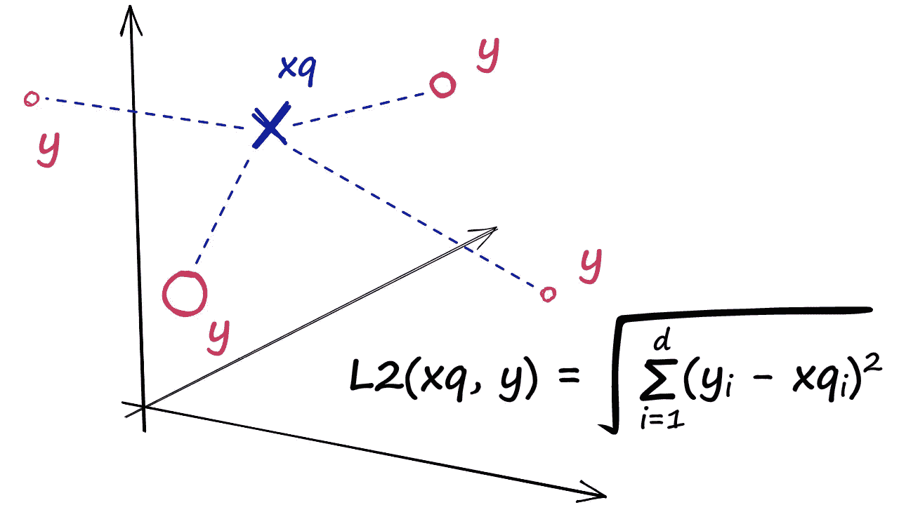
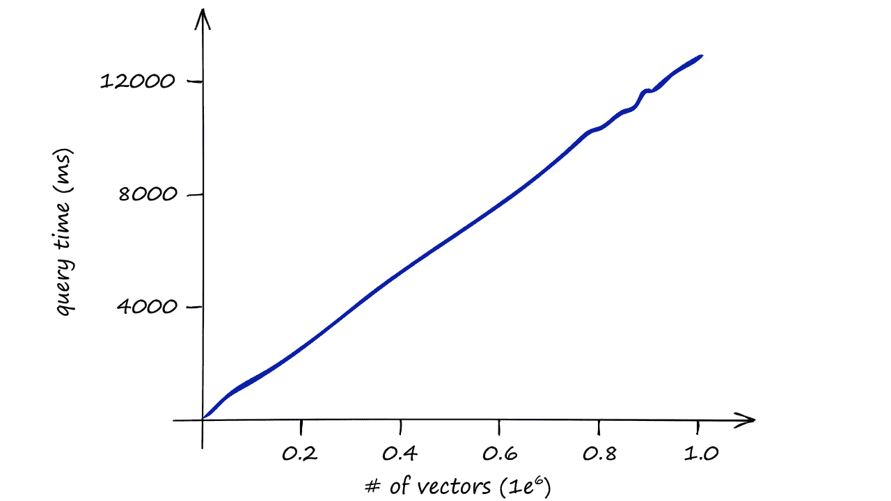
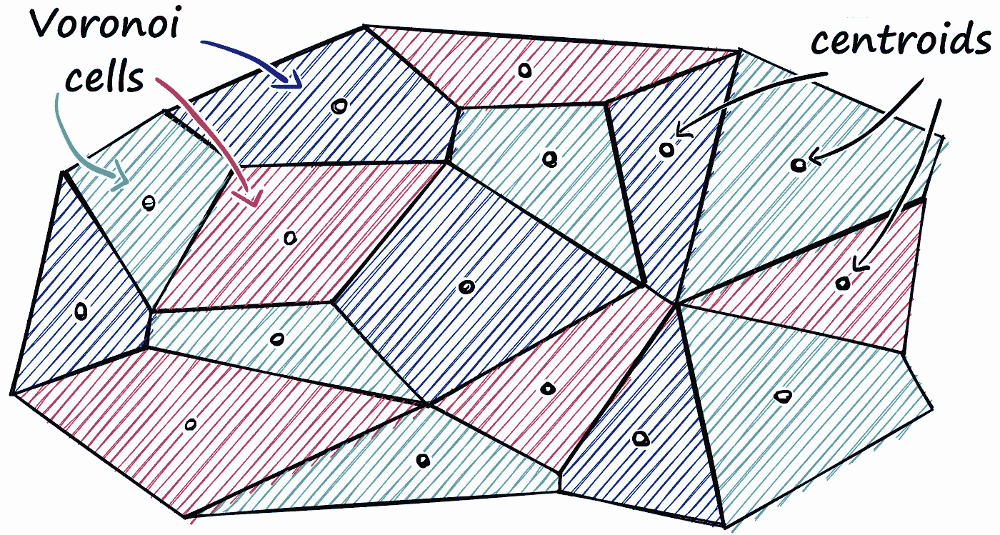
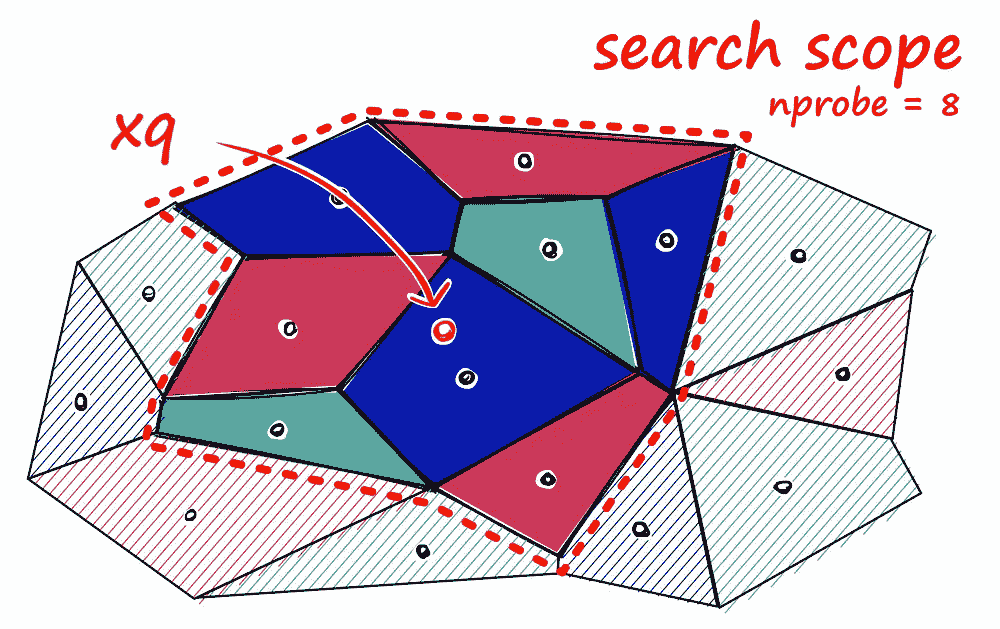
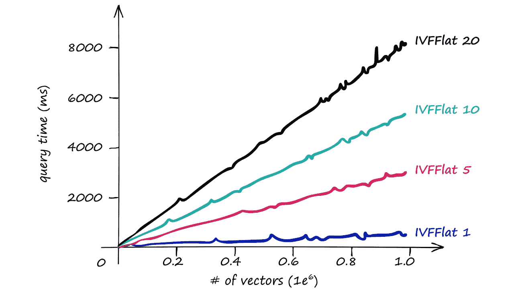
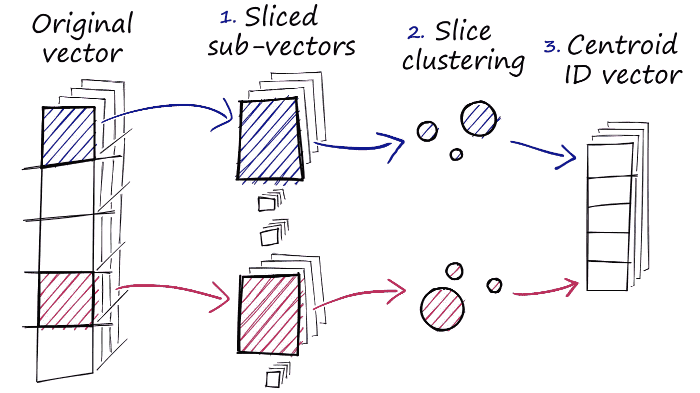
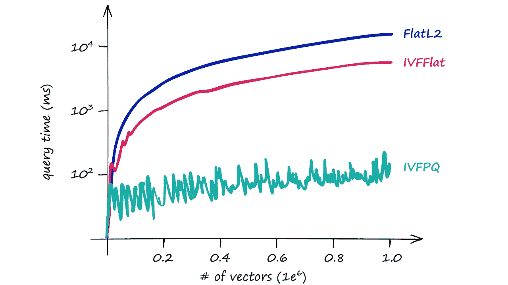

# Faiss 入门

> 原文：<https://towardsdatascience.com/getting-started-with-faiss-93e19e887a0c?source=collection_archive---------7----------------------->

## [行业笔记](https://towardsdatascience.com/tagged/notes-from-industry)

## 了解脸书人工智能相似性搜索的变化—搜索

脸书人工智能的可扩展搜索——关于[松果. io](https://www.pinecone.io/learn/faiss-tutorial/) 的原创文章——图片由作者提供

F acebook AI 相似性搜索(Faiss)是最流行的高效相似性搜索实现之一，但它是什么——以及我们如何使用它？

是什么让 Faiss 与众不同？我们如何最好地利用这个不可思议的工具？

幸运的是，这是一个非常简单的开始过程。在本文中，我们将探索 Faiss 提供的一些选项，它们是如何工作的，以及最重要的是，Faiss 如何使我们的搜索更快。

点击此处查看视频:

# 什么是 Faiss？

在我们开始编写任何代码之前，你们中的许多人会问——什么是 Faiss？

Faiss 是一个由脸书·艾开发的库，可以实现高效的相似性搜索。

因此，给定一组向量，我们可以使用 Faiss 对它们进行索引——然后使用另一个向量(*查询向量*),我们在索引中搜索最相似的向量。

现在，Faiss 不仅允许我们建立一个索引和搜索——而且它还将搜索速度提高到可笑的性能水平——这是我们将在本文中探讨的内容。

# 构建一些向量

我们首先需要的是数据，我们将连接来自[这个](https://github.com/brmson/dataset-sts)语义测试相似性中心报告的几个数据集。我们将下载每个数据集，并将相关的文本列提取到一个列表中。

接下来，我们删除所有重复的句子，留下 14.5 千个独特的句子。最后，我们使用[句子-BERT](https://www.pinecone.io/learn/semantic-search/) 库构建每个句子的密集向量表示。

现在，构建这些句子嵌入可能需要一些时间——所以可以从这里直接下载它们(您可以使用[这个脚本](https://github.com/jamescalam/data/blob/main/sentence_embeddings_15K/download.py)将它们加载到 Python 中)。

# 当然

我们从简单的开始。首先，我们需要建立 Faiss。现在，如果你使用 Linux——你很幸运——Faiss 为任何支持 CUDA 的 Linux 机器提供了内置的 GPU 优化。

MacOS 还是 Windows？我们没那么幸运。

*(别担心，还是快得离谱)*

所以，支持 CUDA 的 Linux 用户，输入`conda install -c pytorch faiss-**gpu**`。其他人，`conda install -c pytorch faiss-**cpu**`。如果你不想使用`conda`，这里有替代的安装说明。

一旦我们安装了 Faiss，我们就可以打开 Python，用`IndexFlatL2`构建我们的第一个简单明了的索引。

## IndexFlatL2

`IndexFlatL2`度量的是*所有*给定点之间的 L2(或欧几里德)距离我们的查询向量，并将这些向量加载到索引中。很简单，*非常*准确，但是不会太快。

查询向量 **xq** 和我们的索引向量之间的 L2 距离计算(显示为 **y**

在 Python 中，我们会用向量维数(`768` —句子嵌入的输出大小)初始化`IndexFlatL2`索引，如下所示:

通常，我们会使用需要我们在加载数据之前`train`它们的索引。我们可以使用`is_trained`方法检查某个指数是否需要训练。`IndexFlatL2`不是需要训练的指标，应该返回`False`。

一旦准备好，我们就像这样加载我们的嵌入和查询:

它返回最接近我们的查询向量`xq`的前`k`个向量作为`7460`、`10940`、`3781`和`5747`。显然，这些都是伟大的比赛——包括人们拿着足球奔跑，或者在足球比赛的背景下。

现在，如果我们想从 Faiss 中提取数值向量，我们也可以这样做。

## 速度

单独使用`IndexFlatL2`索引在计算上是昂贵的，它不能很好地伸缩。

当使用这个索引时，我们正在执行一个*穷举*搜索——这意味着我们将我们的查询向量`xq`与我们索引中的所有其他向量进行比较，在我们的例子中，每次搜索都要计算 14.5K L2 距离。

想象一下我们搜索包含 1M、1B 甚至更多向量的数据集的速度——以及当我们包括几个查询向量时的速度？

返回结果所用的毫秒数(y 轴)/索引中的向量数(x 轴)—仅依赖 IndexFlatL2 会很快变得很慢

我们的索引很快变得太慢而无用，所以我们需要做一些不同的事情。

# 对索引进行分区

Faiss 允许我们添加多个步骤，使用许多不同的方法优化我们的搜索。一种流行的方法是将索引划分成 Voronoi 单元。

我们可以想象我们的向量都包含在一个 Voronoi 单元中——当我们引入一个新的查询向量时，我们首先测量它在质心之间的距离，然后将我们的搜索范围限制在该质心的单元。

使用这种方法，我们将获取一个查询向量`xq`，识别它所属的*单元格*，然后使用我们的`IndexFlatL2`(或另一个度量)在查询向量和属于特定单元格的*的所有其他向量之间进行搜索。*

所以，我们正在缩小我们的搜索范围，产生一个*近似的* 答案，而不是精确的(如同通过穷举搜索产生的一样)。

为了实现这一点，我们首先使用`IndexFlatL2`初始化我们的索引——但是这一次，我们使用 L2 索引作为量化步骤——我们将其输入到分区`IndexIVFFlat`索引中。

这里我们增加了一个新的参数`nlist`。我们使用`nlist`来指定我们希望我们的索引有多少分区(Voronoi 单元)。

现在，当我们构建之前的仅`IndexFlatL2`索引时，我们不需要训练索引，因为构建索引不需要分组/转换。因为我们用`IndexIVFFlat`添加了集群，这种情况不再存在。

所以，我们现在要做的是`train`我们的数据索引——在添加任何数据到索引之前，我们必须*做这件事。*

既然我们的索引已经训练好了，我们就像以前一样添加数据。

让我们使用相同的索引句子嵌入和相同的查询向量`xq`再次搜索。

搜索时间明显减少，在这种情况下，我们没有发现穷举搜索和近似搜索返回的结果之间有任何差异。但是，通常情况是这样的。

如果使用`IndexIVFFlat`的近似搜索返回次优结果，我们可以通过增加搜索范围来提高准确性。我们通过增加`nprobe`属性值来做到这一点——它定义了要搜索多少个邻近像元。

当 **nprobe == 1** 时搜索单个最近的单元(左)，当 **nprobe == 8** 时搜索八个最近的单元(右)

我们可以很容易地实现这种改变。

现在，因为我们通过增加`nprobe`值来搜索更大的范围，我们将看到搜索速度也增加了。

使用不同的 **nprobe** 值(1、5、10 和 20)查询 IVFFlat 索引的时间/向量数

尽管如此，即使有了更大的`nprobe`值，我们仍然看到比我们返回的只有`IndexFlatL2`的索引更快的响应。

## 向量重构

如果我们继续并试图再次使用`index.reconstruct(<vector_idx>)`，我们将返回一个`RuntimeError`，因为由于增加了 IVF 步骤，在原始向量和它们的索引位置之间没有直接映射。

因此，如果我们想要重建向量，我们必须首先使用`index.make_direct_map()`创建这些直接映射。

从那里我们可以像以前一样重建我们的向量。

# 量化

我们还有一个关键的优化要介绍。到目前为止，我们所有的索引都将向量存储为完整的(例如`Flat`)向量。现在，在非常大的数据集中，这可能很快成为一个问题。

幸运的是，Faiss 能够使用*乘积量化(PQ)* 来*压缩*我们的矢量。

但是，PQ 是什么？嗯，我们可以把它看作是一个额外的近似步骤，其结果类似于我们使用的 **IVF** 。IVF 允许我们通过*缩小我们搜索的范围*来近似，而 PQ 近似了*距离/相似性计算*。

PQ 通过压缩向量本身来实现这种近似的相似性操作，这包括三个步骤。

产品量化的三个步骤

**1。我们把原始向量分成几个子向量。**

**2。对于每个颠覆集，我们执行一个聚类操作——为每个子向量集创建多个质心。**

**3。**在我们的子向量的向量中，我们用每个子向量最近的特定于集合的质心的 ID 来替换它。

为了实现所有这些，我们使用了`IndexIVF**PQ**`索引——在添加嵌入之前，我们还需要`train`索引。

现在我们准备开始使用新的索引进行搜索。

## 速度还是准确度？

通过添加 PQ，我们已经将 IVF 搜索时间从大约 7.5 毫秒减少到大约 5 毫秒，对于这种规模的数据集来说，这是一个很小的差异——但当扩大规模时，这一差异会很快变得显著。

但是，我们还应该注意到返回的结果略有不同。之前，通过我们详尽的 L2 搜索，我们返回了`7460`、`10940`、`3781`和`5747`。现在，我们看到稍微不同的结果顺序——以及两个不同的 id，`5013`和`5370`。

我们的两个速度优化操作 **IVF** 和 **PQ** ，都是以准确性为代价的。现在，如果我们打印出这些结果，我们仍然会发现每个项目都是相关的:

因此，尽管我们可能得不到*完美的*结果，但我们仍然很接近——由于这些近似，我们得到了更快的响应。

我们的三个索引的查询时间/向量数量

如上图所示，随着索引大小的增加，查询时间的差异变得越来越重要。

本文到此为止！我们已经介绍了在 Faiss 中为搜索构建高性能索引的基础知识。

显然，使用`IndexFlatL2`、`IndexIVFFlat`和`IndexIVFPQ`可以做很多事情，每一个都有许多参数，可以根据我们特定的精度/速度要求进行微调。如图所示，多亏了 Faiss，我们能以闪电般的速度非常容易地产生一些真正令人印象深刻的结果。

我希望你喜欢这篇文章！如果你有任何问题，请通过 [Twitter](https://twitter.com/jamescalam) 或在下面的评论中告诉我。如果你想知道更多类似的内容，我也会在 YouTube 上发布。

感谢阅读！

[📚了解更多关于可扩展搜索的信息](https://www.pinecone.io/learn/)

[🤖《变形金刚》课程 NLP 的 70%折扣](https://bit.ly/nlp-transformers)

**所有图片均由作者提供，除非另有说明*