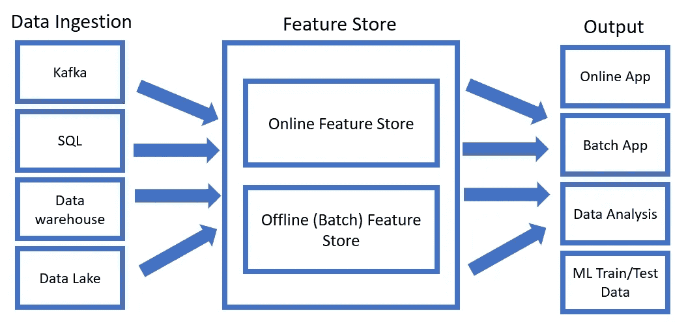

# 功能商店入门

> 原文：<https://towardsdatascience.com/getting-started-with-feature-stores-121006ee81c9?source=collection_archive---------24----------------------->

## 介绍什么是特征库，以及如何使用它们来简化机器学习过程

Artem Gavrysh 在 [Unsplash](https://unsplash.com?utm_source=medium&utm_medium=referral) 上拍摄的照片

# 介绍

创建能够在生产中可靠运行的机器学习模型可能是一个非常困难的过程。事实上，这些模型只能和用来训练它们的数据一样好。因此，能够创建一个能够准确预处理所有传入数据并以最佳方式构建数据以训练模型的流程，对于项目的长期成功至关重要。

数据科学家和数据工程师为了预处理将在机器学习模型中使用的数据而通常使用的技术的一些例子是:

*   [**特征工程:**](/feature-engineering-techniques-9a57e4901545) 修复数据中的不一致，通过合并/分割现有特征来创建新特征。
*   [**特征提取:**](/feature-extraction-techniques-d619b56e31be) 使用 PCA、t-SNE 等技术降低数据集维度
*   [**特征选择:**](/feature-selection-techniques-1bfab5fe0784) 通过删除数据集中携带较少信息的特征或在分析中仅添加噪声的特征来减少特征数量。

彻底预处理我们的数据的一些主要好处是:

*   降低过度拟合的风险。
*   加快训练时间。
*   减少执行[超参数优化](/hyperparameters-optimization-526348bb8e2d)的需求。
*   改进的数据可视化。

因此，在某些情况下，数据预处理可能是一个漫长的过程，以确保我们的数据尽可能采用最佳格式，并考虑所有不同的边缘情况(尤其是在管道中接收新数据时)。

随着越来越多的组织开始在其业务的许多不同领域使用机器学习过程，当涉及到预处理数据时，尝试避免任何形式的重复工作可能非常重要，这些数据随后可由组织内的不同团队和不同模型使用。为了确保消除业务中的任何重复工作，并更好地了解数据在组织中的使用情况，创建了**功能库**。

# ML 的特征存储

特征存储是为机器学习过程设计的数据管理层。因此，特征存储充当公司内的中央存储库，存储所有不同的特征，这些特征被创建用于数据分析和机器学习。

除了存储所有不同的要素之外，要素存储还被设计为完全自动接收新数据(通过自动应用必要的数据预处理步骤)并跟踪其分布中的任何变化。通过这种方式，要素存储可用于存储和转换要素，从而使数据科学家更容易找到他们可能需要的任何要素并使用它们，而不必担心维护问题(要素会自动更新以用于未来预测，如果需要，可以检索任何更改的历史记录)。

最后，为了支持批处理和在线类型的应用程序，已经设计了特性存储。对于批处理应用程序，可能需要存储大量数据(取决于批处理更新的频率)，而对于在线应用程序，实现低延迟通常是主要的优先事项。为了实现这一点，特性存储通常被设计成某种形式的**双数据库**(例如，存储批量数据的 SQL 数据库和快速处理在线数据的键值存储)。

图 1:示例特征库(图片由作者提供)。

因此，利用功能存储可以为组织带来许多不同的好处，例如:

*   **自动数据准备:**一旦添加了新的原始数据，特征就可以自动更新(例如，如果我们有一个使用线性回归估算缺失值的预处理特征，一旦新数据添加到特征中，就可以应用相同的变换)。
*   **改进的模型训练/重新训练:**拥有特征如何随时间变化的历史，可以帮助我们在新数据到来时快速重新训练我们的模型，并充分更新我们的测试数据，以反映自我们上次训练以来真实世界环境如何变化。
*   **部署后改进的模型监控:**随着新数据的存储，可以添加检查，以查看每个特性的分布是否有任何剧烈的变化，并创建警报，然后重新训练我们的模型。
*   **加快新模型的上市时间:**数据科学团队可以在预处理数据上花费更少的时间，而在试验和创建最佳模型上花费更多的时间。
*   **团队间的特性共享:**一旦一个特性被创建并归档，它就可以在将来的其他项目中被自动重用。
*   **确保使用最佳 MLOps 实践:**机器学习操作(MLOps)是一组最佳实践，旨在确保机器学习模型能够尽快创建，同时尽可能易于维护和管理。使用特征库可以极大地帮助我们实现这两个目标。
*   **全面管理您的数据:**使用功能存储可以更轻松地查看组织在整个过程中是如何处理数据的，并在遇到任何监管问题时快速采取行动。

# 创建功能存储

在过去的几年中，不同的开源和企业解决方案已经被构思出来，以促进功能商店的采用。两个最常见的开源解决方案是 [Feast](https://feast.dev/) 和 [Hopsworks](https://www.hopsworks.ai/) 。相反，对于企业用户来说，云服务中增加了功能商店功能，如 [GCP 顶点人工智能](https://cloud.google.com/vertex-ai/docs/featurestore)、 [AWS Sagemaker](https://aws.amazon.com/sagemaker/feature-store/) 和 [Databricks](https://docs.databricks.com/applications/machine-learning/feature-store.html) 。

如果您不确定使用哪个平台作为您的功能商店，可以使用不同的工具，例如[功能商店比较](https://www.featurestorecomparison.com/)，以便为您提供不同提供商之间的差异分类。

# 联系人

如果你想了解我最新的文章和项目[，请在媒体](https://pierpaoloippolito28.medium.com/subscribe)上关注我，并订阅我的[邮件列表](http://eepurl.com/gwO-Dr?source=post_page---------------------------)。以下是我的一些联系人详细信息:

*   [领英](https://uk.linkedin.com/in/pier-paolo-ippolito-202917146?source=post_page---------------------------)
*   [个人网站](https://pierpaolo28.github.io/?source=post_page---------------------------)
*   [中等轮廓](https://towardsdatascience.com/@pierpaoloippolito28?source=post_page---------------------------)
*   [GitHub](https://github.com/pierpaolo28?source=post_page---------------------------)
*   [卡格尔](https://www.kaggle.com/pierpaolo28?source=post_page---------------------------)