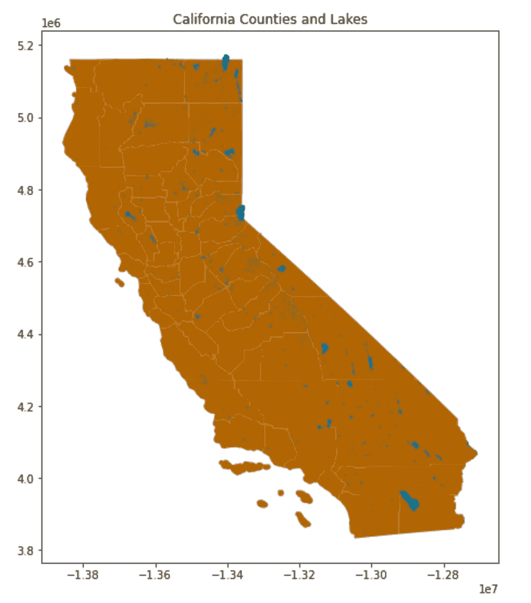

# SageMaker Studio 实验室地理空间分析入门

> 原文：<https://towardsdatascience.com/getting-started-with-geospatial-analysis-b2116c50308b?source=collection_archive---------24----------------------->

SpaceX 在 [Unsplash](https://unsplash.com/@spacex?utm_source=unsplash&utm_medium=referral&utm_content=creditCopyText) 上拍摄的

## [实践教程](https://towardsdatascience.com/tagged/hands-on-tutorials)

## 使用地理数据和地理空间图像来研究气候变化、自然灾害或人类活动的影响。

地理数据包括使用卫星图像和地理延迟系统(GPS)捕获的地理空间数据，以及通常用地理坐标明确描述的其他地理数据。地理空间分析包括使用软件工具、统计方法和机器学习来收集、报告、绘制和分析这些数据。地理空间分析用于 ***了解气候变化、自然灾害或人类活动*** 的影响，通常是对特定地理位置的影响。

# 使用地理空间数据的挑战

使用地理空间数据时存在一些挑战。首先， ***地理空间数据可能非常庞大，*** 如果没有高容量的存储和计算，很难工作，有时甚至无法工作。解决规模复杂性的一个变通办法是缩小你的关注点或研究领域和时间段。这使得检索和分析一小部分数据变得相对容易。

接下来是围绕 ***不同格式*** 的复杂性。使用压缩算法以多种格式捕获地理空间数据，使数据传输和存储更加经济。此外，当您在处理地理数据时，您会经常发现自己在处理多个源，而这些源可能会使用*的不同投影捕获数据(稍后将详细介绍)。这包括在使用数据进行分析之前对数据进行预处理和重新投影。*

*最后，随着卫星绕地球运行， ***数据在一段时间内*** 批量捕获。你可能没有足够的数据或足够高质量的数据来研究特定的时间和地点。在这种情况下，您可能需要调整时间窗口或依靠数据处理来清理和扩充这些数据。*

# *先决条件*

*这篇文章涵盖了在 SageMaker Studio 实验室上开始地理空间数据分析的基础知识。我们探索公开可用的**地理数据集**，然后探索在 **AWS 开放数据注册处**可用的 **Sentinel-2 地理空间数据集**。我们使用地理矢量数据集探索了加利福尼亚州的湖泊和县，然后重点关注加利福尼亚州的沙斯塔湖，以分析 Sentinel-2 地理空间数据并计算光谱指数。*

*如果您想跟随，您将需要以下先决条件，所有这些都是免费的。*

*   *一个 [***SageMaker 工作室实验室***](https://studiolab.sagemaker.aws/) 账号*
*   *一个 [***自由层 AWS***](https://aws.amazon.com/free)*账户**
*   **一个 ***免费试用*** [***的哨兵枢纽***](https://www.sentinel-hub.com/)*账号***

****亚马逊 SageMaker Studio 实验室提供 CPU 和 GPU 环境，您可以使用 CPU 环境完成这里描述的所有步骤。****

# **设置您的环境**

**亚马逊 SageMaker Studio Lab 是一个免费的在线 web 应用程序，用于使用 Jupyter 笔记本学习和实验数据科学和机器学习。使用 Amazon SageMaker Studio Lab，您可以保存和恢复您的工作，访问命令行和克隆 git 存储库。点击[这里](https://studiolab.sagemaker.aws/)注册一个免费账户。一旦你的账户被批准并登录，你就可以克隆[这个库](https://github.com/samx18/geospatial_analysis)或者手动上传文件。**

**首先，您需要在 SageMaker Studio 实验室中创建一个环境。在 Studio Lab 中创建环境很容易。转到您的克隆目录，选择`environment.yml`文件，右键单击 YAML 文件，并选择 create an environment。*您也可以选择在 Studio Lab* 中克隆存储库时自动运行 `*environment.yml*` *。这将创建一个新的 Studio Lab 内核，其中包含所有必需的包。环境创建完成后，您可以打开笔记本并选择新创建的内核。***

****

**选择自定义内核—按作者分类的图像**

**您也可以取消笔记本的包安装部分的注释，手动安装这些包。**

# **下载数据**

**地理数据通常以**shape file**、 **Geopackage、**或 **Geojson** 格式提供。让我们从下载 shapefiles 开始，其中包括加利福尼亚各县和水体的地理矢量数据。**

*   ****加州县数据集**包含加州州、县和地方的边界，来自美国人口普查局的 2016 年 MAF/老虎数据库[此处](https://data.ca.gov/dataset/ca-geographic-boundaries)。**
*   **加州水体数据集由加州渔猎局发布。海洋资源区，可在此下载。**

**下载数据集**

**下载完文件后，我们需要将它们解压缩到您的本地目录中。**

# **带有地理数据的 EDA**

**一旦我们在本地获得了数据，我们就可以读取和执行探索性的数据分析。在我们的例子中，我们下载了 shapefiles。shapefile 是一种 ESRI 矢量数据存储格式，用于存储地理要素的位置、形状和属性。`geopanads` Python 包使得读取这些 shapefiles 和创建一个 **Geopanads 数据帧**变得很容易。一个`geopandas.DataFrame`对象是一个`pandas.DataFrame`，它有一个带几何图形的列。除了标准的`pandas.DataFrame`属性，它们还有另外两个属性，分别是 ***CRS 和***geometry，都是可选的。CRS 用来指定 ***坐标参考系统中*** 的几何数据。几何包含地理数据的实际坐标，并在`geopandas.DataFrame`对象中被设置为几何数据类型。**

**让我们将县形状数据文件读入`geopandas.DataFrame`**

**读取县数据**

****

**县—按作者分类的图像**

**像标准数据帧一样，`geopandas.DataFrame`有一个方便的`plot`方法，可以用来创建地理可视化。**

**绘制加州各县**

****

**绘制加州各县-作者图片**

**类似地，我们将把 California Lakes shapefile 读入一个`geopandas.DataFrame`并绘制它。**

**读取和绘制湖泊数据集。**

****

**绘制加州湖泊——作者图片**

# **数据争论**

**我们之前简单提到过投影和坐标参考系统。坐标参考系统表示二维数据，即我们的`geopandas.DataFrames`中的数据，如何与地球上的真实位置相关联。当您使用不同来源的地理数据时，它们很可能使用不同的投影。**

**我们希望将 California lakes 数据集与 counties 数据集叠加在一起，并将湖泊与 California counties 一起可视化。在此之前，我们需要检查并确保它们使用相同的坐标参考系统(CRS)进行投影。一个`geopandas.DataFrame`对象的`crs`属性就是这样做的。如果您使用`counties.crs`和`lakes.crs`检查坐标参考系统投影，您会注意到加州各县和湖泊的数据具有不同的 CRS。县数据集使用 **EPSG:3857，**湖泊数据集使用 **EPSG:4326** 作为各自的 CRS。在我们一起使用这些数据集之前，我们需要重新规划湖泊，使其具有与县相同的 CRS。**

**重新设计 CRS**

**一旦在同一个 CRS 投影中有了地理数据集，就可以叠加和绘制它们。**

**覆盖物**

****

**绘制叠加数据-作者提供的图像**

**地理数据分析中的一项常见任务是缩小研究范围。我们可以选择一个数据子集来创建一个新的`geopandas.DataFrame`对象，用于进一步的分析和可视化。对于我们的例子，让我们把重点放在沙斯塔湖。**

**选择沙斯塔湖**

**一旦我们选定了感兴趣的领域，就很容易更好地想象和研究它。**

****

**绘制沙斯塔湖—作者图片**

# **使用地理空间图像**

**接下来，我们从地理矢量数据转移到地理空间图像。对于地理空间图像，我们将使用哨兵-2。 [Sentinel-2 任务](https://sentinel.esa.int/web/sentinel/missions/sentinel-2)是一个由两颗卫星组成的陆地监测星座，为当前 SPOT 和 Landsat 任务提供高分辨率光学图像和连续性。Sentinel-2 数据集可在 [AWS 开放数据注册处](https://registry.opendata.aws/sentinel-2/)公开获取。**

**python 包使得直接从 AWS 搜索和下载特定于我们关注领域的数据变得容易。以下代码片段显示了如何配置您的凭据。在这个例子中，我使用一个可选的 JSON 文件来存储和检索我的凭证**

**设置凭据**

**AWS 上的 Sentinel-2 数据集包含 2017 年 1 月以来的全球数据，并定期添加新数据。在下载之前，我们需要指定要学习的搜索坐标和时间窗口。在我们的例子中，我们关注沙斯塔湖区域，我们将它指定为一个边界框和一个随机时间段。**

**哨兵搜索**

**Sentinel-2 数据被捕获并以瓦片的形式分发，这使得它很容易在网络上传输。我们迭代搜索符合搜索标准的可用图块，并选择特定的图块。为了获得最佳效果，我们选择云覆盖最少的图块。**

**选择特定的单幅图块**

**Sentinel-2 卫星各携带一台多光谱仪器(MSI ),在可见光/近红外(VNIR)和短波红外光谱范围(SWIR)有 13 个光谱通道。例如，我们将下载**八个特定波段**，这将有助于我们的分析。你可以在这里阅读更多关于这些乐队的信息[。](https://en.wikipedia.org/wiki/Sentinel-2#Spectral_bands)**

**哨兵数据下载**

**除了光谱带，Sentinel tiles 还包括预览图像。让我们先检查一下，以确保我们完整清晰地捕捉到了感兴趣的区域。**

**解析请求以提取波段和其他数据**

****

**绘制预览图像-按作者排列的图像**

**抽查几个额外的波段也是一个很好的做法，以确保我们拥有一切。我们绘制了波段 7——植被红边，波段 8——近红外光谱，波段 8A——窄近红外光谱。**

****

**绘制不同波段-按作者分类的图像**

# **使用栅格数据**

**地理空间数据基本上由栅格数据或矢量数据组成。Sentinel-2 使用 GeoTIFF，这是一种用于卫星图像和地形模型的栅格数据集。地理空间光栅图像类似于数字图像，但也伴随有将数据连接到特定位置的空间信息。这包括栅格的范围和像元大小、行数和列数及其坐标参考系统(或 CRS)。Python 包可用于读取、检查、可视化和写入地理空间栅格数据。这里我们使用`rasterio`来读取这些光栅阵列，然后创建一个真彩色图像。**

**读取栅格数据**

**我们使用`rasterio`来创建一个`.tiff`格式的真彩色图像。*真彩色图像的文件尺寸较大。在创建之前，请验证您是否有足够的存储空间。***

**生成真彩色图像**

**在 Jupyter 中直接可视化 tiff 图像没有太大帮助。您将需要 GIS 软件来打开和查看它。下面沙斯塔湖地区的真彩色图像是在 [QGIS](https://qgis.org/) 中渲染的。**

****

**在 [QGIS](https://qgis.org/) 中渲染的真彩色图像—作者提供的图像**

# **计算光谱指数**

**光谱指数是多光谱图像中两个或更多光谱波段的像素值的组合。光谱指数突出显示图像中感兴趣的土地覆盖类型的相对丰富或缺乏的像素。让我们来看几个例子**

****归一化差异植被指数(NDVI)** 是一个简单的图形指标，用于分析观测目标是否包含活的绿色植被。它被计算为`NDVI = (NIR — Red) / (NIR + Red)`，其中 NIR 是近红外波段 8，红色是波段 4**

**计算 NDVI**

**`earthpy` Python 包可用于绘制光谱带。我们在这里使用它来显示沙斯塔湖地区周围的归一化植被指数差异。**

**策划 NDVI**

****

**NDVI 情节——作者形象**

**你可以看到绿色的植被区域，深色的植被区域。水体通常很少或没有植被，以对比鲜明的橙色显示。**

****归一化差异水分指数(NDWI)** 使用反射的近红外辐射和可见绿光来增强这些特征的存在，同时消除土壤和陆地植被特征的存在。NDWI 对于分析水体很有用。它被计算为`NDWI = (GREEEN — NIR) / (GREEN + NIR)` ，其中绿色为波段 3，近红外为波段 8。大于 0.5 的值通常对应水体。**

**计算 NDWI**

**类似于我们在上一节中绘制 NDVI 的方式，您可以使用`earthpy`来绘制被观察区域的 NDWI。**

****

**NDWI 图-作者提供的图片**

**上面的图像向我们展示了沙斯塔湖地区的数值。你可以看到蓝色的湖区。植被通常对应于小得多的值，而建筑面积对应于 0 到 0.2 之间的值，并以绿色阴影显示。**

****燃烧面积指数(BAI)** 通过强调火灾后图像中的木炭信号，在红色到近红外光谱中突出显示燃烧过的土地。该指数是根据从每个像素到参考光谱点的光谱距离计算的，在参考光谱点处，最近燃烧的区域会聚。较亮的像素表示烧伤区域。**

**在我居住的南加州，野火是经常发生的自然灾害。下面我们举一个例子，白对 2020 年 Silverado 大火的分析。火灾后的图显示了火灾留下的烧伤疤痕。**

****

**Silverado Fire BAI —图片由作者提供**

# **包扎**

**本文介绍了在 SageMaker Studio 实验室中设置地理空间分析环境、地理分析的基础知识、搜索和下载地理空间图像、操作栅格以及计算光谱指数。Studio Lab 是免费的，我们没有创建任何收费的 AWS 资源作为本练习的一部分。但是，您下载的地理和 GIS 数据以及生成的影像可能会占用大量存储空间。请确保检查您的存储利用率，并根据需要删除文件。**