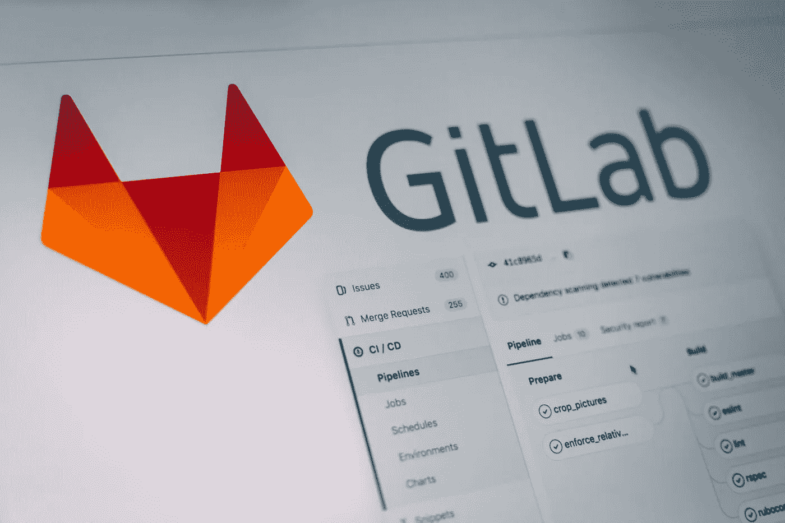
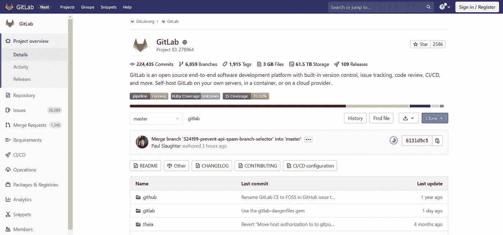
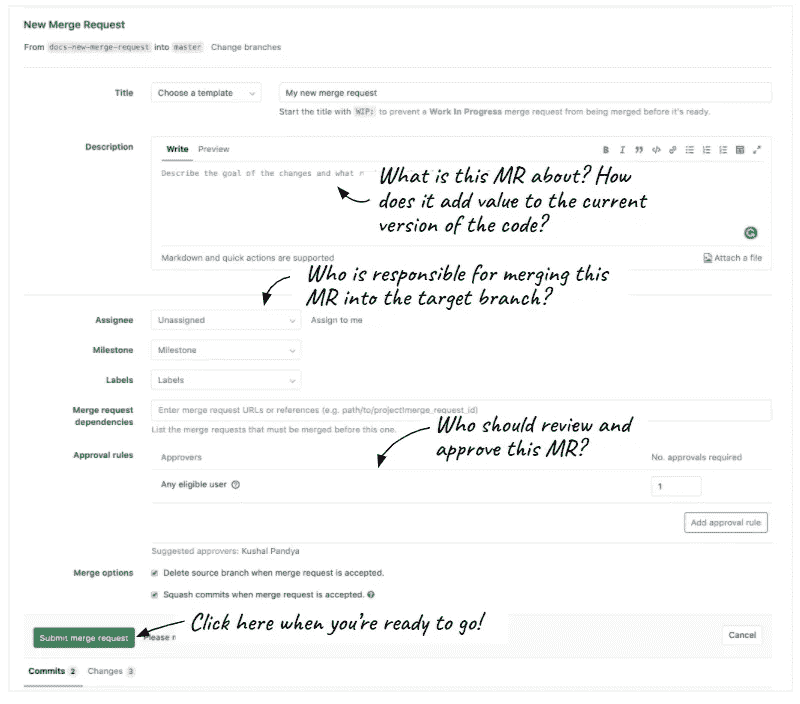

# GitLab 入门:绝对初学者指南

> 原文：<https://towardsdatascience.com/getting-started-with-gitlab-the-absolute-beginners-guide-ea9e5cadac8b?source=collection_archive---------6----------------------->

## [入门](https://towardsdatascience.com/tagged/getting-started)

## 如何一步一步地使用 GitLab，即使你以前从未听说过 Git

[潘卡杰·帕特尔](https://unsplash.com/@pankajpatel?utm_source=unsplash&utm_medium=referral&utm_content=creditCopyText)在 [Unsplash](/?utm_source=unsplash&utm_medium=referral&utm_content=creditCopyText) 上的照片

不到一年前，我不知道“Git”这个词是什么意思。对我来说，这是一个相当野蛮的术语，开发团队用一种编码语言相互交流。有了商业背景，我以为自己永远也不会用到它，所以我从来没有真正关注过这个概念。

当我 2020 年开始在一家数据驱动的公司担任数据分析师时，我不得不面对它:处理我本地保存的文件，并使用像“v1”、“v2”等后缀更新它们。是历史。使用 Windows 的 SharePoint 或 Google Drive 等协作工具也不足以确保整个公司使用的代码的质量和统一性。**虽然修改和保存你自己的代码可能会奏效一段时间，但不幸的是，这种工作方式从长远来看是不可持续的。**您不仅会浪费时间来维护所有文件版本，还会在与他人沟通时遇到困难:

> "你实际上指的是文件的哪个版本？"“你能把你最后的修改通过电子邮件发给我吗？”
> “在哪里可以找到这个文件的“final-def-latest.sql”版本？”

如果只集中存储一个版本的代码，就可以避免与同事之间许多耗时的交流。比如其他团队和外部工具使用的“官方”版本的代码。例如，我工作的大部分代码都是由 Apache Airflow 每天处理的，并且供我以外的其他部门的同事使用。**这正是 Git 和 GitLab 在这里的目的**:

*   在一个唯一的地方存储和保存该代码的唯一有效版本
*   让每个人都能同时使用同一个版本
*   历史化公共代码片段中所做的更改
*   讨论要添加到代码主版本中的修改

# 入门:什么是 GitLab？

## Git 的概念

首先也是最重要的:什么是 Git？正如 [git 的网站](https://git-scm.com/)所说，“ **Git 是一个免费开源的分布式版本控制系统**，旨在快速高效地处理从小型到超大型项目的一切”。该系统传统上用于在软件开发过程中协调合作开发源代码的程序员之间的工作。它允许跟踪任何一组文件中的变化，因此它与任何基于共享版本代码的协作项目高度相关。Git 的目标包括速度、数据完整性和对分布式非线性工作流的支持(在不同系统上运行的数千个并行分支)。

具体来说，这意味着两个不同的人可以在不妨碍彼此进度的情况下处理相同的代码。为了做到这一点，每个人都将在他们自己的*分支*上工作，分支是位于分支“主”上的主代码的副本。当保存修改时，每个用户*提交*他们的修改，并在所谓的*合并请求*中解释修改了什么。下面是一个可视化的例子，可以更好地理解 Git 分支背后的逻辑:

玛丽·勒费夫尔

## GitLab:一个基于 Git 并为组织设计的在线平台

虽然 Git 可以直接在每个用户的电脑上使用，例如通过电脑终端或 Sublime Merge 等 Git GUI 客户端使用, **GitLab 是一个在线平台，所有操作都可以在浏览器中完成**。正如 [GitLab](https://gitlab.com/gitlab-org/gitlab) 的网站上所描述的，它是“一个在代码上进行合作的开源软件”。创建 GitLab 帐户是免费的，因此如果您在公司环境中使用它，项目管理员会将您添加到公司的相关项目中。这意味着您可以使用相同的帐户在 GitLab 上进行专业项目和个人项目(取决于您用来创建帐户的电子邮件地址)。

在您的计算机上使用 Git 可以完成的大多数操作也可以在 GitLab 中完成。这在这里尤为关键，因为这意味着 GitLab 允许非开发人员(至少是从未学习过如何使用版本控制系统的人，比如一年前的我)在代码中添加修改，而不必接受计算机科学方面的广泛培训(T21)。

此外，GitLab 将自己标榜为“完整的 DevOps 平台”,因为它为组织提供了比简单地跟踪用户在主代码中所做的更改更多的功能。GitLab 还包括测试代码片段的工具，并允许将代码部署到产品中(当代码被依赖于它的外部工具实际应用和使用时)。在这里，我不会深入讨论细节，因为我想向软件开发领域的初学者介绍 GitLab 的主要特性。

[GitLab 项目概述](https://gitlab.com/gitlab-org/gitlab)

# 入驻:如何在 GitLab 中找到合适的信息？

## 贮藏室ˌ仓库

GitLab 上的每个项目都对应一个存储库。这是**，在这里你可以找到你的项目中包含的所有文件，以及变更的历史和现有分支的状态**。当你发现一个新的项目时，这是你应该开始的地方，因为你将理解项目的结构和参与者是如何工作的。

请特别查看以下部分:

*   **文件**:顶部导航栏允许您找到您正在寻找的确切文件和版本

[GitLab 储存库>文件部分](https://gitlab.com/gitlab-org/gitlab/-/tree/master)

*   **提交**:该部分显示了所有最近提交并合并到所选分支中的变更

[GitLab 储存库>提交部分](https://gitlab.com/gitlab-org/gitlab/-/commits/master)

*   **分支**:在这里您可以看到项目的所有分支及其当前状态(“主”是主分支，您也可以浏览您或您的同事创建的分支)

[GitLab 知识库>分支部分](https://gitlab.com/gitlab-org/gitlab/-/branches)

# 投稿:如何将你的个人风格带入项目？

## 合并请求

现在你已经对你将要工作的项目有了更好的理解，你可以通过**对位于“主”分支**上的代码进行修改来开始对它做出贡献。为此，请转到“合并请求”(也称为“MR”)部分。

这一部分中最有用的功能包括:

*   **合并请求概述**:它允许您快速掌握您的团队成员一直在进行的变更，并希望整合到“主”分支中

[GitLab 合并请求>概述](https://gitlab.com/gitlab-org/gitlab/-/merge_requests)

*   **创建一个新的合并请求**:当你准备好让你的同事审查、批准你的修改，然后将你的修改合并到“主”分支时，你可以点击“创建一个合并请求”并按照指示操作

新的合并请求([示例](https://docs.gitlab.com/ee/user/project/merge_requests/creating_merge_requests.html)

*   **合并请求的详细信息**:当你点击一个合并请求(应该是你的还是其他人的)时，你可以在四个选项卡中查看它的详细信息——概述、提交、管道和变更

合并请求的详细信息([示例](https://gitlab.com/gitlab-org/gitlab/-/merge_requests/56602)

# 结论

## 从零到 GitLab，再从 GitLab 到 Git

正如我刚才介绍的， **GitLab 是软件开发领域新手的易用工具**。实际上，它的使用不需要高级的编程知识，只要用户熟悉他想要改变的文件的编程语言。

**随着您对 GitLab 越来越熟悉，您可能会想在自己的计算机上使用 Git**(通过终端或 Git GUI 客户端)。这将允许您**节省时间**，因为您将在桌面上有一份存储库文件的副本。相信我:我很不情愿从漂亮的 GitLab 界面切换到冰冷的终端窗口。但是在对 Git 的逻辑有了更好的理解，并对我对 master 分支所做的更改有了信心之后，我不得不承认，在浏览和更改我组织的项目时，我节省了大量的时间。

我给你的最后一个建议:**慢慢掌握 Git 和 GitLab，剩下的会随着实践而来！**

你喜欢读这篇文章吗？ [*成为*](https://marie-lefevre.medium.com/membership) *的一员，加入一个不断成长的充满好奇心的社区吧！*

 [## 加入 Medium！

### 作为一个媒体会员，你的会员费的一部分会给你阅读的作家，你可以完全接触到每一个故事…

marie-lefevre.medium.com](https://marie-lefevre.medium.com/membership)