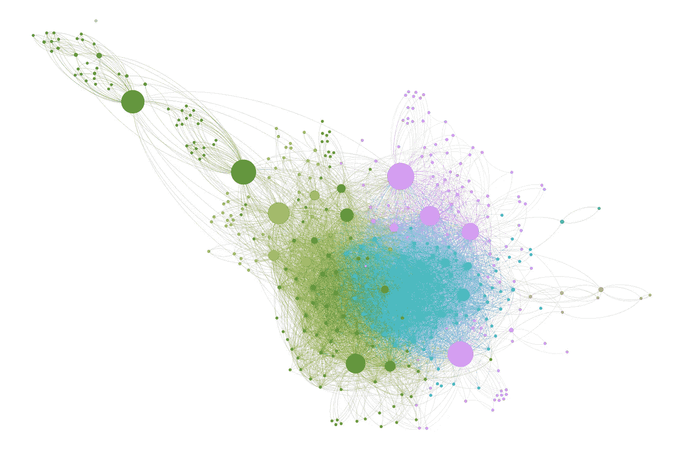
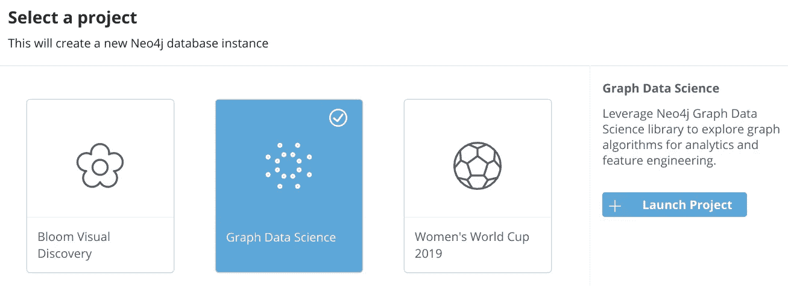
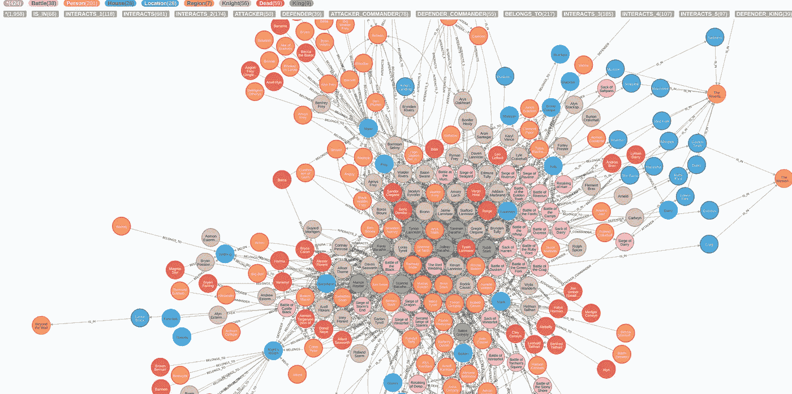
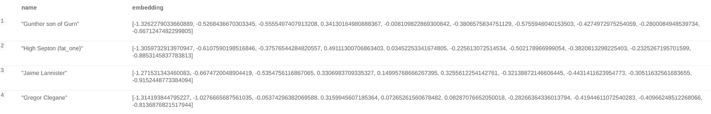

# Neo4j 图形嵌入入门

> 原文：<https://towardsdatascience.com/getting-started-with-graph-embeddings-2f06030e97ae?source=collection_archive---------10----------------------->

## [实践教程](https://towardsdatascience.com/tagged/hands-on-tutorials)

## 浅谈如何将网络图的节点转化为向量



图片由 [Savionasc](https://commons.wikimedia.org/w/index.php?title=User:Savionasc&action=edit&redlink=1) 提供，根据[知识共享](https://en.wikipedia.org/wiki/en:Creative_Commons) [署名-共享 4.0 国际版](https://creativecommons.org/licenses/by-sa/4.0/deed.en)许可授权。未对原始图像进行任何更改。

# 介绍

所有机器学习的起点都是把你的数据变成向量/嵌入(如果他们还没有的话)。也许在你的问题中你是幸运的，你已经有了许多列与每个数据点相关联的规格化浮点数，它们很容易组合起来进行嵌入。或者你可以很容易地推导出它们。许多不同类型的数据可以用来生成向量，如文本、图像等。但是，当您的数据以图表或其他相互关联的数据的形式出现时，该怎么办呢？

在接下来的几篇博文中，我希望深入了解如何创建和调整这些向量的一些细节。为了这篇文章，我将介绍 [Neo4j](http://dev.neo4j.com/neo4j) 的[图形数据科学](http://dev.neo4j.com/graph_data_science) (GDS)库中存在的三种方法。(我们将在一两篇不同的文章中讨论嵌入调整。这些超参数包含很多内容！)我们将使用一个使用 [Neo4j 沙箱](http://dev.neo4j.com/sandbox)可用的小图(但你也可以使用 [Neo4j 桌面](http://dev.neo4j.com/desktop)或使用我在[这篇文章](http://dev.neo4j.com/docker_neo_jupyter)中描述的自定义 Docker 容器来完成此操作)，这是一个免费工具，可用于免费试用 Neo4j 和 GDS。

这篇文章是一系列文章中的第二篇，我们将看看如何用图表进行数据科学研究，从…

1.  [“通过 Docker 开始使用 Neo4j 和 Jupyter Lab”](http://dev.neo4j.com/docker_neo_jupyter)

(在未来的博客文章中，我们将更多地使用 Docker 参考。)

# Neo4j 沙盒入门

我已经在[的另一篇博文](/create-a-graph-database-in-neo4j-using-python-4172d40f89c4)中描述了这一点，所以让我们在这里重点讨论一下。第一步是创建沙箱本身。你可以在这里做。我们将创建一个新的沙盒实例，方法是选择“新建项目”，然后选择“图形数据科学”，如下所示。



创建图形数据科学沙盒数据库

一旦完成设置，点击右边的绿色按钮，告诉它“在浏览器中打开”

现在，让我们单击左上角看起来像数据库图标的按钮，看看我们在这个代表“权力的游戏”的预填充图形中有什么酷毙了。我们有几个节点标签和关系类型，这对以后的工作非常有帮助。当您发出 Cypher 命令`MATCH (n) RETURN n`时，您的图形应该如下所示:



权力的游戏，形象化为网络图。(图片由作者提供。)

# 使用 GDS 创建内存中的图形

使用 GDS 的第一步总是创建内存中的图形，这是通过使用图形投影来实现的。关于图投影的好处是，您可以(并且通常应该)明确您想要为图的哪个(哪些)部分创建嵌入。一般来说，使用整个图表不是一个好主意，特别是当图表变大时。此外，GDS 中的一些图算法不适用于二分图或多分图。最后，使用内存中的图并不一定要永久地改变整个数据库，除非您使用带有`.write()`的算法，您可以用它来编写作为节点属性的嵌入。当我们想在图上做 ML 时，这将是非常有用的，我将在这篇文章中展示如何做。所以使用内存中的图形。你会喜欢他们的！

有两种方法可以创建内存中的图形，这两种方法都是用投影表示的图形数据模型。投影指定了节点类型和关系类型，它们可以是全包含的。这两种方法包括通过 [Cypher 投影](https://neo4j.com/docs/graph-data-science/current/management-ops/cypher-projection/#cypher-projection)或所谓的[“本地”投影](https://neo4j.com/docs/graph-data-science/current/management-ops/native-projection/)创建图形。Cypher 投影的优点是编写简单，同时还提供了 Cypher 查询的所有灵活性，但代价是比原生投影慢得多。

所以让我们从创建一个内存图开始。这里我将使用本机投影，但是如果您愿意，它们可以很容易地转换成 Cypher 投影。假设我想查看图表中的所有人。我们会使用

```
CALL gds.graph.create(
    'people', {
        Person: { label: 'Person' }
    },
    '*'
)
YIELD graphName, nodeCount, relationshipCount;
```

来创建这个内存中的图形。这里，节点投影简单地指定了具有标签`Person`的每个节点。边缘投影`'*'`包括与节点投影中的节点相关联的所有边缘。

我们可以创建一些更具体的东西，比如指定多个节点类型。然后我们可以使用语法

```
CALL gds.graph.create(
    'a-different-graph', {
        Person: { label: 'Person' },
        House: { label: 'House' }
    },
    '*'
)
YIELD graphName, nodeCount, relationshipCount
```

所以现在我们有了人和房子，这可能对 ML 任务有用，比如预测人和房子之间的联系。(我们将把它留到以后的文章中。)

也许我们还想只包括人和房子之间的特定关系类型。(在 Cypher 中，你可以通过快速查询`MATCH (p:Person)--(h:House) RETURN p, h`来查看所有的关系类型。)假设我们只关心关系`BELONGS_TO`。为了创建内存中图形，我们将包括一个特定的边投影:

```
CALL gds.graph.create(
    'belongs-graph', {
        Person: { label: 'Person' },
        House: { label: 'House' }
    },
    {
     BELONGS: { type: 'BELONGS_TO',
            orientation: 'NATURAL'
        }
    }
)
YIELD graphName, nodeCount, relationshipCount
```

边缘投影`BELONGS`有一些我们已经包括的东西，即边缘类型和方向。关于后者的一个注意事项:GDS 的一些图形算法倾向于使用`'UNDIRECTED'`方向，然而默认方向是`'NATURAL'`。我们鼓励您查阅 API 文档来确定每个算法需要什么。当有疑问时，最安全的方法是假设无向单部图。

酷毙了。现在我们有了一些内存中的图形(请看`CALL gds.graph.list())`)。最佳实践表明，您应该丢弃所有不打算使用`CALL gds.graph.drop(graph_name)`的图形，以释放内存。

# 创建嵌入

您可以使用 GDS 创建三种类型的嵌入: [FastRP](https://neo4j.com/docs/graph-data-science/current/algorithms/fastrp/#algorithms-embeddings-fastrp) 、 [GraphSAGE](https://neo4j.com/docs/graph-data-science/current/algorithms/graph-sage/) 和 [node2vec](https://neo4j.com/docs/graph-data-science/current/algorithms/node2vec/) 。每一个都以自己的方式在内存图中创建节点的嵌入。在我们讨论每一个之前，让我们来看一下它们的一些公共参数，您将使用它们来生成嵌入。

所有的嵌入(事实上，所有的图形算法)都有一些不同的方法。我们这里要用的是`.stream()`(把结果输出到屏幕上)和`.write()`(把计算出来的东西写成节点属性)。对于它们中的每一个，我们都需要提供内存图的名称、一些配置参数集以及算法返回的内容。在`.write()`的情况下，这将通过`YIELD`语句返回。当您返回结果时，它们是根据节点 id 完成的，节点 id 是图的内部 id。请注意，它们特定于内存中的图形，并且不匹配数据库本身中的任何内容，因此我们将很快展示如何将它们转换回可识别的内容。这些配置往往是特定于每种算法的，我们鼓励您查阅这方面的 API 文档。

现在让我们看看三种嵌入算法。FastRP，顾名思义就是，嗯，快。它使用基于线性代数的稀疏随机投影，根据图的结构创建节点嵌入。另一个好处是，它很好地处理了有限的内存，这意味着它可以在沙箱中很好地工作。node2vec 的工作方式类似于 [word2vec](https://en.wikipedia.org/wiki/Word2vec) 的 NLP 矢量化方法，其中为每个节点计算给定长度的随机游走。最后，GraphSAGE 是一种归纳方法，这意味着当添加新节点时，您不需要重新计算整个图的嵌入，而对于其他两种方法，您必须这样做。此外，GraphSAGE 能够使用每个节点的属性，这对于以前的方法是不可能的。

因此，你可能会认为你应该总是使用 GraphSAGE。但是，它比其他两种方法运行时间更长。例如，FastRP 除了非常快(因此经常用于基线嵌入)之外，有时还可以提供非常高质量的嵌入。我们将在以后的博文中讨论嵌入结果的优化和比较。

现在让我们从一个内存图开始，看看使用 FastRP 创建嵌入的最基本的方法。我们将创建一个单部分、无方向的人物图:

```
CALL gds.graph.create(
    'people', {
        Person: { label: 'Person' }
    },
    {
     ALL_INTERACTS: { type: 'INTERACTS',
            orientation: 'UNDIRECTED'
        }
    }
)
YIELD graphName, nodeCount, relationshipCount
```

请注意，当我们创建一个无向内存图时，您正在创建两个方向上的关系投影(自然和反向)。

为了获得 FastRP 嵌入，我们将使用

```
CALL gds.fastRP.stream('people',
 {
     embeddingDimension: 10
    }
)
YIELD nodeId, embedding
RETURN gds.util.asNode(nodeId).name AS name, embedding
```

在这里，我们已经告诉 FastRP 创建一个 10 维向量，流式传输到屏幕上。最后一行使用`gds.util.asNode()`将这些内部节点 id 转换成我们可以理解的东西(在本例中是角色名)。当我们运行它时，我们会得到如下结果:



FastRP 嵌入。(图片由作者提供。)

如果我们想将这些作为属性写入数据库，我们可以使用

```
CALL gds.fastRP.write('people',
 {
     embeddingDimension: 10,
     writeProperty: 'fastrf_embedding'
    }
)
```

现在，如果你看一些人节点`MATCH (p:Person) RETURN p LIMIT 3`你会看到，例如，詹姆·兰尼斯特给了我们

```
{
  "identity": 96,
  "labels": [
    "Knight",
    "Person"
  ],
  "properties": {
"fastrf_embedding": [
      -0.57976233959198,
      1.2105076313018799,
      -0.7537267208099365,
      -0.6507896184921265,
      -0.23426271975040436,
      -0.8760757446289062,
      0.23972077667713165,
      -0.07020065188407898,
      -0.15781474113464355,
      -0.4160367250442505
    ],
"pageRank": 13.522417121008036,
"wcc_partition": 2,
"gender": "male",
"book_intro_chapter": "5",
"name": "Jaime Lannister",
"pageRank-1": 3.143866012990475,
"community": 304,
"title": "Ser",
"age": 39,
"birth_year": 266
  }
}
```

我们可以看到有一个很好的嵌入在等着我们。

# 这个系列的下一部是什么？

在这篇文章中，我们演示了在 Neo4j 沙盒实例上创建 FastRP 嵌入。但是等等，node2vec 或者 GraphSAGE 呢？！这些方法需要更多一点的内存，所以我们将把它们保存到以后的文章中，我们将用更多的计算能力来完成。因此，我们将在未来的博客文章中使用 Docker 容器来讨论这些，可以通过[这篇文章](http://dev.neo4j.com/docker_neo_jupyter)找到它。我们还将花一些时间讨论如何调优这些不同的嵌入，这是任何基于 ML 的解决方案都需要的一个步骤。当然，如果我们不讨论常见的基于 ML 的解决方案，如自动节点分类或链接预测，我们会怎么样呢？敬请期待！