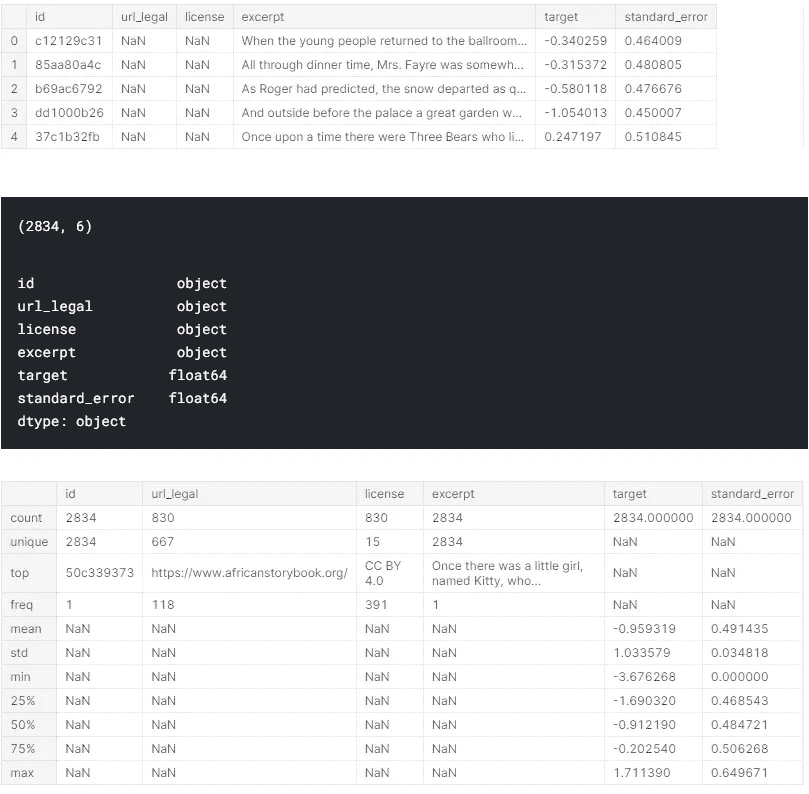
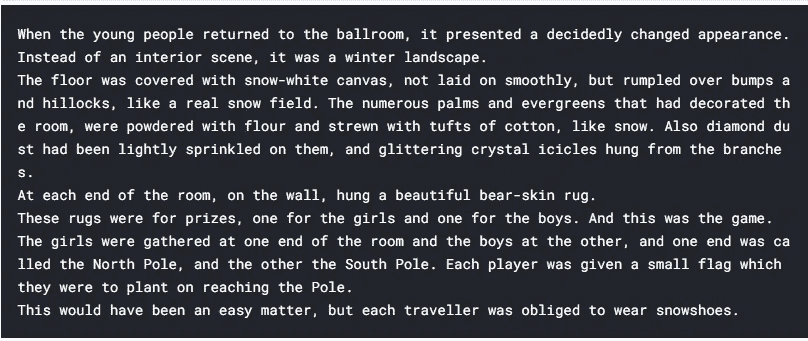
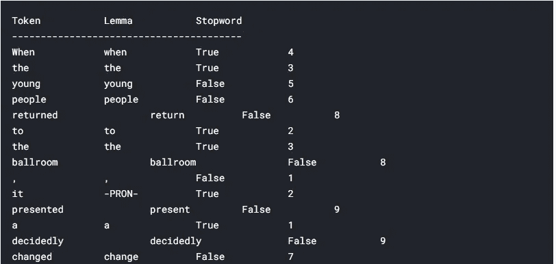
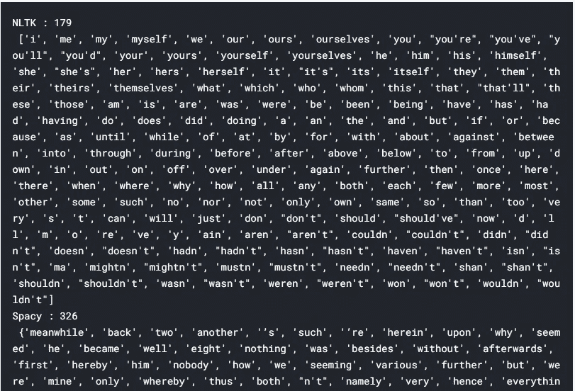
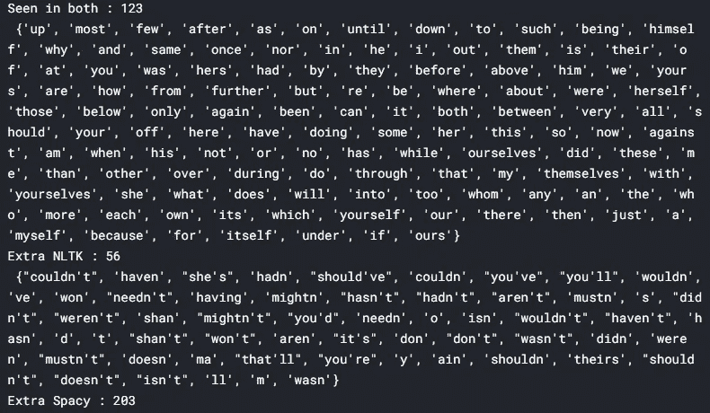
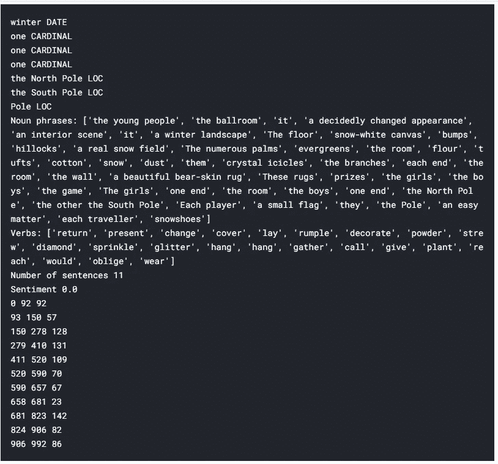
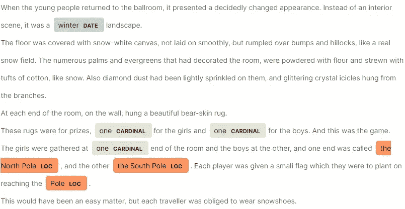

# Python 中的 NLP 入门

> 原文：<https://towardsdatascience.com/getting-started-with-nlp-in-python-6a14d0bf4cfe?source=collection_archive---------24----------------------->

## 开始进入自然语言处理空间的旅程

在 [Unsplash](https://unsplash.com?utm_source=medium&utm_medium=referral) 上由 [Jaredd Craig](https://unsplash.com/@jaredd_craig?utm_source=medium&utm_medium=referral) 拍照

阅读的乐趣在于发现新的见解。书籍帮助我们学习，但也挑战我们的理解。有了许多不同的流派，可以发现的知识深度是没有止境的。

我们每个人都可能有越来越多的建议需要阅读。我们可能还记得上一次我们进入图书馆，努力想知道从哪里开始。理解课文难度的有效方法会有帮助吗？是时候调用自然语言处理(NLP)算法了。为了从文本中提取价值，他们帮助区分小麦和谷壳。本文旨在开始理解如何通过使用几个 Python 包来获得价值。

首先，我们需要一个数据集，Kaggle 就是我们要去的地方。

## Kaggle 数据集

Kaggle 内部有许多不同的竞赛，旨在挑战任何初露头角的数据科学家。我们将回顾 CommonLit 可读性竞赛中提供的数据集。

<https://www.kaggle.com/c/commonlitreadabilityprize>  

CommonLit 为 Kaggle 提供了开发算法的机会，这些算法可以帮助管理员、教师、家长和学生理解如何以适当的技能水平分配阅读材料。在这方面，阅读材料应该提供乐趣和挑战，以帮助防止阅读技能停滞不前。这个项目的发现之路应该鼓励自然语言处理技术的发展，这种技术可以对应该分配给每个阅读水平的书的摘录进行分类/分级。

## 关键挑战

在深入分析之前，总是鼓励先假设我们要提取的关键特征。当回顾一篇文章的难度时，有几个感兴趣的方面:

1.  单词难度

*   单词长度:长单词通常被认为比短单词更难。因此，可以在单词长度和文本难度之间建立相关性
*   词汇表:可以用来突出常用词的比例。一个单词越不常见，就越难被感知和理解。然而，请记住，很多时候，单词的难度会受到话题受欢迎程度的影响

2.句子难度

*   句子长度:更长的句子导致更难的文本。必须注意包含冒号和分号会影响句子长度以及句号

我们有一系列的初步想法要探索。分析的其余部分将提供几种可用于检查这些初始特性的方法。

## 初始数据分析

使用 Python 时，我们从导入包或包中的模块开始，以便在分析中使用。要使用的初始包的常见列表有:pandas(别名 pd)、numpy(别名 np)、matplotlib.pyplot(别名 plt)。每个软件包都有助于数据分析和数据可视化。

对于下面显示的代码，使用了一个 Jupyter 笔记本实例。Jupyter 笔记本是一种常用的探索性数据分析(EDA)工具。这是第一次探索数据以获得有价值的见解时可以帮助的许多选项之一。在最初的发现阶段之后，自动化的类和函数结构通常会就位。应用先探索数据然后自动分析的方法，确保可以更有效地探索数据集的未来版本。这个过程超出了本文的范围，但是我将在以后的材料中介绍它。

代码 1.1 导入训练数据集并执行初始 EDA

从代码 1.1 开始，数据首先被导入以开始分析。对于本次审查，csv 文件已被导入并存储在变量 train 中。pandas 包中的 read_csv()方法将 csv 文件转换成 pandas 数据帧。数据帧提供具有行和列的结构化表格数据集。

默认情况下，在 Jupyter 记事本中，code 单元格的最后一个元素将提供显示的结果。然而，我们可以通过运行第 4 行到第 6 行的代码来调整这些设置。这些调整后的设置将允许从第 9 行到第 12 行请求的每个输出一起显示。反过来，这确保了开发人员不必将应用于训练数据集的每个方法放入单独的 Jupyter 单元格中来显示输出。

Python 输出 1.1 来自训练数据集的 EDA

在 python output 1.1 中，已经获得了一些初步的见解。head()方法显示了训练数据集的前五行。默认情况下，使用值 5，开发人员可以通过在位置参数的括号()中放置一个值来调整这个值。我们可以看到,“摘录”列存储了用于审查的文本,“目标”列为模型分析提供了因变量。对于这个 NLP 分析，我们将把注意力集中在“摘录”列。

shape 方法通过输出数据集中的(行，列)数来提供数据集的结构。而 dtypes 方法显示列数据类型。在 python 中，对象数据类型表征字符串变量。float 数据类型表示一个数值变量。根据所需的数据精度，还可以使用其他几种数字格式。

最后，describe()方法有助于在数据集上执行初始 EDA。通过请求上面显示的参数，我们可以显示对象列的输出。describe()方法的默认选项是只输出数值变量的值。所有摘录值都是唯一的，而目标变量显示的值范围很广。当平均值高于中值(50%)时，变量中似乎存在一些偏斜。

## NLP 分析

执行一些初始 EDA 后，我们对所提供的数据集有了更好的理解。然而，在建立模型对新数据进行预测之前，还需要进行更多的分析。在本节中，我们将开始关注分析的 NLP 部分。

代码 1.2 设置初始 NLP 步骤

首先，我们从设置 NLP 分析开始，这是 spacy 包被使用的地方。spacy.load()方法的一个实例已被赋给变量 nlp。这里提到的实例是一种定义方法的方式，请求的方法已经被打开使用，并且可以与已经定义的变量一起应用。为英文文本设置好参数值后，我们就可以开始了。

通过使用 pandas 方法 loc[]，我们可以选择感兴趣的适当[行，列]。在这个 Python 方法中，索引值从零开始。因此，分配给 sample1 的变量将从第一行的“摘录”列中提取值。

Python Output 1.2 将示例摘录文本表示为 spacy 文档

我们可以从上面的输出中看到，nlp 方法已经将“摘录”文本放入到结果输出中。我们现在可以在下面显示的代码中请求额外的输出。

## 代币

一个标记可以被看作是一个句子中的每个唯一值。其中组成句子的单词和标点符号可以分别查看。

代码 1.3 检查文本中的标记

前两个 print 命令创建在输出中显示的顶部行。使用 for 循环有助于遍历 doc 变量中的前 20 个标记。

Python 输出 1.3 由文本中的每个标记产生

从输出来看，已经请求了许多功能。最初的标记有助于定义我们当前正在复习的句子的哪个元素。一个引理的目的是把意思相近的词连接成一个词。我们可以看到“改变”已经被还原为“变化”。而停用词代表一组不会给句子增加多少价值的单词。通过从句子中排除这些连接成分，我们保持了句子的上下文。最后，应用 len()方法检查令牌的长度。

## 停用词

如前一节所述，停用词被视为句子中的标记，可以在不破坏句子潜在含义的情况下将其删除。Python 中已经存在几个库，可以帮助揭开从头创建停用词列表的神秘面纱。

代码 1.4 不同可用停用词列表的比较

在代码 1.4 中，我们将比较两个可用列表。我们可以使用已经导入的 spacy 包和 nltk 包。自然语言工具包(nltk)有助于提供初始的 NLP 算法来开始工作。相比之下，spacy 软件包通过大量的方法库提供了更快、更准确的分析。

代码的第一部分(第 6 行和第 7 行)显示了输出 1.4 中的结果。这些列表显示了当前的停用词，使用 len()方法可以让我们快速了解停用词的数量。从这个分析中，我们可以看到 nltk 列表更小。

从代码的第二部分(第 9 行到第 22 行)，我们可以看到输出 1.5 中显示的结果。在这段代码中，我们的目标是通过执行维恩图分析来理解列表之间的差异。通过应用 set()方法，我们确保了可迭代的元素都是不同的。执行 union()有助于显示两个 set 语句的组合，并为我们提供完整的停用词集。而取交集显示了在两个集合中看到的唯一值。最后的陈述旨在了解哪些值是每个集合独有的，而在另一个集合中看不到。

Python 输出了两个包的停用词的 1.4 结果

Python 输出 1.5 两个停用词列表的比较

正如我们从输出 1.5 中看到的，较大的 spacy 集合包含更多 nltk 集合中没有的唯一值。但是，nltk 集合中仍有一组 56 个值可以添加到空间集合中。如果空间集需要任何额外的停用词，我们可能需要重新访问这个片段。

## 实体

回顾句子的实体旨在发现提供上下文的关键标签。在 spacy 中，我们可以提取与实体相关的文本和标签。

代码 1.5 理解实体和句子特征

从代码 1.5 开始，每个实体都被请求。在第二部分(第 6 行到第 9 行)中回顾了其他见解。最后一部分旨在揭示每个句子的长度。

Python Output 1.6 结果来自实体和句子

输出显示了关键实体标签，其中一些与位置相关。理解句子中的名词和动词有助于提供项目和动作的细节。记录句子的数量有助于确定文章的结构。通过回顾每一个句子的长度，我们可以看到这篇文章是如何既有长句又有短句的。如果我们只回顾所有句子的平均长度，我们可能会错过这个范围。

使用 displacy 模块，我们还可以显示上面列出的每个实体如何在文本中显示。

代码 1.6 使用 displacy 模块显示文本

Python 输出 1.7 一个显示文档，突出显示文本中的实体

我们可以更好地理解最后一段包含了关于两个极点位置的更多细节。该上下文可以显示文本已经向不同的方向移动。如果我们只显示了前面看到的 for 循环中的实体，我们可能会错过文本中紧密相连的值。

## 结论

总的来说，我们已经回顾了 NLP 数据集的一些初始特征。我们已经介绍了执行初始 EDA 所需的步骤。通过获得这种洞察力，我们能够理解我们正在处理的数据集的结构。在执行额外的分析时，显示并始终建议对数据集总体进行采样。它有助于减少所需的处理和在应用于更大的群体之前消耗的内存。我们从这个 EDA 转移到 NLP 分析，并开始理解如何使用 spacy 从样本文本中获得有价值的见解。我们介绍了 NLP 分析的一些关键元素，并开始创建新的列，用于建立模型，将文本分类到不同的难度。

*感谢阅读*