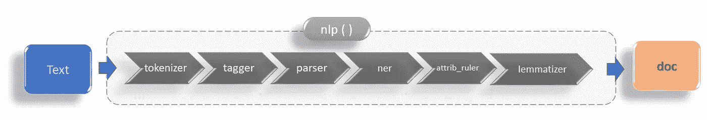
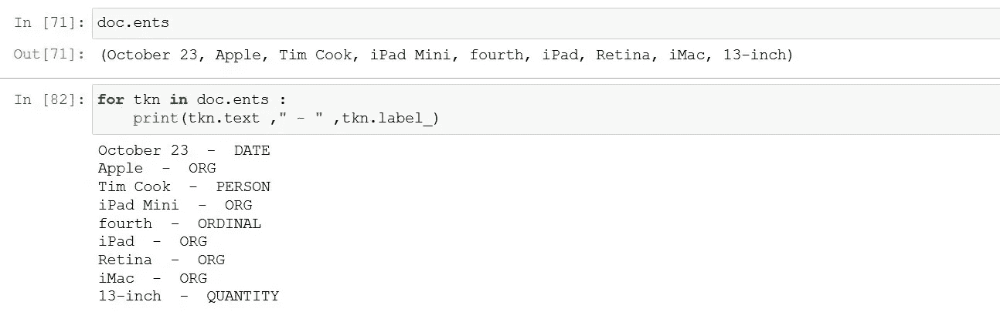
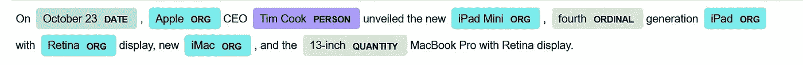
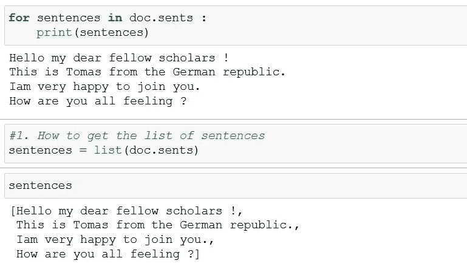

# spaCy 3.0 入门

> 原文：<https://towardsdatascience.com/getting-started-with-nlp-with-spacy-3-0-ff6a4bc74d9b?source=collection_archive---------9----------------------->

## 理解运行 spaCy 代码时发生的事情


图片来源:[威廉·冈克尔](https://unsplash.com/@wilhelmgunkel)

# 关于这篇文章

这篇文章是故事“理解 NLP —从 TF-IDF 到变形金刚 ”的支持材料的一部分

本文详细介绍了如何开始使用 spaCy。我们将把重点放在内部，而不仅仅是写一些代码和执行它。这意味着——我们将尝试更深入地研究当您执行每个代码片段时发生了什么。

每个代码片段都被分解并详细解释。如果您只想查看运行中的代码，您可能想跳过中间的详细解释，直接在您的 IDE 上运行代码。

**是给谁的？**

如果您刚刚开始使用 NLP，最好阅读一些关于 NLP 基本概念的文章。

在继续之前，您可能想更新/理解一些概念—

*   代币
*   词性标注
*   命名实体识别(NER)
*   词汇化/词干化

这篇文章是写给任何一个刚开始尝试 spaCy 作为你的软件包的人的。在我们的例子中，我们将使用 spaCy v3.0。

# 关于空间的一个简短说明

`spaCy`是一个工业级 NLP 包。

*   它很快(用 C 编写，带有 Python 的语言绑定)
*   这是生产级的
*   受到活跃社区的支持
*   围绕它构建了许多活跃的独立项目

# 安装和设置

**步骤 1 )** 安装`spaCy` 就像安装任何其他软件包一样

`> pip install spaCy`

**步骤 2)从命令提示符下下载**至少一个预先训练好的管道模型(英语版)

`> spacy download en_core_web_sm`

这下载了一个小型的英语语言模型管道，在网上找到的大量文本样本上进行训练。对于我们下载的语言，它有`weights`、`vocabularies` 等(*我们还不用担心这些术语*)。现在我们准备尝试一些例子。

你可以下载 4 个预先训练好的管道—

*   `en_core_web_sm` —小型号(13 MB)
*   `en_core_web_md` —中型预训练型号(44 MB)
*   `en_core_web_lg` —大型预训练模型(742 MB)
*   `en_core_web_trf` ( —基于变压器的预训练型号 438 MB)

输出的准确性和效率(执行速度)将取决于您选择的预训练模型。

# *#代码片段 1 —入门*

```
import spacy
nlp = spacy.load("en_core_web_md")doc = nlp("On October 23, Apple CEO Tim Cook unveiled the new iPad Mini, fourth generation iPad with Retina display, new iMac, and the 13-inch MacBook Pro with Retina display.")
```

## 这里发生了什么？

1.  我们导入了一个预先训练好的 spacy.lang 对象(如前所述，这个预先训练好的模型基于来自互联网的英语文本样本)。
2.  运行这个`nlp()`管道(以一个字符串为参数，返回一个`Doc`)。
3.  返回一个我们可以操作的空间`Doc` 对象

## **幕后发生了什么？**

当你把文本放在`nlp()`周围时，会发生很多事情。要知道发生了什么，调用`pipeline` 属性，你就会看到发生了什么。

```
>> nlp.pipeline
```

按正确顺序给出管道中包含的组件列表。

```
[('tok2vec', <spacy.pipeline.tok2vec.Tok2Vec at 0x24c8>),
 ('tagger', <spacy.pipeline.tagger.Tagger at 0x24c47c8>),
 ('parser', <spacy.pipeline.dep_parser.DependencyParser at 0x24c9ba8>),
 ('ner', <spacy.pipeline.ner.EntityRecognizer at 0x24c66508>),
 ('attribute_ruler',
  <spacy.pipeline.attributeruler.AttributeRuler at 0x24c67e08>),
 ('lemmatizer', <spacy.lang.en.lemmatizer.EnglishLemmatizer at 0x2403a88>)]
```

这意味着当您调用 nlp()时，您正在运行一系列步骤—



spaCy 语言处理管道(图片由作者提供)

*   **记号赋予器** —将文本转换成由单词和标点组成的小段——这些小段被称为**记号。**
*   **标记器** —该组件根据所使用的语言模型，将每个单词标记为相应的 ***词性*** 。
*   **解析器** —用于依赖解析的组件(换句话说，找到句子中单词之间的结构和关系——在本文的上下文中理解起来并不重要)。
*   **NER** (命名实体识别器)。
*   **属性标尺** —当您分配自己的规则(例如:单词/短语令牌匹配)时，该组件可以为单个令牌设置属性。
*   **词条解释器** —该组件为文档中的每个单词/符号创建词条。(词条也称为单词的基本形式。)

**哇！—** 如你所见，这里完成了很多工作。如果你有一个非常大的文本，它可能需要一点时间。

此时，我们准备对`doc` 对象进行一些操作。

# *#代码片段 2 —显示命名实体*

```
#if you want to show the named entities in the text 
doc.ents # if you want to display the labels associated with it 
for tkn in doc.ents : 
    print(tkn.text ," - " ,tkn.label_)
```

上面代码的输出会是这样的—



代码的输出(图片由作者提供)

或者如果你想要一个可视化的显示

```
from spacy import displacy
displacy.render(doc, style='ent')
```

会给你以下的输出。



文档中标识的实体的空间输出。(图片由作者提供)

# #代码片段 3—探索 doc 对象

**1。句子** —您可以使用`doc` 对象中的`sents`属性将句子分成一个`iterator` 对象，创建一个迭代器保存每个句子。

```
#working with sentences txt = “Hello my dear fellow scholars ! This is Tomas from the German republic. Iam very happy to join you. How are you all feeling ?”doc = nlp(txt)for sentences in doc.sents : 
    print(sentences)# or you can store it as a list
list_sentences = list(doc.sents)
```

上述代码的输出如下所示



代码的输出(图片由作者提供)

👉**注**:从 doc 对象中提取的句子是一个统计预测，不一定是最准确的。它不进行简单的基于规则的拆分，例如:基于“句号”/“句号”字符)

# #代码片段 4—规则和字符串匹配(自定义搜索模式)

spaCy 允许您搜索自定义搜索模式。这里有一个应用于前面例子的简单模式。

```
txt_apl = "On October 23, Apple CEO Tim Cook unveiled the new iPad Mini, fourth generation iPad with Retina display, new iMac, and the 13-inch MacBook Pro with Retina display."doc = nlp(txt_apl)
```

现在，创建并添加**自定义搜索模式**:

```
from spacy.matcher import Matcher
mat = Matcher(nlp.vocab,validate = True)#create patterns for matching
patrn_mac = [ {'LOWER': 'ipad'}]
patrn_Appl = [ {'LOWER': {'IN': ['apple', 'appl']}}]mat.add('patrn_mac', [patrn_mac])
mat.add('patrn_Appl', [patrn_Appl])for match_id, start, end in mat(doc):
    print(doc[start: end], “found at “,[start,end])
```

上面代码的输出看起来像这样—

```
Apple found at  [4, 5]
iPad found at  [11, 12]
iPad found at  [16, 17]
```

## 下面是正在发生的事情—分解成几个步骤:

1.  导入相关包(此处为`Matcher`)。
2.  通过包含`spacy.vocab.Vocab`对象，创建一个`Matcher` 对象`mat`。
3.  定义你的模式——这里我们想搜索任何字符串，转换成小写，并检查它是否匹配'`ipad`,并将该模式命名为`patrn_mac.` 。类似地，我们创建另一个名为`patrn_Appl`的模式。
4.  将这些图案添加到我们创建的`Matcher` 对象`(mat)`中。
5.  对我们从文本中创建的文档运行/检查这个`Matcher` 对象。`mat(doc)` 方法返回一个列表，其中包含匹配 ID、文档中匹配的开始和结束位置——如下所示:

```
[
 (4260053945752191717, 4, 5),
 (4964878671255706859, 11, 12),
 (4964878671255706859, 16, 17)
]
```

# 概述

*   当您运行`nlp()`时，它运行一个组件管道— `tok2vec`、`tagger`、`parser`、`ner`、`attribute_ruler` 和`lemmatizer`。
*   `doc.ents` 列出预训练模型识别的实体。
*   您可以使用`displacy` 直观查看 NER 输出。
*   在文档中列出你的句子。
*   您可以使用`Matcher`模块创建自定义字符串匹配模式。

## 结束语

这是对 spaCy 入门的简要介绍。然而，这篇文章并没有公正地评价 spaCy 作为一个高度可扩展的 NLP 包的能力和威力。后续文章将展示 spaCy 作为 NLP 包的生产就绪选择的强大功能。

如果你想阅读一些关于 NLP 的相关文章，这里有一篇

<https://pythoslabs.medium.com/10-use-cases-in-everyday-business-operations-using-nlp-af49b9650d8f>**使用 NLP 的日常业务运营中的 10 个用例**

**<https://pythoslabs.medium.com/10-use-cases-in-everyday-business-operations-using-nlp-af49b9650d8f> **