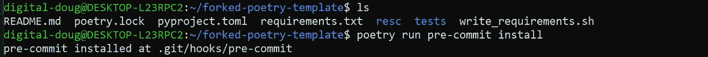
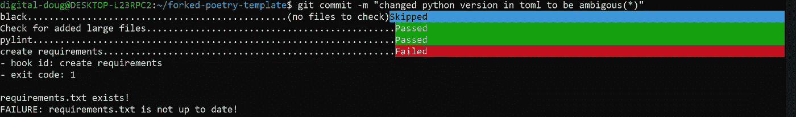
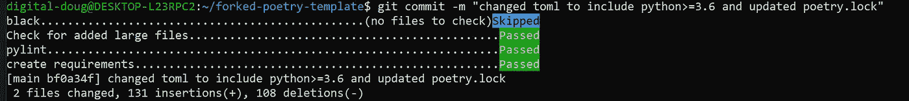

# Python 预提交挂钩入门

> 原文：<https://towardsdatascience.com/getting-started-with-python-pre-commit-hooks-28be2b2d09d5?source=collection_archive---------3----------------------->

## 定义拒绝不符合要求的提交的规则

作者:[爱德华·克鲁格](https://www.linkedin.com/in/edkrueger/)和[道格拉斯·富兰克林](https://www.linkedin.com/in/douglas-franklin-1a3a2aa3/)


布鲁克·安德森在 [Unsplash](https://unsplash.com/s/photos/hooks?utm_source=unsplash&utm_medium=referral&utm_content=creditCopyText) 上拍摄的照片

这里是这个项目的模板。我们使用诗歌进行包装管理。本文主要关注预提交挂钩。

[](https://github.com/edkrueger/poetry-template) [## 爱德华·克鲁格/诗歌模板

### 运行诗歌安装来安装环境。运行诗歌运行预提交安装初始化 git 挂钩。跑诗跑…

github.com](https://github.com/edkrueger/poetry-template) 

# 什么是预提交挂钩？

预提交钩子是 Git 钩子的子集。Git-hooks 是每当 Git 存储库中发生特定事件时自动运行的脚本。“预提交挂钩”在提交发生之前运行。

这些 Python 钩子被认为是静态分析的一种方法。静态代码分析是一种通过检查代码而不执行代码来进行调试的方法。

预提交挂钩通常用于确保代码在发布前被正确地链接和格式化。在我们的项目中，我们使用四个预提交钩子，`black`、check-large-files、`pylint` 和我们的自定义钩子`create-requirements`。

我们在一个名为`pre-commit-config.yaml`的 YAML 文件中指定这些 Python 钩子。YAML 是一种人类可读的数据序列化语言，通常用于配置文件。YAML 文件包含带有键/值对的列表和字典。

## 预提交 Python 包

令人困惑的是，还有一个叫做`pre-commit`的 Python 包。预提交是一个用于预提交挂钩的管理工具。这个包在每次提交之前管理安装和执行挂钩。

我们将需要这个`pre-commit`包作为开发需求。此外，钩子`check-added-large-files`来自这个预提交包，稍后你可以在我们的`.yaml`文件中看到。

请注意，在`[tool.poetry.dev-dependecies]`下，您会找到`pre-commit.`

pyproject.toml

## 提交前挂钩文件

使用包`pre-commit`设置 git 挂钩非常容易。我们需要做的就是在我们的项目中创建并格式化一个`.pre-commit-config.yaml`文件。然后包`pre-commit`在你运行时寻找这个`.yaml`文件:

```
> pre-commit install
```

因为 Python 我们的 Python 钩子在源代码中是以 YAML 的形式存储的，所以当我们把这个文件上传到 Git 时，它们会自动分发。这使得在新机器上设置项目的预提交挂钩就像克隆 repo 并运行上面的代码行一样简单。

如果您没有使用 Python 包、预提交和他们提供给我们的标准格式，这个过程会更复杂。

## 我们的`.pre-commit-config.yaml`

这是一个不错的通用`pre-commit-config.yaml`。我们可以看到在`repos`下面是一个字典列表，用键/值对来指定钩子和它们的行为。这个 YAML 包含了格式化钩子，文件大小过滤器，棉绒，和我们的自定义钩子。每个钩子都有一个伴随的`id`，见第 5、9、12 和 18 行。

。预提交配置文件

这是标准的 `.yaml`格式。您可以看到嵌套在`repos.` 中的`repo`键，每个回购键后面都跟有所需钩子代码的值(URL)。第 2 行和第 6 行有对应于 Github 存储库的 URL。

在第 10 行，我们指定下面的钩子是`local`钩子。这意味着我们在本地使用第 14 行的 bash 代码运行`pylint` ，使用第 20 行的代码运行`create-requirements`。

本地运行`pylint` 给了我们对内衬行为更多的控制，因为我们可以指定 bash 命令如何工作。这节省了我们调试`pylint` 问题的时间，并允许更多的透明度和定制。此外，在本地运行`pylint` 意味着您在自己的环境中使用的是`pylint` 的版本。

值得注意的是，在第 3 行和第 7 行，我们使用`rev` 来指定我们想要使用的钩子的版本。这些版本可能与您的虚拟环境中的版本不同步。您必须手动保持这些版本的同步。如果这是一个问题，您可以在本地运行所有的挂钩，以确保挂钩使用的是您在虚拟环境中指定的相同版本。

# 运行提交前挂钩

我们运行`poetry run pre-commit install`来初始化 git 挂钩。



提交前安装

现在我们的预提交钩子将在我们提交代码时运行。



使用预提交挂钩的 git 提交

这里的终端输出很简单。我们看到每个钩子都有一个`skipped,passed, or failed`结果。

`Black` 被跳过，因为没有已更改的 Python 文件来运行格式化。钩子`check-added-large-files`通过，因为没有超过 5Mb 的文件被提交。`pylint`无法在我们的 Python 文件中找到任何林挺错误。最后，我们注意到我们的定制钩子失败了，因为我们的`requirements.txt`文件与我们的`pyproject.toml.`文件不同步

假设我们已经做了必要的修改，所以我们所有的预提交钩子都通过了(或者跳过了),并且我们已经使用了`git add`在提交中包含了修改。现在，当我们运行`git commit`时，我们的输出看起来略有不同。



带预提交的 git 提交

因为我们所有的预提交 Python 钩子都已经通过或跳过，所以提交将被完成和暂存。注意，当一个钩子失败时，提交也会失败。这就是当我们的代码不符合我们的标准时，预提交钩子如何避免我们犯错误。

现在我们可以`git push`对我们的源代码进行修改，知道我们的提交没有语法错误、不必要的大文件或过时的 requirements.txt 文件。

## 结论

记住,“预提交钩子”在提交发生之前运行。Python 包 Pre-commit 使我们能够轻松地管理和运行钩子，我们需要这些钩子来确保代码在发布前被正确地链接和格式化。

通过最少的设置，预提交钩子可以避免错误的提交，从而节省时间。像`black`这样的预提交钩子确保你发布的代码是干净和专业的。`Pylint` 在我们将错误添加到代码库之前向我们显示错误。在您意外地将大文件提交给 git 之前，大文件检查会向您发出警告。这种意外事故很难逆转，所以最好提前预防。

您甚至可以将自己的预提交挂钩编码为 bash 脚本，以满足定制需求。例如，您可以要求在提交代码之前运行测试。

*有关使用 bash 编写自己的预提交钩子的更多信息，请查看这篇文章！*

[](https://medium.com/@edkrueger_16881/how-to-code-your-own-python-pre-commit-hooks-with-bash-171298c6ee05) [## 如何用 Bash 编写自己的 Python 预提交钩子

### 创建自己的预提交挂钩，用于静态分析和与 Git repo 的持续集成。

medium.com](https://medium.com/@edkrueger_16881/how-to-code-your-own-python-pre-commit-hooks-with-bash-171298c6ee05)