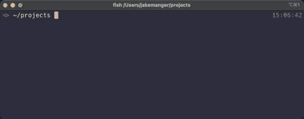
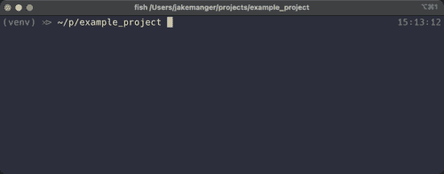

# Python 虚拟环境入门

> 原文：<https://towardsdatascience.com/getting-started-with-python-virtual-environments-252a6bd2240?source=collection_archive---------1----------------------->

## [入门](https://towardsdatascience.com/tagged/getting-started)

## 避免 python 项目间冲突的简短指南

如果您刚刚开始使用 python 进行数据科学或开发，您可能会遇到一个常见的初学者问题——为什么您的项目在从事其他工作一段时间后不再运行。您可能也不知道您的 python 包存储在哪里，或者不知道如何在项目之间管理不同版本的 python。好了，松一口气吧，虚拟环境已经来拯救我们了(实际上它们已经存在很长时间了。长到找不到参考文献……)。


不要让你的 python 和你的头发纠缠在一起，使用虚拟环境。图片是卡拉瓦乔的美杜莎，来源于[维基共享](https://commons.wikimedia.org/wiki/File:Medusa_by_Caravaggio.jpg)。

# 它们是什么？

简单地说，Python 虚拟环境是一个独立 python 在您的计算机上运行的封闭环境🐍。这意味着您可以拥有单独的虚拟环境，为您的每个项目提供单独版本的 python 和 python 包。因此，您可以在一个项目上安装或删除 python 包，这不会影响您可能拥有的任何其他项目。

*注意:本指南假设您已经安装了 python 3。如果没有，请访问*[*https://www.python.org/*](https://www.python.org/)*获取安装说明。*

# 你把它们放在哪里？

有些人喜欢把他们所有的 python 虚拟环境放在一个文件夹中，然而，我发现这种方法很难跟踪什么环境属于什么项目。对于 python 虚拟环境，一个更常见的做法是将它们放在每个项目的根目录下。

例如，如果您有一个名为“example_project”的项目，您可以将当前目录更改到那里

```
cd example_project
```

然后按照以下步骤创建您的虚拟环境。

# 创建虚拟环境

人们用来创建虚拟环境的一种常见方式是使用一个名为 [**virtualenv**](https://virtualenv.pypa.io/en/latest/) 的 python 包，但从 python 3.3 版本开始，virtualenv 的部分内容实际上是以模块名`venv`内置到 python 中的。现在，您可以使用以下命令创建虚拟环境:

```
python3 -m venv venv
```

这是怎么回事？

*   嗯，`python3`就是你安装的 python。如果你安装的 python 版本叫`python`、`python3.7`或者`python3.9`或者别的什么，那就用那个；
*   `-m venv`是一个告诉 python 运行虚拟环境模块的参数，`venv`；
*   最后，最后一个`venv`是虚拟环境文件夹的名称。有些人喜欢用另一个名字(如 env 或。env)，不过，这完全取决于你。

这个命令应该做的是在当前目录下创建一个名为 venv 的 python 虚拟环境。

*注意:如果你使用 git，你会想把* `*venv/*` *添加到一个名为。gitignore 确保你不会对你的虚拟环境进行版本控制。如果您忘记了这一步，那么您的 git 存储库可能会被数百个额外的版本控制文件堵塞。*

一旦你创建了你的虚拟环境，你就不需要再这样做了。现在，您将能够按照以下步骤使用您的环境。

# 如何使用它们

要使用虚拟环境，您需要使用以下命令“激活”该环境:

(在 MacOS 和 Linux 上)

```
source venv/bin/activate
```

或(Windows)

```
venv\Scripts\activate
```

如果您在 MacOS 或 Linux 上使用 fish shell(像我一样),您需要将上面的 MacOS 或 Linux 命令替换为:

```
source venv/bin/activate.fish
```

上述命令所做的是改变命令`python`和`pip`(python 包管理器)来引用那些位于 venv 文件夹中的命令。应该会出现一个有用的指示器，显示您正在使用虚拟环境，如下所示:

```
(venv) $
```

这意味着当您安装带有 pip 的软件包时，例如

```
pip install numpy
```

现在，您将把它安装到 venv 文件夹中的虚拟环境中。如果您愿意，您应该能够查看您在`venv/lib/python3.9/site-packages`中安装的包的文件。如果不同，您必须用`python3.9`替换您的版本。

按照上面的步骤操作，应该会看到类似下面 GIF 的东西。



创建虚拟环境。图片作者。

继续这个例子，如果您现在以交互模式启动 python，您将能够使用以下命令访问这些包:

```
pythonimport numpy as npprint(np.sqrt(5))
```

如果一切正常，您应该会看到类似下面的内容:



使用虚拟环境。图片作者。

在使用 python 运行 python 文件时，您还应该能够访问您安装的任何包。例如，如果您想使用虚拟环境中包含的 python 来运行一个名为“main.py”的文件，您可以使用以下命令:

```
python main.py
```

完成虚拟环境后，您可以关闭终端，或者使用如下命令停用环境:

```
deactivate
```

如果需要的话，这也将允许您为您的另一个项目激活一个不同的虚拟环境。

# 复制你的环境

为了重现 python 虚拟环境(例如，在另一台机器上)，通常需要将安装的包保存到一个文件中。这将允许任何拥有您的文件的人安装您在开发项目时使用的相同版本的包。然而，你可能还是想告诉他们你使用的 python 版本。通常人们喜欢使用一个名为“requirements.txt”的文件来实现这个目的。

如果您已经激活了 python 虚拟环境，那么您可以自动生成 requirements.txt 文件，包含以下内容:

```
pip freeze > requirements.txt
```

您也可以编辑这个文件或者手动创建一个，如果您愿意的话(例如，您不想对包的版本要求如此严格)。更多详情见[此处](https://pip.pypa.io/en/stable/user_guide/)。

因此，如果您或其他人想要创建一个虚拟环境并使用与您相同的包，他们可以按照上面的命令创建并激活一个虚拟环境，然后安装您的需求。可以使用 pip 的-r 方法安装需求，如下所示:

```
pip install -r requirements.txt
```

# 现在去哪里？

我已经向您展示了使用 python 的虚拟环境的最简单和标准的方法，但是，如果您愿意，您可以使用虚拟环境和 python 的各种方法。大多数情况下，这些都不是不必要的，但是如果您愿意，一些著名的包提供了一种不同的方式来处理虚拟环境和包，它们是:

*   诗歌【https://python-poetry.org/】T2，还有
*   https://www.anaconda.com/products/individual[康达](https://www.anaconda.com/products/individual)

如果你已经走了这么远，谢谢你。我希望这篇文章能帮助您在数据科学(或您所做的任何事情)之旅中取得更大的进步。如果你喜欢这篇文章，请鼓掌并关注我，让我有动力写更多。如果你有任何问题，请在下面补充。