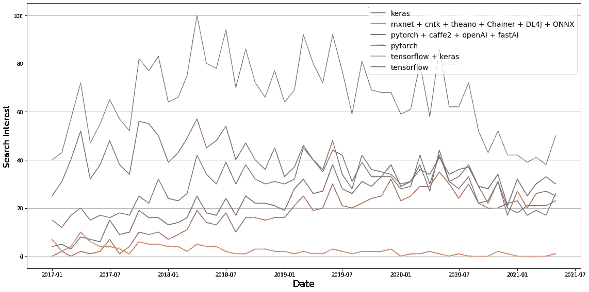
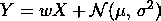
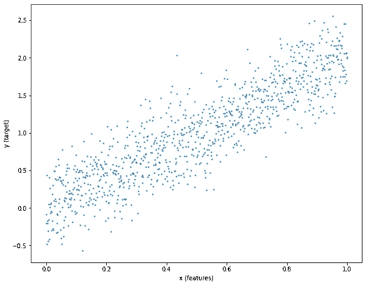
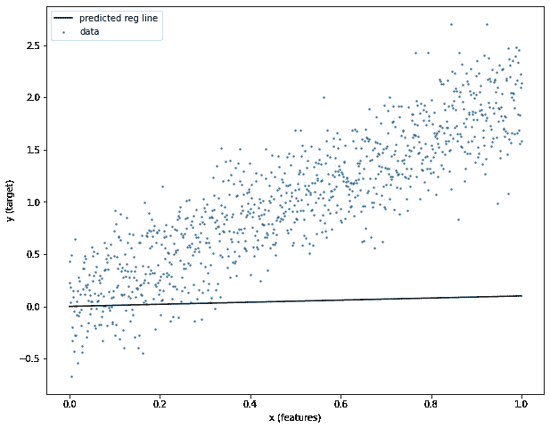
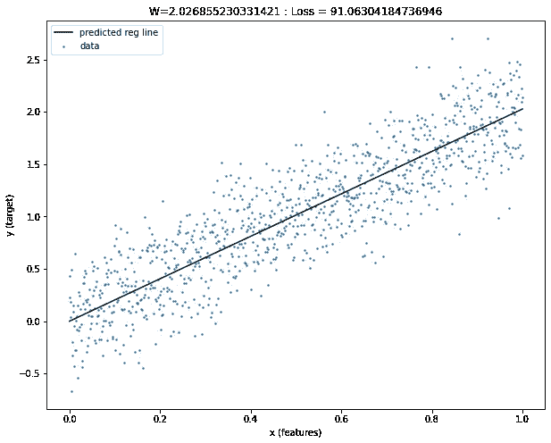
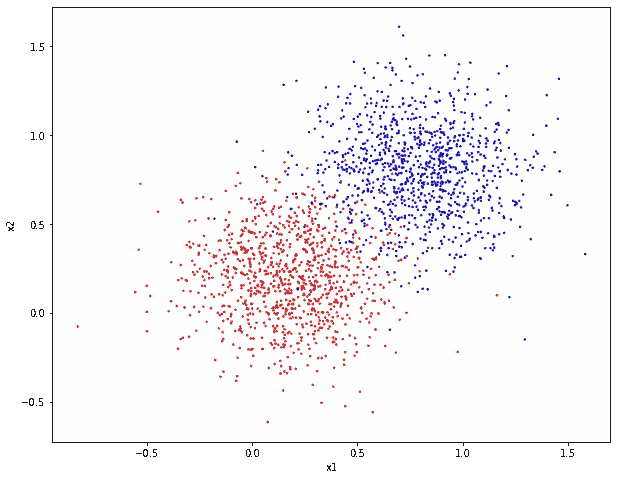
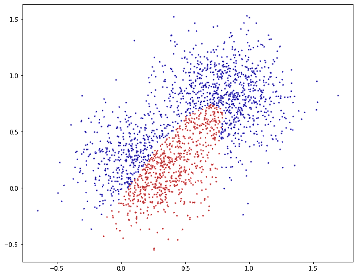
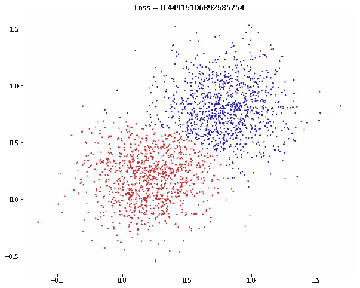

# PyTorch 入门

> 原文：<https://towardsdatascience.com/getting-started-with-pytorch-2819d7aeb87c?source=collection_archive---------9----------------------->

## [入门](https://towardsdatascience.com/tagged/getting-started)

## 通过示例学习基础知识


照片由来自 Pexels 的[杰瑞米·毕夏普](https://www.pexels.com/@jeremy-bishop-1260133)拍摄

# 介绍

在我之前的帖子“[Tensorflow](/getting-started-with-tensorflow-e33999defdbf)入门”中，我提到如果你想构建小型或大型深度学习解决方案，tensor flow 和 PyTorch 都是很好的选择。这两个平台都广泛应用于学术界和工业界，维护良好，是开源的，提供简单的 API 和高级功能。

在这里，我们将探索 PyTorch API。在“【Tensorflow 入门”的同时，我们将讨论 PyTorch 是如何产生的，以及如何将其用于深度学习。

# PyTorch 是什么时候开发的？

大约在 PyTorch 0.1.1 版本于 2016 年 9 月发布时，有多个深度学习框架可用，为构建和训练复杂模型提供了低级和高级包装器。

Caffe、Chainer、Theano、Tensorflow、CNTK、MXNet 和 Torch 只是研究人员用来构建日益复杂的网络的几个低级库。

另一方面，Lasagne 和 Keras 专注于创建可以使用许多低级库之一的高级包装器。这种方法得到了从业者的大力支持，因为它允许他们从 Tensorflow、CNTK 或 Theano 等语言的低级语法中进行抽象。

在接下来的几年里，随着 frameworks⁴:的放弃和巩固，情况发生了巨大的变化

*   Keras 被并入 Tensorflow，大大改变了方向；
*   Caffe 2 被合并到 PyTorch 中，取代了 Torch 祖先的部分原始 Lua 实现；
*   Theano、CNTK 和 Chainer 的开发和支持已停止。



谷歌在“机器学习和人工智能”类别下搜索 2017 年 1 月至 2021 年 7 月之间的顶级低/高级深度学习框架(Tensorflow、Keras、PyTorch)。为了进行比较，还显示了合并的 Tensorflow+Keras 和 PyTorch+Caffe2。图片由作者提供。

到 2021 年 6 月，超过 99%的谷歌搜索主要深度学习框架包含 Tensorflow/Keras 或 PyTorch/Caffe，其中第一个仍然明显更受欢迎(见图表)。

# 通过例子学习

在下面的小节中，我将介绍在 PyTorch 中构建两个简单神经网络的关键概念(一个用于回归，一个用于分类)。

为了使本教程与我之前的帖子“[tensor flow](/getting-started-with-tensorflow-e33999defdbf)入门”相媲美，我将重复使用相同的模拟数据集。为了使本教程自成一体，我将在这里再次重新介绍它们。

## 线性回归

在此示例中，我们将在 PyTorch 中构建一个简单的 1 层神经网络来解决线性回归问题。这将解释如何初始化你的权重(又名回归系数)，以及如何通过反向传播来更新它们。

我们首先需要的是一个数据集。这里，我们将模拟一个噪声线性模型，如下所示



其中 Y 是我们的目标，X 是我们的输入，w 是我们要确定的系数，N 是高斯分布噪声变量。为此，在笔记本的第一个单元格中粘贴并运行以下代码片段。

这将显示 X 和 Y 之间关系的散点图，清楚地表明在一些高斯噪声下的线性相关性。在这里，我们期望一个合理的模型来估计 2 作为理想的回归系数。



代表高斯噪声下 X 和 Y 之间线性相关性的模拟数据。

在 PyTorch 中，我们通常使用张量来表示我们的输入、目标和回归系数(这里称为权重)。张量是由火炬表示的多维元素阵列。张量的对象。张量只有一种数据类型和一种形状。

现在让我们将输入(x)和目标(y)转换成火炬张量。为此，在 Colab 中复制并运行以下代码片段。

这将返回类(火炬。张量)、输入和目标张量的形状、大小和值。

```
Describing the features...
<class 'torch.Tensor'>
torch.float64
torch.Size([1000])
tensor([0.0000, 0.0010, 0.0020, 0.0030, 0.0040, 0.0050, 0.0060, 0.0070, 0.0080,
        0.0090], dtype=torch.float64) Describing the target...
<class 'torch.Tensor'>
torch.float64
torch.Size([1000])
tensor([ 0.1587, -0.6984,  0.1692,  0.1368,  0.1386,  0.0854,  0.2807,  0.2895,
         0.5358,  0.3550], dtype=torch.float64)
```

现在让我们用一个常数(0.1)开始我们的权重。为此，我们调用“torch.tensor ”,缺省值为 0.1，需要的数据类型(float)和存储张量的设备。在本例中，我们将在“cpu”中执行所有操作。为了提高大型神经网络模型的性能，我们可以将张量移至“gpu”。

运行这个代码片段将输出权重张量的类、形状、类型和值。注意，这个张量有一个“[]”形状，表示它是一个 0 维向量。

```
Describing the weights… 
<class ‘torch.Tensor’> 
torch.float32 torch.Size([]) 
tensor(0.1000, requires_grad=True)
```

给定初始化的权重张量和输入 X，为了获得预测的 Y (Yhat ),我们可以简单地调用 Yhat = x * w _ tensor.detach()。numpy()'。的’。分离()。“numpy()”用于将权重向量转换为 numpy 数组。复制并运行下面的代码片段，看看初始化后的重量如何符合数据。

正如你所观察到的,‘w _ tensor’的当前值与理想值相差甚远。回归线完全符合数据。



训练前模型拟合的表示。

为了找到‘w _ tensor’的最佳值，我们需要定义一个损失度量和一个优化器。这里，我们将使用均方误差(MSE)作为我们的损失度量，随机梯度下降(SGD)作为我们的优化器。

我们现在有了优化我们的“w _ 张量”的所有部分。优化循环需要自定义“前进”步骤的定义，从我们的损失度量调用“后退”步骤方法，从我们的优化器调用“步骤”方法。

自定义的“前进”步骤告诉模型如何将输入与权重张量相结合，以及如何计算我们的目标与预测目标之间的误差(下面代码片段中的第 5 行到第 8 行)。在一个更复杂的例子中，这将是一组定义从输入 X 到目标 y 的计算图的指令。

“向后”步骤告诉模型将错误反向传播到网络中的每一层(下面代码片段中的第 22 行)。

最后，“optimizer.step()”告诉模型计算并应用这次迭代的权重变化(下面代码片段中的第 23 行)。注意，在大多数情况下，您需要在调用优化器步骤之前清除梯度(下面代码片段中的第 21 行)。

在训练结束时，你的体重应该接近 2(理想值)。要使用该模型进行推理(即，在给定 X 值的情况下预测 Y 变量)，只需执行“Yhat = x * w_tensor.detach()。numpy()'。



训练后模型拟合的表示。

## 分类问题

在本例中，我们将引入 PyTorch NN 顺序模型定义来创建一个更复杂的神经网络。如果你习惯 Keras，这个模块看起来会很熟悉。我们将把这个模型应用于一个线性可分的分类问题。

像以前一样，让我们从构建数据集开始。在下面的代码片段中，我们为第一个聚类创建了两个以(0.2，0.2)为中心的点聚类，为第二个聚类创建了两个以(0.8，0.8)为中心的点聚类。

我们可以很快观察到，用一条与两个聚类距离相等的线将两个数据集线性分离的模型是理想的。



模拟数据表示两个数据聚类，第一个聚类以(0.2，0.2)为中心，第二个聚类以(0.8，0.8)为中心。

让我们从定义自定义 NN 模型来解决这个问题开始。我们将定义一个 5 层神经网络如下:

1.  有 10 个节点的线性层。这将有一个 2 x 10(输入形状 x 图层大小)的形状。
2.  批量标准化层。这一层将对每一批的第一层的输出进行归一化，避免爆炸/消失梯度。
3.  Relu 激活层。这一层将为我们的网络提供非线性能力。请注意，我们仅以此为例。对于这个问题，relu 层是不必要的，因为它是线性可分离的。
4.  具有两个节点的线性层。这将有一个 10 x 2(层大小 x 输出形状)的形状。
5.  Softmax 层。该层会将第 4 层的输出转换为 softmax。

和以前一样，让我们也将 x 和 y numpy 数组转换成张量，使它们对 PyTorch 可用，然后定义我们的损失度量和优化器。在这个例子中，我们应该使用分类损失度量，例如交叉熵。

对于优化器，我们可以像以前一样使用 SGD。然而，普通 SGD 的收敛速度慢得令人难以置信。相反，我们将使用最近的自适应梯度下降方法(RMSProp)。

和以前一样，我们先来检查一下我们的网络在训练前表现如何。要使用该模型进行推理，我们可以简单地键入“yhat = model(x)”。现在，复制下面的片段来可视化网络输出。

你可以确认网络一点也不好。显然需要一些训练来正确区分这两个类别。



训练前模型拟合的表示。

为了训练顺序 PyTorch 模型，我们遵循与第一个示例相同的步骤，但是用模型调用替换了自定义的“前进”步骤。将下面的片段添加到您的笔记本中，以训练模型。

在训练循环结束时，你的网络应该能够很好地分离这两个类。要使用该模型进行推理(即，在给定 X 值的情况下预测 Y 变量)，您可以简单地执行“yhat = model(x)”。



训练后模型拟合的表示。

## 完整脚本

如需完整的脚本，请点击以下链接进入我的 github 页面:

<https://github.com/andreRibeiro1989/medium/blob/main/pytorch_getting_started.ipynb>  

或者通过以下链接直接访问 Google Colab 笔记本:

<https://colab.research.google.com/github/andreRibeiro1989/medium/blob/main/pytorch_getting_started.ipynb>  

# 结论

PyTorch 是目前开发定制深度学习解决方案的最佳深度学习框架之一(另一个是 Tensorflow)。在这篇博客中，我介绍了在 PyTorch 中构建两个简单 NN 模型的关键概念。

**警告！！！**正如我在《【Tensorflow 入门中提到的，你的学习才刚刚开始。要变得更好，你需要不断练习。[官方 Pytorch](https://pytorch.org/tutorials/) 网站提供了从初学者到专家级别的示例，以及 Pytorch 软件包的官方文档。祝你好运！

[1]钦塔拉，苏密特。 *PyTorch Alpha-1 发布*(2016 年 9 月)
[https://github.com/pytorch/pytorch/releases/tag/v0.1.1](https://github.com/pytorch/pytorch/releases/tag/v0.1.1)

[2]因陀罗·登·贝克。"*深度学习框架之战—第一部分:2017，更多框架和接口"*
[https://towardsdatascience . com/Battle-of-the-Deep-Learning-frameworks-Part-I-cff0e 3841750](/battle-of-the-deep-learning-frameworks-part-i-cff0e3841750)

[3]麦迪逊·梅。"*Python 深度学习框架概述"*
[https://www . kdnugges . com/2017/02/Python-Deep-Learning-Frameworks-Overview . html](https://www.kdnuggets.com/2017/02/python-deep-learning-frameworks-overview.html)

[4]伊莱·史蒂文斯、卢卡·安提卡、托马斯·维赫曼。"*用 PyTorch 进行深度学习"*
[https://py torch . org/assets/Deep-Learning/Deep-Learning-with-py torch . pdf](https://pytorch.org/assets/deep-learning/Deep-Learning-with-PyTorch.pdf)