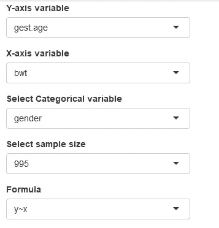
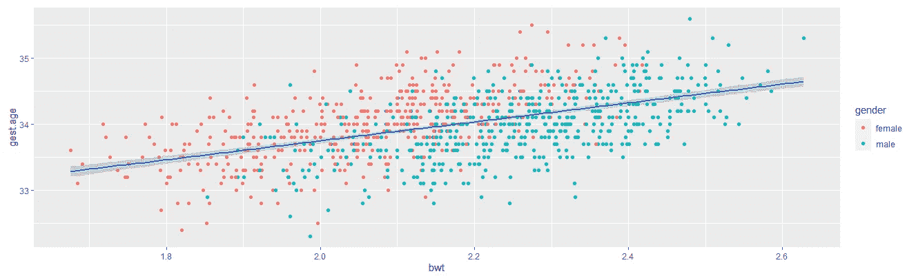
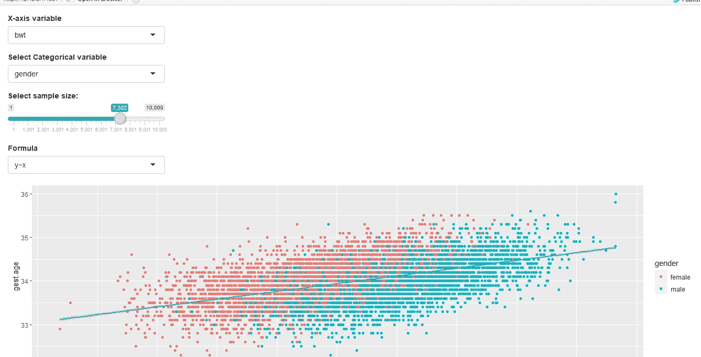
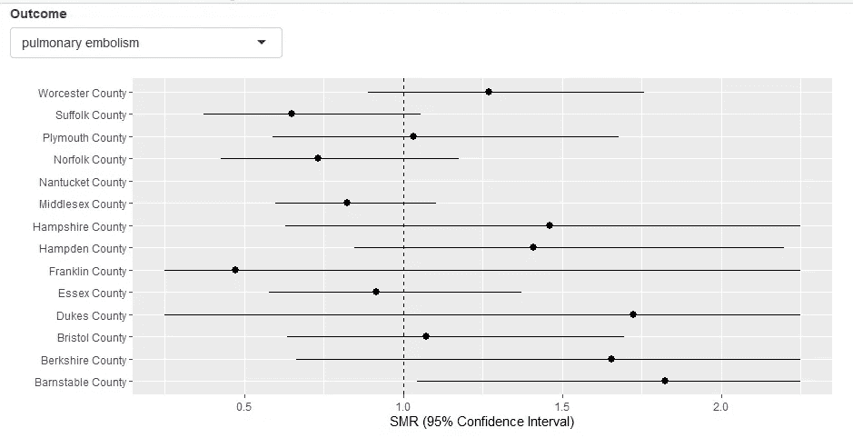
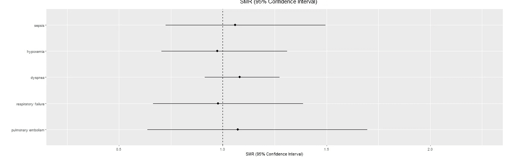
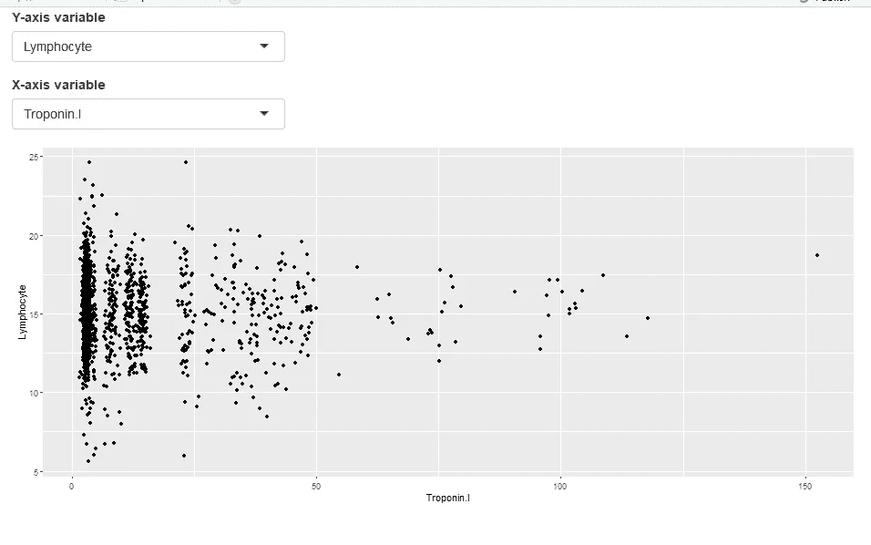

# R Shiny 入门

> 原文：<https://towardsdatascience.com/getting-started-with-r-shiny-821eb0328e73?source=collection_archive---------4----------------------->

## 向成为一名闪亮的专家迈出第一步


照片由[卢克·切瑟](https://unsplash.com/@lukechesser?utm_source=unsplash&utm_medium=referral&utm_content=creditCopyText)在 [Unsplash](https://unsplash.com/s/photos/analysis?utm_source=unsplash&utm_medium=referral&utm_content=creditCopyText) 上拍摄

# R 闪亮简介

Shiny 是一个 R 包，它允许程序员在 R 中构建 web 应用程序。对于像我这样发现用 Java 构建 GUI 应用程序非常困难的人来说，Shiny 让它变得容易多了。

这篇博客文章将让你用工作示例直接构建闪亮的应用程序。首先，确保你安装了闪亮的软件包。

```
install.packages("shiny")
```

# 闪亮的应用程序结构

和 R 文件一样，闪亮的应用也以*结尾。r 分机。*app 结构由三部分组成，分别是:

1.  一个用户界面对象 **(ui)**
2.  服务器功能
3.  对 shinyApp 的函数调用

用户界面(`ui`)对象用于管理应用程序的外观和布局，如单选按钮、面板和选择框。

```
*# Define UI for app* 
ui <- fluidPage(

  *# App title ----*
  titlePanel("!"),

  *# Sidebar layout with input and output definitions ----*
  sidebarLayout(

    *# Sidebar panel for inputs* 
    sidebarPanel(

    )*# Allow user to select input for a y-axis variable from drop-down*
       selectInput("y_varb", label="Y-axis variable",choices=names(data)[c(-1,-3,-4)]),*# Output: Plot*
      ("plot", dblclick = "plot_reset"))
```

`server`函数包含构建应用程序所需的信息。例如，这包括生成图或表以及对用户点击做出反应的指令。

```
*# Define server logic here ----*
server <- **function**(input, output) {

  *# 1\. It is "reactive" and therefore updates x-variable based on y-        variable selection* *# 2\. Its output type is a plot*
  output$distPlot <- renderPlot({

    remaining <- reactive({
    names(data)[c(-1,-3,-4,-match(input$y_varb,names(data)))]
  })

  observeEvent(remaining(),{
    choices <- remaining()
    updateSelectInput(session = getDefaultReactiveDomain(),inputId = "x_varb", choices = choices)
  })

}output$plot <- renderPlot({
    #ADD YOUR GGPLOT CODE HERE
    subset_data<-data[1:input$sample_sz,]
    ggplot(subset_data, aes_string(input$x_varb, input$y_varb))+
      geom_point(aes_string(colour=input$cat_colour))+
      geom_smooth(method="lm",formula=input$formula)}, res = 96)
}
```

最后，`shinyApp`函数基于 UI/服务器对构建闪亮的应用程序对象。

```
library(shiny)
*# Build shiny object* shinyApp(ui = ui, server = server)
*# Call to run the application*
runApp("my_app")
```

# 什么是反应性？

反应性就是把用户输入和应用输出联系起来；以便 Shiny 应用程序中的显示可以根据用户的输入或选择进行动态更新。

# 反应式编程的构建模块

## **输入**

传递给`shinyServer`函数的`input`对象允许用户访问应用程序的输入字段。它是一个类似列表的对象，包含从浏览器发送的所有输入数据，根据输入 ID 命名。

与典型的列表不同，输入对象是只读的。如果您试图修改服务器函数内部的输入，您将会得到一个错误。输入只能由用户设置。这是通过创建一个反应表达式来完成的，其中一个普通表达式被传递到`reactive`。要从输入中读取数据，您必须处于由像`renderText()`或`reactive().`这样的函数创建的反应上下文中

## 输出

为了允许在应用程序中查看反应值或输入，需要将它们分配给`output`对象。和`input`对象一样，它也是一个类似列表的对象。它通常与类似`renderTable.`的`render`功能一起工作

`render`功能执行以下两个操作:

1.  它设置了一个反应上下文，用于自动将输入与输出关联起来。
2.  它将 R 代码输出转换为 HTML 代码，以便在应用程序上显示。

## 反应式表达

反应式表达式用于将应用程序中的代码分割成相当大的代码块，这不仅可以减少代码重复，还可以避免重新计算。

在下面的例子中，反应代码接收来自用户的四个输入，然后用于输出独立样本 t 检验的结果。

```
server <- function(input, output) {x1 <- reactive(rnorm(input$n1, input$mean1, input$sd1))x2 <- reactive(rnorm(input$n2, input$mean2, input$sd2))output$ttest <- renderPrint({t.test(x1(), x2())})}
```

# 闪亮的应用示例

现在，我们知道一些基础知识，让我们建立一些应用程序。

## 应用一

该应用程序使用一个虚拟数据集，其中包括三个连续变量。对应用程序的要求如下:

1.  在数据集中三个连续变量中的两个之间生成散点图，其中第一个变量不能相对于自身绘制。
2.  用户可以选择 x 和 y 变量进行绘图
3.  用户可以选择绘图公式(“y~x”，“y~poly(x，2)”，“y~log(x)”)。
4.  选择的分类变量用于给散点图中的点着色
5.  用户可以选择行数(样本大小)，范围从 1 到 1，000，用于绘图。

```
*#Load libraries*
library(shiny)
library(ggplot2)***#Create dummy dataset***
k<-1000
set.seed(999)
data<-data.frame(id=1:k)
data$gest.age<-round(rnorm(k,34,.5),1)
data$gender<-factor(rbinom(k,1,.5),labels=c("female","male"))
z =  -1.5+((((data$gest.age-mean(data$gest.age)))/sd(data$gest.age))*-1.5)
pr = 1/(1+exp(-z))
data$mat.smoke = factor(rbinom(k,1,pr))
data$bwt<- round(-3+data$gest.age*0.15+
                   ((as.numeric(data$mat.smoke)-1)*-.1)+
                   ((as.numeric(data$mat.smoke)-1))*((data$gest.age*-0.12))+
                   (((as.numeric(data$mat.smoke)-1))*(4))+
                   ((as.numeric(data$gender)-1)*.2)+rnorm(k,0,0.1),3)
data$mat.bmi<-round((122+((data$bwt*10)+((data$bwt^8)*2))/200)+
                      rnorm(k,0,1.5)+(data$gest.age*-3),1)rm(z, pr, k)***#Define UI***
ui <- fluidPage(

 ***#1\. Select 1 of 3 continuous variables as y-variable and x-variable***
  selectInput("y_varb", label="Y-axis variable",choices=names(data)[c(-1,-3,-4)]),
  selectInput("x_varb", label="X-axis variable", choices=NULL),   ***#2\. Colour points using categorical variable (1 of 4 options)***
  selectInput("cat_colour", label="Select Categorical variable", choices=names(data)[c(-1,-2,-5,-6)]),  ** *#3\. Select sample size***
  selectInput("sample_sz", label = "Select sample size", choices = c(1:1000)),
  #4\. Three different types  of linear regression plots
  selectInput("formula", label="Formula", choices=c("y~x", "y~poly(x,2)", "y~log(x)")),
  #5\. Reset plot output after each selection
  plotOutput("plot", dblclick = "plot_reset")

)
server <- function(input, output) {

  ***#1\. Register the y-variable selected, the remaining variables are now options for x-variable***
  remaining <- reactive({
    names(data)[c(-1,-3,-4,-match(input$y_varb,names(data)))]
  })

  observeEvent(remaining(),{
    choices <- remaining()
    updateSelectInput(session = getDefaultReactiveDomain(),inputId = "x_varb", choices = choices)
  })

  output$plot <- renderPlot({
    ***#Produce scatter plot***
    subset_data<-data[1:input$sample_sz,]
    ggplot(subset_data, aes_string(input$x_varb, input$y_varb))+
      geom_point(aes_string(colour=input$cat_colour))+
      geom_smooth(method="lm",formula=input$formula)}, res = 96)
}***# Run the application*** 
shinyApp(ui = ui, server = server)
```



图 1:用户必须从 5 个不同的输入中进行选择

一旦用户选择了输入，就会生成下面的散点图。



图 2:应用一的输出图

这就是你的第一个 web 应用程序。然而，让我们进一步分解代码。

**App 一解释**

功能`selectInput`用于显示下拉菜单，供用户选择绘图变量、散点图中各点的着色变量以及样本大小。

在`server`函数中，基于用户对 y 变量的选择，用户对 x 变量的选择被更新。`observeEvent`函数用于响应事件执行动作。在这个例子中，它更新了可以为 x 轴选择的 x 变量列表；因此不能在 y 轴和 x 轴上绘制同一个变量。

然后使用函数`renderPlot`获取所有输入，x 变量、y 变量、分类变量、样本大小和公式，以生成或“呈现”一个图。

这就是你的第一个闪亮的应用程序。

现在，如果我们希望下拉菜单是一个滑块。您可以通过在中添加以下代码片段来修改代码。

```
ui <- fluidPage(

  #3\. Select sample size
  # numericInput("sample_sz", "Input sample size", 10000),
  sliderInput(inputId = "sample_sz",
              label = "Select sample size:",
              min = 1,
              max = 10000,
             value = 1)
)
```

输出将类似于



图 App One 的输出显示了样本大小的滑块

现在，让我们进入下一个稍微复杂一点的例子。

## 应用二

在这个应用程序中，我们正在查看一个数据集，该数据集显示了新冠肺炎感染导致的五种威胁生命的后果。我们希望该应用程序能够做到以下几点:

1.  允许用户从五个结果中选择一个作为输入
2.  通过森林地块中选定的结果比较不同的县
3.  如果用户在图中选择了一个县，那么应该生成另一个森林图，显示所选国家的所有五个结果。
4.  显示缺少值的错误消息。

```
#Load libraries
library(shiny)
library(ggplot2)
library(exactci)#import the data and restrict the data to variables and patients of interest

patient.data<-read.csv("Synthea_patient_covid.csv", na.strings = "")
cons.data<-read.csv("Synthea_conditions_covid.csv", na.strings = "")
data<-merge(cons.data, patient.data)
data<-data[which(data$covid_status==1),] 
data<-data[,c(12,14,65,96,165,194)]#Get the state average for each outcome
state.average<-apply(data[,-6],MARGIN=2,FUN=mean)#Make better names for the outcomes
names<-c("pulmonary embolism", "respiratory failure", "dyspnea", "hypoxemia", "sepsis")#Calculate and aggregate the obs and exp by outcome and county
data$sample.size<-1
list<-list()
for (i in 1:5) {
  list[[i]]<-cbind(outcome=rep(names[i],length(unique(data$COUNTY))),
                   aggregate(data[,i]~COUNTY, sum,data=data),
                   exp=round(aggregate(sample.size~COUNTY, sum,data=data)[,2]
                             *state.average[i],2))
}
plot.data<-do.call(rbind,list)
names(plot.data)[3]<-"obs"#Lastly, obtain the smr (called est), lci and uci for each row
#Add confidence limits
plot.data$est<-NA
plot.data$lci<-NA
plot.data$uci<-NA
#Calculate the confidence intervals for each row with a for loop and add them to the plot.data
for (i in 1:nrow(plot.data)){
  plot.data[i,5]<-as.numeric(poisson.exact(plot.data[i,3],plot.data[i,4],
                                           tsmethod = "central")$estimate)
  plot.data[i,6]<-as.numeric(poisson.exact(plot.data[i,3],plot.data[i,4],
                                           tsmethod = "central")$conf.int[1])
  plot.data[i,7]<-as.numeric(poisson.exact(plot.data[i,3],plot.data[i,4],
                                           tsmethod = "central")$conf.int[2])
}# Define UI for application 
ui <- fluidPage(
  selectInput("outcome_var", label="Outcome",unique(plot.data$outcome)),
  plotOutput("plot", click = "plot_click"),
  plotOutput("plot2")
)
server <- function(input, output) {

  output$plot <- renderPlot({#Output error message for missing values
    validate(
      need( nrow(plot.data) > 0, "Data insufficient for plot")
    )
    ggplot(subset(plot.data,outcome==input$outcome_var), aes(x = COUNTY,y = est, ymin = pmax(0.25,lci), 
                               ymax = pmin(2.25,uci))) +
      geom_pointrange()+
      geom_hline(yintercept =1, linetype=2)+
      coord_flip() +
      xlab("")+ ylab("SMR (95% Confidence Interval)")+
      theme(legend.position="none")+ ylim(0.25, 2.25)
  }, res = 96)

  #Output error message for missing values
  #modify this plot so it's the same forest plot as above but shows all outcomes for the selected county

  output$plot2 <- renderPlot({validate(
      need( nrow(plot.data) > 0, "Data insufficient for plot as it contains a missing value")
    )
    #Output error message for trying to round a value when it doesn't exist/missing
    validate(
      need( as.numeric(input$plot_click$y), "Non-numeric y-value selected")
    )

    forestp_data<-plot.data[which(plot.data$COUNTY==names(table(plot.data$COUNTY))[round(input$plot_click$y,0)]),] 
    ggplot(forestp_data, aes(x = outcome,y = est, ymin = pmax(0.25,lci), ymax = pmin(2.25,uci))) +
      geom_pointrange()+
      geom_hline(yintercept =1, linetype=2)+
      coord_flip() +
      xlab("")+ ylab("SMR (95% Confidence Interval)")+
      theme(legend.position="none")+ ylim(0.25, 2.25)
  })  

}# Run the application 
shinyApp(ui = ui, server = server)
```

**App 二解说**

在这个应用程序中，像 App One 一样，用户从下拉框中选择一个结果。这产生了一个森林地块。这个森林图的计算是在闪亮的用户界面之外完成的。这个应用程序中的棘手之处是构建一个反应性的第二个图，以响应用户在第一个图中单击的 county。

这种反应发生在使用以下代码行的服务器函数中

```
plot.data[which(plot.data$COUNTY==names(table(plot.data$COUNTY))[round(input$plot_click$y,0)]),]
```

在这里，我们检查选择了哪个县，以便显示所有五个结果的第二个森林图。



图 App 2 中的第一个森林图是基于选择的结果生成的



图 5:单击给定县的第一个森林图，生成下面的第二个图，显示所选县的所有五个结果

在应用程序中，使用`validate`功能显示一条错误消息，如果有数据丢失，则会显示一条由以下语法导致的错误:

`[round(input$plot_click$y,0)],]`

## 应用三

最终的 web 应用程序的目标是允许用户绘制数据集中变量之间的关系。一些变量是分类的，而另一些是连续的。当绘制两个连续变量时，用户应该只能在散点图上绘制它们。当选择了一个连续变量和一个分类变量时，用户应该只能绘制箱线图。用户不应该能够用两个分类变量绘图。根据用户的选择，应用程序应该一次只显示一个图。

```
#Load libraries
library(shiny)
library(ggplot2)#import data
setwd("C:/Users/User/Desktop/Synthea")
patient.data<-read.csv("Synthea_patient_covid.csv", na.strings = "")
obs.data<-read.csv("Synthea_observations_covid.csv", na.strings = "")patient.data$dob<-as.Date(patient.data$BIRTHDATE, tryFormats = "%d/%m/%Y")
patient.data$enc.date<-as.Date(patient.data$DATE, tryFormats = "%d/%m/%Y")
patient.data$age<-as.numeric((patient.data$enc.date-patient.data$dob)/365.25)
data<-merge(obs.data, patient.data)
data<-na.omit(data[,c(4,5,10:12,20,24,32,18,15,23,31,33,48:51,60)])
names(data)<-substr(names(data),1,10)
data$covid_stat<-as.factor(data$covid_stat)
data$dead<-as.factor(data$dead)# Define UI for application 
ui <- fluidPage(
  #1\. Select 1 of many continuous variables as y-variable 
  selectInput("y_varb", label="Y-axis variable",choices=names(data)[c(-1,-2,-14,-15,-16,-17)]),

  #2 Select any variable in dataset as x-variable
  selectInput("x_varb", label="X-axis variable", choices=names(data)),

  #3\. Reset plot1 output after each selection
  plotOutput("plot", dblclick = "plot_reset"))
server <- function(input, output) {

  remaining <- reactive({
    names(data)[-match(input$y_varb,names(data))]
  })

  observeEvent(remaining(),{
    choices <- remaining()
    updateSelectInput(session = getDefaultReactiveDomain(),inputId = "x_varb", choices = choices)
  })

  output$plot <- renderPlot({if ( is.numeric(data[[input$x_varb]]) ) {
      ggplot(data, aes_string(input$x_varb, input$y_varb)) + geom_point()  
    } else {
      ggplot(data, aes_string(input$x_varb, input$y_varb)) + stat_boxplot()
    }})

}# Run the application 
shinyApp(ui = ui, server = server)
```


图 6:选择分类变量和连续变量时显示的箱线图



图 7:如果选择了两个连续变量，则显示散点图

**App 三解说**

这个应用程序中的巧妙之处在于使用了`renderPlot`中的 if-else 条件，因此只能选择两种类型的图(散点图或箱线图)中的一种。此外，当你想检查`input$x_varb`的类时，使用双方括号(list)是必需的，`data[[input$x_varb]],`否则输出将总是字符。

# 结论

现在，你有了三个简单的应用程序。让我们快速回顾一下这篇博客文章的内容。

*   一个闪亮的应用程序的结构
*   连接输入和输出
*   使用 reactive()和 observeEvent 创建动态用户界面
*   使用验证显示错误消息