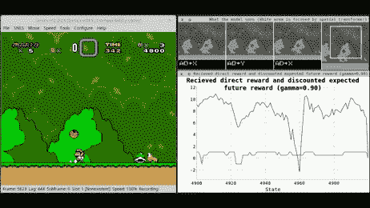
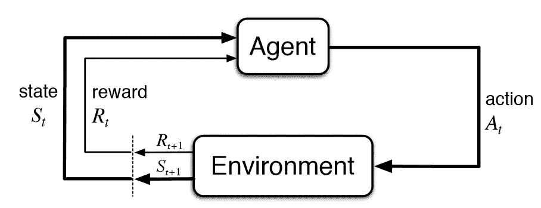

# 强化学习入门

> 原文：<https://towardsdatascience.com/getting-started-with-reinforcement-learning-cf2f2655854?source=collection_archive---------20----------------------->

## 揭秘一些与强化学习相关的主要概念和术语，以及它们与人工智能其他领域的关联

列宁·艾斯特拉达在 [Unsplash](https://unsplash.com?utm_source=medium&utm_medium=referral) 上的照片

# 介绍

今天，人工智能(AI)经历了令人印象深刻的进步。根据机器逻辑地和独立地执行智力任务的能力，人工智能可以细分为三个不同的级别:

*   ***狭义 AI*** :机器在执行非常具体的任务(但不试图执行其他类型的任务)时比人类更有效率。
*   ***通用 AI*** :机器和人类一样聪明。
*   ***强 AI*** :机器在不同领域(在我们可能或根本无法执行的任务中)表现得比人类更好。

现在，由于机器学习，我们已经能够在狭窄的人工智能水平上实现良好的能力。使用的机器学习算法主要有三种类型:

*   ***监督学习:*** 使用带标签的训练集训练一个模型，然后对无标签的数据进行预测。
*   ***无监督学习:*** 给一个模型一个未标记的数据集，然后模型要试着在数据中寻找模式来做预测。
*   ***强化学习:*** 通过奖励机制训练模型，在表现良好的情况下鼓励积极的行为(特别用于基于代理的模拟、游戏和机器人)。

强化学习，现在被认为是最有前途的技术，以便进入人工智能范式的下一个阶段(图 1)。

图 1:强化学习代理玩超级马里奥[1]

# 强化学习

强化学习今天获得如此多兴趣的原因之一是它的跨学科性。这个领域的核心概念，事实上遵循基本的[博弈论](/game-theory-in-artificial-intelligence-57a7937e1b88)、[进化](/introduction-to-evolutionary-algorithms-1278f335ead6)和神经科学原则。

与所有其他形式的机器学习相比，RL 实际上可以被认为是试图复制人类和动物如何学习的最接近的近似方法。

强化学习主张人类最常使用的主要学习方式是通过使用他们的传感器和与环境交互(因此不需要像监督学习那样的外部指导，而是通过试错过程)。

在日常生活中，我们试图完成新的任务，根据我们尝试的结果，我们会影响周围的环境。通过评估我们的尝试，我们可以从经验中学习，以确定哪些行为给了我们更大的好处(因此最方便重复)，哪些行为应该避免。图 2 总结了这个迭代过程，它代表了大多数基于强化学习的算法的主要工作流程。

> 一个代理(如软件机器人，机器人)被放置在一个环境中，通过与它的互动，可以学习，接收新的刺激和创造新的状态(如解锁一个新的场景或修改现有场景的结构)。然后，我们的代理的每一个动作都与一个奖励值相关联，以评估其实现预定目标的效率。

图 2:强化学习工作流程[2]

表征强化学习系统的两个主要挑战是:

*   **与此同时，如果代理人甚至不尝试不同的行动，它可能永远不会发现更好的奖励是可能实现的。**
*   ***延迟奖励的处理*** :代理不被告知要尝试什么动作，而是应该想出不同的解决方案，测试它们，最后根据收到的奖励进行评估。代理不应仅根据眼前的回报来评估他们的行为。事实上，选择某种类型的行动可能会带来更大的回报，不是立即的，而是长期的。

# 核心组件

根据 Richard S. Sutton 等人[3]的观点，强化学习算法由 4 个主要的关键部分组成:策略、奖励、价值函数和环境模型。

*   ***策略:*** 定义代理行为(将不同的状态映射到动作)。政策最有可能是随机的，因为每个特定的行动都与被选择的概率相关联。
*   ***奖励:*** 是一个信号，用来提醒代理应该如何最好地修改它的策略，以达到规定的目标(在短时间内)。每当执行一个动作时，代理从环境接收一个奖励。
*   ***价值函数:*** 是为了获得一种感觉，什么行为从长远来看能带来更大的回报。它的工作原理是给不同的状态赋值，以评估如果从任何特定的状态出发，一个代理应该期望什么样的回报。
*   ***环境模型:*** 模拟智能体所处环境的动态，以及环境应该如何响应智能体采取的不同动作。取决于应用，一些 RL 算法不一定需要环境模型(无模型方法),因为可以使用试错法来接近它们。但是，基于模型的方法可以使 RL 算法处理需要规划的更复杂的任务。

# 结论

如果你有兴趣了解更多关于强化学习的内容，理查德·萨顿和安德鲁·g·巴尔托的《强化学习:导论》和《开放人工智能健身房》将在我的下一篇文章中讨论。)是两个很好的起点。

*希望您喜欢这篇文章，感谢您的阅读！*

# 联系人

如果你想了解我最新的文章和项目[，请在媒体](https://pierpaoloippolito28.medium.com/subscribe)上关注我，并订阅我的[邮件列表](http://eepurl.com/gwO-Dr?source=post_page---------------------------)。以下是我的一些联系人详细信息:

*   [领英](https://uk.linkedin.com/in/pier-paolo-ippolito-202917146?source=post_page---------------------------)
*   [个人博客](https://pierpaolo28.github.io/blog/?source=post_page---------------------------)
*   [个人网站](https://pierpaolo28.github.io/?source=post_page---------------------------)
*   [中等轮廓](https://towardsdatascience.com/@pierpaoloippolito28?source=post_page---------------------------)
*   [GitHub](https://github.com/pierpaolo28?source=post_page---------------------------)
*   [卡格尔](https://www.kaggle.com/pierpaolo28?source=post_page---------------------------)

# 文献学

[1]强化学习，Gfycat。访问时间:[https://gfycat.com/gifs/search/reinforcement+learning](https://gfycat.com/gifs/search/reinforcement+learning)

[2]强化学习—第 1 部分:Q-学习简介，Novatec。访问:[https://www . novatec-gmbh . de/en/blog/introduction-to-q-learning/](https://www.novatec-gmbh.de/en/blog/introduction-to-q-learning/)

[3]强化学习:导论，理查德·萨顿和安德鲁·巴尔托。麻省理工学院出版社剑桥，马萨诸塞州伦敦，英国。访问:[https://web . Stanford . edu/class/psych 209/Readings/suttonbartoiprlbook 2 nded . pdf](https://web.stanford.edu/class/psych209/Readings/SuttonBartoIPRLBook2ndEd.pdf)