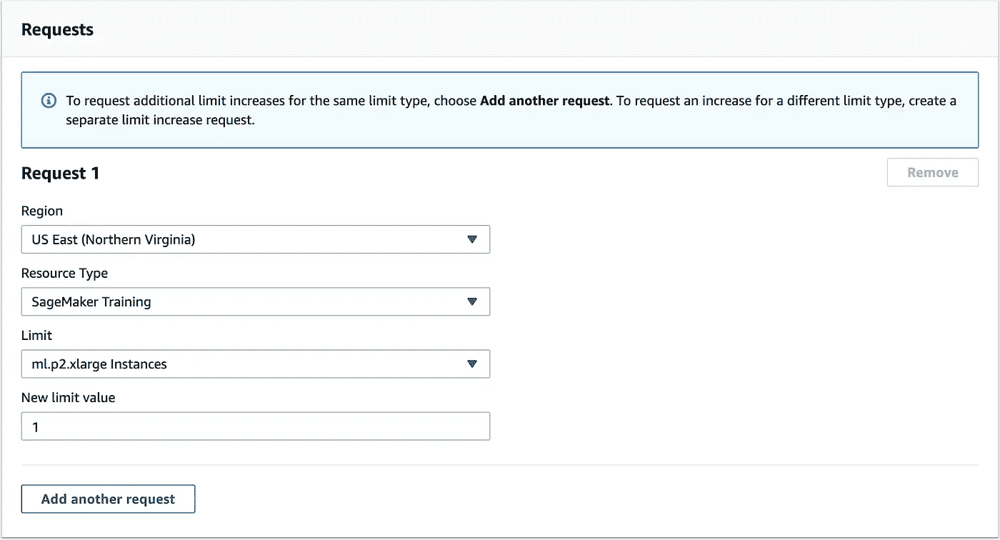
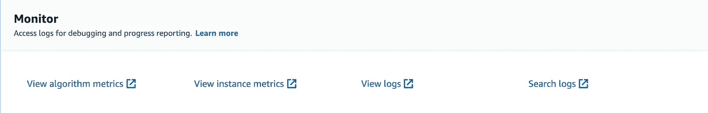
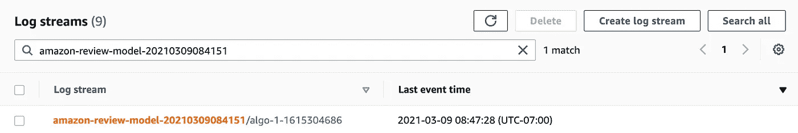

# 在 AWS SageMaker 上用 PyTorch 和拥抱脸变形金刚微调 BERT

> 原文：<https://towardsdatascience.com/getting-started-with-sagemaker-for-model-training-512b75eae7d7?source=collection_archive---------18----------------------->

## [现实世界中的数据科学](https://towardsdatascience.com/data-science-in-the-real-world/home)

## 使用 PyTorch、BERT 和 Amazon SageMaker 构建最先进的文本分类器的分步指南

在本教程中，我将向您展示如何在[亚马逊 SageMaker](https://aws.amazon.com/sagemaker/) 上构建和训练一个文本分类器。我们将利用出色的[拥抱脸变形金刚库](https://huggingface.co/transformers/)来训练一个最先进的 NLP 模型来对亚马逊书评进行分类。

云技术正成为数据科学家工作中越来越重要的一部分，AWS 技能非常受欢迎。我的目标是通过一步一步地指导您完成这一过程，消除新手无法使用云工具的常见障碍。

你在学习如何用 SageMaker 训练你的模型之后。

# 我们开始吧

如果你已经熟悉 SageMaker，只是想看看代码，这里有 [repo](https://github.com/brent-lemieux/sagemaker_train_demo) 。

## 什么是 SageMaker？

亚马逊 SageMaker 是一个完全托管的机器学习服务，用于**构建、培训和部署机器学习模型**。SageMaker 内置了几个模型训练的框架( [XGBoost](https://docs.aws.amazon.com/sagemaker/latest/dg/xgboost.html) 、 [BlazingText](https://docs.aws.amazon.com/sagemaker/latest/dg/blazingtext.html) 等)。)，而且还可以使用像 [PyTorch](https://pytorch.org/) 和 [TensorFlow](https://www.tensorflow.org/) 这样的框架轻松创建定制的深度学习模型。

## 为什么要学 SageMaker？

使用 SageMaker 对数据科学家和工程师有很多好处:

1.  模特培训。SageMaker 使得**利用 GPU 实例**进行更快的模型训练变得更加容易。如果没有 GPU，训练许多深度学习架构是难以处理的。[例如，微调最先进的语言模型(就像本教程中一样)和计算机视觉模型需要每一步更新数亿个参数。](https://blog.inten.to/speeding-up-bert-5528e18bb4ea)即使不需要，使用 GPU 进行训练也会加快你的开发周期，让你**迭代更快**和**交付更多价值**。
2.  模型部署。SageMaker 使得[将模型部署为可以通过 REST API 访问的生产级端点](https://docs.aws.amazon.com/sagemaker/latest/dg/how-it-works-hosting.html)变得相对简单。您定义了容器、实例类型和一些扩展配置，剩下的由 SageMaker 处理。
3.  超参数调谐。SageMaker 支持[贝叶斯超参数优化](https://docs.aws.amazon.com/sagemaker/latest/dg/automatic-model-tuning-how-it-works.html)用于许多建模框架。这个特性对于快速找到最佳超参数非常有价值。
4.  这个清单还在继续。AWS 继续向 SageMaker 生态系统添加功能，解决模型监控、跟踪实验等问题。

[Google Cloud](https://cloud.google.com/) 和 [Azure](https://azure.microsoft.com/en-us/) 提供类似 AWS SageMaker 的解决方案。我选择 AWS 作为本教程的参考，因为它是行业领导者——越来越多的公司使用它，使它成为开发人员更有市场的技能。

# 使用 SageMaker 进行模型训练

1.  设置。
2.  数据。
3.  PyTorch 模型脚本。
4.  启动模型培训。

## 设置

对于本教程，您需要创建一个 AWS 帐户，并设置一个 IAM admin 用户，以及一个 SageMaker 角色。您还需要安装和配置 AWS CLI，并创建一个 S3 bucket。[按照这里的步骤 1-4](https://brentlemieux.medium.com/quick-setup-guide-for-your-aws-account-423dadb61f99)开始！

为了访问 GPU，您还需要请求增加**服务限制**。为此，导航至控制台中的**支持中心**，点击**创建案例**。选择服务限制增加，对于限制类型选择 **SageMaker** 。在此表格中填写您将培训模特的地区:

## 数据

本指南使用的数据是[亚马逊评论数据集](https://s3.amazonaws.com/amazon-reviews-pds/readme.html)的子集，具体来说就是书评，可以点击[这里](https://s3.amazonaws.com/amazon-reviews-pds/tsv/amazon_reviews_us_Books_v1_02.tsv.gz)下载。该数据集相当大，因此您可能希望限制本练习的大小。在 GitHub repo 的[中的`data.zip`中可以找到该数据的较小版本。如果您想学习如何自己处理大型数据集，请查看](https://github.com/brent-lemieux/sagemaker_train_demo)[我对在 AWS EMR 上使用 PySpark 的介绍](/getting-started-with-pyspark-on-amazon-emr-c85154b6b921)。

使用自定义数据集或在 [Kaggle](https://www.kaggle.com/datasets?tags=13204-NLP) 上找到一个数据集非常容易——你所需要的只是一个包含文本和标签行的文件。

## 模型

对于本教程，我们将使用来自拥抱脸的[变形金刚库。拥抱脸可以很容易地加载预先训练的最先进的语言模型，并在自己的数据集上进行微调。这里使用的具体模型是](https://huggingface.co/transformers/)[distil BERT](https://arxiv.org/abs/1910.01108)——它是 [BERT](https://arxiv.org/abs/1810.04805) 的一个分支，更小，因此训练和推理更快更便宜。

微调预先训练好的模型的做法被称为迁移学习— [在这里阅读更多信息](https://machinelearningmastery.com/transfer-learning-for-deep-learning/#:~:text=Transfer%20learning%20is%20a%20machine,model%20on%20a%20second%20task.&text=Common%20examples%20of%20transfer%20learning,your%20own%20predictive%20modeling%20problems.)。如果你有兴趣了解变革了 NLP 的 transformer 架构的更多信息，我强烈推荐杰伊·阿拉玛的《图解 Transformer》[。](http://jalammar.github.io/illustrated-transformer/)

**创建一个 SageMaker 评估程序脚本**

我们需要一个 Python 脚本，将我们的训练数据上传到 S3，定义我们的 SageMaker 估计器，并启动训练作业。您需要更新`bucket`和`role`，以反映您在上面的**设置**部分中创建的存储桶和角色。

*   第一部分将我们的训练数据上传到 S3，SageMaker 可以访问这些数据。
*   接下来，我们定义`hyperparameters`，它实际上只是我们的模型脚本将接受的命令行参数。您可以使您的模型脚本非常灵活，以接受不同的数据预处理和模型训练参数。这在使用 [SageMaker 超参数调谐器](https://sagemaker.readthedocs.io/en/stable/api/training/tuner.html)时非常方便。
*   `PyTorch`估算器对象中的`entry_point`定义了我们的[模型脚本](https://github.com/brent-lemieux/sagemaker_train_demo/blob/main/src/model.py)，这将在下一节中描述。
*   `PyTorch`估算器对象中的`source_dir`让我们可以访问`utils.py`中定义的函数，并安装`requirements.txt`中定义的包。完整的`source_dir`可以在这里找到[。](https://github.com/brent-lemieux/sagemaker_train_demo/tree/main/src)
*   `output_path`在`PyTorch`估计器对象中定义了你的训练模型在 S3 的保存位置。

这是开始模型培训的[完整脚本](https://github.com/brent-lemieux/sagemaker_train_demo/blob/main/train_model.py)，我们将在创建模型脚本后进行。

## 模型脚本

在 SageMaker 上编写一个脚本来训练一个模型与在本地机器上做同样的事情没有什么不同。完整的脚本可以在 GitHub repo 中找到。

**配置 argparse 以接受命令行参数**

在文件底部的`if __name__ == “__main__":`块中，我们需要利用`argparse`模块，以便我们的脚本接受超参数作为命令行参数。在这种情况下，超参数可以是您希望传递给模型脚本用于数据预处理和模型训练的任何参数。

[**创建自定义 PyTorch 数据集**](https://pytorch.org/tutorials/beginner/data_loading_tutorial.html) **。**

**训练模型。**

## 启动模型培训

运行`train_model.py`并等待任务完成，或者在终端上观看火车模型。

*警告:在撰写本文时，* `*ml.p2.xlarge*` *实例每小时的成本为 0.90 美元。运行该脚本还会产生[最低限度的]S3 存储成本。如果您不希望收取月租费，请务必删除 S3 存储桶中的数据。*

## 检查模型输出

通过在 AWS 控制台中搜索 **SageMaker** 并点击左侧导航栏中的 **Training Jobs** 来检查 CloudWatch 日志。然后，点击刚刚完成的培训工作，向下滚动点击**查看日志**。

点击日志流，您可以查看您的模特培训工作的日志，包括您在`src/model.py`中打印的任何内容。

通过导航到`train_model.py`中定义的`output_path`来定位`model.tar.gz`。您可以下载这个模型在其他地方使用，或者在 SageMaker 上通过这个 S3 路径访问它进行批量推理或实时推理。

# 包扎

我希望您现在能够使用 Amazon SageMaker 在云中构建和训练模型。查看 [AWS Labs GitHub](https://github.com/awslabs/amazon-sagemaker-examples) 页面，了解如何将 SageMaker 与其他框架一起使用，如 [Keras](https://keras.io/) / [TensorFlow、](https://www.tensorflow.org/) [scikit-learn](https://scikit-learn.org/stable/index.html) 等等。

## 更多 AWS 教程

如果你觉得这很有用，[一定要关注我，看看我剩下的 AWS 教程](https://medium.com/@brentlemieux)。

## 取得联系

感谢您的阅读！请让我知道你是否喜欢这篇文章，或者你是否有任何批评。想打个招呼就在 [LinkedIn](https://www.linkedin.com/in/brent-lemieux/) 上联系我。干杯！