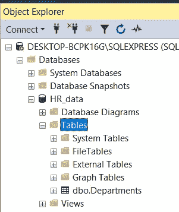

# 了解 SQL Server Management Studio —关于数据库、表和命名约定的第 2 部分

> 原文：<https://towardsdatascience.com/getting-started-with-sql-server-management-studio-5cd24bb1a87c?source=collection_archive---------8----------------------->

## 让你在派对上开心的技能！逐步地


迈克尔·泽兹奇在 [Unsplash](https://unsplash.com?utm_source=medium&utm_medium=referral) 上的照片

# 在最后一集…

欢迎光临！还是“欢迎回来！”？这是 SQL 和 SQL Server Studio 系列教程的第二部分。目标？让你熟悉和适应这个工具和语言。“这有什么关系？”我知道你在问。事实证明，好奇心和副业往往是被新项目选中的关键，甚至是获得新工作的关键。您已经使用了一个重要的工具，比如 SQL Server Studio，并且编写了一些 SQL 查询，这一事实可以并且将会给您一个清晰的开端。

如果您错过了关于如何设置我们的环境和本地服务器的第 1 集，请阅读本文，然后不要忘记回来😉。

</getting-started-with-sql-server-management-studio-part-1-step-by-step-setup-63428650a1e0>  

# 期待什么？

今天，我们将看看数据库、表，并简要提及模式。还会有一个关于命名约定的重要注释。我们将看到创建表的两种方法，并编写删除表的查询。您将找到 SQL Studio 如何支持您编写无错误查询的示例，并能够查看查询性能和返回的结果。到本文结束时，您将会感到自信，并具备强大的基础知识，开始在 SQL Studio 中漫游。让我们直接跳进来吧！

# 创建您的第一个数据库

数据库，简称 DB，是表的集合。这是我们最简单的说法。让我们一步一步来创建我们的第一个。

1.  我们假设已经启动了 SQL Server Studio，并连接到本地服务器的实例。
2.  左边是对象资源管理器。右键单击数据库，然后单击“新建数据库”。


3.将出现一个新窗口。**最大的问题是如何命名我们的数据库。**为什么有关系？一点思考的内容:

*   它很可能会比我们将实施的许多应用程序、仪表盘和流程更长寿。
*   我们合作，所以这个选择的名字将会被使用，无论是口头的还是书面的。想象一下它被命名为 *XRZPWO_JLM* 。不错吧？祝你在口头对话中好运。随着时间的推移，你可能会经常用到这个术语。一年几百次。好吧，至少在书面形式下，你可以说‘是那个以 XR 开头的服务器……’。好吧，你说到点子上了。那是当然，除非它是唯一一个这样命名的。拥有一个名为 XRZPWO_JLM 的数据库给了我一个提示，在你的服务器的其余部分将会有更多名为**的方式*。你必须登录，检查，复制粘贴(你将无法通过记忆正确地交流)。您的收件人可能会花一些时间来找到它。听起来像地狱，对吧？*
*   *名字作为参考。如果你从一个名为 *XRZPWO_JLM* 的数据库开始，几个月后，在厌倦了与它交流的麻烦后，你决定改变它，它可能会破坏相关的应用程序。双重痛苦。*

*那么如何命名呢？对于数据库中的内容，该名称应该是不言自明的。也应该是鲜明的。一个有趣的方法是使用数据库按项目分离我们的数据。*

*   *HR_data 可以保存与您的人员相关的数据，如名字和姓氏、电子邮件、雇佣日期、级别。*
*   *API_Finance 可以托管来自不同金融网站 API 的数据。*
*   *Product_ABC 可以托管从名为 ABC 的产品中收集和生成的数据。*

***长话短说，命名要紧。这个主题应该有自己的一篇文章。有惯例，不同的方法。常识和实用性应该占上风。我们来看看 HR_data。***

*我们可以调整一系列设置，但我们将保留默认设置。我们按 enter 键，新的数据库就创建好了。*

*4.单击+展开“数据库”的层次结构，然后单击“HR_data ”,您应该会看到以下内容:*

**

*我们已经有了第一个数据库，我们已经准备好创建第一个表。*

# *创建您的第一个表格*

*根据字段的不同，表中的元素可以有不同的名称。最常见的是行列称谓。*

*   *行也可以被称为记录或行，这取决于你问谁。*
*   *按照列，它们可以被称为“特征”或“变量”，这是数据科学中经常使用的行话。但是你可能知道:*

> *其他名字的行闻起来还是一样香*

*现在，表命名和数据库命名一样重要。因为同样，我们可能会一遍又一遍地使用和讨论这些术语。这也使得在编写脚本或运行查询时，拥有清晰的名称和对表中内容的理解变得更加容易。*

*下面我们来看一个复杂的(剧透:不是很好的方式)例子:*

**

*上面的这些表形成了一个“规范化模式”——与平面表的模式相反，下一篇文章将详细介绍这一点——但是表和列的命名远非最佳。没有一致性，有些是不言自明的。让我们继续创建我们的第一个表。*

1.  *右键单击表，然后单击新建表*

**

*2.将出现表设计器。可以通过多种方式创建表，既可以使用表设计器，也可以编写查询。我们先从前者说起。*

## ***使用表格设计器创建表格***

*我们将从小而简单开始，分为三栏:*

*   *Department_ID —这将是部门的唯一标识符。由于这将是一个数字，我们指定 *int* (整数)作为数据类型。*
*   *部门名称—这是其通用名称。我们选择 nvarchar(50 ),因为字符串的长度(这里是部门名称)可能不同，因此数据类型中有“var”。(50)表示我们允许的最大长度。任何超出的都不会被记录。如果我们想使用最大可接受的长度，我们可以将它设置为 nvarchar(MAX)。“为什么不一直用 nvarchar(MAX)呢？”，我看你在问。嗯，因为性能的原因，比 nvarchar(n)慢。*
*   *Department_Email —部门的电子邮件，例如共享邮箱。Nvarchar(50)也在这里。*

**

*稍后可以轻松调整 nvarchar(n)。如果您希望文本作为输入，或者如果您很懒并且性能不是您主要关心的问题(可能总是回来困扰您，但是您将能够调整到数字“n”)，那么使用(MAX)最有意义。*

*3.让我们点击左上角的“保存”软盘，给我们的表起一个引人注目的名字，“部门”。*

**

*4.现在，该表在层次结构中的“表”下可见。如果没有显示，请点击“刷新”按钮，即“连接”旁边的圆圈箭头。使用网络服务器时，可能会出现表格不显示的情况，您需要单击“连接”并重新连接到服务器。*

**

*5.现在已经保存并创建了表，我们可以关闭设计窗口了*

**

*6.如果将来您需要调整表格，您可以右键单击表格，然后选择设计。“设计”窗口再次出现，并允许您修改表格。完成后，不要忘记保存更改。*

**

## *通过编写查询来创建表*

*这是设计窗口的一种替代方式。当您编写脚本时，这可能会很方便，因为脚本需要创建一个表。结果是一样的，你得到了一个新的表。如果要更新、添加或删除表中的记录，最有可能使用这种方法。让我们看看如何编写一个查询来创建同一个表。*

1.  *右键单击数据库 HR_data，然后单击新建查询*

**

*2.将出现一个查询窗口。让我们写以下内容*

```
*CREATE TABLE HR_data.dbo.Departments(Department_ID int,Department_Name nvarchar(50),Department_Email nvarchar(50))*
```

*其结构如下:*

*   *“CREATE TABLE”是 SQL 语言中的一个命令名。*
*   *然后，通过点链或层次结构，我们精确地确定应该在哪里创建这个表。这里是在我们的表> 的 *HR_data.dbo. <名称内。“Dbo”是默认设置。**
*   *然后我们打开一个方括号'('，开始输入我们的列名，后面是它的数据类型。每一行都以逗号结尾。*
*   *我们用另一个括号“)”结束列列表。*

*3.在窗口中，您会看到查询的一部分用红色下划线标出。有点不对劲。我们的数据库中已经有一个这样的表。因此，在本练习中，我们将调整上面的查询，并将表称为 *Departments_temp。*现代脚本和编码环境的一个有用特性是扫描潜在的 bug 或错误。这甚至在我们开始执行代码之前就节省了大量的时间。*

**

*让我们键入以下内容:*

```
*CREATE TABLE HR_data.dbo.Departments_temp(Department_ID int,Department_Name nvarchar(50),Department_Email nvarchar(50))*
```

*红色下划线消失了。*

*4.我们现在可以执行我们的查询。点击 F5 或“执行”绿色箭头。*

**

*5.我们会收到对我们的询问的即时反馈*

**

*6.让我们刷新我们的服务器，表出现。很棒的东西。*

**

*7.为了保持整洁，我们将删除这个 _temp 表。小心这个，因为一旦它掉了…它就掉了。不见了。*

*8.我们将回收我们的查询窗口，首先删除导致表创建的代码。然后写下以下内容，并点击执行或 F5:*

```
*DROP TABLE HR_data.dbo.Departments_temp*
```

*9.刷新层次结构后，我们看到表不见了。请注意，“刷新”只是从用户界面的角度来看。因为在后台，当您执行' drop table …'查询时，该表已经被删除了。*

**

# *查询我们的表*

*可以查询或“读取”表。让我们看看我们自己的 SQL“Hello World”。*

1.  *清理您的查询窗口。或者关闭它并重新打开一个。*
2.  *键入下面的，然后执行/F5*

```
*SELECT *
FROM HR_data.dbo.Departments*
```

*   *选择意味着我们将选择接下来的内容，*
*   **表示“一切”，即每一列，*
*   *FROM 表示我们将从中选择“所有内容”的来源*

**

# *查询窗口上的其他提示和注释*

## *旗帜*

*在这一系列教程中，我们会遇到不同的颜色。下面先睹为快。*

*   *表名、列名是黑色的，*
*   *SQL 命令(SELECT，FROM，…)将变成蓝色，*
*   *由简单引号'和'表示字符串将是红色，*
*   *系统功能将是粉红色的(纯粹主义者会说是洋红色)，*
*   *运算符如 AND、OR 将是灰色的，*
*   *评论将是绿色的*

*自己看:*

**

*虽然它很漂亮，但没什么用处。*

*还有更多！*

## *结果窗格*

*结果窗格显示我们的查询结果(如果我们正在进行“选择”):*

**

*它还提供了受“消息”影响的记录数量的信息。如果没有错误，您将得到以下结果:*

**

*如果出现问题，您会收到通知，并得到一些关于如何调试的支持，例如“无效的列名‘Departm’”。*

**

*结果窗格还为我们提供了以下一般信息:*

*   *查询的状态:*

****

*   *它的性能，即它运行了多长时间和返回的记录数，这里它在不到 1 秒的时间内执行，并返回 0 行，因为我们的表或查询有 0 个匹配。*

**

# *最后的话和接下来会发生什么*

*暂时就这样吧！我的目标是让它简短、甜蜜、有趣，尽管这部电影中没有任何迷因。*

*   *我希望您现在有信心创建数据库和表，无论是使用设计工具还是通过编写查询。*
*   *您也有权删除表，但是要小心，因为除非您的数据库得到备份，否则您将丢失底层数据。您还会停止依赖于它的任何应用程序、过程或表。*
*   *您知道结果窗格、查询性能指标和返回的行数，这是调试的第一种方法。*
*   *我不能再强调正确的表和数据库命名的重要性了，因为它们会随着时间的推移而出现，如果您选择了糟糕的名称，它们可能会困扰您。*

## *编码快乐！*

*感谢阅读！喜欢这个故事吗？ [**加入媒介**](https://medium.com/@maximegodfroid/membership) 可完整访问我的所有故事。*

# *从关于 CRUD 操作、主键和外键的第 3 集开始继续这一旅程！*

*</learn-sql-server-management-studio-part-3-crud-operations-primary-foreign-keys-9d884b32ad70>  

## 或者选择你喜欢的另一集

**在第 4 集**中，我们讨论模式&主要的规范化步骤— [第 4 部分模式&规范化](/learn-sql-server-management-studio-part-4-schemas-normalization-80bcd6a5258)

**在第 5 集**，我们覆盖存储过程&调度，这是一个真正的野兽。我怎么强调这将如何促进和自动化你的日常(数据)生活都不为过。[第五部分存储过程&调度](/learn-sql-server-management-studio-part-5-stored-procedures-scheduling-88fd9788d314)

**在第 6 集**中，我们介绍了用于 ETL 的 SSIS 包，并回顾了如何在两个数据库之间以及一个数据库和 Excel 之间导入和导出数据。[第六部 SSIS 套餐简介](/learn-sql-server-management-studio-part-6-ssis-packages-9438dbc90437)

**在第 7 集**中，我们将 SQL Studio 连接到 PowerBI，并构建了我们的第一批视觉效果。[第 7 部分连接到 PowerBI &第一视觉效果](http://Part 7 Connect to PowerBI & First Visuals)*