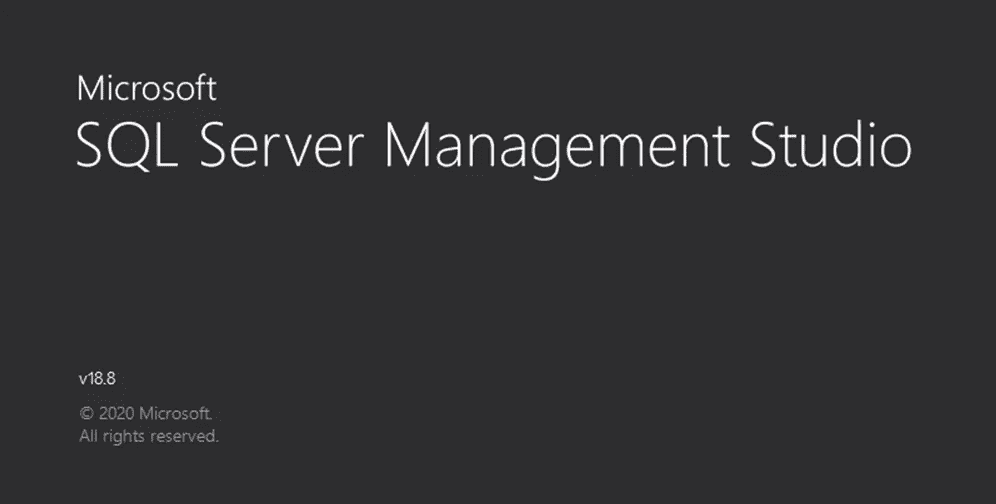
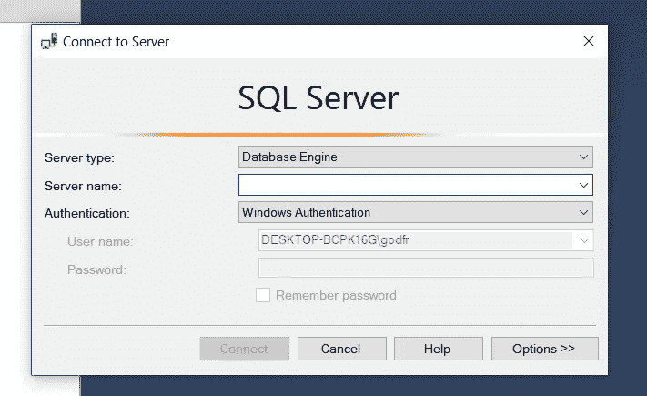
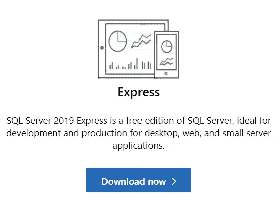
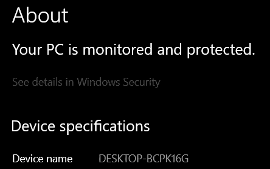
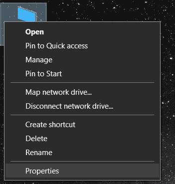
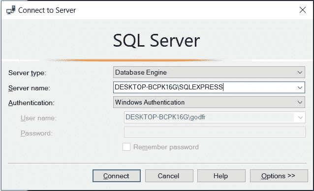
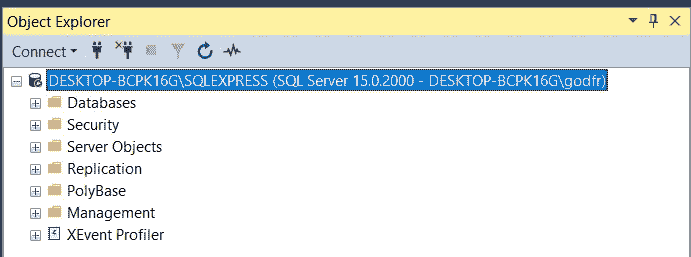

# 了解 SQL Server Management Studio —第 1 部分分步安装

> 原文：<https://towardsdatascience.com/getting-started-with-sql-server-management-studio-part-1-step-by-step-setup-63428650a1e0?source=collection_archive---------14----------------------->

## 这是一个免费且强大的工具，可以利用数据、提高技能并在面试中脱颖而出

迈克尔·泽兹奇在 [Unsplash](https://unsplash.com?utm_source=medium&utm_medium=referral) 上的照片

# 期待什么？

在这一系列文章中，我将对 Microsoft SQL Server Management Studio(SSMS)进行一次演练。今天，我们将从环境设置开始。在接下来的文章中，我们将创建自己的数据库和表。创建、读取、更新、删除记录。我们将编写、保存和修改我们自己的存储过程。我们还将安排作业，创建 SSIS 包…如果您不熟悉其中的一些术语，您很快就会掌握，并自己创建和管理它们。

SSMS 是一个强有力的工具，如果你想提高技能或面试另一份工作，这是一项有趣的技能。这也是一个在浏览器窗口上把你在 SQL 101 中学到的东西付诸实践的机会，但是从来没有机会体验数据库管理软件的感觉。

# 什么是 SQL？

SQL 代表**结构化查询语言。**它旨在管理关系数据库中的数据。剧透:它做得很好。这门语言诞生于 20 世纪 70 年代，自那以后已经有了很大的发展。在其存在的 40 多年里，新的数据类型、操作符和功能丰富了这种语言。

# 什么是 Microsoft SQL Server Management Studio？

Microsoft SQL Server Management Studio 通常被称为 SSMS，是一种用于配置、管理和控制数据的工具。该工具允许您连接到本地(酷孩子称之为“本地”)和云中的 SQL Server 实例。

# 你能实现什么？

简而言之:很多东西。更详细的回答是，在 SSMS，你可以:

*   连接到服务器及其实例，
*   创建和管理数据库及其底层表，
*   连接到可视化工具，如 PowerBI，Tableau，Spotfire，…
*   连接到 Power Automate 等自动化工具，或者 PowerApps 等低代码和无代码平台，
*   创建和管理存储过程，即您可以编写和保存的脚本。然后，可以在以后执行这些程序来利用您的数据，例如对您的数据进行一些操作、存档记录或表格、发送电子邮件等等
*   创建和管理触发器，这是在某个操作(创建/删除/更新记录等)之后触发的自动化操作
*   创建和管理计划作业，以便给定的存储过程以任何定义的频率运行，
*   备份和恢复数据，
*   导入和导出数据
*   创建 SSIS 软件包，用微软自己的话说就是:

*“SQL Server Integration Services(SSIS)是一个构建企业级数据集成和数据转换解决方案的平台。使用 Integration Services 通过复制或下载文件、加载数据仓库、清理和挖掘数据以及管理 SQL Server 对象和数据来解决复杂的业务问题"*

如果您想在数据库之间或服务器之间复制表，SSIS 包非常有用。可以保存 SSIS 包，然后将其用作计划作业的一部分。

这是一份很长的清单。但是如何以及从哪里开始呢？请继续阅读！

# 设置您的环境

这应该是一种解脱:安装和设置将不会是一场噩梦。这个软件是成熟和稳定的，我还没有遇到任何错误或崩溃。将有两个组件安装完成。

## 1.下载 SSMS

进入[页面](https://docs.microsoft.com/en-us/sql/ssms/download-sql-server-management-studio-ssms?view=sql-server-ver15)，在【下载 SSMS】下下载最新版本。在撰写本文时，它是 v18.8。启动程序要求您有大约 657MB 的空闲磁盘空间。一旦你完成安装，你应该会发现这样的标志。

一个相当于任何注重数据的人的锤子和镰刀的数据库。启动程序时，应出现以下屏幕:

进入矩阵

然后很快出现一个窗口，让您连接到服务器:

好吧，现在正是恐慌的时候。“连接到服务器？但是您没有告诉我们需要服务器。”你是对的。如果你有一个，你可以输入它的名字和实例:<name>\实例#。例如 myserver\inst1。</name>

如果你没有足够的服务器，不要担心，还有一个方法可以让你继续享受和探索 SSMS。进入第二次下载:

**2。SQL Express**

我们将使用我们的计算机和 SQL Express 作为我们的服务器和实例。转到[本页](https://www.microsoft.com/en-us/sql-server/sql-server-downloads)并下载免费专业版‘Express’

安装完成后，让我们返回下面的 SSMS“连接到服务器”窗口:

首先，我们需要找到我们的计算机名。在 Windows 10 上，点击 Windows 键，然后输入“关于你的电脑，你应该会进入一个页面，我们需要的信息在“设备名称”之后。

您也可以右键单击桌面上的“我的电脑”图标，然后选择属性。你会发现和上面一样的窗口。

复制这个名字并粘贴在 SSMS 窗口。然后写\SQLExpress。它应该是这样的，用你的计算机名代替我的。

点击连接…我们就开始直播了！对象资源管理器提供了一个整洁的文件夹列表，每个文件夹都封装了 SSMS 的特性和功能。

这就是初始设置。在下一篇文章中，我们将讨论数据库和表的创建和设计，记录管理的 CRUD 缩写(创建、读取、更新、删除),等等。

## 编码快乐！

# 继续 SQL 之旅，阅读关于数据库、表等的第 2 部分！

</getting-started-with-sql-server-management-studio-5cd24bb1a87c>  

## 或者选择你喜欢的另一集

**在第 3 集**中，我们介绍了 CRUD 操作以及主键和外键——[第 3 部分 CRUD 操作，主键&外键](/learn-sql-server-management-studio-part-3-crud-operations-primary-foreign-keys-9d884b32ad70)

**在第 4 集**中，我们讨论模式&主要的规范化步骤— [第 4 部分模式&规范化](/learn-sql-server-management-studio-part-4-schemas-normalization-80bcd6a5258)

**在第 5 集**，我们覆盖存储过程&调度，这是一个真正的野兽。我怎么强调这将如何促进和自动化你的日常(数据)生活都不为过。[第五部分存储过程&调度](/learn-sql-server-management-studio-part-5-stored-procedures-scheduling-88fd9788d314)

**在第 6 集**中，我们介绍了用于 ETL 的 SSIS 包，并回顾了如何在两个数据库之间以及一个数据库和 Excel 之间导入和导出数据。[第六部 SSIS 套餐简介](/learn-sql-server-management-studio-part-6-ssis-packages-9438dbc90437)

**在第 7 集**中，我们将 SQL Studio 连接到 PowerBI，并构建了我们的第一批视觉效果。[第 7 部分连接到 PowerBI &第一视觉效果](http://Part 7 Connect to PowerBI & First Visuals)

感谢阅读！喜欢这个故事吗？ [**加入媒介**](https://medium.com/@maximegodfroid/membership) 获取完整的我的所有故事。

# **参考文献**

1.  [https://en.wikipedia.org/wiki/SQL](https://en.wikipedia.org/wiki/SQL)
2.  [https://docs . Microsoft . com/en-us/SQL/integration-services/SQL-server-integration-services？view=sql-server-ver15](https://docs.microsoft.com/en-us/sql/integration-services/sql-server-integration-services?view=sql-server-ver15)