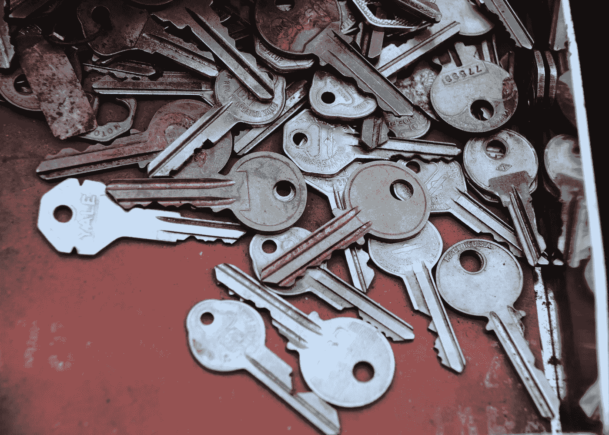

# SSH 入门

> 原文：<https://towardsdatascience.com/getting-started-with-ssh-d931874f5fb4?source=collection_archive---------47----------------------->

## 数据科学家开始使用 SSH 应该知道的一切



学习如何创建和管理多组 SSH 密钥对是任何有抱负的数据科学家或机器学习工程师的重要技能。来源:Samantha Lam ( [Unsplash](https://unsplash.com/photos/zFy6fOPZEu0) )

在某些时候，作为一名数据科学家，您需要处理一个需要比您的笔记本电脑或工作站更多计算资源(例如，磁盘空间、CPU 内存、CPU 或 GPU 数量)的数据集。当这种情况发生时，你需要知道如何访问一个拥有足够计算资源的远程服务器来完成手头的任务。无论这些远程服务器驻留在公共云中(即 [AWS](https://aws.amazon.com/) 、 [GCP](https://cloud.google.com/) 或 [Azure](https://azure.microsoft.com/en-us/) )，还是驻留在本地(即大学远程计算集群)，您都将使用[安全外壳(SSH)](https://www.ssh.com/ssh/) 协议来访问这些服务器。

在本文中，我将介绍使用 SSH 有效地连接到远程服务器需要了解的内容。特别是，您将学习如何使用 SSH 登录到远程服务器，如何生成自己的 SSH 密钥对，以及如何使用新的 SSH 密钥对部分自动化连接到远程服务器的过程。在以后的文章中，我将讨论如何配置 SSH 以获得最大的生产率，以及如何使用更高级的技术来完全自动化使用 SSH 登录远程服务器的过程。

我们开始吧！

# OpenSSH

虽然 SSH 协议有许多实现，但我在本文中重点介绍的是 OpenSSH。OpenSSH 可能是使用 SSH 协议进行远程登录的最广泛使用的连接工具。它对所有流量进行加密，以消除窃听、连接劫持和其他攻击。此外，OpenSSH 提供了一大套安全隧道功能、几种身份验证方法和复杂的配置选项。

如果您运行的是 Mac OS 或 Linux，那么应该已经安装了 OpenSSH。Open SSH 于 2018 年秋季添加到 Windows 中，因此如果您运行的是较新版本的 Windows(特别是 Windows 10)，那么 Open SSH 应该也已经安装了。如果您运行的是旧版本的 Windows，那么您可能需要[安装并配置 OpenSSH](https://winscp.net/eng/docs/guide_windows_openssh_server) 。

# 使用 SSH 登录

使用 SSH 登录的默认方式是使用用户名和密码使用`[ssh](https://www.ssh.com/ssh/command/)` [命令](https://www.ssh.com/ssh/command/)登录到特定的主机(可能是主机名或 IP 地址)。

```
ssh username@some.host.com # could also be an IP address
```

如果这是您第一次使用`ssh`连接到这个远程服务器，那么您将会看到这样的消息:

```
The authenticity of host 'some.host.com' cannot be established.
ECDSA key fingerprint is SHA256:d/FZhiccG5Gs6MzA7XR6Hksvl9OZjSx6WVXEi6Ddrj3
Are you sure you want to continue connecting (yes/no)?
```

根据用于生成远程服务器的[主机密钥](https://www.ssh.com/ssh/host-key) (上例中的 ECDSA)的算法类型，上面的消息可能看起来略有不同。键入`yes`继续。这将把远程服务器添加到您的已知主机列表中(您的*本地*机器上的`~/.ssh/known_hosts`文件)。

```
Warning: Permanently added 'some.host.com' (ECDSA) to the list of known hosts.
```

首次登录远程服务器时，系统会要求您验证并保存远程服务器的主机密钥，以便下次连接到该远程服务器时，您的本地计算机可以验证它实际上是同一个远程服务器(通过检查远程服务器的主机密钥是否包含在已知主机列表中)。

然后，系统会提示您输入密码，以完成身份验证过程。一旦通过身份验证，您就可以登录到您的远程服务器，并且会有一个新的 shell 提示符，通常看起来如下所示(`~`表示您的当前目录是您的用户在远程服务器上的主目录)。

```
username@some.host.com ~$
```

反复使用您的用户名和密码进行身份验证既耗时又容易出错。在下一节中，我将向您展示如何使用公共/私有 SSH 密钥来部分自动化认证过程。

# 生成 SSH 密钥对

更高效(也更安全！)与远程服务器交互的方式是使用公共/私有 SSH 密钥对来部分自动化认证过程。如果您对 SSH 公钥/私钥对如何工作的直觉感兴趣，那么我推荐您观看下面的视频；如果您只想学习如何生成自己的公共/私有 SSH 密钥对，那么您可以放心地跳过视频。

`[ssh-keygen](https://www.ssh.com/ssh/keygen/)`命令用于使用各种算法生成公共/私有 SSH 密钥对。使用[椭圆曲线数字签名算法(ECDSA)](https://en.wikipedia.org/wiki/Elliptic_Curve_Digital_Signature_Algorithm) 使用`ssh-keygen`生成公共/私有 SSH 密钥对，如下所示。

```
cd ~/.ssh
ssh-keygen \
  -t ecdsa\ # could also use older rsa algorithm with -b 4096
  -b 521\ # alternatives are 256 or 384
  -C "your.email@provider.com"
  -f ~/.ssh/id_ecdsa # save your keys in ~/.ssh/
```

运行上述命令将启动生成公钥/私钥 ECDSA 密钥对的过程。系统将提示您提供保存密钥的文件路径。默认为`~/.ssh/id_ecdsa`。您可能有许多组 SSH 密钥对，因此您应该更喜欢将您的密钥文件命名为不太通用的名称。

接下来，系统会提示您输入可选的密码(然后要求您确认密码)。

```
Enter passphrase (empty for no passphrase):
```

你应该*总是*使用密码保护你的私有 SSH 密钥。如果有人获得了对您的本地机器的物理访问权，而您的私钥没有密码保护，那么这个人也获得了对使用您的 SSH 密钥对的每个远程服务器的访问权。

输入(并确认)您的密码后，将生成密钥对并保存到指定的文件中。

```
Your identification has been saved in ~/.ssh/id_ecdsa.
Your public key has been saved in ~/.ssh/id_ecdsa.pub.
The key fingerprint is:
SHA256:2yyanHlvgr68zw1pS+h7zDTkvR0pujsyrKumPqHb3bY your.email@provider.com
The key's randomart image is:
+---[ECDSA 521]---+
|.. .             |
|..o o    B .    o|
|..E.... @ * o. +o|
|.  + + = = + +* o|
|. . + . S + o =o=|
| o o     . =   *.|
|. .       +  . o |
|         . .  +  |
|            ..   |
+----[SHA256]-----+
```

# 将 SSH 密钥对添加到 authorized_keys

为了使用您新生成的 SSH 密钥对登录到您的远程服务器，您必须首先将新生成的公共 SSH 密钥添加到远程服务器上的授权密钥列表中(注意:新生成的私有 SSH 密钥应该*始终*保留在您的本地机器上)。

将您的公共 SSH 密钥添加到远程服务器上的授权密钥列表中可以通过三个步骤手动完成。

1.  运行`cat`输出您的公共 SSH 密钥文件的内容，并复制公共 SSH 密钥。
2.  用你的`$USERNAME`和密码登录你的远程服务器`$HOSTNAME`。
3.  打开`~/.ssh/authorized_keys`文件，在文件末尾粘贴新创建的公共 SSH 密钥。

您可以使用下面的命令，而不是手动将您的公共 SSH 密钥添加到授权密钥列表中(这很容易出错)。

```
ssh-copy-id -i ~/.ssh/id_ecdsa.pub username@some.host.com
```

运行上述命令时，系统会提示您提供登录远程服务器的密码，但是一旦命令完成，并且您的公共 SSH 密钥已被添加到授权密钥列表中，您应该能够注销，然后再次登录，而无需提供密码(但是您仍然需要提供密码来解锁您的私有密钥)。

一旦在远程服务器上配置了公钥，远程服务器将允许*任何拥有私钥的*连接用户(并且知道密码来解锁它！)登录，因此*永远不要*共享您的私钥。

# 摘要

下面三个(真的是两个！)命令将生成您的公共/私有 SSH 密钥对，并将公共密钥添加到远程服务器上的`~/.ssh/authorized_keys`文件中。

```
cd ~/.ssh
ssh-keygen -t ecdsa -b 521 -C "your.email@provider.com"
ssh-copy-id -i ~/.ssh/id_ecdsa.pub username@some.host.com
```

如果您已经做到了这一步，那么恭喜您:您现在应该对 SSH 的基础有了很好的理解！

一旦您开始使用 SSH，您将很快发现您想要生成多个 SSH 密钥对(您需要访问的每个远程服务器都有一个不同的密钥对),因此在本系列的下一篇文章中，我将讨论如何配置 SSH 来有效地管理这些多个 SSH 密钥对。