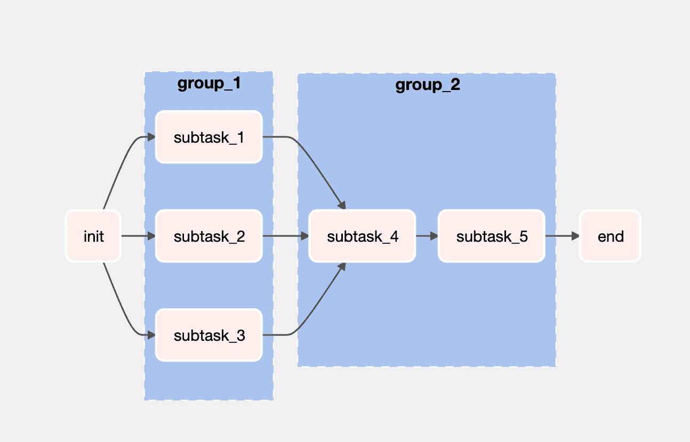
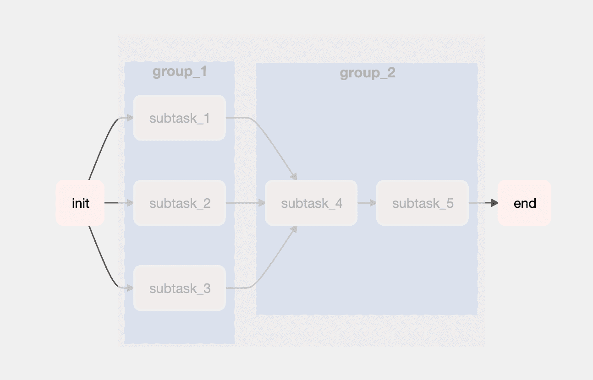
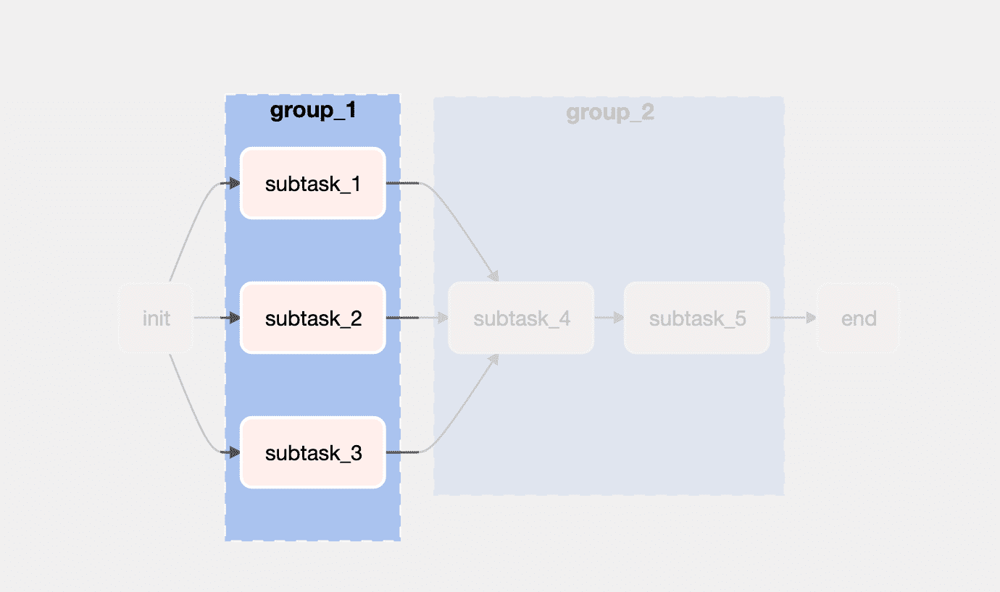
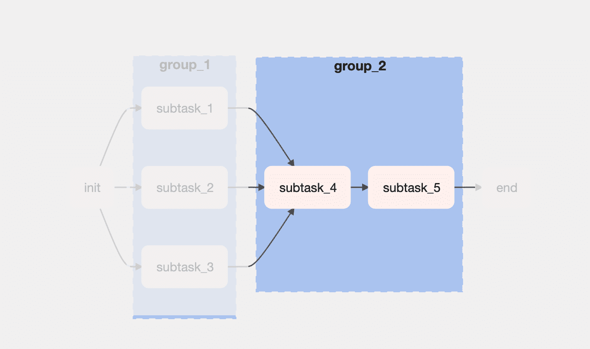

# 开始使用 Airflow 2.0 中的任务组

> 原文：<https://towardsdatascience.com/getting-started-with-task-groups-in-airflow-2-0-d85b7517767e?source=collection_archive---------9----------------------->

## 一个包含两组任务的简单管道，使用来自 Airflow 2 的 TaskFlow API 的@taskgroup decorator。

# 介绍

在 Airflow 2.0 中的任务分组之前，子标记是分组任务的首选 API。在 Airflow 2.0 中，子标签[被降级](https://www.astronomer.io/guides/subdags)，现在被任务组功能取代。任务流 API 很简单，允许适当的代码结构，有利于清晰地分离关注点。

我们今天构建的是一个包含两组任务的简单 DAG，使用了来自气流 2 的任务流 API 的`@taskgroup`装饰器。图表视图为:

作者图片

这条管道对给定的初始值进行不同的操作。任务实例化了一个值为`0`的变量。然后，它传递给一组子任务(`group_1`)，这些子任务处理初始值。`group_2`将所有的值聚合成一个。最后，`end()`子任务将打印出最终结果。

让我们从将管道分成几个部分开始。

# 任务分组-分解

如上图所示，有一个`init()`和`end()`任务。在这两者之间，有两组任务，但是让我们从管道的第一个和最后一个任务开始。

作者图片

`init()`任务是这个管道的起点——它返回将在整个管道中操作的初始值:0。任务将把管道中的所有操作打印到控制台。

让我们看看`init()`任务的代码:

就是这样。现在是`end()`任务的代码:

定义整个管道的流程也很简单，由包装所有内容的函数返回:

查看上面的代码，可以看到:

# 任务组#1 ( `group_1`)

作者图片

`group_1`有一组操纵原始数字的三个任务:

`group_1`函数接收来自`init()`任务的结果。注意这里返回的是什么:三个值的列表。每个值都源于`subtask_1`、`subtask_2`和`subtask_3`。这个值列表就是将要发送给`group_2`的内容。

# 任务组#2 ( `group_2`)

作者图片

很简单。它接收从`group_1`发送来的列表，并对所有值求和(`subtask_4`完成)，然后`subtask_5`将来自`subtask_4`的结果乘以 2:

就是这样——下一个任务是`end()`，在本帖之前已经处理过了。同样，这里有可能看到完整的代码。

如果您检查“end()”任务的日志(参见我以前的帖子，了解如何检查任务日志)，您将看到打印的结果。最后的结果应该是`12`。

成功！🎉

# 结论

在 Airflow 2 中创建任务组很容易——它消除了以前存在的复杂性，并允许用干净的代码创建管道。

# 背景

这篇文章是 ETL 系列教程的一部分。这最初发布在[pedromadruga.com](https://pedromadruga.com)上。如果你喜欢这篇文章，可以考虑订阅[时事通讯](http://localhost:1313/newsletter)或者在[推特](https://twitter.com/pmadruga_)上关注我。

完整的代码可在[这里](https://github.com/pmadruga/airflow-dags/blob/main/taskgroup.py)获得。

*原载于*【https://pedromadruga.com】**。如果你喜欢这篇文章，可以考虑订阅[时事通讯](http://localhost:1313/newsletter)或者在[推特](https://twitter.com/pmadruga_)上关注我。**