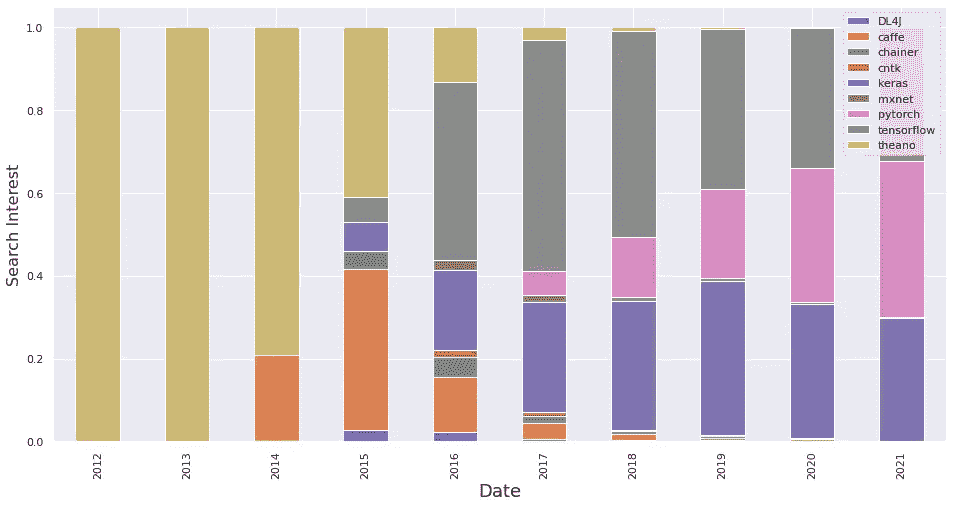
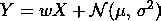
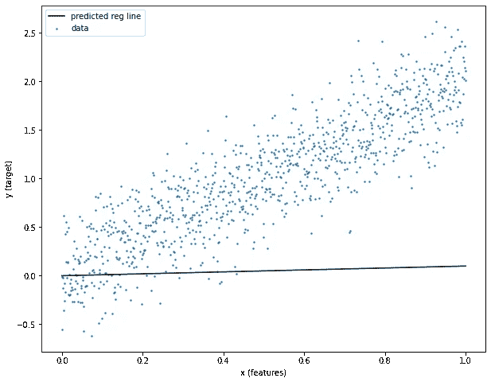
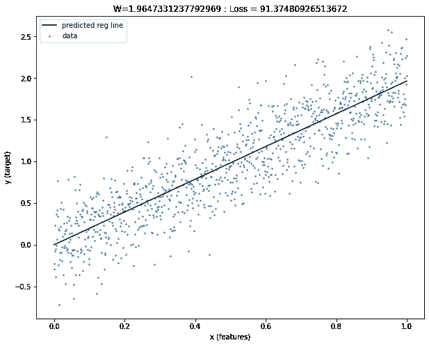
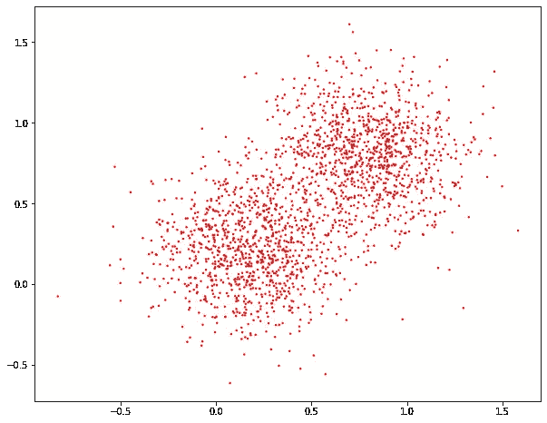
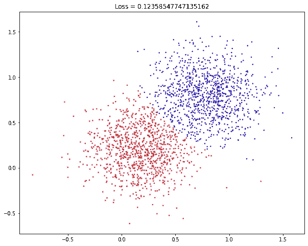

# Tensorflow 入门

> 原文：<https://towardsdatascience.com/getting-started-with-tensorflow-e33999defdbf?source=collection_archive---------28----------------------->

## 通过示例学习基础知识


照片由来自 Unsplash 的 [Marten Newhall](https://unsplash.com/@laughayette) 拍摄。

# 介绍

好，我们来讨论一下房间里的大象。应该学 Tensorflow 还是 PyTorch？

老实说，没有正确的答案。这两个平台背后都有一个大型开源社区，易于使用，并且能够构建复杂的深度学习解决方案。如果你真的想成为一名出色的深度学习研究者，你必须了解这两方面。

我们现在来讨论 Tensorflow 是如何产生的，以及如何利用它进行深度学习。

# Tensorflow 是什么时候开发的？

人工神经网络(ANN)的研究已经存在了很长时间。沃伦·麦卡洛克和沃尔特·皮茨在 1943 年发表了其早期作品之一，其中作者开发了人工神经网络的第一个计算模型。

在 21 世纪初之前，只有粗略的框架可用，需要有经验的 ML 从业者来建立简单/适度的人工神经网络方法。

随着 2012 年对人工神经网络的兴趣激增，深度学习(DL)框架的前景开始发生变化。Caffe、Chainer 和 Theano 可以说是早期的顶级竞争者，它们使普通数据科学家更容易使用 DL。



谷歌在“机器学习和人工智能”类别下搜索 2012 年 1 月至 2021 年 7 月之间的顶级低/高级深度学习框架。图片来自作者。

2015 年 2 月，谷歌开源了 Tensorflow 1.0，这一框架迅速获得了关注。Tensorflow swift 的采用与几个因素有关，如家喻户晓的名字、快速和频繁的更新、简单的语法以及对可用性和可扩展性的关注(如移动和嵌入式 devices)⁴⁵.

随着 PyTorch 的日益普及和 Tensorflow⁶市场份额的减少，谷歌团队在 2019 年发布了对库“Tensorflow 2.0"⁷.”的重大更新这次更新引入了急切执行(PyTorch 的关键卖点之一)，以及对 Keras 的本机支持(通过静态计算图极大地简化了开发)。

到 2021 年 6 月，超过 99%的谷歌搜索主要深度学习框架包含 Tensorflow、Keras 或 PyTorch。

# 通过例子学习

最简单的学习方法(至少对我来说)是通过例子。这种方法允许您测试一个工作过程，修改它，或者获取对您的项目有用的组件。

在这篇博客中，我将通过两个 ML 示例来指导您，说明构建简单张量流模型所需的关键组件。

为了提高可复制性，我建议使用 Google Colab 作为这里描述的例子。为此，只需打开[这个](https://research.google.com/colaboratory/)链接，按照步骤创建一个新的 python 3 笔记本。

## 线性回归

在此示例中，我们将构建一个简单的 1 层神经网络来解决线性回归问题。这个例子将解释如何初始化你的权重(又名回归系数)，以及如何通过反向传播来更新它们。

我们首先需要的是一个数据集。让我们模拟一个噪声线性模型如下



其中 Y 是我们的目标，X 是我们的输入，w 是我们要确定的系数，N 是高斯分布噪声变量。为此，在笔记本的第一个单元格中粘贴并运行以下代码片段。

这将显示 X 和 Y 之间关系的散点图，清楚地表明在一些高斯噪声下的线性相关性。在这里，我们期望一个合理的模型来估计 2 作为理想的回归系数。


代表高斯噪声下 X 和 Y 之间线性相关性的模拟数据。

现在让我们用一个常数(0.1)开始我们的回归系数(这里称为权重)。为此，我们首先需要导入 Tensorflow 库，然后将权重初始化为 Tensorflow 变量。

为了这个例子的目的，假设一个变量具有与张量相似的性质。张量是由 tf 表示的多维元素阵列。张量对象。张量只有一种数据类型(在下面的例子中为“float32”)和一种形状。该对象允许其他 Tensorflow 函数执行某些操作，例如计算与该变量相关的梯度并相应地更新其值。复制以下代码片段来初始化我们的权重变量。

运行这个代码片段将输出变量名、形状、类型和值。注意，这个变量有一个“()”形状，表示它是一个 0 维向量。

```
<tf.Variable ‘Variable:0’ shape=() dtype=float32, numpy=0.1>
```

给定初始化的权重张量和输入 X，为了获得预测的 Y (Yhat ),我们可以简单地调用“Yhat = x * w_tensor.numpy()”。的’。“numpy()”用于将权重向量转换为 numpy 数组。复制并运行下面的代码片段，看看初始化后的重量如何符合数据。

正如你所观察到的,‘w _ tensor’的当前值与理想值相差甚远。回归线完全符合数据。



训练前模型拟合的表示。

为了找到‘w _ tensor’的最佳值，我们需要定义一个损失度量和一个优化器。这里，我们将使用均方误差(MSE)作为我们的损失度量，随机梯度下降(SGD)作为我们的优化器。

我们现在有了优化我们的“w _ 张量”的所有部分。优化循环只需要定义“前进步骤”,并从我们的优化器调用最小化函数。

“前进步骤”告诉模型如何将输入与权重张量相结合，以及如何计算我们的目标与预测目标之间的误差(下面代码片段中的第 5 行)。在一个更复杂的例子中，这将是一组定义从输入 X 到目标 y 的计算图的指令。

为了最小化定义的损失，我们只需要告诉我们的优化器最小化关于‘w _ tensor’的‘损失’(下面代码片段中的第 17 行)。

将下面的代码片段添加到您的示例中，为模型定型 100 次迭代。这将动态绘制新的权重值和当前拟合。

在训练结束时，你的体重应该接近 2(理想值)。要使用此模型进行推理(即，在给定 X 值的情况下预测 Y 变量)，只需执行` Yhat = x * w_tensor.numpy()'



训练后模型拟合的表示。

## 分类问题

在本例中，我们将引入 Keras 顺序模型定义来创建更复杂的神经网络。我们将把这个模型应用于一个线性可分的分类问题。

像以前一样，让我们从构建数据集开始。在下面的代码片段中，我们为第一个聚类创建了两个以(0.2，0.2)为中心的点聚类，为第二个聚类创建了两个以(0.8，0.8)为中心的点聚类。

我们可以很快观察到，用一条与两个聚类距离相等的线将两个数据集线性分离的模型是理想的。


模拟数据表示两个数据聚类，第一个聚类以(0.2，0.2)为中心，第二个聚类以(0.8，0.8)为中心。

像以前一样，让我们定义我们的损失度量和优化器。在这个例子中，我们应该使用分类损失度量，例如交叉熵。因为我们的目标被编码为整数，所以我们必须使用“SparseCategoricalCrossEntropy”方法。

对于优化器，我们可以像以前一样使用 SGD。然而，普通 SGD 的收敛速度慢得令人难以置信。相反，我们将使用最近的自适应梯度下降方法(RMSProp)。

下一步是定义自定义神经网络模型。让我们创建一个 5 层神经网络如下:

1.  有 10 个节点的线性层。这将有一个 2 x 10(输入形状 x 图层大小)的形状。
2.  批量标准化层。这一层将对每一批的第一层的输出进行归一化，避免爆炸/消失梯度。
3.  Relu 激活层。这一层将为我们的网络提供非线性能力。请注意，我们仅以此为例。对于这个问题，relu 层是不必要的，因为它是线性可分离的。
4.  具有两个节点的线性层。这将有一个 10 x 2(层大小 x 输出形状)的形状。
5.  Softmax 层。该层会将第 4 层的输出转换为 softmax。

在网络用于训练之前，我们需要调用“编译”方法。这将允许 Tensorflow 将模型链接到优化器和上面定义的损失度量。

和以前一样，我们先来检查一下我们的网络在训练前表现如何。要使用该模型进行推理，我们只需键入“yhat = model.predict(x)”。现在，复制下面的片段来可视化网络输出。

你可以确认网络一点也不好。显然需要一些训练来正确区分这两个类别。



训练前模型拟合的表示。

要训练一个 Keras 模型，我们只需输入“model.fit(x，y，epochs=50)”。将下面的片段添加到您的笔记本中，以训练模型。

在训练循环结束时，你的网络应该能够很好地分离这两个类。要使用此模型进行推理(即，在给定 X 值的情况下预测 Y 变量)，只需执行“yhat = model.predict(x)”。



训练后模型拟合的表示。

## 完整脚本

如需完整的脚本，请点击以下链接进入我的 Github 页面:

[](https://github.com/andreRibeiro1989/medium/blob/main/tensorflow_getting_started.ipynb) [## 安德里贝罗 1989/中号

### tensor flow _ getting _ started . ipynb

github.com](https://github.com/andreRibeiro1989/medium/blob/main/tensorflow_getting_started.ipynb) 

或者通过以下链接直接访问 Google Colab 笔记本:

[](https://colab.research.google.com/github/andreRibeiro1989/medium/blob/main/tensorflow_getting_started.ipynb) [## 谷歌联合实验室

### tensor flow _ getting _ started . ipynb

colab.research.google.com](https://colab.research.google.com/github/andreRibeiro1989/medium/blob/main/tensorflow_getting_started.ipynb) 

# 结论

Tensorflow 是目前开发定制深度学习解决方案的最佳深度学习框架之一。在这篇博客中，我介绍了构建两个简单神经网络模型的关键概念。

**警告！！！**你的学习才刚刚开始。要变得更好，你需要练习。[官方 Tensorflow](https://www.tensorflow.org/tutorials) 网站提供了从初学者到专家级别的示例，以及 Tensorflow 软件包的官方文档。祝你好运！

[1]沃伦·麦卡洛克和沃尔特·皮茨”*神经活动中固有的逻辑思想演算*(1943)，《数学生物物理学通报》。5: 115–133.
[https://link.springer.com/article/10.1007%2FBF02478259](https://link.springer.com/article/10.1007%2FBF02478259)

[2]袁林。*深度学习框架简史*
[https://towardsdatascience . com/A-Brief-History-of-Deep-Learning-Frameworks-8 deb F3 ba 6607](/a-brief-history-of-deep-learning-frameworks-8debf3ba6607)

[3] Alex Krizhevsky 等著《*深度卷积神经网络的 ImageNet 分类*》(2012)，neur IPS
[https://papers . nips . cc/paper/2012/file/c 399862d 3 b 9 d6b 76 c 8436 e 924 a 68 c 45 b-paper . pdf](https://papers.nips.cc/paper/2012/file/c399862d3b9d6b76c8436e924a68c45b-Paper.pdf)

[4]苏尼思·谢蒂。"*为什么 TensorFlow 总是高居机器学习和人工智能工具调查榜首"*
[https://hub . packtpub . com/tensor flow-always-tops-machine-learning-artificial-intelligence-tool-surveys/](https://hub.packtpub.com/tensorflow-always-tops-machine-learning-artificial-intelligence-tool-surveys/)

[5]叶达鑫·瓦朗冈卡。*十大深度学习框架*
[https://hub.packtpub.com/top-10-deep-learning-frameworks/](https://hub.packtpub.com/top-10-deep-learning-frameworks/)

[6]贺拉斯何。"*2019 年机器学习框架状况"*
[https://The gradient . pub/State-of-ml-Frameworks-2019-py torch-domains-research-tensor flow-domains-industry/](https://thegradient.pub/state-of-ml-frameworks-2019-pytorch-dominates-research-tensorflow-dominates-industry/)

[7] TensorFlow 团队。" *TensorFlow 2.0 现已上市！"*
[https://blog . tensor flow . org/2019/09/tensor flow-20-is-now-available . html](https://blog.tensorflow.org/2019/09/tensorflow-20-is-now-available.html)